# Technical Specification

# 1. Introduction

This section establishes the foundational context for the **Londry** (Sistem Laundry) Technical Specification. It defines the project's purpose, the business problem it addresses, the stakeholders it serves, and the precise boundaries of its scope. As a greenfield initiative—where this specification precedes all implementation—the content herein serves as the authoritative blueprint guiding all subsequent design, development, and validation activities.

---

## 1.1 EXECUTIVE SUMMARY

### 1.1.1 Project Overview

**Londry** is a web-based Point-of-Sale (POS) and operational management system purpose-built for a laundry service business. The system is designed to digitize and streamline the end-to-end workflow of a laundry operation—from customer order intake and cash payment processing through product catalog management, user administration, and business reporting.

| Attribute | Detail |
|---|---|
| **Project Name** | Londry (Sistem Laundry) |
| **Project Type** | Web-based POS & Operations Management |
| **Repository** | GitLab — `https://gitlab.com/mzkrl/londry.git` |
| **Project Phase** | Pre-implementation (Greenfield) |

The project repository currently contains only a default GitLab template `README.md` with no source code, configuration files, or assets, as confirmed through exhaustive repository inspection. This Technical Specification therefore functions as the definitive design contract for the system, establishing all functional, architectural, and data requirements before any code is written.

### 1.1.2 Core Business Problem

The Londry system addresses the operational challenges inherent in managing a laundry service business without a dedicated digital platform. Specifically, the system solves the following problems:

- **Order Processing Inefficiency:** Without a structured system, tracking customer orders, associating them with specific laundry products, and generating unique pickup identifiers is error-prone and time-consuming. Londry introduces a transaction processing workflow that captures each order with a unique order number (*nomor pesanan*), ensuring reliable order identification from payment through to laundry pickup.

- **Lack of Financial Accountability:** Cash-based businesses require rigorous transaction recording to prevent discrepancies. The system provides receipt generation (*bukti transaksi*) and comprehensive transaction logging, creating an auditable financial trail for every sale.

- **Operational Opacity:** Business owners lack visibility into day-to-day operations without a reporting mechanism. Londry delivers date-filterable transaction reports and a complete activity audit log, enabling the owner to monitor all cashier and administrator actions transparently.

- **Uncontrolled System Access:** In the absence of role-based access control, any staff member can perform any operation. The system enforces strict role segregation across three user types—Kasir (Cashier), Administrator, and Owner—each with a tailored dashboard and permission set.

### 1.1.3 Key Stakeholders and Users

The system defines four distinct actors, three of whom are authenticated system users and one who interacts indirectly through the cashier:

| Actor | Role (Indonesian) | System Access | Primary Responsibility |
|---|---|---|---|
| **Cashier** | Kasir | Authenticated | Transaction processing, receipt printing, product viewing |
| **Administrator** | Admin | Authenticated | Product CRUD, user management, data administration |
| **Owner** | Owner / Manajer | Authenticated | Report viewing, transaction filtering, audit log monitoring |
| **Customer** | Pelanggan | None (External) | Selects products and pays cash at the counter |

> **Note on Terminology:** The user context refers to the owner role interchangeably as *Owner* and *Manajer* (Manager). The database schema uses the enum value `"owner"` in the `users.role` column. Throughout this specification, **Owner** is used as the canonical term for this role.

### 1.1.4 Business Impact and Value Proposition

The Londry system delivers measurable value across four dimensions:

| Value Dimension | Business Impact |
|---|---|
| **Operational Efficiency** | Eliminates manual order tracking by automating transaction recording, unique order number generation, and receipt printing |
| **Financial Transparency** | Every transaction is recorded with payment amount (*uang_bayar*) and change (*uang_kembali*), creating an immutable financial record |
| **Accountability & Compliance** | All Kasir and Admin actions are automatically captured in the `log` table, providing a complete audit trail for operational oversight |
| **Business Intelligence** | The Owner gains on-demand access to transaction reports with date-based filtering, enabling data-driven decision-making |

---

## 1.2 SYSTEM OVERVIEW

### 1.2.1 Project Context

#### Business Context and Market Positioning

Londry operates within the Indonesian laundry service market (*usaha laundry*), a sector characterized by small-to-medium enterprises that typically rely on manual or semi-manual processes for order management. The system is positioned as a self-hosted, internally operated tool for a single laundry business establishment rather than a multi-tenant SaaS platform.

All business terminology, user interface labels, role names, and data field identifiers are defined in **Bahasa Indonesia** (Indonesian language), reflecting the target market and user base. Key domain terms include:

| Indonesian Term | English Equivalent | System Context |
|---|---|---|
| *Produk* | Product | Laundry service type in the catalog |
| *Transaksi* | Transaction | A completed sale between Kasir and Pelanggan |
| *Nomor Unik / Nomor Pesanan* | Unique Order Number | Pickup identifier issued to the customer |
| *Bukti Transaksi* | Transaction Receipt | Printed proof of payment |
| *Log Aktivitas* | Activity Log | Audit trail of user actions |

#### Current System State

As this is a greenfield project with no predecessor system, there are no legacy constraints, data migration requirements, or backward-compatibility considerations. The system is designed from a clean slate, allowing architectural decisions to be optimized purely for the stated requirements.

#### Integration with Existing Enterprise Landscape

Londry is designed as a **standalone, self-contained system**. It does not integrate with external services, third-party APIs, payment gateways, or enterprise middleware. All data resides within its own relational database, and all processing occurs within its native PHP application boundary. The only external infrastructure dependency is a web server capable of executing PHP and connecting to a MySQL or PostgreSQL database instance.

### 1.2.2 High-Level System Description

#### Primary System Capabilities

The Londry system provides six core functional modules organized around the three authenticated user roles:

| Module | Primary Role | Capability Summary |
|---|---|---|
| **Authentication** | All Users | Role-based login with dashboard routing per role |
| **Transaction Processing** | Kasir | Order creation, payment recording, receipt generation |
| **Product Management** | Admin | CRUD operations on the product/service catalog |
| **User Management** | Admin | User account creation, updates, and deactivation |
| **Reporting** | Owner | Transaction reports with date-based filtering |
| **Activity Logging** | System-wide | Automatic audit trail for Kasir and Admin actions |

#### Major System Components

The system follows a monolithic server-rendered architecture with a clear separation between presentation, business logic, and data persistence layers:

```mermaid
flowchart TB
    CUST(["Pelanggan\n(Customer)"])
    KSR(["Kasir\n(Cashier)"])
    ADM(["Administrator"])
    OWN(["Owner / Manajer"])

    subgraph PresentationLayer["Presentation Layer — Bootstrap UI"]
        LOGIN["Login Page"]
        DASH_K["Kasir Dashboard"]
        DASH_A["Admin Dashboard"]
        DASH_O["Owner Dashboard"]
    end

    subgraph BusinessLogic["Business Logic Layer — Native PHP"]
        AUTH_MOD["Authentication &\nAuthorization"]
        TXN_MOD["Transaction\nProcessing"]
        PROD_MOD["Product\nManagement"]
        USR_MOD["User\nManagement"]
        LOG_MOD["Activity\nLogging"]
        RPT_MOD["Reporting &\nFiltering"]
    end

    subgraph DataLayer["Data Persistence Layer"]
        ENV[".env Configuration"]
        DB[("MySQL / PostgreSQL\n4 Tables")]
    end

    CUST -->|"Cash Payment"| KSR
    KSR --> LOGIN
    ADM --> LOGIN
    OWN --> LOGIN

    LOGIN --> AUTH_MOD
    AUTH_MOD --> DASH_K
    AUTH_MOD --> DASH_A
    AUTH_MOD --> DASH_O

    DASH_K --> TXN_MOD
    DASH_A --> PROD_MOD
    DASH_A --> USR_MOD
    DASH_O --> RPT_MOD
    DASH_O --> LOG_MOD

    TXN_MOD --> LOG_MOD
    PROD_MOD --> LOG_MOD
    USR_MOD --> LOG_MOD

    AUTH_MOD --> DB
    TXN_MOD --> DB
    PROD_MOD --> DB
    USR_MOD --> DB
    LOG_MOD --> DB
    RPT_MOD --> DB
    ENV -.->|"Connection Config"| DB
end
```

#### Core Technical Approach

The system is built on an intentionally minimalist technology stack that emphasizes simplicity, zero external dependency management, and broad hosting compatibility:

| Layer | Technology | Rationale |
|---|---|---|
| **Backend** | PHP (Native) | No framework overhead; uses only built-in PHP functions and extensions |
| **Frontend** | Bootstrap CSS | Responsive design framework loaded via CDN or local assets |
| **Database** | MySQL and PostgreSQL | Dual database support via environment configuration |
| **Configuration** | `.env` file | Centralizes database connection parameters for easy switching |
| **Dependencies** | None (external) | Explicitly no npm packages, no Composer packages — zero dependency management |

This approach ensures the system can be deployed on virtually any standard PHP hosting environment (shared hosting, VPS, or local XAMPP/WAMP setup) without requiring package managers, build pipelines, or containerization.

### 1.2.3 Success Criteria

Since no explicit KPIs or quantitative metrics are defined in the project specification, the following success criteria are derived directly from the stated functional requirements and business constraints. Each criterion maps to a verifiable system behavior.

#### Measurable Objectives

| ID | Objective | Verification Method |
|---|---|---|
| **SO-1** | All three user roles can authenticate and access their respective dashboards | Login test per role with correct dashboard routing |
| **SO-2** | Kasir can complete a full transaction cycle (view products → process payment → generate order number → print receipt) | End-to-end transaction workflow test |
| **SO-3** | Admin can perform full CRUD on product data | Create, read, update, and delete operations on `products` table |
| **SO-4** | Admin can add, update, and deactivate user accounts | User lifecycle management test across `users` table |
| **SO-5** | Owner can view transaction reports filtered by date range | Report generation and filtering validation |
| **SO-6** | All Kasir and Admin activities are automatically recorded in the activity log | Log table inspection after performing operations |

#### Critical Success Factors

| Factor | Description |
|---|---|
| **Role Isolation** | Each user role must see only the functionality permitted for their role; no privilege escalation is possible |
| **Data Integrity** | Every transaction must generate a unique order number (*nomor_unik*) and correctly calculate change (*uang_kembali*) |
| **Audit Completeness** | No Kasir or Admin action may execute without a corresponding entry in the `log` table |
| **Database Portability** | The system must function identically on both MySQL and PostgreSQL with configuration-only switching via `.env` |

#### Key Performance Indicators

| KPI | Target | Rationale |
|---|---|---|
| **Feature Completeness** | 10/10 specified features operational | All enumerated features (items 1–10 from specification) must be implemented |
| **Role Coverage** | 3/3 roles with correct permissions | Kasir, Admin, and Owner dashboards with appropriate access controls |
| **Database Compatibility** | 2/2 databases supported | Verified operation on both MySQL and PostgreSQL |
| **Zero External Dependencies** | 0 npm / 0 Composer packages | Deployable without any package manager execution |

---

## 1.3 SCOPE

### 1.3.1 In-Scope

#### Core Features and Functionalities

The following table enumerates all features within the system scope, organized by user role. Each feature is directly traceable to the numbered requirements in the project specification.

| Req # | Role | Feature | Description |
|---|---|---|---|
| 1 | Kasir | Product Information View | View product types (*jenis produk*) and availability |
| 2 | Kasir | Transaction Processing | Create sales transactions with customer name, product selection, payment, and change calculation |
| 3 | Kasir | Receipt Printing | Generate and print transaction receipts (*bukti transaksi*) with unique order number |
| 4 | Kasir | Activity Logging | All cashier actions automatically recorded in `log` table |
| 5 | Admin | Product Data Management | Full CRUD (add, delete, update) on `products` table entries |
| 6 | Admin | User Data Management | Add, update, and deactivate users in `users` table |
| 7 | Admin | Activity Logging | All administrator actions automatically recorded in `log` table |
| 8 | Owner | Product Data Review | Read-only access to product catalog data |
| 9 | Owner | Transaction Reporting | View transaction history with date-based filtering |
| 10 | Owner | Activity Log Review | View complete audit trail of Kasir and Admin actions |

#### Primary User Workflows

The following diagram illustrates the primary customer-facing workflow, which is the core revenue-generating process of the system:

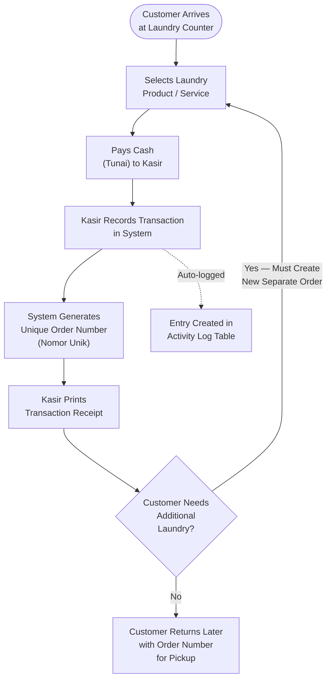
```mermaid
flowchart TD
    START(["Customer Arrives\nat Laundry Counter"]) --> SELECT["Selects Laundry\nProduct / Service"]
    SELECT --> PAY["Pays Cash\n(Tunai) to Kasir"]
    PAY --> PROCESS["Kasir Records Transaction\nin System"]
    PROCESS --> GENERATE["System Generates\nUnique Order Number\n(Nomor Unik)"]
    GENERATE --> RECEIPT["Kasir Prints\nTransaction Receipt"]
    RECEIPT --> DECIDE{"Customer Needs\nAdditional\nLaundry?"}
    DECIDE -->|"Yes — Must Create\nNew Separate Order"| SELECT
    DECIDE -->|"No"| PICKUP["Customer Returns Later\nwith Order Number\nfor Pickup"]
    PROCESS -.->|"Auto-logged"| LOGENTRY["Entry Created in\nActivity Log Table"]
```

**Key workflow constraints:**
- Payment is exclusively **cash-based** (*tunai*) — no digital or card payment methods are supported.
- If a customer requires additional laundry services after completing an order, a **new, separate order must be created** — appending to an existing order is not supported.
- The unique order number (*nomor pesanan / nomor unik*) serves as the sole customer-facing identifier for laundry pickup.

#### Essential Technical Requirements

The following technical constraints are explicitly mandated by the project specification and are non-negotiable implementation boundaries:

| Requirement | Specification | Implication |
|---|---|---|
| **PHP Native Only** | No PHP frameworks (Laravel, Symfony, CodeIgniter, etc.) | All routing, templating, database access, and session management via native PHP |
| **Zero External Dependencies** | No npm packages, no Composer packages | No `vendor/` directory, no `node_modules/`, no `package.json`, no `composer.json` |
| **Dual Database Support** | MySQL and PostgreSQL | SQL queries must be compatible with both engines or abstracted accordingly |
| **Environment Configuration** | `.env` file (or equivalent) | Database connection parameters externalized for easy switching |
| **Bootstrap Frontend** | Bootstrap CSS framework | Responsive UI design using Bootstrap components and grid system |

#### Implementation Boundaries

**System Boundaries:**
The Londry system is a self-contained web application operating within a single server environment. It encompasses the complete stack from user interface rendering (Bootstrap/PHP) through business logic processing (native PHP) to data persistence (MySQL/PostgreSQL). No external network calls, API integrations, or microservice communication is required.

**User Groups Covered:**

| User Group | Access Type | Coverage |
|---|---|---|
| Kasir (Cashier) | Full authenticated access | Transaction CRUD, product viewing, receipt generation |
| Administrator | Full authenticated access | Product CRUD, user management |
| Owner / Manajer | Full authenticated access | Read-only reporting and audit monitoring |
| Pelanggan (Customer) | No system access | Interacts only with Kasir at the physical counter |

**Data Domains Included:**
The system manages four discrete data domains, each corresponding to a database table:

| Data Domain | Table | Key Fields |
|---|---|---|
| User Identity & Access | `users` | `id`, `username`, `password`, `role` (enum) |
| Product Catalog | `products` | `id`, `nama_produk`, `harga_produk` |
| Sales Transactions | `transactions` | `id_produk` (FK), `nama_pelanggan`, `nomor_unik`, `uang_bayar`, `uang_kembali` |
| Audit Trail | `log` | `id_user` (FK), `activity` |

**Database Relationships:**
- `transactions.id_produk` → `products.id` (Many-to-One): Each transaction references one product.
- `log.id_user` → `users.id` (Many-to-One): Each log entry is attributed to one system user.

### 1.3.2 Implementation Boundaries — Geographic and Market Scope

The system is designed for a **single-location laundry business** operating within Indonesia. All user interface text, field labels, and business terminology are in Bahasa Indonesia. No multi-language, multi-currency, or multi-branch capabilities are included.

### 1.3.3 Out-of-Scope

The following items are explicitly excluded from the current project scope. These exclusions are derived from the stated project constraints and the absence of these features in the specification.

| Excluded Capability | Rationale | Future Consideration |
|---|---|---|
| **Digital / Card Payments** | Specification explicitly states cash-only (*tunai*) payment | Potential Phase 2 — integration with Indonesian payment gateways (GoPay, OVO, DANA) |
| **Customer Self-Service Portal** | Customers have no system access; all interactions are mediated by Kasir | Could be added as a customer-facing order tracking interface |
| **Mobile Application** | System is web-based (Bootstrap); no native mobile app specified | Responsive Bootstrap design may provide adequate mobile browser experience |
| **Order Modification / Appending** | Specification mandates new order for additional laundry | Could be revisited if business workflow evolves |
| **Multi-Branch Support** | No mention of multiple locations in specification | Would require schema extension (branch/location tables) |
| **Inventory / Stock Tracking** | `products` table contains no quantity or stock fields | Could be added with stock columns and threshold alerts |
| **External API Integrations** | No third-party service connections specified | Could enable SMS notifications, accounting software sync, etc. |
| **External Package Dependencies** | Explicitly excluded: no npm, no Composer | Maintains deployment simplicity at the cost of framework features |
| **Automated Testing Framework** | No testing requirements specified | Recommended for future quality assurance |
| **Data Backup / Recovery** | No backup or archival policies defined | Critical for production deployment — recommended for Phase 2 |

**Unsupported Use Cases:**

- **Multi-user concurrent editing** — No real-time collaboration or conflict resolution mechanisms are specified.
- **Offline operation** — The system requires an active web server and database connection at all times.
- **Customer account creation** — Customers (*Pelanggan*) are identified by name per transaction only; no persistent customer profiles exist.
- **Product categorization** — The `products` table has no category or grouping field; all products exist in a flat list.
- **Discount or promotional pricing** — No price override, coupon, or discount mechanism is specified.
- **Multi-currency transactions** — All prices and payments are assumed to be in Indonesian Rupiah (IDR) with no currency conversion.

---

## 1.4 DOCUMENT CONVENTIONS

### 1.4.1 Language and Terminology

This Technical Specification uses **English** as the primary documentation language. Indonesian terms are presented in *italics* alongside their English equivalents where they correspond to system-specific identifiers (database column names, role names, UI labels). The database schema retains its original Indonesian field names (e.g., `nama_produk`, `harga_produk`, `uang_kembali`) as these represent the actual implementation identifiers.

### 1.4.2 Requirement Traceability

Features are referenced by their specification requirement number (1–10) as defined in the user-provided project description. These numbers are used consistently throughout this document for cross-referencing.

### 1.4.3 Scope of This Specification

This document serves as the **pre-implementation design specification**. As the repository (`https://gitlab.com/mzkrl/londry.git`) currently contains no source code—only a default `README.md`—all system descriptions herein represent the intended architecture and behavior, not observations of existing code. Implementation is expected to adhere to this specification as its authoritative reference.

---

## 1.5 REFERENCES

#### Repository Files Examined

| File | Relevance |
|---|---|
| `README.md` | Confirmed project name ("londry") and GitLab hosting URL; verified repository is in greenfield state with only default GitLab template content |

#### Repository Structure Verified

| Path | Depth | Finding |
|---|---|---|
| `/` (root) | 0 | Single child: `README.md` — no source directories, configuration files, or asset folders exist |

#### Semantic Searches Performed (Confirming Greenfield State)

The following searches were conducted against the repository and returned no results, confirming the pre-implementation status:

- PHP files for laundry management system
- Database configuration / connection / environment files
- User authentication and login system files
- Transaction and product management modules
- Bootstrap CSS/HTML template files
- SQL database schema and migration files

#### Primary Authoritative Source

All system requirements, business process definitions, database schema specifications, technology stack decisions, and user role definitions are sourced from the **user-provided project context**, which serves as the sole and definitive requirements document for this greenfield project.

# 2. Product Requirements

This section defines the complete product requirements for the **Londry** (Sistem Laundry) web-based POS and operational management system. All requirements are derived from the user-provided project specification and the pre-implementation Technical Specification (Sections 1.1–1.5). As this is a greenfield project with no existing source code, these requirements serve as the authoritative design contract that all implementation must adhere to.

---

## 2.1 FEATURE CATALOG

### 2.1.1 Feature Registry Overview

The Londry system comprises eleven discrete features organized across one cross-cutting concern and three role-specific domains. Ten features map directly to the numbered requirements in the project specification (Req 1–10), with one additional infrastructure feature (Authentication) required as a universal prerequisite.

| Feature ID | Feature Name | Role | Priority |
|---|---|---|---|
| F-001 | Authentication & Role-Based Access | All Users | Critical |
| F-002 | Product Information View | Kasir | Critical |
| F-003 | Transaction Processing | Kasir | Critical |
| F-004 | Receipt Printing | Kasir | Critical |
| F-005 | Kasir Activity Logging | Kasir | Critical |
| F-006 | Product Data Management | Admin | High |
| F-007 | User Data Management | Admin | High |
| F-008 | Admin Activity Logging | Admin | Critical |
| F-009 | Product Data Review | Owner | Medium |
| F-010 | Transaction Reporting | Owner | High |
| F-011 | Activity Log Review | Owner | High |

| Feature ID | Category | Spec Req # | Status |
|---|---|---|---|
| F-001 | Infrastructure | Implicit | Proposed |
| F-002 | Operations | Req 1 | Proposed |
| F-003 | Operations | Req 2 | Proposed |
| F-004 | Operations | Req 3 | Proposed |
| F-005 | Audit & Compliance | Req 4 | Proposed |
| F-006 | Data Management | Req 5 | Proposed |
| F-007 | Data Management | Req 6 | Proposed |
| F-008 | Audit & Compliance | Req 7 | Proposed |
| F-009 | Monitoring | Req 8 | Proposed |
| F-010 | Business Intelligence | Req 9 | Proposed |
| F-011 | Monitoring | Req 10 | Proposed |

All features carry a status of **Proposed**, consistent with the repository's confirmed greenfield state (only a default `README.md` exists — see Section 1.5).

### 2.1.2 Cross-Cutting Features

#### F-001: Authentication & Role-Based Access

| Attribute | Detail |
|---|---|
| **Feature ID** | F-001 |
| **Feature Name** | Authentication & Role-Based Access |
| **Category** | Infrastructure / Security |
| **Priority** | Critical |

**Overview:** The system requires all three internal user types — Kasir (Cashier), Administrator, and Owner — to authenticate via a login process before accessing any dashboard or functionality. Upon successful authentication, the system routes each user to their role-specific dashboard, enforcing strict role isolation. This is explicitly stated in the business process specification: each actor must go through the login process (*proses Login*) before entering their respective access-controlled dashboard.

**Business Value:** Prevents unauthorized access to system functionality and enforces the principle of least privilege. Role isolation ensures that a Kasir cannot access administrative functions, and an Admin cannot access owner-level reporting, preserving operational integrity and accountability.

**User Benefits:** Each user sees only the functionality relevant to their role, reducing complexity and preventing accidental data modification. The Owner can trust that operational data has not been tampered with by unauthorized users.

**Technical Context:** Authentication relies on the `users` table, which stores `id`, `username`, `password`, and `role` (ENUM: `"admin"`, `"kasir"`, `"owner"`). Session management uses native PHP sessions (`$_SESSION`). Dashboard routing is determined by the `role` column value after credential validation.

| Dependency Type | Detail |
|---|---|
| Prerequisite Features | None (root feature) |
| System Dependencies | `users` table, PHP session engine |
| External Dependencies | None |
| Integration Requirements | All features F-002 through F-011 |

---

### 2.1.3 Kasir Role Features

#### F-002: Product Information View

| Attribute | Detail |
|---|---|
| **Feature ID** | F-002 |
| **Feature Name** | Product Information View |
| **Category** | Operations |
| **Priority** | Critical |

**Overview:** Kasir can view information about product types (*jenis produk*) and product availability. This corresponds to Req 1 in the project specification. The product catalog is sourced from the `products` table, which contains `id`, `nama_produk` (product name), and `harga_produk` (product price).

**Business Value:** Enables the cashier to accurately inform customers about available laundry services and their pricing before processing a transaction.

**User Benefits:** Kasir has immediate visibility into the current product catalog without needing to consult separate documentation or other staff members.

**Technical Context:** The `products` table contains a flat list of products with no categorization or stock fields. "Availability" is limited to which products are listed in the catalog — there is no inventory or stock-level tracking, as confirmed in the out-of-scope items (Section 1.3.3). Product data is managed exclusively by the Admin role (F-006).

| Dependency Type | Detail |
|---|---|
| Prerequisite Features | F-001 (Authentication) |
| System Dependencies | `products` table |
| External Dependencies | None |
| Integration Requirements | Feeds into F-003 (Transaction Processing) |

#### F-003: Transaction Processing

| Attribute | Detail |
|---|---|
| **Feature ID** | F-003 |
| **Feature Name** | Transaction Processing |
| **Category** | Operations |
| **Priority** | Critical |

**Overview:** Kasir can create sales transactions (Req 2). Each transaction captures a customer name (*nama_pelanggan*), a product selection (*id_produk*), the cash payment amount (*uang_bayar*), and the system-calculated change (*uang_kembali*). The system auto-generates a unique order number (*nomor_unik*) that serves as the customer's pickup identifier.

**Business Value:** This is the core revenue-generating process of the system. It digitizes the order intake and payment recording workflow, replacing manual tracking with a structured, auditable transaction record.

**User Benefits:** Kasir can process orders quickly with automatic change calculation and unique order number generation. Customers receive a reliable pickup identifier. Business owners gain a complete financial record.

**Technical Context:** Each transaction references exactly one product via the `transactions.id_produk → products.id` foreign key (Many-to-One relationship). Payment is exclusively cash-based (*tunai*). If a customer requires additional laundry services, a new, separate transaction must be created — appending to an existing order is not supported.

| Dependency Type | Detail |
|---|---|
| Prerequisite Features | F-001, F-002 |
| System Dependencies | `transactions` table, `products` table |
| External Dependencies | None |
| Integration Requirements | Triggers F-005 (Logging), feeds F-004 (Receipt), feeds F-010 (Reporting) |

#### F-004: Receipt Printing

| Attribute | Detail |
|---|---|
| **Feature ID** | F-004 |
| **Feature Name** | Receipt Printing |
| **Category** | Operations |
| **Priority** | Critical |

**Overview:** Kasir can generate and print transaction receipts (*bukti transaksi*) to hand to the customer (Req 3). The receipt serves as proof of payment and contains the unique order number required for laundry pickup.

**Business Value:** Provides an auditable proof of payment for each transaction and serves as the customer's pickup token — the sole mechanism for identifying completed laundry orders.

**User Benefits:** Customers receive tangible documentation of their order. Kasir has a streamlined workflow from payment to receipt delivery.

**Technical Context:** Receipt content is derived from the completed transaction record: `nomor_unik`, `nama_pelanggan`, `nama_produk`, `harga_produk`, `uang_bayar`, and `uang_kembali`. The printing mechanism targets browser-based print functionality via the Bootstrap UI layer.

| Dependency Type | Detail |
|---|---|
| Prerequisite Features | F-001, F-003 |
| System Dependencies | `transactions` table, `products` table |
| External Dependencies | Browser print API |
| Integration Requirements | Triggered after F-003 completion |

#### F-005: Kasir Activity Logging

| Attribute | Detail |
|---|---|
| **Feature ID** | F-005 |
| **Feature Name** | Kasir Activity Logging |
| **Category** | Audit & Compliance |
| **Priority** | Critical |

**Overview:** All cashier actions are automatically recorded in the activity log (Req 4). This is a system-triggered, non-discretionary process — the Kasir does not manually create log entries; the system auto-generates them upon each action.

**Business Value:** Provides a complete audit trail of all cashier operations, enabling the Owner to monitor daily activities and detect irregularities. This is a critical success factor defined in Section 1.2.3: no Kasir action may execute without a corresponding `log` table entry.

**User Benefits:** The Owner gains operational transparency. The Kasir's work is documented for accountability and dispute resolution.

**Technical Context:** Log entries are written to the `log` table with fields `id_user` (FK → `users.id`) and `activity` (text description of the action performed). This feature shares the same database table and logging mechanism as F-008 (Admin Activity Logging).

| Dependency Type | Detail |
|---|---|
| Prerequisite Features | F-001 |
| System Dependencies | `log` table, `users` table |
| External Dependencies | None |
| Integration Requirements | Auto-triggered by F-003, F-004; read by F-011 |

---

### 2.1.4 Administrator Role Features

#### F-006: Product Data Management

| Attribute | Detail |
|---|---|
| **Feature ID** | F-006 |
| **Feature Name** | Product Data Management |
| **Category** | Data Management |
| **Priority** | High |

**Overview:** Admin can add, delete, and update product data (Req 5). This provides full CRUD (Create, Read, Update, Delete) operations on the `products` table, managing the laundry service catalog that Kasir and Owner access.

**Business Value:** Enables the business to maintain an accurate and up-to-date product catalog, reflecting changes in available laundry services and pricing.

**User Benefits:** Admin can independently manage the product catalog without developer intervention. Changes are immediately reflected for Kasir (F-002) and Owner (F-009).

**Technical Context:** Operations target the `products` table fields: `nama_produk` (product name) and `harga_produk` (product price). Unlike user management (F-007), product records **can be deleted** — not merely deactivated. No product categorization or inventory tracking is supported.

| Dependency Type | Detail |
|---|---|
| Prerequisite Features | F-001 |
| System Dependencies | `products` table |
| External Dependencies | None |
| Integration Requirements | Triggers F-008 (Logging); data consumed by F-002, F-003, F-009 |

#### F-007: User Data Management

| Attribute | Detail |
|---|---|
| **Feature ID** | F-007 |
| **Feature Name** | User Data Management |
| **Category** | Data Management |
| **Priority** | High |

**Overview:** Admin can add, update, and **deactivate** user accounts (Req 6). This is a deliberate distinction from product management — users are deactivated rather than deleted, preserving referential integrity with the `log` table.

**Business Value:** Centralizes user lifecycle management, ensuring only authorized personnel have system access. Deactivation (rather than deletion) preserves the audit trail for historical accountability.

**User Benefits:** Admin can onboard new staff, update credentials or roles, and revoke access for departed employees — all without technical support.

**Technical Context:** Operations target the `users` table fields: `username`, `password`, and `role` (ENUM: `"admin"`, `"kasir"`, `"owner"`). The deactivation mechanism implies a status toggle (active/inactive) on user records. Only three role values are permitted by the ENUM constraint.

| Dependency Type | Detail |
|---|---|
| Prerequisite Features | F-001 |
| System Dependencies | `users` table |
| External Dependencies | None |
| Integration Requirements | Triggers F-008 (Logging); affects F-001 (Authentication) |

#### F-008: Admin Activity Logging

| Attribute | Detail |
|---|---|
| **Feature ID** | F-008 |
| **Feature Name** | Admin Activity Logging |
| **Category** | Audit & Compliance |
| **Priority** | Critical |

**Overview:** All administrator actions are automatically recorded in the activity log (Req 7). Like Kasir logging (F-005), this is a system-triggered process using the same `log` table and recording mechanism.

**Business Value:** Ensures administrative operations (product changes, user management) are fully auditable. Combined with F-005, this satisfies the audit completeness critical success factor from Section 1.2.3.

**User Benefits:** The Owner gains full visibility into all data management operations performed by the Admin.

**Technical Context:** Uses the same `log` table as F-005: `id_user` (FK → `users.id`) and `activity` (text description). Auto-triggered by F-006 (product operations) and F-007 (user operations).

| Dependency Type | Detail |
|---|---|
| Prerequisite Features | F-001 |
| System Dependencies | `log` table, `users` table |
| External Dependencies | None |
| Integration Requirements | Auto-triggered by F-006, F-007; read by F-011 |

---

### 2.1.5 Owner Role Features

#### F-009: Product Data Review

| Attribute | Detail |
|---|---|
| **Feature ID** | F-009 |
| **Feature Name** | Product Data Review |
| **Category** | Monitoring |
| **Priority** | Medium |

**Overview:** Owner can check (*pengecekan*) product data (Req 8). This is strictly a **read-only** capability — the Owner views the product catalog without any modification ability.

**Business Value:** Enables the business owner to verify the accuracy and completeness of the product catalog without requiring Admin assistance.

**User Benefits:** Owner can independently audit product offerings and pricing at any time.

**Technical Context:** Executes `SELECT` queries against the `products` table. No INSERT, UPDATE, or DELETE operations are permitted for this role. The data displayed mirrors what Kasir sees (F-002) and what Admin manages (F-006).

| Dependency Type | Detail |
|---|---|
| Prerequisite Features | F-001 |
| System Dependencies | `products` table |
| External Dependencies | None |
| Integration Requirements | Reads data managed by F-006 |

#### F-010: Transaction Reporting with Date Filtering

| Attribute | Detail |
|---|---|
| **Feature ID** | F-010 |
| **Feature Name** | Transaction Reporting with Date Filtering |
| **Category** | Business Intelligence |
| **Priority** | High |

**Overview:** Owner can view transaction reports and filter transactions by date (Req 9). This provides on-demand access to the complete transaction history with date-range filtering capability.

**Business Value:** Enables data-driven decision-making through transaction analysis. The Owner can assess daily, weekly, or monthly revenue patterns and monitor business performance.

**User Benefits:** Owner gains self-service business intelligence without requiring technical staff to generate reports.

**Technical Context:** Executes `SELECT` queries against the `transactions` table with date-range filtering via `WHERE` clauses. The date filtering requirement implies a timestamp or date column in the `transactions` table, though this is not explicitly listed in the provided schema (see Section 2.5.3 — Assumptions).

| Dependency Type | Detail |
|---|---|
| Prerequisite Features | F-001 |
| System Dependencies | `transactions` table, `products` table |
| External Dependencies | None |
| Integration Requirements | Reads data created by F-003 |

#### F-011: Activity Log Review

| Attribute | Detail |
|---|---|
| **Feature ID** | F-011 |
| **Feature Name** | Activity Log Review |
| **Category** | Monitoring |
| **Priority** | High |

**Overview:** Owner can check (*pengecekan*) the activity log (Req 10). This provides read-only access to the complete audit trail of all Kasir and Admin actions recorded by F-005 and F-008.

**Business Value:** Provides operational oversight and accountability. The Owner can verify that staff are performing their duties correctly and investigate any discrepancies.

**User Benefits:** Owner can independently audit all system operations at any time, without requiring staff cooperation.

**Technical Context:** Executes `SELECT` queries against the `log` table with a JOIN to the `users` table to display which user performed each recorded action. Displays both the user identity and the activity description.

| Dependency Type | Detail |
|---|---|
| Prerequisite Features | F-001 |
| System Dependencies | `log` table, `users` table |
| External Dependencies | None |
| Integration Requirements | Reads data written by F-005, F-008 |

---

## 2.2 FUNCTIONAL REQUIREMENTS

### 2.2.1 Authentication Requirements (F-001)

#### Requirement Details

| Requirement ID | Description | Acceptance Criteria | Priority |
|---|---|---|---|
| F-001-RQ-001 | System shall present a login form accepting username and password | Login page renders with both input fields and a submit action | Must-Have |
| F-001-RQ-002 | System shall validate credentials against the `users` table | Correct credentials grant access; incorrect credentials display error | Must-Have |
| F-001-RQ-003 | System shall route authenticated users to their role-specific dashboard | Kasir → Kasir Dashboard; Admin → Admin Dashboard; Owner → Owner Dashboard | Must-Have |
| F-001-RQ-004 | System shall prevent access to any dashboard or feature without authentication | Unauthenticated requests redirect to login page | Must-Have |
| F-001-RQ-005 | System shall enforce role isolation across all features | Kasir cannot access Admin/Owner features; Admin cannot access Owner features; Owner cannot access Kasir/Admin write features | Must-Have |
| F-001-RQ-006 | System shall provide a logout function that terminates the session | Session is destroyed; user is redirected to login page | Must-Have |

#### Technical Specifications

| Requirement ID | Input Parameters | Output / Response | Complexity |
|---|---|---|---|
| F-001-RQ-001 | None (page load) | HTML login form (Bootstrap) | Low |
| F-001-RQ-002 | `username`, `password` | Session token or error message | Medium |
| F-001-RQ-003 | Authenticated session with `role` | Dashboard redirect (HTTP 302) | Low |
| F-001-RQ-004 | HTTP request without session | Redirect to login (HTTP 302) | Low |
| F-001-RQ-005 | Session `role` value | Access grant or denial per role | Medium |
| F-001-RQ-006 | Logout action trigger | Session destruction, redirect | Low |

#### Validation Rules

| Requirement ID | Rule Type | Rule Description |
|---|---|---|
| F-001-RQ-002 | Data Validation | Username and password must be non-empty strings |
| F-001-RQ-002 | Security | Password comparison must use hashed values (recommended: `password_hash()` / `password_verify()`) |
| F-001-RQ-003 | Business Rule | Role value must match one of: `"admin"`, `"kasir"`, `"owner"` |
| F-001-RQ-005 | Security | Role-based access checks must occur on every protected page request |
| F-001-RQ-006 | Security | Session data must be fully cleared upon logout; session ID must be invalidated |

---

### 2.2.2 Kasir Functional Requirements (F-002 through F-005)

#### Requirement Details — Product Information View (F-002)

| Requirement ID | Description | Acceptance Criteria | Priority |
|---|---|---|---|
| F-002-RQ-001 | System shall display a list of all products with name and price | All records from `products` table render in a tabular format | Must-Have |
| F-002-RQ-002 | System shall indicate product availability based on catalog presence | Products listed in the catalog are considered available | Should-Have |

#### Requirement Details — Transaction Processing (F-003)

| Requirement ID | Description | Acceptance Criteria | Priority |
|---|---|---|---|
| F-003-RQ-001 | System shall allow Kasir to select a product for the transaction | Product selection from the catalog is possible via the UI | Must-Have |
| F-003-RQ-002 | System shall capture the customer name (*nama_pelanggan*) | Text input field accepts and stores customer name | Must-Have |
| F-003-RQ-003 | System shall record the cash payment amount (*uang_bayar*) | Numeric input field accepts the payment amount | Must-Have |
| F-003-RQ-004 | System shall auto-calculate change (*uang_kembali = uang_bayar − harga_produk*) | Correct change amount is displayed and persisted | Must-Have |
| F-003-RQ-005 | System shall generate a unique order number (*nomor_unik*) per transaction | Each transaction receives a unique, non-repeating identifier | Must-Have |
| F-003-RQ-006 | System shall persist the transaction to the `transactions` table | Transaction record is retrievable after creation | Must-Have |

#### Requirement Details — Receipt Printing (F-004)

| Requirement ID | Description | Acceptance Criteria | Priority |
|---|---|---|---|
| F-004-RQ-001 | System shall generate a printable receipt containing all transaction details | Receipt includes: `nomor_unik`, `nama_pelanggan`, `nama_produk`, `harga_produk`, `uang_bayar`, `uang_kembali` | Must-Have |
| F-004-RQ-002 | System shall enable print action via the browser | Kasir can trigger browser print dialog for the receipt | Must-Have |

#### Requirement Details — Kasir Activity Logging (F-005)

| Requirement ID | Description | Acceptance Criteria | Priority |
|---|---|---|---|
| F-005-RQ-001 | System shall auto-record a log entry for every Kasir action | Each Kasir operation creates a corresponding `log` table record | Must-Have |
| F-005-RQ-002 | Log entry shall reference the Kasir's user ID and describe the action | `id_user` matches authenticated Kasir; `activity` contains a meaningful description | Must-Have |

#### Technical Specifications — Kasir Features

| Requirement ID | Input / Data | Output / Response | Complexity |
|---|---|---|---|
| F-002-RQ-001 | `SELECT` on `products` | Rendered product list (Bootstrap table) | Low |
| F-003-RQ-001 | `id_produk` (FK selection) | Product linked to transaction | Low |
| F-003-RQ-002 | `nama_pelanggan` (text) | Stored in `transactions` | Low |
| F-003-RQ-003 | `uang_bayar` (numeric) | Stored in `transactions` | Low |
| F-003-RQ-004 | `uang_bayar`, `harga_produk` | `uang_kembali` (calculated) | Low |
| F-003-RQ-005 | Auto-generated | `nomor_unik` (unique string) | Medium |
| F-004-RQ-001 | Transaction record data | Formatted receipt HTML | Medium |
| F-005-RQ-001 | Session `user_id`, action context | `log` table INSERT | Low |

#### Validation Rules — Kasir Features

| Requirement ID | Rule Type | Rule Description |
|---|---|---|
| F-003-RQ-002 | Data Validation | `nama_pelanggan` must be a non-empty string |
| F-003-RQ-003 | Business Rule | `uang_bayar` must be greater than or equal to `harga_produk` (sufficient payment) |
| F-003-RQ-004 | Business Rule | Change formula: `uang_kembali = uang_bayar − harga_produk`; result must be ≥ 0 |
| F-003-RQ-005 | Data Validation | `nomor_unik` must be unique across all transaction records |
| F-003-RQ-006 | Business Rule | Each transaction references exactly one product (single `id_produk` FK) |
| F-003-RQ-006 | Business Rule | Additional orders require a new separate transaction — no appending |
| F-003-RQ-003 | Business Rule | Payment is exclusively cash-based (*tunai*); no digital payment methods |
| F-005-RQ-001 | Compliance | No Kasir action may execute without a corresponding `log` entry |

---

### 2.2.3 Administrator Functional Requirements (F-006 through F-008)

#### Requirement Details — Product Data Management (F-006)

| Requirement ID | Description | Acceptance Criteria | Priority |
|---|---|---|---|
| F-006-RQ-001 | Admin shall add new products to the catalog | New product with `nama_produk` and `harga_produk` persists in `products` table | Must-Have |
| F-006-RQ-002 | Admin shall update existing product data | Modified `nama_produk` and/or `harga_produk` values persist correctly | Must-Have |
| F-006-RQ-003 | Admin shall delete products from the catalog | Product record is removed from `products` table | Must-Have |
| F-006-RQ-004 | Admin shall view the current product catalog | All products render in a tabular view | Must-Have |

#### Requirement Details — User Data Management (F-007)

| Requirement ID | Description | Acceptance Criteria | Priority |
|---|---|---|---|
| F-007-RQ-001 | Admin shall add new user accounts | New user with `username`, `password`, and `role` persists in `users` table | Must-Have |
| F-007-RQ-002 | Admin shall update existing user data | Modified `username`, `password`, and/or `role` values persist correctly | Must-Have |
| F-007-RQ-003 | Admin shall deactivate user accounts (not delete) | User record is flagged as inactive; user can no longer authenticate | Must-Have |
| F-007-RQ-004 | Admin shall view the current user list | All user records render in a tabular view (passwords excluded from display) | Should-Have |

#### Requirement Details — Admin Activity Logging (F-008)

| Requirement ID | Description | Acceptance Criteria | Priority |
|---|---|---|---|
| F-008-RQ-001 | System shall auto-record a log entry for every Admin action | Each Admin operation creates a corresponding `log` table record | Must-Have |
| F-008-RQ-002 | Log entry shall reference the Admin's user ID and describe the action | `id_user` matches authenticated Admin; `activity` contains a meaningful description | Must-Have |

#### Technical Specifications — Admin Features

| Requirement ID | Input / Data | Output / Response | Complexity |
|---|---|---|---|
| F-006-RQ-001 | `nama_produk`, `harga_produk` | `INSERT` into `products` | Low |
| F-006-RQ-002 | `id`, updated field values | `UPDATE` on `products` | Low |
| F-006-RQ-003 | `id` (product to delete) | `DELETE` from `products` | Low |
| F-007-RQ-001 | `username`, `password`, `role` | `INSERT` into `users` | Medium |
| F-007-RQ-002 | `id`, updated field values | `UPDATE` on `users` | Medium |
| F-007-RQ-003 | `id` (user to deactivate) | Status toggle on `users` record | Low |
| F-008-RQ-001 | Session `user_id`, action context | `INSERT` into `log` | Low |

#### Validation Rules — Admin Features

| Requirement ID | Rule Type | Rule Description |
|---|---|---|
| F-006-RQ-001 | Data Validation | `nama_produk` must be a non-empty string; `harga_produk` must be a positive numeric value |
| F-006-RQ-003 | Data Validation | Product ID must exist before deletion is attempted |
| F-007-RQ-001 | Data Validation | `username` must be unique; `password` must be non-empty; `role` must be one of `"admin"`, `"kasir"`, `"owner"` |
| F-007-RQ-001 | Security | Passwords must be stored as hashed values, never plaintext |
| F-007-RQ-003 | Business Rule | Users are deactivated, not deleted — preserving referential integrity with the `log` table |
| F-008-RQ-001 | Compliance | No Admin action may execute without a corresponding `log` entry |

---

### 2.2.4 Owner Functional Requirements (F-009 through F-011)

#### Requirement Details — Product Data Review (F-009)

| Requirement ID | Description | Acceptance Criteria | Priority |
|---|---|---|---|
| F-009-RQ-001 | Owner shall view the product catalog in read-only mode | All products render; no add/edit/delete controls are available | Must-Have |

#### Requirement Details — Transaction Reporting (F-010)

| Requirement ID | Description | Acceptance Criteria | Priority |
|---|---|---|---|
| F-010-RQ-001 | Owner shall view the complete transaction history | All transaction records render with product name, customer name, amounts, and order number | Must-Have |
| F-010-RQ-002 | Owner shall filter transactions by date range | Date-from and date-to inputs filter the transaction list to the specified range | Must-Have |
| F-010-RQ-003 | Filtered results shall update dynamically | After applying a date filter, only matching transactions are displayed | Should-Have |

#### Requirement Details — Activity Log Review (F-011)

| Requirement ID | Description | Acceptance Criteria | Priority |
|---|---|---|---|
| F-011-RQ-001 | Owner shall view the complete activity log | All log entries render with user identity and activity description | Must-Have |
| F-011-RQ-002 | Log entries shall display the associated username | `log.id_user` is resolved to `users.username` via JOIN | Should-Have |

#### Technical Specifications — Owner Features

| Requirement ID | Input / Data | Output / Response | Complexity |
|---|---|---|---|
| F-009-RQ-001 | `SELECT` on `products` | Read-only product table (Bootstrap) | Low |
| F-010-RQ-001 | `SELECT` on `transactions` JOIN `products` | Transaction report table | Medium |
| F-010-RQ-002 | `date_from`, `date_to` parameters | Filtered transaction report | Medium |
| F-011-RQ-001 | `SELECT` on `log` JOIN `users` | Activity log table | Medium |

#### Validation Rules — Owner Features

| Requirement ID | Rule Type | Rule Description |
|---|---|---|
| F-009-RQ-001 | Security | Owner role must have no write access to any table |
| F-010-RQ-002 | Data Validation | `date_from` must not be after `date_to`; both must be valid date values |
| F-010-RQ-002 | Business Rule | Date filtering applies to transaction timestamps |
| F-011-RQ-001 | Security | Log data is read-only; no modification or deletion of log entries is permitted |

---

## 2.3 FEATURE RELATIONSHIPS

### 2.3.1 Feature Dependency Map

The following diagram illustrates the hierarchical and operational dependencies between all eleven features. Solid arrows represent prerequisite dependencies (must be completed before the target feature can function). Dashed arrows represent auto-triggered relationships (the source feature automatically invokes the target feature).

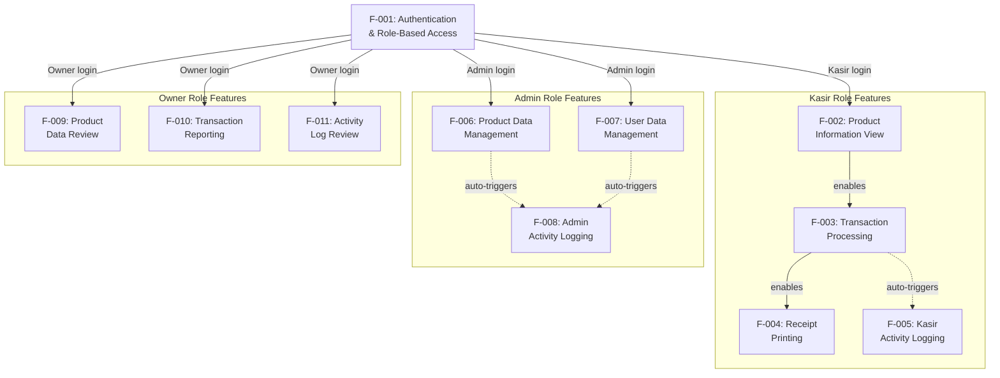
```mermaid
flowchart TD
    F001["F-001: Authentication<br/>& Role-Based Access"]

    subgraph KasirGroup["Kasir Role Features"]
        F002["F-002: Product<br/>Information View"]
        F003["F-003: Transaction<br/>Processing"]
        F004["F-004: Receipt<br/>Printing"]
        F005["F-005: Kasir<br/>Activity Logging"]
        F002 -->|"enables"| F003
        F003 -->|"enables"| F004
        F003 -.->|"auto-triggers"| F005
    end

    subgraph AdminGroup["Admin Role Features"]
        F006["F-006: Product Data<br/>Management"]
        F007["F-007: User Data<br/>Management"]
        F008["F-008: Admin<br/>Activity Logging"]
        F006 -.->|"auto-triggers"| F008
        F007 -.->|"auto-triggers"| F008
    end

    subgraph OwnerGroup["Owner Role Features"]
        F009["F-009: Product<br/>Data Review"]
        F010["F-010: Transaction<br/>Reporting"]
        F011["F-011: Activity<br/>Log Review"]
    end

    F001 -->|"Kasir login"| F002
    F001 -->|"Admin login"| F006
    F001 -->|"Admin login"| F007
    F001 -->|"Owner login"| F009
    F001 -->|"Owner login"| F010
    F001 -->|"Owner login"| F011
```

> **Note:** F-001 (Authentication) is the universal prerequisite for all ten functional features. Every feature within each role subgroup requires an active, authenticated session with the appropriate role before any functionality is accessible.

### 2.3.2 Integration Points and Data Flow

Features interact through shared database tables. The following diagram shows how write operations (left) flow through the database (center) to read operations (right), establishing cross-role data integration.

```mermaid
flowchart LR
    subgraph WriteOps["Write Operations"]
        W1["F-003: Transaction<br/>Processing<br/>(Kasir)"]
        W2["F-006: Product<br/>Management<br/>(Admin)"]
        W3["F-007: User<br/>Management<br/>(Admin)"]
        W4["F-005 / F-008:<br/>Activity Logging<br/>(System)"]
    end

    subgraph DataStore["Database Tables"]
        T1[("transactions")]
        T2[("products")]
        T3[("users")]
        T4[("log")]
    end

    subgraph ReadOps["Read Operations"]
        R1["F-002: Product View<br/>(Kasir)"]
        R2["F-009: Product Review<br/>(Owner)"]
        R3["F-010: Transaction<br/>Reports (Owner)"]
        R4["F-011: Log Review<br/>(Owner)"]
        R5["F-001: Authentication<br/>(All Roles)"]
    end

    W1 -->|"INSERT"| T1
    W2 -->|"CRUD"| T2
    W3 -->|"CRUD"| T3
    W4 -->|"INSERT"| T4

    T1 -->|"SELECT"| R3
    T2 -->|"SELECT"| R1
    T2 -->|"SELECT"| R2
    T4 -->|"SELECT"| R4
    T3 -->|"SELECT"| R5
end
```

#### Cross-Role Integration Points

| Integration Point | Source Feature | Target Feature | Data Table |
|---|---|---|---|
| Product catalog availability | F-006 (Admin writes) | F-002, F-009 (Kasir/Owner read) | `products` |
| Transaction records for reporting | F-003 (Kasir writes) | F-010 (Owner reads) | `transactions` |
| Audit trail for oversight | F-005, F-008 (System writes) | F-011 (Owner reads) | `log` |
| User credentials for authentication | F-007 (Admin writes) | F-001 (All roles read) | `users` |

### 2.3.3 Shared Components and Common Services

The following components are shared across multiple features and should be implemented as reusable modules to ensure consistency and reduce duplication.

#### Shared Database Tables

| Table | Written By | Read By |
|---|---|---|
| `products` | F-006 | F-002, F-003, F-009 |
| `transactions` | F-003 | F-010 |
| `users` | F-007 | F-001 |
| `log` | F-005, F-008 | F-011 |

#### Common Services

| Service | Description | Consumed By |
|---|---|---|
| **Authentication Guard** | Session validation and role checking on every protected page | F-002 through F-011 |
| **Activity Logger** | Shared logging mechanism that inserts entries into the `log` table | F-005, F-008 (auto-triggered by F-003, F-004, F-006, F-007) |
| **Database Connector** | Centralized `.env`-driven database connection supporting MySQL and PostgreSQL | All features |
| **Bootstrap UI Layer** | Shared presentation framework for responsive dashboard rendering | All features with UI components |

---

## 2.4 IMPLEMENTATION CONSIDERATIONS

### 2.4.1 Technical Constraints

The following non-negotiable constraints are mandated by the project specification and apply to all feature implementations. These are defined in Section 1.3.1 (Essential Technical Requirements) and the user-provided context.

| Constraint | Specification | Impact |
|---|---|---|
| PHP Native Only | No frameworks (Laravel, Symfony, CodeIgniter, etc.) | All routing, templating, session management, and DB access via native PHP |
| Zero External Dependencies | No npm packages, no Composer packages | No `vendor/`, `node_modules/`, `package.json`, or `composer.json` |
| Dual Database Support | MySQL **and** PostgreSQL | SQL must be compatible with both engines; `.env` file switches between them |
| Environment Configuration | `.env` file for connection parameters | Database host, name, user, password, and driver externalized |
| Bootstrap Frontend | Bootstrap CSS framework | All UI components use Bootstrap grid and components |
| Cash-Only Payments | No digital or card payment methods | No payment gateway integration required |
| Single Location | No multi-branch or multi-location support | No branch/location data structures needed |
| Bahasa Indonesia UI | All labels and business terms in Indonesian | Field names, button labels, messages in Bahasa Indonesia |

### 2.4.2 Performance and Scalability Requirements

Performance requirements are derived from the system's operational context as a single-location laundry POS system, as defined in Section 1.2.1 and Section 1.3.2.

| Consideration | Requirement | Applicable Features |
|---|---|---|
| Transaction Response Time | Transaction processing and receipt generation should complete within standard web response times | F-003, F-004 |
| Report Generation | Date-filtered transaction reports should render efficiently for growing datasets | F-010 |
| Concurrent Users | System should support simultaneous access by Kasir, Admin, and Owner | All features |
| Database Indexing | Primary keys and foreign keys should be indexed for query performance | All database operations |
| Session Management | PHP sessions must be managed efficiently with appropriate timeout policies | F-001 |

**Scalability Boundaries:** The system is designed for a single-location laundry business. Multi-branch support, multi-tenant architecture, and horizontal scaling are explicitly out of scope (Section 1.3.3). Vertical scaling (improving the single server) is the only applicable growth path.

### 2.4.3 Security Implications

Security requirements are derived from the role isolation and audit completeness critical success factors defined in Section 1.2.3, as well as PHP session security best practices.

| Security Concern | Requirement | Applicable Features |
|---|---|---|
| **Role-Based Access Control** | Each role accesses only permitted functionality; no privilege escalation | F-001 through F-011 |
| **Password Storage** | Passwords must be hashed (PHP `password_hash()` / `password_verify()` recommended) | F-001, F-007 |
| **Session Security** | Session IDs should be regenerated after authentication; sessions must have timeout policies | F-001 |
| **Input Sanitization** | All user inputs must be sanitized to prevent SQL injection and XSS attacks | F-003, F-006, F-007 |
| **Audit Immutability** | Log entries must not be editable or deletable by any role | F-005, F-008, F-011 |
| **Owner Read-Only Enforcement** | Owner role must have no write access to any data table | F-009, F-010, F-011 |
| **CSRF Protection** | Form submissions should include CSRF tokens to prevent cross-site request forgery | All form-based features |

### 2.4.4 Maintenance Requirements

| Consideration | Description | Applicable Features |
|---|---|---|
| **Database Portability** | All SQL queries must function on both MySQL and PostgreSQL without modification, or use an abstraction layer | All features |
| **Code Organization** | Native PHP files should follow a logical directory structure separating concerns (authentication, transactions, admin, owner) | All features |
| **Configuration Management** | `.env` file must be the single point of change for database connection parameters | Infrastructure |
| **Log Growth Management** | The `log` table will grow indefinitely; consideration for archival or pagination is recommended | F-005, F-008, F-011 |
| **Product Catalog Integrity** | Deletion of products must account for existing transaction references (FK constraint on `transactions.id_produk`) | F-006, F-003 |

---

## 2.5 REQUIREMENTS TRACEABILITY MATRIX

### 2.5.1 Feature-to-Specification Traceability

This matrix maps each feature to its originating specification requirement, the success objective it fulfills (from Section 1.2.3), and its verification method.

| Feature ID | Spec Req | Success Objective | Verification Method |
|---|---|---|---|
| F-001 | Implicit | SO-1 | Login test per role with correct dashboard routing |
| F-002 | Req 1 | SO-2 (partial) | Product list display validation |
| F-003 | Req 2 | SO-2 | End-to-end transaction workflow test |
| F-004 | Req 3 | SO-2 | Receipt generation and print test |
| F-005 | Req 4 | SO-6 | Log table inspection after Kasir operations |
| F-006 | Req 5 | SO-3 | CRUD operations on `products` table |
| F-007 | Req 6 | SO-4 | User lifecycle management test |
| F-008 | Req 7 | SO-6 | Log table inspection after Admin operations |
| F-009 | Req 8 | — | Read-only product catalog access test |
| F-010 | Req 9 | SO-5 | Report generation and date filtering validation |
| F-011 | Req 10 | — | Activity log display with user attribution |

### 2.5.2 Feature-to-Database Traceability

| Feature ID | Primary Table | Operation Type | Related Tables |
|---|---|---|---|
| F-001 | `users` | SELECT | — |
| F-002 | `products` | SELECT | — |
| F-003 | `transactions` | INSERT | `products` (FK lookup) |
| F-004 | `transactions` | SELECT | `products` (JOIN) |
| F-005 | `log` | INSERT | `users` (FK reference) |
| F-006 | `products` | INSERT, UPDATE, DELETE | — |
| F-007 | `users` | INSERT, UPDATE | — |
| F-008 | `log` | INSERT | `users` (FK reference) |
| F-009 | `products` | SELECT | — |
| F-010 | `transactions` | SELECT | `products` (JOIN) |
| F-011 | `log` | SELECT | `users` (JOIN) |

### 2.5.3 Assumptions and Constraints

The following assumptions underlie these requirements. They are derived from gaps between the explicitly stated specification and the functional requirements that imply additional capabilities.

| ID | Assumption | Rationale | Impact |
|---|---|---|---|
| A-001 | The `transactions` table includes a date/timestamp column for creation time | Req 9 requires date-based filtering, but the schema lists no date field | F-010 cannot function without this column |
| A-002 | The `users` table includes an active/status flag for deactivation | Req 6 specifies deactivation (not deletion), but the schema lists no status field | F-007-RQ-003 requires a mechanism to flag inactive users |
| A-003 | The `nomor_unik` generation uses a system-determined algorithm | No specific format for the unique order number is specified | F-003-RQ-005 implementation must ensure uniqueness |
| A-004 | All monetary values are in Indonesian Rupiah (IDR) | No currency field exists; single-location Indonesian business | F-003, F-006 |
| A-005 | Bootstrap is loaded via CDN or local copy (no npm) | Zero external dependency constraint prohibits npm | All UI features |
| A-006 | Product deletion is restricted when referenced by existing transactions | FK constraint `transactions.id_produk → products.id` prevents orphaned records | F-006-RQ-003 |

---

## 2.6 REFERENCES

### 2.6.1 Repository and Specification Sources

| Source | Relevance |
|---|---|
| `README.md` | Confirmed greenfield project state; default GitLab template with no project-specific content |
| `/` (repository root) | Single file present; no source code, configuration, or assets |
| User-provided project context | Sole authoritative requirements source: 10 numbered requirements, business process, database schema, technology constraints |

### 2.6.2 Technical Specification Cross-References

| Section | Content Referenced |
|---|---|
| Section 1.1 — Executive Summary | Project overview, core business problem, stakeholder definitions, business value dimensions |
| Section 1.2 — System Overview | Business context, six core modules, component architecture diagram, core technical approach, success criteria (SO-1 through SO-6), KPIs |
| Section 1.3 — Scope | 10 in-scope features, primary user workflow diagram, essential technical requirements, implementation boundaries, data domains, database relationships, out-of-scope items |
| Section 1.4 — Document Conventions | Language conventions, requirement traceability numbering (Req 1–10), pre-implementation specification scope |
| Section 1.5 — References | Repository files examined, greenfield state confirmation, authoritative source identification |

### 2.6.3 External References

| Source | Relevance |
|---|---|
| PHP Manual — Session Management Basics (php.net) | Session security best practices for F-001 authentication implementation: session ID regeneration, timestamp-based management |

# 3. Technology Stack

This section defines the complete technology stack for the **Londry** (Sistem Laundry) web-based POS and operational management system. All technology decisions are derived from the non-negotiable constraints established in the Technical Specification (Sections 1.2.2, 1.3.1, 2.4.1) and the user-provided project context. As a greenfield, pre-implementation project (confirmed in Section 1.4.3), this section serves as the authoritative technology blueprint for all future development.

> **Critical Context — Default Stack Override:** The Londry system explicitly rejects the default technology stack template (AWS, Docker, Python/Flask, React, MongoDB, etc.). The user-provided context mandates a fundamentally different architecture: PHP Native backend, Bootstrap frontend, MySQL/PostgreSQL databases, zero external dependencies, and self-hosted deployment. Every technology choice below reflects these mandated constraints.

---

## 3.1 PROGRAMMING LANGUAGES

### 3.1.1 Backend Language: PHP (Native)

PHP serves as the sole backend programming language for the Londry system. This is a non-negotiable project constraint: all server-side logic — including routing, templating, session management, and database access — must be implemented using native PHP functions and built-in extensions exclusively.

| Attribute | Specification |
|---|---|
| **Language** | PHP (Hypertext Preprocessor) |
| **Recommended Version** | PHP 8.5.x (latest stable) |
| **Minimum Supported Version** | PHP 8.4.x (actively supported) |
| **Latest Stable Patch** | PHP 8.5.3 (released 2026-01-29) |
| **Active Support Window** | 2 years bug fixes + 2 years security fixes (4-year total lifecycle) |
| **License** | PHP License v3.01 |

#### Version Justification

PHP 8.5.3 was released on February 12, 2026, making it the most current stable release. PHP 8.5 is the latest stable release and the recommended version for new projects, offering improved performance, enhanced type safety, better debugging tools, and modern language features. If the hosting provider does not yet support PHP 8.5, PHP 8.4 remains a stable and production-ready option.

Each release branch of PHP is fully supported for two years from its initial stable release, during which bugs and security issues are fixed in regular point releases. After this two-year period, each branch is then supported for an additional two years for critical security issues only. The PHP Release Cycle was extended in March 2024 from 3 to 4 years: 2 years of bug fixes, and 2 years of security fixes.

The current support status of relevant PHP versions is:

| PHP Version | Release Date | Status | Bug Fix Support Until | Security Support Until |
|---|---|---|---|---|
| **8.5** | November 20, 2025 | Active Support | ~November 2027 | ~November 2029 |
| **8.4** | November 2024 | Active Support | ~December 2026 | ~December 2028 |
| **8.3** | November 2023 | Security-Only | — | ~December 2027 |

PHP 8.4 is an actively maintained branch, and will receive active bug fix and security updates until 2026-12-31. For a greenfield project beginning development now, PHP 8.5 is the optimal choice as it provides the longest support runway.

#### Selection Criteria and Constraints

The choice of PHP Native (no frameworks) is mandated by the project specification and reinforced by the user context, which states: *"codebase ditulis dengan PHP native, menggunakan dependency bawaan dalam PHP itu sendiri."* This constraint is documented in Tech Spec Section 2.4.1 as: "PHP Native Only — No frameworks (Laravel, Symfony, CodeIgniter, etc.) — All routing, templating, session management, and DB access via native PHP."

| Criterion | Rationale |
|---|---|
| **Zero Framework Overhead** | Native PHP eliminates framework abstraction layers, reducing complexity and deployment dependencies |
| **Universal Hosting Compatibility** | PHP is supported on virtually all web hosting environments, from shared hosting to VPS and dedicated servers |
| **Built-in Function Coverage** | PHP's standard library provides all functions required: session management, password hashing, database access (PDO), input sanitization, and output encoding |
| **Deployment Simplicity** | PHP files are interpreted at runtime — no compilation, no build step, no transpilation required |

### 3.1.2 Frontend Languages: HTML5, CSS3, JavaScript

The frontend layer uses standard web technologies delivered through server-rendered PHP templates:

| Language | Role | Version | Notes |
|---|---|---|---|
| **HTML5** | Document structure and markup | Living Standard | Generated by PHP template files |
| **CSS3** | Styling and layout | Level 3+ | Delivered via Bootstrap framework |
| **JavaScript** | UI component interactivity | ES6+ | Bundled with Bootstrap (vanilla JS) |

No custom JavaScript framework (React, Vue, Angular) or TypeScript is used. All frontend interactivity is limited to Bootstrap's built-in JavaScript components (modals, tooltips, dropdowns, collapse behaviors). Bootstrap 5 is the newest version of Bootstrap, with a smooth overhaul; jQuery is replaced with vanilla JavaScript.

### 3.1.3 Database Query Language: SQL

All database interactions use SQL, which must be written to be compatible with both MySQL and PostgreSQL dialects. This dual-compatibility requirement is documented in Tech Spec Section 2.4.4: "All SQL queries must function on both MySQL and PostgreSQL without modification, or use an abstraction layer."

---

## 3.2 FRAMEWORKS & LIBRARIES

### 3.2.1 Backend Framework: None (Explicit Constraint)

The Londry system uses **no backend framework**. This is a non-negotiable architectural constraint, not an oversight. Tech Spec Section 1.3.1 mandates: "PHP Native Only — No PHP frameworks (Laravel, Symfony, CodeIgniter, etc.) — All routing, templating, database access, and session management via native PHP."

All functionality that frameworks typically provide is implemented through native PHP:

| Framework Capability | Native PHP Replacement | PHP Feature Used |
|---|---|---|
| Routing | Manual URL routing | `$_SERVER['REQUEST_URI']`, directory structure |
| Templating | PHP as template engine | Native `<?php ?>` tags in `.php` files |
| Session Management | Native session handling | `session_start()`, `$_SESSION` superglobal |
| Database ORM | PDO with prepared statements | `PDO` class, `PDOStatement` |
| Authentication | Custom implementation | `password_hash()`, `password_verify()`, `$_SESSION` |
| Input Validation | Native sanitization functions | `htmlspecialchars()`, `filter_input()`, PDO parameterization |
| CSRF Protection | Custom token generation | `random_bytes()`, `bin2hex()`, `$_SESSION` token storage |

### 3.2.2 Frontend Framework: Bootstrap 5.3

Bootstrap CSS is the sole frontend framework, providing responsive layout, UI components, and interactive JavaScript behaviors.

| Attribute | Specification |
|---|---|
| **Framework** | Bootstrap |
| **Major Version** | 5 |
| **Latest Release** | 5.3.8 |
| **Integration Method** | CDN or local compiled assets (no npm) |
| **jQuery Dependency** | None (removed in Bootstrap 5) |
| **License** | MIT License |

Bootstrap 5.3 is the current major release, with the last update being v5.3.8.

#### CDN Integration (Recommended)

Bootstrap is loaded via CDN `<link>` and `<script>` tags, consistent with the zero-dependency constraint documented in Tech Spec Section 2.5.3 (Assumption A-005): "Bootstrap is loaded via CDN or local copy (no npm) — Zero external dependency constraint prohibits npm."

The recommended CDN references for Bootstrap 5.3.8 are:

| Asset | CDN Provider |
|---|---|
| **CSS** | `cdn.jsdelivr.net/npm/bootstrap@5.3.8/dist/css/bootstrap.min.css` |
| **JS Bundle** | `cdn.jsdelivr.net/npm/bootstrap@5.3.8/dist/js/bootstrap.bundle.min.js` |

#### Alternative: Local Asset Hosting

For environments without reliable internet access, the compiled Bootstrap CSS and JS files can be downloaded and served as local static assets. This requires no build tools — only the pre-compiled distribution files.

#### Justification

| Criterion | Bootstrap 5 Advantage |
|---|---|
| **Zero Build Requirement** | Pre-compiled CSS/JS files usable directly via `<link>` and `<script>` tags |
| **No jQuery** | Bootstrap 5 uses vanilla JavaScript, eliminating the need for additional library dependencies |
| **Responsive Design** | Built-in responsive grid system for consistent layouts across devices |
| **Component Library** | Comprehensive UI components (tables, forms, cards, modals, alerts) matching all Londry dashboard requirements |
| **Bahasa Indonesia Compatible** | No language-specific constraints; all labels and text are rendered by PHP templates |

### 3.2.3 PHP Built-in Extensions

The system relies exclusively on PHP's standard built-in extensions — no PECL or third-party extensions are required:

| Extension | Purpose | System Usage |
|---|---|---|
| **PDO** | Database abstraction layer | Centralized database connection supporting dual MySQL/PostgreSQL switching |
| **PDO_MySQL** | MySQL-specific PDO driver | Enables MySQL connectivity via PDO |
| **PDO_PGSQL** | PostgreSQL-specific PDO driver | Enables PostgreSQL connectivity via PDO |
| **session** | Native session management | User authentication state, role-based dashboard routing (`$_SESSION`) |
| **password** | Secure password hashing | `password_hash()` for storage, `password_verify()` for authentication (bcrypt by default) |
| **filter** | Input filtering and validation | `filter_input()`, `filter_var()` for sanitizing user-supplied data |
| **json** | JSON encoding/decoding | Environment configuration parsing, potential AJAX responses |
| **date** | Date/time handling | Transaction timestamps, date-filtered reporting (F-010) |

#### PDO as the Database Abstraction Strategy

PDO (PHP Data Objects) is the critical enabler for the system's dual-database requirement. As a built-in PHP extension, PDO provides a uniform interface for accessing MySQL and PostgreSQL — the only code change required to switch databases is the DSN (Data Source Name) string in the `.env` configuration.

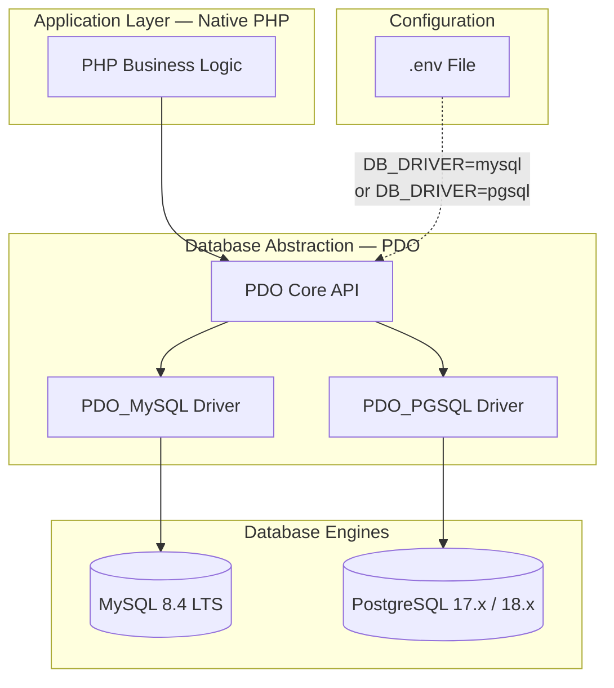
```mermaid
flowchart TD
    subgraph ApplicationLayer["Application Layer — Native PHP"]
        APP["PHP Business Logic"]
    end

    subgraph AbstractionLayer["Database Abstraction — PDO"]
        PDO_CORE["PDO Core API"]
        PDO_CORE --> PDO_MYSQL["PDO_MySQL Driver"]
        PDO_CORE --> PDO_PGSQL["PDO_PGSQL Driver"]
    end

    subgraph DatabaseLayer["Database Engines"]
        MYSQL[("MySQL 8.4 LTS")]
        PGSQL[("PostgreSQL 17.x / 18.x")]
    end

    subgraph ConfigLayer["Configuration"]
        ENV[".env File"]
    end

    APP --> PDO_CORE
    PDO_MYSQL --> MYSQL
    PDO_PGSQL --> PGSQL
    ENV -.->|"DB_DRIVER=mysql\nor DB_DRIVER=pgsql"| PDO_CORE
```

This architecture satisfies Tech Spec Section 1.2.3's critical success factor: "The system must function identically on both MySQL and PostgreSQL with configuration-only switching via `.env`."

---

## 3.3 OPEN SOURCE DEPENDENCIES

### 3.3.1 External Package Dependencies: Zero

The Londry system maintains a strict **zero external dependency** policy. This is one of the most distinctive architectural constraints of the project and is documented across multiple specification sections.

| Dependency Type | Count | Artifacts |
|---|---|---|
| **npm packages** | 0 | No `package.json`, no `node_modules/` |
| **Composer packages** | 0 | No `composer.json`, no `vendor/` |
| **PECL extensions** | 0 | Only standard PHP built-in extensions |
| **External PHP libraries** | 0 | No third-party `.php` files |

Tech Spec Section 1.2.3 defines this as a KPI: "Zero External Dependencies — 0 npm / 0 Composer packages — Deployable without any package manager execution." Section 1.3.1 further reinforces: "No `vendor/` directory, no `node_modules/`, no `package.json`, no `composer.json`."

The user-provided context explicitly states: *"tidak ada dependency luar yang perlu di unduh (seperti npm dan composer package)"* — there are no external dependencies to download.

### 3.3.2 Bootstrap as a Non-Package Dependency

Bootstrap is the sole external library in the system, but it does **not** constitute a package dependency because it is loaded via one of two methods, neither of which requires a package manager:

| Method | Mechanism | Files Involved |
|---|---|---|
| **CDN (Primary)** | `<link>` and `<script>` tags in HTML `<head>` | None stored locally |
| **Local Assets (Fallback)** | Pre-compiled CSS/JS files served from the web server | `bootstrap.min.css`, `bootstrap.bundle.min.js` |

### 3.3.3 Custom `.env` Parser

Since the widely-used `vlucas/phpdotenv` Composer package is prohibited by the zero-dependency constraint, the system requires a custom PHP implementation to parse the `.env` configuration file. This custom parser must:

- Read key-value pairs from the `.env` file
- Support basic string values for database connection parameters
- Handle comments (lines beginning with `#`)
- Populate configuration variables accessible to the application

---

## 3.4 THIRD-PARTY SERVICES

### 3.4.1 External Services: None

The Londry system is architected as a **standalone, self-contained application** with zero external service dependencies. Tech Spec Section 1.2.1 states: "Londry is designed as a standalone, self-contained system. It does not integrate with external services, third-party APIs, payment gateways, or enterprise middleware."

| Service Category | Status | Rationale |
|---|---|---|
| **Payment Gateways** | Not applicable | Cash-only payments (*tunai*) — no digital payment processing |
| **Authentication Services** (e.g., Auth0, OAuth) | Not applicable | Native PHP session-based authentication against the `users` table |
| **Monitoring/APM Tools** | Not specified | No observability tooling mandated |
| **Cloud Services** (e.g., AWS, Azure) | Not required | System is designed for self-hosted deployment on any PHP-capable server |
| **Email/SMS Services** | Not specified | No notification mechanisms in scope |
| **CDN** (for Bootstrap) | Optional | jsDelivr CDN used for Bootstrap delivery; system functions without it via local assets |
| **AI/ML Services** | Not applicable | No artificial intelligence features in scope |

### 3.4.2 Sole Infrastructure Dependency

Tech Spec Section 1.2.1 identifies the only external infrastructure requirement: "The only external infrastructure dependency is a web server capable of executing PHP and connecting to a MySQL or PostgreSQL database instance." This simplicity is a deliberate architectural decision optimizing for universal deployability.

---

## 3.5 DATABASES & STORAGE

### 3.5.1 Primary Database: MySQL

MySQL serves as the primary database engine for the Londry system.

| Attribute | Specification |
|---|---|
| **Database Engine** | MySQL |
| **Recommended Version** | 8.4 LTS |
| **Latest Stable Patch** | 8.4.8 (released 2026-01-20) |
| **Support Model** | Long-Term Support (LTS) |
| **License** | GPLv2 (Community Edition) |

MySQL 8.4.8 was released on 2026-01-20 as an LTS Release. LTS releases have a 5-year premier and 3-year extended support.

As of April 2026, with version 8.0.46, MySQL 8.0 reaches End of Life (EoL). MySQL 8.0 users are encouraged to upgrade to the latest MySQL 8.4 LTS or MySQL Innovation release. Therefore, MySQL 8.4 LTS is the only recommended track for new deployments.

### 3.5.2 Alternative Database: PostgreSQL

PostgreSQL is the supported alternative database, switchable via the `.env` configuration file.

| Attribute | Specification |
|---|---|
| **Database Engine** | PostgreSQL |
| **Recommended Version** | 17.x (established) or 18.x (latest) |
| **Latest Stable Patches** | 18.3, 17.9 (released 2026-02-26) |
| **Support Model** | 5-year major version support |
| **License** | PostgreSQL License (permissive open source) |

PostgreSQL 18.3, 17.9, 16.13, 15.17, and 14.22 were released on 2026-02-26. The PostgreSQL Global Development Group supports a major version for 5 years after its initial release.

For a new deployment, PostgreSQL 17 is recommended as a mature, well-tested release. PostgreSQL 18 is also suitable for projects seeking the latest features.

### 3.5.3 Dual Database Architecture

The system must support both MySQL and PostgreSQL interchangeably through environment-driven configuration. This is a critical success factor documented in Tech Spec Section 1.2.3.

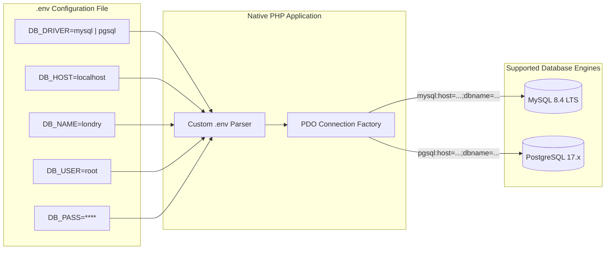
```mermaid
flowchart LR
    subgraph ConfigFile[".env Configuration File"]
        DB_DRIVER["DB_DRIVER=mysql | pgsql"]
        DB_HOST["DB_HOST=localhost"]
        DB_NAME["DB_NAME=londry"]
        DB_USER["DB_USER=root"]
        DB_PASS["DB_PASS=****"]
    end

    subgraph PHPApp["Native PHP Application"]
        PARSER["Custom .env Parser"]
        CONN["PDO Connection Factory"]
    end

    subgraph Databases["Supported Database Engines"]
        MY[("MySQL 8.4 LTS")]
        PG[("PostgreSQL 17.x")]
    end

    DB_DRIVER --> PARSER
    DB_HOST --> PARSER
    DB_NAME --> PARSER
    DB_USER --> PARSER
    DB_PASS --> PARSER
    PARSER --> CONN
    CONN -->|"mysql:host=...;dbname=..."| MY
    CONN -->|"pgsql:host=...;dbname=..."| PG
```

#### Database Compatibility Constraints

Tech Spec Section 2.4.4 mandates: "All SQL queries must function on both MySQL and PostgreSQL without modification, or use an abstraction layer." Key areas requiring attention:

| SQL Feature | MySQL Syntax | PostgreSQL Syntax | Compatibility Strategy |
|---|---|---|---|
| Auto-increment PK | `AUTO_INCREMENT` | `SERIAL` / `GENERATED ALWAYS AS IDENTITY` | Use PDO `lastInsertId()` post-insert |
| String Concatenation | `CONCAT()` function | `CONCAT()` or `\|\|` operator | Use `CONCAT()` function (both support) |
| Boolean Type | `TINYINT(1)` | `BOOLEAN` | Use integer values (0/1) for portability |
| ENUM Type | Native `ENUM(...)` | `CHECK` constraint or custom type | Requires abstraction in schema creation |
| Date Functions | `NOW()`, `CURDATE()` | `NOW()`, `CURRENT_DATE` | Use ANSI SQL standard functions |
| LIMIT Syntax | `LIMIT n` | `LIMIT n` | Identical syntax (compatible) |

### 3.5.4 Database Schema

The system uses a relational schema of four tables, as defined in Tech Spec Section 1.3.1:

| Table | Purpose | Primary Key | Foreign Keys | Operations |
|---|---|---|---|---|
| `users` | User identity and access management | `id` | — | SELECT (F-001), INSERT/UPDATE (F-007) |
| `products` | Laundry service catalog | `id` | — | SELECT (F-002, F-009), CRUD (F-006) |
| `transactions` | Sales transaction records | Auto-generated | `id_produk` → `products.id` | INSERT (F-003), SELECT (F-004, F-010) |
| `log` | Audit trail of user actions | Auto-generated | `id_user` → `users.id` | INSERT (F-005, F-008), SELECT (F-011) |

### 3.5.5 Caching Solutions: Not Required

No caching layer (Redis, Memcached, or PHP opcode cache) is specified in the project requirements. The system is designed for a single-location laundry business with low concurrency — the operational context does not warrant a dedicated caching infrastructure. Standard PHP opcode caching (OPcache, included with PHP) is recommended for production performance.

### 3.5.6 File and Object Storage: Not Required

No file storage, object storage (S3), or media upload capabilities are specified. All data resides exclusively in the relational database. Receipt generation (F-004) uses browser-based print functionality rather than server-side file generation.

---

## 3.6 DEVELOPMENT & DEPLOYMENT

### 3.6.1 Development Environment

The system is designed for deployment on standard PHP hosting environments. Tech Spec Section 1.2.2 states the system "can be deployed on virtually any standard PHP hosting environment (shared hosting, VPS, or local XAMPP/WAMP setup) without requiring package managers, build pipelines, or containerization."

#### Recommended Development Stacks

| Stack | Platform | Included Components | Recommended For |
|---|---|---|---|
| **XAMPP** | Windows, macOS, Linux | Apache, MariaDB/MySQL, PHP, Perl | Cross-platform development |
| **WAMP** | Windows | Apache, MySQL, PHP | Windows-only development |
| **MAMP** | macOS | Apache, MySQL, PHP | macOS-only development |
| **LAMP** | Linux | Apache, MySQL/MariaDB, PHP | Linux server deployment |
| **PHP Built-in Server** | Any OS with PHP | PHP development server only | Quick testing (`php -S localhost:8000`) |

### 3.6.2 Web Server: Apache HTTP Server

| Attribute | Specification |
|---|---|
| **Web Server** | Apache HTTP Server |
| **Current Stable Version** | 2.4.66 |
| **License** | Apache License 2.0 |
| **Alternative** | Nginx with PHP-FPM (compatible but not specified) |

Apache HTTP Server version 2.4.66 is the latest release from the 2.4.x stable branch and represents the best available version.

Apache is the standard web server for PHP applications and is included in all major development stacks (XAMPP, WAMP, LAMP). It is particularly common in LAMP stack deployments running PHP applications.

Key Apache modules required for the Londry system:

| Module | Purpose |
|---|---|
| `mod_php` or `php-fpm` | PHP script execution |
| `mod_rewrite` | URL rewriting for clean routing |
| `mod_ssl` | HTTPS support (recommended for production) |
| `mod_headers` | Security header configuration |

### 3.6.3 Build System: None Required

The Londry system requires **no build process whatsoever**. This is a direct consequence of the technology stack choices:

| Typical Build Step | Why Not Needed |
|---|---|
| JavaScript bundling/minification | No custom JavaScript; Bootstrap loaded pre-compiled |
| CSS preprocessing (Sass/LESS) | Bootstrap used as pre-compiled CSS; no custom preprocessing |
| TypeScript compilation | No TypeScript in the stack |
| PHP compilation | PHP is an interpreted language — files execute at runtime |
| Asset pipeline | No Webpack, Vite, Gulp, or any build tool required |
| Dependency installation | Zero npm/Composer dependencies to install |

This zero-build architecture means the entire application can be deployed by copying PHP files to a web server document root.

### 3.6.4 Containerization: Not Required

Docker and containerization are explicitly **not required** for this system. Tech Spec Section 1.2.2 confirms the system is deployable "without requiring package managers, build pipelines, or containerization." The intentionally simple PHP-native stack ensures compatibility with the broadest possible range of hosting environments, including shared hosting where Docker is unavailable.

### 3.6.5 CI/CD: Not Specified

No CI/CD pipeline is mandated by the project specification. Tech Spec Section 1.3.3 explicitly excludes "Automated Testing Framework — No testing requirements specified." The repository is hosted on GitLab (`https://gitlab.com/mzkrl/londry.git`), which provides GitLab CI/CD capabilities that could be adopted in future phases.

### 3.6.6 Version Control

| Attribute | Specification |
|---|---|
| **VCS** | Git |
| **Hosting Platform** | GitLab |
| **Repository URL** | `https://gitlab.com/mzkrl/londry.git` |
| **Current State** | Greenfield (single `README.md` file) |

---

## 3.7 COMPLETE TECHNOLOGY STACK OVERVIEW

### 3.7.1 Stack Summary Table

The following table provides a consolidated view of every technology component in the Londry system:

| Layer | Technology | Version | Status | Justification |
|---|---|---|---|---|
| **Backend Language** | PHP (Native) | ≥ 8.4 (recommend 8.5.x) | Mandated | Explicit project requirement; built-in functions only |
| **Frontend Framework** | Bootstrap | 5.3.8 | Mandated | Explicit project requirement; responsive UI design |
| **Frontend Markup** | HTML5 | Living Standard | Standard | Server-rendered PHP templates |
| **Frontend Styling** | CSS3 | Level 3+ | Standard | Delivered through Bootstrap |
| **Frontend Scripting** | JavaScript (vanilla) | ES6+ | Standard | Bootstrap's bundled JS; no custom framework |
| **Primary Database** | MySQL | 8.4 LTS (8.4.8) | Mandated | Explicit project requirement; LTS for long-term stability |
| **Alternative Database** | PostgreSQL | 17.x or 18.x | Mandated | Explicit project requirement; dual-database support |
| **DB Abstraction** | PDO (PHP built-in) | Bundled with PHP | Required | Enables MySQL/PostgreSQL portability via unified API |
| **Web Server** | Apache HTTP Server | 2.4.66 | Recommended | Standard PHP hosting server; included in XAMPP/WAMP/LAMP |
| **Configuration** | `.env` file (custom parser) | N/A | Mandated | Externalize database connection parameters |
| **Authentication** | Native PHP sessions | Bundled with PHP | Mandated | No external auth service; session-based RBAC |
| **Package Managers** | None | N/A | Constraint | No npm, no Composer — zero external dependencies |
| **Build Tools** | None | N/A | Constraint | PHP is interpreted; Bootstrap is pre-compiled |
| **Containerization** | None required | N/A | Design choice | Deployable on any PHP hosting environment |
| **CI/CD** | Not specified | N/A | Out of scope | No automated testing requirements defined |
| **Version Control** | Git (GitLab) | Latest | Standard | Repository at `gitlab.com/mzkrl/londry.git` |

### 3.7.2 Architecture Stack Diagram

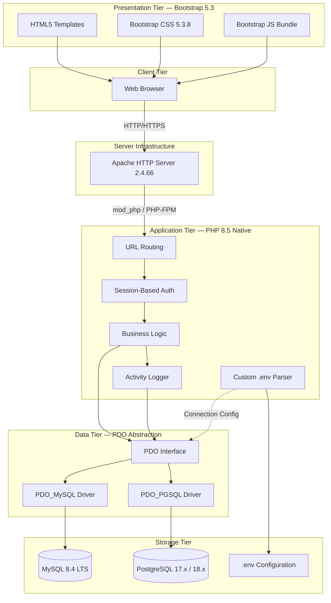
```mermaid
flowchart TB
    subgraph ClientTier["Client Tier"]
        BROWSER["Web Browser"]
    end

    subgraph PresentationTier["Presentation Tier — Bootstrap 5.3"]
        HTML["HTML5 Templates"]
        CSS["Bootstrap CSS 5.3.8"]
        JS["Bootstrap JS Bundle"]
    end

    subgraph ApplicationTier["Application Tier — PHP 8.5 Native"]
        ROUTING["URL Routing"]
        AUTH["Session-Based Auth"]
        BIZ["Business Logic"]
        LOG_SVC["Activity Logger"]
        ENV_PARSER["Custom .env Parser"]
    end

    subgraph DataTier["Data Tier — PDO Abstraction"]
        PDO_LAYER["PDO Interface"]
        MYSQL_DRV["PDO_MySQL Driver"]
        PGSQL_DRV["PDO_PGSQL Driver"]
    end

    subgraph StorageTier["Storage Tier"]
        MYSQL_DB[("MySQL 8.4 LTS")]
        PGSQL_DB[("PostgreSQL 17.x / 18.x")]
        ENV_FILE[".env Configuration"]
    end

    subgraph ServerInfra["Server Infrastructure"]
        APACHE["Apache HTTP Server 2.4.66"]
    end

    BROWSER -->|"HTTP/HTTPS"| APACHE
    APACHE -->|"mod_php / PHP-FPM"| ROUTING
    ROUTING --> AUTH
    AUTH --> BIZ
    BIZ --> LOG_SVC
    BIZ --> PDO_LAYER
    LOG_SVC --> PDO_LAYER
    PDO_LAYER --> MYSQL_DRV
    PDO_LAYER --> PGSQL_DRV
    MYSQL_DRV --> MYSQL_DB
    PGSQL_DRV --> PGSQL_DB
    ENV_PARSER --> ENV_FILE
    ENV_PARSER -.->|"Connection Config"| PDO_LAYER

    HTML --> BROWSER
    CSS --> BROWSER
    JS --> BROWSER
```

### 3.7.3 Default Stack Deviation Matrix

The following matrix documents the complete deviation from the default technology stack template, with justification for each change:

| Category | Default Template | Londry Actual | Deviation Rationale |
|---|---|---|---|
| Cloud Platform | AWS | Self-hosted / Shared hosting | Standalone system; no cloud dependency |
| Containerization | Docker | Not required | Deployable on any PHP hosting environment |
| Infrastructure as Code | Terraform | Not applicable | No cloud infrastructure to manage |
| CI/CD | GitHub Actions | Not specified (GitLab available) | No automated testing requirements |
| Backend Language | Python | **PHP (Native)** | Explicit project mandate |
| Backend Framework | Flask | **None** | Native PHP only; zero framework overhead |
| Authentication | Auth0 | **Native PHP sessions** | No external service dependencies |
| Primary Database | MongoDB | **MySQL (relational)** | Four-table relational schema; dual-DB support |
| AI Framework | Langchain | Not applicable | No AI/ML features in scope |
| Frontend Framework | React + TypeScript | **Server-rendered PHP + Bootstrap** | No SPA architecture; server-rendered pages |
| CSS Framework | TailwindCSS | **Bootstrap 5.3** | Explicit project requirement |
| Mobile Framework | React-Native | Not applicable | Web-only system; no mobile app |
| Native Apps | Swift / Kotlin / Electron | Not applicable | Browser-based POS; no native clients |

---

## 3.8 SECURITY CONSIDERATIONS

### 3.8.1 Security-Relevant Technology Decisions

The technology stack includes built-in security capabilities that address the requirements defined in Tech Spec Section 2.4.3:

| Security Concern | Technology / Approach | PHP Feature |
|---|---|---|
| **Password Storage** | Bcrypt hashing (default) | `password_hash(PASSWORD_DEFAULT)` + `password_verify()` |
| **SQL Injection Prevention** | Parameterized queries | PDO prepared statements (`$pdo->prepare()` with bound parameters) |
| **XSS Prevention** | Output encoding | `htmlspecialchars($input, ENT_QUOTES, 'UTF-8')` |
| **CSRF Protection** | Token-based form validation | `random_bytes()` + `bin2hex()` for token generation; `$_SESSION` for storage |
| **Session Security** | ID regeneration, timeout policies | `session_regenerate_id(true)` after authentication |
| **Role-Based Access Control** | Session-based role verification | `$_SESSION['role']` checked on every protected page |
| **Audit Immutability** | INSERT-only log table | `log` table has no UPDATE/DELETE operations for any role |

### 3.8.2 Security Implications of Stack Choices

| Stack Decision | Security Implication | Mitigation |
|---|---|---|
| No framework CSRF handling | Must implement custom CSRF tokens | Generate per-session tokens; validate on every form POST |
| Custom `.env` parser | Risk of exposing credentials if misconfigured | Place `.env` outside web root or protect with `.htaccess` |
| CDN for Bootstrap | Potential supply-chain risk from CDN compromise | Use Subresource Integrity (SRI) hashes on `<link>` and `<script>` tags |
| Native sessions | Session fixation/hijacking risk | Regenerate session ID on login; set `HttpOnly`, `Secure`, `SameSite` flags |
| No HTTPS enforcement in spec | Data transmitted in cleartext | Recommend `mod_ssl` with TLS certificates in production |

---

## 3.9 INTEGRATION REQUIREMENTS

### 3.9.1 Component Integration Map

The following table documents the integration requirements between technology components:

| Integration Point | Source Component | Target Component | Integration Mechanism |
|---|---|---|---|
| HTTP Request Handling | Apache HTTP Server | PHP Runtime | `mod_php` module or PHP-FPM via FastCGI |
| Database Connection | PHP Application | MySQL / PostgreSQL | PDO extension with DSN from `.env` configuration |
| UI Rendering | PHP Templates | Bootstrap CSS/JS | `<link>` and `<script>` tags in HTML output |
| Session Persistence | PHP Runtime | Server Filesystem | Default PHP session handler (file-based) |
| Configuration Loading | PHP Application | `.env` File | Custom file parser (`fopen()` / `fgets()` / `explode()`) |
| Receipt Printing | Bootstrap UI | Browser Print API | `window.print()` JavaScript call |

### 3.9.2 Compatibility Matrix

| Component A | Component B | Compatibility Requirement |
|---|---|---|
| PHP 8.5 | MySQL 8.4 LTS | PDO_MySQL driver bundled with PHP; full compatibility |
| PHP 8.5 | PostgreSQL 17.x/18.x | PDO_PGSQL driver bundled with PHP; full compatibility |
| PHP 8.5 | Apache 2.4.x | Supported via `mod_php` (prefork MPM) or PHP-FPM (event MPM) |
| Bootstrap 5.3 | PHP templates | No version coupling; Bootstrap is purely client-side |
| MySQL 8.4 | PostgreSQL 17.x/18.x | SQL queries must be cross-compatible (ANSI SQL preferred) |

---

## 3.10 REFERENCES

### 3.10.1 Technical Specification Sections Referenced

- **Section 1.1 — Executive Summary** — Project overview, greenfield state confirmation, stakeholder definitions
- **Section 1.2 — System Overview** — System architecture diagram, core technical approach table, success criteria, KPIs (zero external dependencies)
- **Section 1.3 — Scope** — In-scope features, essential technical requirements (PHP Native Only, Zero Dependencies, Dual Database), out-of-scope items (no mobile, no APIs, no Docker)
- **Section 1.4 — Document Conventions** — Pre-implementation specification status confirmation
- **Section 1.5 — References** — Repository file inventory (`README.md` only), greenfield state confirmation
- **Section 2.1 — Feature Catalog** — Feature registry with technical context for each feature (F-001 through F-011), dependency information
- **Section 2.3 — Feature Relationships** — Common services (Database Connector, Authentication Guard, Activity Logger, Bootstrap UI Layer)
- **Section 2.4 — Implementation Considerations** — Technical constraints table, security implications, maintenance requirements, database portability requirements
- **Section 2.5 — Requirements Traceability Matrix** — Assumption A-005 (Bootstrap CDN/local, no npm)
- **Section 2.6 — References** — External PHP manual reference for session management

### 3.10.2 External Sources Consulted

- **php.net** — PHP official website: version history, release schedule, support lifecycle
- **getbootstrap.com** — Bootstrap official documentation: version history, CDN URLs, download options
- **dev.mysql.com** — MySQL official release notes: version 8.4.8 LTS release details, EOL schedules
- **postgresql.org** — PostgreSQL official website: version 18.3/17.9 releases, versioning policy, support lifecycle
- **httpd.apache.org** — Apache HTTP Server official website: version 2.4.66 release, download page
- **endoflife.date** — End-of-life tracking for PHP, MySQL, PostgreSQL, and Apache HTTP Server

### 3.10.3 Repository Files Examined

- `README.md` — Default GitLab template; confirms greenfield state with no technology artifacts present
- `/` (repository root) — Single file present; no source code, configuration files, `package.json`, `composer.json`, or build scripts

# 4. Process Flowchart

This section provides a comprehensive catalog of all process flows within the Londry system — a web-based POS and operational management platform for a laundry business (*Sistem Laundry*). The system serves three authenticated internal user roles (Kasir, Administrator, and Owner/Manajer) and one external actor (Pelanggan/Customer) through a monolithic PHP-native architecture backed by four relational database tables. All process flows documented herein are derived from the Technical Specification, which serves as the definitive design contract for this greenfield project.

Each workflow in this section documents start and end points, process steps, decision diamonds, system boundaries, user touchpoints, error states and recovery paths, and timing considerations. Diagrams use Mermaid.js with the following symbol conventions:

| Symbol | Mermaid Shape | Meaning |
|---|---|---|
| Rounded rectangle | `(["..."])` | Start / End terminal |
| Rectangle | `["..."]` | Process step |
| Diamond | `{"..."}` | Decision point |
| Cylinder | `[("...")]` | Database / data store |
| Dashed arrow | `-.->` | Auto-triggered / implicit |
| Solid arrow | `-->` | Direct flow / prerequisite |

---

## 4.1 SYSTEM WORKFLOWS OVERVIEW

### 4.1.1 High-Level System Workflow

The Londry system operates around two major interaction categories: a **customer-facing workflow** where Pelanggan interacts physically with the Kasir at the laundry counter, with the Kasir mediating all system interactions; and an **internal management workflow** where three authenticated roles (Kasir, Admin, Owner) access role-specific dashboards after login. The universal entry point for all internal actors is the authentication gate — the system routes each user to their role-specific dashboard based on the `users.role` ENUM value (`"kasir"`, `"admin"`, or `"owner"`) stored in `$_SESSION`. All features (F-002 through F-011) require an active authenticated session with the appropriate role.

The following diagram illustrates the complete high-level system workflow, from actor entry through authentication to role-specific feature access:

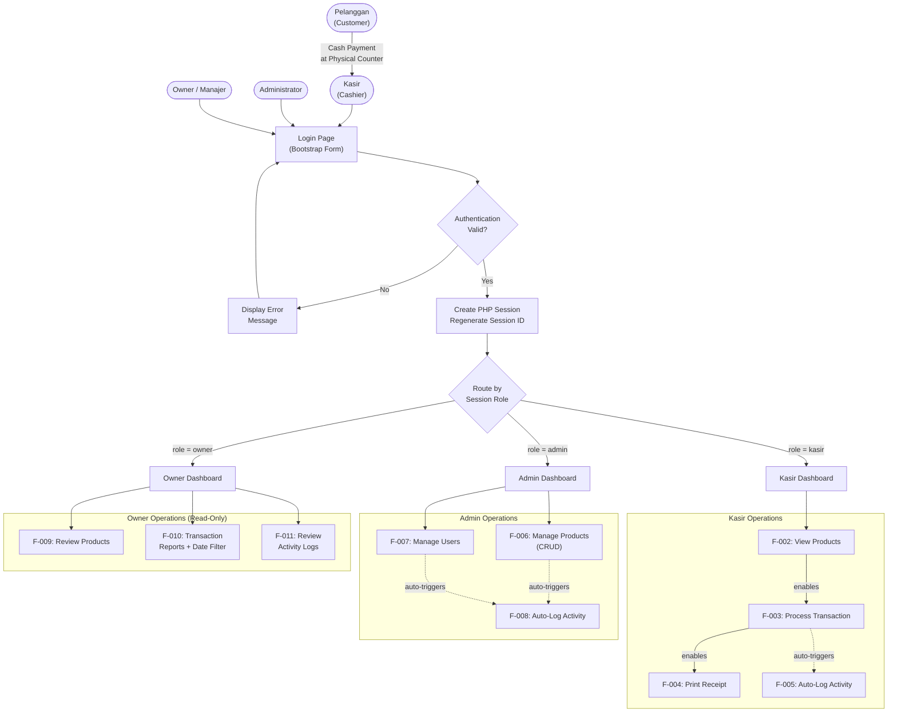
```mermaid
flowchart TD
    CUST(["Pelanggan<br/>(Customer)"])
    KSR_ACT(["Kasir<br/>(Cashier)"])
    ADM_ACT(["Administrator"])
    OWN_ACT(["Owner / Manajer"])

    CUST -->|"Cash Payment<br/>at Physical Counter"| KSR_ACT

    KSR_ACT --> LP["Login Page<br/>(Bootstrap Form)"]
    ADM_ACT --> LP
    OWN_ACT --> LP

    LP --> AUTH{"Authentication<br/>Valid?"}
    AUTH -->|"No"| ERR_MSG["Display Error<br/>Message"]
    ERR_MSG --> LP
    AUTH -->|"Yes"| SESS["Create PHP Session<br/>Regenerate Session ID"]

    SESS --> RR{"Route by<br/>Session Role"}
    RR -->|"role = kasir"| DK["Kasir Dashboard"]
    RR -->|"role = admin"| DA["Admin Dashboard"]
    RR -->|"role = owner"| DO["Owner Dashboard"]

    subgraph KasirScope["Kasir Operations"]
        KO1["F-002: View Products"]
        KO2["F-003: Process Transaction"]
        KO3["F-004: Print Receipt"]
        KO4["F-005: Auto-Log Activity"]
        KO1 -->|"enables"| KO2
        KO2 -->|"enables"| KO3
        KO2 -.->|"auto-triggers"| KO4
    end

    subgraph AdminScope["Admin Operations"]
        AO1["F-006: Manage Products<br/>(CRUD)"]
        AO2["F-007: Manage Users"]
        AO3["F-008: Auto-Log Activity"]
        AO1 -.->|"auto-triggers"| AO3
        AO2 -.->|"auto-triggers"| AO3
    end

    subgraph OwnerScope["Owner Operations (Read-Only)"]
        OO1["F-009: Review Products"]
        OO2["F-010: Transaction<br/>Reports + Date Filter"]
        OO3["F-011: Review<br/>Activity Logs"]
    end

    DK --> KO1
    DA --> AO1
    DA --> AO2
    DO --> OO1
    DO --> OO2
    DO --> OO3
```

### 4.1.2 Core Process Catalog

The system encompasses fourteen discrete process flows organized across infrastructure, core business, data management, monitoring, business intelligence, audit, and security domains. The following table provides a complete registry:

| Flow ID | Flow Name | Primary Actor | Category | Feature References |
|---|---|---|---|---|
| PF-01 | Authentication and Login | All Users | Infrastructure | F-001 |
| PF-02 | Logout and Session Destruction | All Users | Infrastructure | F-001 |
| PF-03 | Customer Transaction Cycle (End-to-End) | Pelanggan + Kasir | Core Business | F-002, F-003, F-004, F-005 |
| PF-04 | Product Information View | Kasir | Operations | F-002 |
| PF-05 | Transaction Processing (Detailed) | Kasir | Core Business | F-003, F-005 |
| PF-06 | Receipt Generation and Printing | Kasir | Core Business | F-004 |
| PF-07 | Product Data Management (CRUD) | Admin | Data Management | F-006, F-008 |
| PF-08 | User Data Management | Admin | Data Management | F-007, F-008 |
| PF-09 | Product Data Review (Read-Only) | Owner | Monitoring | F-009 |
| PF-10 | Transaction Reporting with Date Filtering | Owner | Business Intelligence | F-010 |
| PF-11 | Activity Log Review | Owner | Monitoring | F-011 |
| PF-12 | Activity Logging (Auto-Triggered) | System | Audit | F-005, F-008 |
| PF-13 | Database Connection Initialization | System | Infrastructure | All features |
| PF-14 | Session Management and Access Control | System | Security | F-001 |

### 4.1.3 Timing and SLA Considerations

The system operates as a single-location laundry POS with low concurrency. The following timing considerations apply across all workflows, as derived from the performance requirements in Technical Specification §2.4.2:

| Consideration | Target | Applicable Flows |
|---|---|---|
| Transaction Response Time | Standard web response time (sub-second DB operations) | PF-03, PF-05, PF-06 |
| Report Generation | Efficient rendering for growing datasets with indexed queries | PF-10 |
| Session Timeout | Configurable timeout with `session.gc_maxlifetime` | PF-01, PF-14 |
| Concurrent Access | Simultaneous access by Kasir, Admin, and Owner without conflicts | All flows |
| Database Indexing | Primary keys and foreign keys indexed for query performance | All DB operations |

---

## 4.2 CORE BUSINESS PROCESS FLOWS

### 4.2.1 Authentication and Login Flow

The authentication flow (PF-01) is the universal prerequisite for all system functionality. It validates user credentials against the `users` table, creates a secure PHP session, and routes users to their role-specific dashboard. This flow implements requirements F-001-RQ-001 through F-001-RQ-005 and incorporates multiple security controls including CSRF protection, password hashing via `password_verify()`, and session ID regeneration.

#### Login Process Flowchart

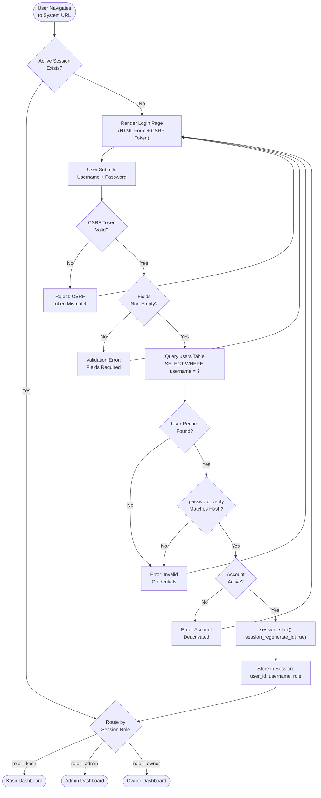
```mermaid
flowchart TD
    START(["User Navigates<br/>to System URL"]) --> SESS_CHK{"Active Session<br/>Exists?"}

    SESS_CHK -->|"Yes"| ROLE_ROUTE{"Route by<br/>Session Role"}
    SESS_CHK -->|"No"| RENDER_LOGIN["Render Login Page<br/>(HTML Form + CSRF Token)"]

    ROLE_ROUTE -->|"role = kasir"| DASH_K(["Kasir Dashboard"])
    ROLE_ROUTE -->|"role = admin"| DASH_A(["Admin Dashboard"])
    ROLE_ROUTE -->|"role = owner"| DASH_O(["Owner Dashboard"])

    RENDER_LOGIN --> SUBMIT["User Submits<br/>Username + Password"]
    SUBMIT --> CSRF_VAL{"CSRF Token<br/>Valid?"}
    CSRF_VAL -->|"No"| CSRF_ERR["Reject: CSRF<br/>Token Mismatch"]
    CSRF_ERR --> RENDER_LOGIN
    CSRF_VAL -->|"Yes"| EMPTY_VAL{"Fields<br/>Non-Empty?"}
    EMPTY_VAL -->|"No"| EMPTY_ERR["Validation Error:<br/>Fields Required"]
    EMPTY_ERR --> RENDER_LOGIN
    EMPTY_VAL -->|"Yes"| DB_QUERY["Query users Table<br/>SELECT WHERE username = ?"]
    DB_QUERY --> USER_FOUND{"User Record<br/>Found?"}
    USER_FOUND -->|"No"| CRED_ERR["Error: Invalid<br/>Credentials"]
    CRED_ERR --> RENDER_LOGIN
    USER_FOUND -->|"Yes"| PWD_CHECK{"password_verify<br/>Matches Hash?"}
    PWD_CHECK -->|"No"| CRED_ERR
    PWD_CHECK -->|"Yes"| ACTIVE_CHECK{"Account<br/>Active?"}
    ACTIVE_CHECK -->|"No"| DEACT_ERR["Error: Account<br/>Deactivated"]
    DEACT_ERR --> RENDER_LOGIN
    ACTIVE_CHECK -->|"Yes"| CREATE_SESS["session_start()<br/>session_regenerate_id(true)"]
    CREATE_SESS --> STORE_SESS["Store in Session:<br/>user_id, username, role"]
    STORE_SESS --> ROLE_ROUTE
```

#### Authentication Validation Rules

| Checkpoint | Rule Type | Rule Description | Requirement |
|---|---|---|---|
| CSRF Validation | Security | Token generated via `random_bytes()` + `bin2hex()`, stored in `$_SESSION`, validated on form POST | §3.8.1 |
| Username Input | Data Validation | Must be a non-empty string | F-001-RQ-002 |
| Password Input | Data Validation | Must be a non-empty string | F-001-RQ-002 |
| Credential Match | Security | Password comparison via `password_hash(PASSWORD_DEFAULT)` and `password_verify()` against stored bcrypt hash | F-001-RQ-002 |
| Account Status | Business Rule | User account must be active (status flag, Assumption A-002) | F-007-RQ-003 |
| Role Value | Business Rule | Must match ENUM `"admin"`, `"kasir"`, or `"owner"` | F-001-RQ-003 |
| Session Security | Security | Session ID regenerated after authentication; `HttpOnly`, `Secure`, `SameSite` cookie flags set | §3.8.1 |

#### Logout Process (PF-02)

The logout flow implements F-001-RQ-006 through a straightforward session destruction sequence:

1. User triggers logout action from any dashboard.
2. System invokes `session_destroy()` to remove all session data.
3. Session ID is invalidated server-side.
4. System issues an HTTP 302 redirect to the login page.
5. User is returned to the unauthenticated state.

### 4.2.2 Customer Transaction Cycle — End-to-End Journey

The customer transaction cycle (PF-03) represents the **core revenue-generating process** of the Londry system. It spans the physical interaction between the Pelanggan and Kasir at the laundry counter through to the system-mediated transaction processing, receipt generation, and order number issuance. This is the primary end-to-end user journey.

**Key Business Constraints:**
- Payment is exclusively **cash-based** (*tunai*) — no digital or card payment methods are supported.
- If a customer requires additional laundry services, a **new, separate order must be created** — appending to an existing order is not supported.
- The unique order number (*nomor unik / nomor pesanan*) serves as the **sole customer-facing identifier** for laundry pickup.
- Each transaction references exactly **one product** via the `transactions.id_produk` foreign key (Many-to-One).

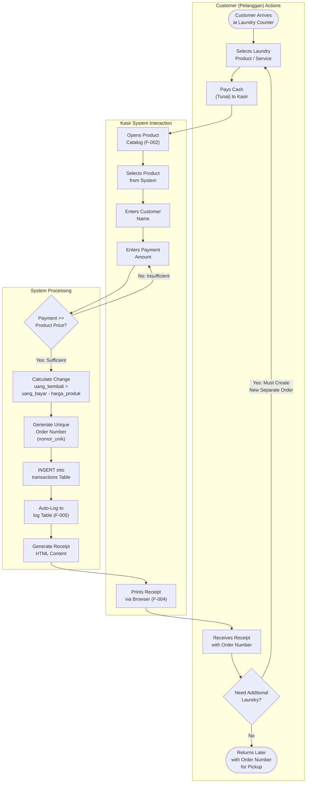
```mermaid
flowchart TD
    subgraph CustomerLane["Customer (Pelanggan) Actions"]
        C_START(["Customer Arrives<br/>at Laundry Counter"])
        C_SELECT["Selects Laundry<br/>Product / Service"]
        C_PAY["Pays Cash<br/>(Tunai) to Kasir"]
        C_RECEIVE["Receives Receipt<br/>with Order Number"]
        C_DECIDE{"Need Additional<br/>Laundry?"}
        C_PICKUP(["Returns Later<br/>with Order Number<br/>for Pickup"])
    end

    subgraph KasirLane["Kasir System Interaction"]
        K_CATALOG["Opens Product<br/>Catalog (F-002)"]
        K_SELECT["Selects Product<br/>from System"]
        K_NAME["Enters Customer<br/>Name"]
        K_AMOUNT["Enters Payment<br/>Amount"]
        K_PRINT["Prints Receipt<br/>via Browser (F-004)"]
    end

    subgraph SystemLane["System Processing"]
        S_VALIDATE{"Payment >=<br/>Product Price?"}
        S_CALC["Calculate Change<br/>uang_kembali =<br/>uang_bayar - harga_produk"]
        S_GENERATE["Generate Unique<br/>Order Number<br/>(nomor_unik)"]
        S_PERSIST["INSERT into<br/>transactions Table"]
        S_LOG["Auto-Log to<br/>log Table (F-005)"]
        S_RECEIPT["Generate Receipt<br/>HTML Content"]
    end

    C_START --> C_SELECT
    C_SELECT --> C_PAY
    C_PAY --> K_CATALOG
    K_CATALOG --> K_SELECT
    K_SELECT --> K_NAME
    K_NAME --> K_AMOUNT
    K_AMOUNT --> S_VALIDATE
    S_VALIDATE -->|"No: Insufficient"| K_AMOUNT
    S_VALIDATE -->|"Yes: Sufficient"| S_CALC
    S_CALC --> S_GENERATE
    S_GENERATE --> S_PERSIST
    S_PERSIST --> S_LOG
    S_LOG --> S_RECEIPT
    S_RECEIPT --> K_PRINT
    K_PRINT --> C_RECEIVE
    C_RECEIVE --> C_DECIDE
    C_DECIDE -->|"Yes: Must Create<br/>New Separate Order"| C_SELECT
    C_DECIDE -->|"No"| C_PICKUP
```

### 4.2.3 Transaction Processing — Detailed Flow

The transaction processing flow (PF-05) documents the internal system operations executed by the Kasir when processing a sale. This implements requirements F-003-RQ-001 through F-003-RQ-006 and auto-triggers activity logging per F-005-RQ-001.

**Input Parameters:**
- `id_produk` — selected from the product catalog (foreign key to `products.id`)
- `nama_pelanggan` — text input for customer name
- `uang_bayar` — numeric input for cash payment amount

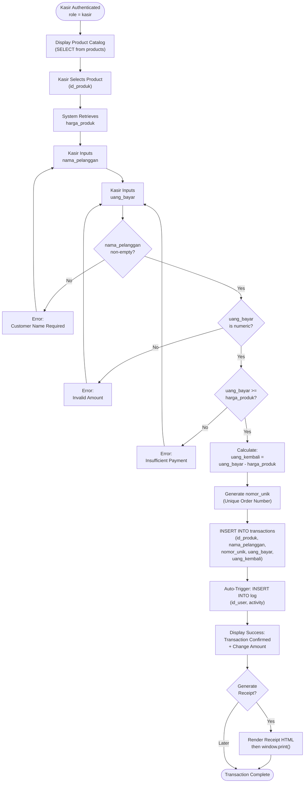
```mermaid
flowchart TD
    T_START(["Kasir Authenticated<br/>role = kasir"]) --> T_CATALOG["Display Product Catalog<br/>(SELECT from products)"]
    T_CATALOG --> T_SELECT["Kasir Selects Product<br/>(id_produk)"]
    T_SELECT --> T_PRICE["System Retrieves<br/>harga_produk"]
    T_PRICE --> T_NAME["Kasir Inputs<br/>nama_pelanggan"]
    T_NAME --> T_PAY["Kasir Inputs<br/>uang_bayar"]

    T_PAY --> V_NAME{"nama_pelanggan<br/>non-empty?"}
    V_NAME -->|"No"| VE_NAME["Error:<br/>Customer Name Required"]
    VE_NAME --> T_NAME
    V_NAME -->|"Yes"| V_NUMERIC{"uang_bayar<br/>is numeric?"}
    V_NUMERIC -->|"No"| VE_NUM["Error:<br/>Invalid Amount"]
    VE_NUM --> T_PAY
    V_NUMERIC -->|"Yes"| V_SUFFICIENT{"uang_bayar >=<br/>harga_produk?"}
    V_SUFFICIENT -->|"No"| VE_INSUF["Error:<br/>Insufficient Payment"]
    VE_INSUF --> T_PAY
    V_SUFFICIENT -->|"Yes"| T_CALC["Calculate:<br/>uang_kembali =<br/>uang_bayar - harga_produk"]

    T_CALC --> T_UNIQ["Generate nomor_unik<br/>(Unique Order Number)"]
    T_UNIQ --> T_INSERT["INSERT INTO transactions<br/>(id_produk, nama_pelanggan,<br/>nomor_unik, uang_bayar,<br/>uang_kembali)"]
    T_INSERT --> T_LOG["Auto-Trigger: INSERT INTO log<br/>(id_user, activity)"]
    T_LOG --> T_SUCCESS["Display Success:<br/>Transaction Confirmed<br/>+ Change Amount"]
    T_SUCCESS --> T_RECEIPT{"Generate<br/>Receipt?"}
    T_RECEIPT -->|"Yes"| T_PRINT["Render Receipt HTML<br/>then window.print()"]
    T_PRINT --> T_END(["Transaction Complete"])
    T_RECEIPT -->|"Later"| T_END
```

#### Transaction Validation Rules

| Checkpoint | Rule | Failure Action | Requirement |
|---|---|---|---|
| Customer Name | `nama_pelanggan` must be non-empty string | Return to form with error | F-003-RQ-002 |
| Payment Type | Numeric value, cash only (*tunai*) | Return to form with error | F-003-RQ-003 |
| Sufficient Payment | `uang_bayar >= harga_produk` | Display "insufficient payment" error | F-003-RQ-003 |
| Change Calculation | `uang_kembali = uang_bayar - harga_produk` (result >= 0) | System-enforced by preceding validation | F-003-RQ-004 |
| Order Number | `nomor_unik` must be unique across all records | System regenerates if collision occurs | F-003-RQ-005 |
| Single Product | Each transaction references exactly one product | UI constraint (single selection) | F-003-RQ-006 |
| Audit Logging | Corresponding `log` entry must be created | Critical: action must not complete without log | §1.2.3 |

### 4.2.4 Receipt Generation and Printing Flow

Receipt generation (PF-06) implements requirements F-004-RQ-001 and F-004-RQ-002. The receipt is rendered as Bootstrap-styled HTML and printed via the browser Print API using a `window.print()` JavaScript call — no server-side PDF generation occurs (as documented in §3.5.6 and §3.9.1).

**Receipt Content Fields:**
- `nomor_unik` — unique order number (pickup identifier)
- `nama_pelanggan` — customer name
- `nama_produk` — product name (JOINed from `products` table)
- `harga_produk` — product price
- `uang_bayar` — amount paid by customer
- `uang_kembali` — change returned

**Process Steps:**
1. Transaction has been completed and persisted (F-003).
2. System queries the `transactions` table JOINed with `products` to assemble all receipt fields.
3. Receipt content is rendered in a Bootstrap-styled HTML template.
4. Kasir clicks the print button, which triggers `window.print()`.
5. The browser print dialog appears, allowing the Kasir to select a printer.
6. The printed receipt is handed to the customer as the laundry pickup identifier.

---

## 4.3 ADMINISTRATIVE PROCESS FLOWS

### 4.3.1 Product Data Management — CRUD Operations

Product data management (PF-07) enables the Administrator to perform full Create, Read, Update, and Delete operations on the `products` table. This implements requirements F-006-RQ-001 through F-006-RQ-004. Every Admin operation auto-triggers an activity log entry via F-008. A critical constraint applies to the Delete operation: the foreign key relationship `transactions.id_produk → products.id` prevents deletion of any product that is referenced by existing transaction records (Assumption A-006).

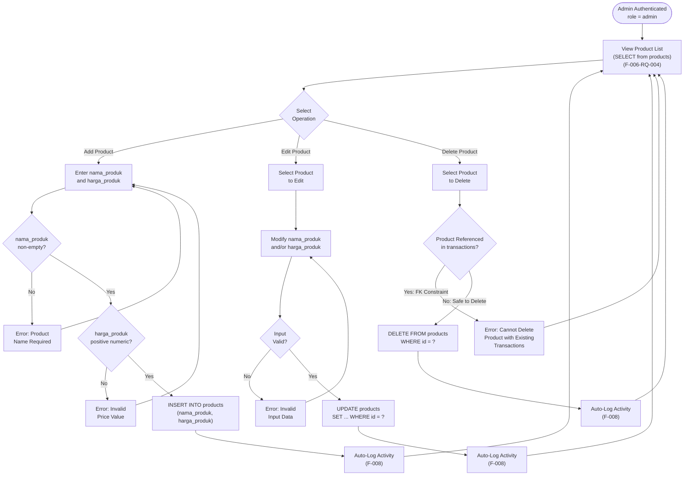
```mermaid
flowchart TD
    PM_START(["Admin Authenticated<br/>role = admin"]) --> PM_VIEW["View Product List<br/>(SELECT from products)<br/>(F-006-RQ-004)"]
    PM_VIEW --> PM_OP{"Select<br/>Operation"}

    PM_OP -->|"Add Product"| ADD_INPUT["Enter nama_produk<br/>and harga_produk"]
    ADD_INPUT --> ADD_V1{"nama_produk<br/>non-empty?"}
    ADD_V1 -->|"No"| ADD_ERR1["Error: Product<br/>Name Required"]
    ADD_ERR1 --> ADD_INPUT
    ADD_V1 -->|"Yes"| ADD_V2{"harga_produk<br/>positive numeric?"}
    ADD_V2 -->|"No"| ADD_ERR2["Error: Invalid<br/>Price Value"]
    ADD_ERR2 --> ADD_INPUT
    ADD_V2 -->|"Yes"| ADD_EXEC["INSERT INTO products<br/>(nama_produk, harga_produk)"]
    ADD_EXEC --> ADD_LOG["Auto-Log Activity<br/>(F-008)"]
    ADD_LOG --> PM_VIEW

    PM_OP -->|"Edit Product"| UPD_SELECT["Select Product<br/>to Edit"]
    UPD_SELECT --> UPD_INPUT["Modify nama_produk<br/>and/or harga_produk"]
    UPD_INPUT --> UPD_VAL{"Input<br/>Valid?"}
    UPD_VAL -->|"No"| UPD_ERR["Error: Invalid<br/>Input Data"]
    UPD_ERR --> UPD_INPUT
    UPD_VAL -->|"Yes"| UPD_EXEC["UPDATE products<br/>SET ... WHERE id = ?"]
    UPD_EXEC --> UPD_LOG["Auto-Log Activity<br/>(F-008)"]
    UPD_LOG --> PM_VIEW

    PM_OP -->|"Delete Product"| DEL_SELECT["Select Product<br/>to Delete"]
    DEL_SELECT --> DEL_FK{"Product Referenced<br/>in transactions?"}
    DEL_FK -->|"Yes: FK Constraint"| DEL_ERR["Error: Cannot Delete<br/>Product with Existing<br/>Transactions"]
    DEL_ERR --> PM_VIEW
    DEL_FK -->|"No: Safe to Delete"| DEL_EXEC["DELETE FROM products<br/>WHERE id = ?"]
    DEL_EXEC --> DEL_LOG["Auto-Log Activity<br/>(F-008)"]
    DEL_LOG --> PM_VIEW
```

#### Product Management Validation Rules

| Operation | Validation | Rule Description | Requirement |
|---|---|---|---|
| Add / Edit | `nama_produk` | Must be a non-empty string | F-006-RQ-001 |
| Add / Edit | `harga_produk` | Must be a positive numeric value (IDR) | F-006-RQ-001 |
| Delete | Product ID | Must exist in `products` table before deletion | F-006-RQ-003 |
| Delete | FK Constraint | Cannot delete products referenced by `transactions.id_produk` | Assumption A-006 |
| All Operations | Activity Logging | Corresponding `log` entry auto-created | F-008-RQ-001 |

### 4.3.2 User Data Management

User data management (PF-08) enables the Administrator to add, update, and deactivate user accounts. This implements requirements F-007-RQ-001 through F-007-RQ-004. A critical design decision distinguishes this from product management: **users are deactivated, not deleted**, preserving referential integrity with the `log` table where `log.id_user` references `users.id`.

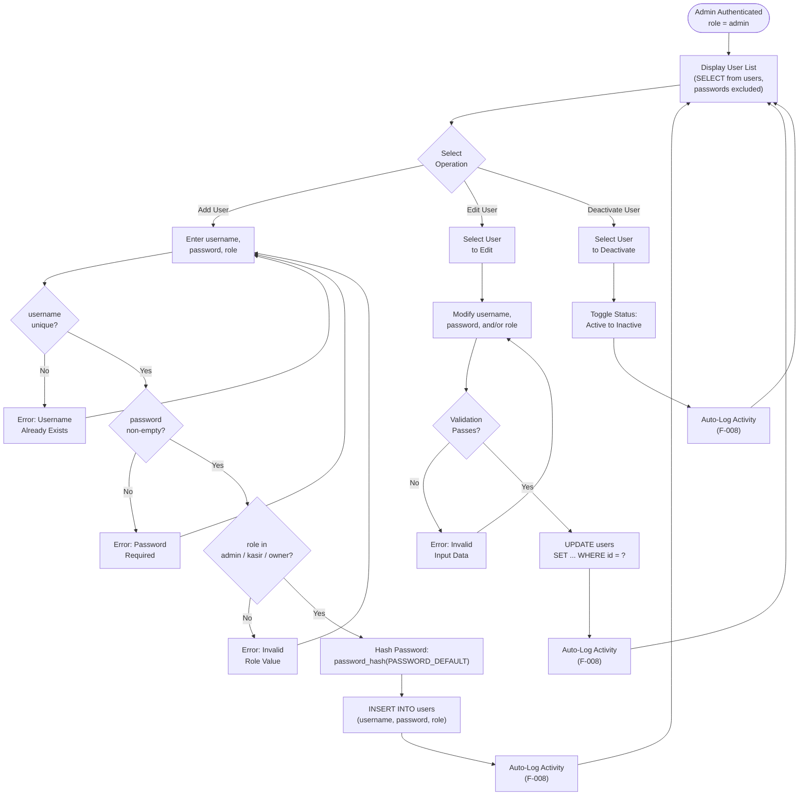
```mermaid
flowchart TD
    UM_START(["Admin Authenticated<br/>role = admin"]) --> UM_VIEW["Display User List<br/>(SELECT from users,<br/>passwords excluded)"]
    UM_VIEW --> UM_OP{"Select<br/>Operation"}

    UM_OP -->|"Add User"| UA_INPUT["Enter username,<br/>password, role"]
    UA_INPUT --> UA_V1{"username<br/>unique?"}
    UA_V1 -->|"No"| UA_ERR1["Error: Username<br/>Already Exists"]
    UA_ERR1 --> UA_INPUT
    UA_V1 -->|"Yes"| UA_V2{"password<br/>non-empty?"}
    UA_V2 -->|"No"| UA_ERR2["Error: Password<br/>Required"]
    UA_ERR2 --> UA_INPUT
    UA_V2 -->|"Yes"| UA_V3{"role in<br/>admin / kasir / owner?"}
    UA_V3 -->|"No"| UA_ERR3["Error: Invalid<br/>Role Value"]
    UA_ERR3 --> UA_INPUT
    UA_V3 -->|"Yes"| UA_HASH["Hash Password:<br/>password_hash(PASSWORD_DEFAULT)"]
    UA_HASH --> UA_EXEC["INSERT INTO users<br/>(username, password, role)"]
    UA_EXEC --> UA_LOG["Auto-Log Activity<br/>(F-008)"]
    UA_LOG --> UM_VIEW

    UM_OP -->|"Edit User"| UE_SELECT["Select User<br/>to Edit"]
    UE_SELECT --> UE_INPUT["Modify username,<br/>password, and/or role"]
    UE_INPUT --> UE_VAL{"Validation<br/>Passes?"}
    UE_VAL -->|"No"| UE_ERR["Error: Invalid<br/>Input Data"]
    UE_ERR --> UE_INPUT
    UE_VAL -->|"Yes"| UE_EXEC["UPDATE users<br/>SET ... WHERE id = ?"]
    UE_EXEC --> UE_LOG["Auto-Log Activity<br/>(F-008)"]
    UE_LOG --> UM_VIEW

    UM_OP -->|"Deactivate User"| UD_SELECT["Select User<br/>to Deactivate"]
    UD_SELECT --> UD_EXEC["Toggle Status:<br/>Active to Inactive"]
    UD_EXEC --> UD_LOG["Auto-Log Activity<br/>(F-008)"]
    UD_LOG --> UM_VIEW
```

#### User Management Validation Rules

| Operation | Validation | Rule Description | Requirement |
|---|---|---|---|
| Add | `username` | Must be unique across `users` table | F-007-RQ-001 |
| Add / Edit | `password` | Must be non-empty; stored as bcrypt hash via `password_hash()` | F-007-RQ-001, §3.8.1 |
| Add / Edit | `role` | Must be one of `"admin"`, `"kasir"`, `"owner"` | F-007-RQ-001 |
| Deactivate | Status Toggle | User record flagged inactive; user can no longer authenticate (Assumption A-002) | F-007-RQ-003 |
| All Operations | Referential Integrity | Users are never deleted — preserves FK reference from `log.id_user` | F-007-RQ-003 |
| All Operations | Activity Logging | Corresponding `log` entry auto-created | F-008-RQ-001 |

---

## 4.4 OWNER MONITORING AND REPORTING FLOWS

### 4.4.1 Transaction Reporting with Date Filtering

Transaction reporting (PF-10) provides the Owner with on-demand access to the complete transaction history and the ability to filter by date range. This implements requirements F-010-RQ-001 through F-010-RQ-003. The date filtering capability requires a timestamp or date column in the `transactions` table (Assumption A-001), which is not explicitly present in the provided schema but is functionally required.

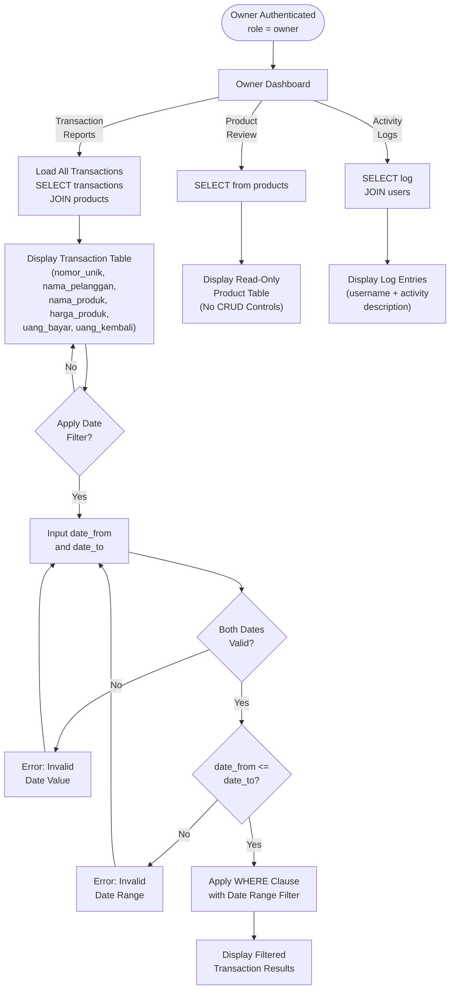
```mermaid
flowchart TD
    OR_START(["Owner Authenticated<br/>role = owner"]) --> OR_DASH["Owner Dashboard"]

    OR_DASH -->|"Transaction<br/>Reports"| OT_LOAD["Load All Transactions<br/>SELECT transactions<br/>JOIN products"]
    OT_LOAD --> OT_DISPLAY["Display Transaction Table<br/>(nomor_unik, nama_pelanggan,<br/>nama_produk, harga_produk,<br/>uang_bayar, uang_kembali)"]
    OT_DISPLAY --> OT_FILTER{"Apply Date<br/>Filter?"}
    OT_FILTER -->|"No"| OT_DISPLAY
    OT_FILTER -->|"Yes"| OT_INPUT["Input date_from<br/>and date_to"]
    OT_INPUT --> OT_V1{"Both Dates<br/>Valid?"}
    OT_V1 -->|"No"| OT_ERR1["Error: Invalid<br/>Date Value"]
    OT_ERR1 --> OT_INPUT
    OT_V1 -->|"Yes"| OT_V2{"date_from <=<br/>date_to?"}
    OT_V2 -->|"No"| OT_ERR2["Error: Invalid<br/>Date Range"]
    OT_ERR2 --> OT_INPUT
    OT_V2 -->|"Yes"| OT_QUERY["Apply WHERE Clause<br/>with Date Range Filter"]
    OT_QUERY --> OT_RESULT["Display Filtered<br/>Transaction Results"]

    OR_DASH -->|"Product<br/>Review"| OP_LOAD["SELECT from products"]
    OP_LOAD --> OP_DISPLAY["Display Read-Only<br/>Product Table<br/>(No CRUD Controls)"]

    OR_DASH -->|"Activity<br/>Logs"| OL_LOAD["SELECT log<br/>JOIN users"]
    OL_LOAD --> OL_DISPLAY["Display Log Entries<br/>(username + activity<br/>description)"]
```

### 4.4.2 Owner Feature Authorization Boundaries

All Owner features are strictly **read-only**. The Owner role has no write access to any database table. This enforcement is a security requirement documented in §2.4.3 (Owner Read-Only Enforcement: F-009, F-010, F-011).

| Feature | Operation | Table | Access Level | Controls |
|---|---|---|---|---|
| F-009: Product Data Review | SELECT only | `products` | Read-Only | No add/edit/delete UI controls rendered |
| F-010: Transaction Reporting | SELECT with JOIN and optional WHERE | `transactions`, `products` | Read-Only | Date filter inputs only |
| F-011: Activity Log Review | SELECT with JOIN | `log`, `users` | Read-Only | No modification or deletion permitted |

---

## 4.5 CROSS-CUTTING SYSTEM FLOWS

### 4.5.1 Activity Logging — Auto-Triggered Process

Activity logging (PF-12) is a **cross-cutting concern** that fires automatically whenever a Kasir or Admin performs an action. This mechanism implements both F-005 (Kasir Activity Logging) and F-008 (Admin Activity Logging), which share the same `log` table and recording mechanism. The `log` table is INSERT-only — no UPDATE or DELETE operations are permitted for any role, ensuring audit immutability. This is a critical success factor per §1.2.3: "No Kasir or Admin action may execute without a corresponding entry in the `log` table."

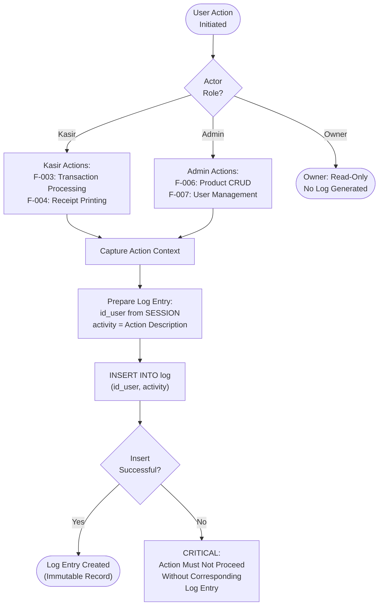
```mermaid
flowchart TD
    TRIGGER_START(["User Action<br/>Initiated"]) --> ROLE_CHECK{"Actor<br/>Role?"}

    ROLE_CHECK -->|"Kasir"| K_ACTIONS["Kasir Actions:<br/>F-003: Transaction Processing<br/>F-004: Receipt Printing"]
    ROLE_CHECK -->|"Admin"| A_ACTIONS["Admin Actions:<br/>F-006: Product CRUD<br/>F-007: User Management"]
    ROLE_CHECK -->|"Owner"| O_SKIP(["Owner: Read-Only<br/>No Log Generated"])

    K_ACTIONS --> CAPTURE_CTX["Capture Action Context"]
    A_ACTIONS --> CAPTURE_CTX

    CAPTURE_CTX --> PREPARE["Prepare Log Entry:<br/>id_user from SESSION<br/>activity = Action Description"]
    PREPARE --> LOG_INSERT["INSERT INTO log<br/>(id_user, activity)"]
    LOG_INSERT --> LOG_RESULT{"Insert<br/>Successful?"}
    LOG_RESULT -->|"Yes"| LOG_DONE(["Log Entry Created<br/>(Immutable Record)"])
    LOG_RESULT -->|"No"| LOG_CRITICAL["CRITICAL:<br/>Action Must Not Proceed<br/>Without Corresponding<br/>Log Entry"]
```

#### Activity Log Triggers

| Trigger Source | Feature | Example Activity Description |
|---|---|---|
| Transaction created | F-003 → F-005 | "Kasir menambah transaksi B" |
| Receipt printed | F-004 → F-005 | "Kasir mencetak bukti transaksi" |
| Product added | F-006 → F-008 | "Admin menambah produk A" |
| Product updated | F-006 → F-008 | "Admin mengupdate produk A" |
| Product deleted | F-006 → F-008 | "Admin menghapus produk A" |
| User added | F-007 → F-008 | "Admin menambah user X" |
| User updated | F-007 → F-008 | "Admin mengupdate user X" |
| User deactivated | F-007 → F-008 | "Admin menonaktifkan user X" |

### 4.5.2 Per-Request Access Control Sequence

Every request to a protected page undergoes a session validation and role authorization check (PF-14). This is mandated by F-001-RQ-004 ("Unauthenticated requests redirect to login page") and F-001-RQ-005 ("Role-based access checks must occur on every protected page request"). The following sequence diagram illustrates the per-request access control flow across system components:

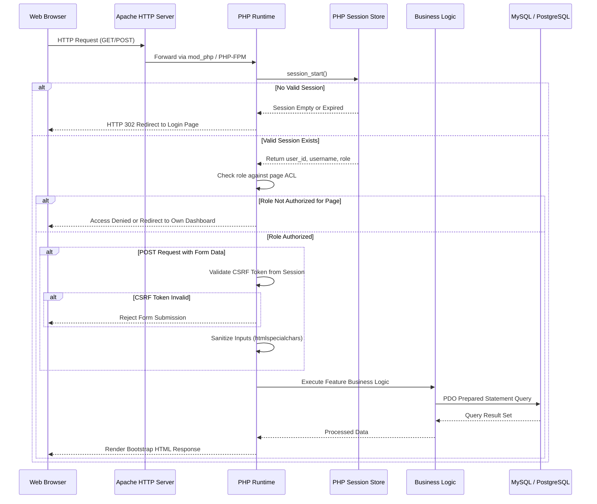
```mermaid
sequenceDiagram
    participant Browser as Web Browser
    participant Apache as Apache HTTP Server
    participant PHP as PHP Runtime
    participant Session as PHP Session Store
    participant Logic as Business Logic
    participant DB as MySQL / PostgreSQL

    Browser->>Apache: HTTP Request (GET/POST)
    Apache->>PHP: Forward via mod_php / PHP-FPM
    PHP->>Session: session_start()

    alt No Valid Session
        Session-->>PHP: Session Empty or Expired
        PHP-->>Browser: HTTP 302 Redirect to Login Page
    else Valid Session Exists
        Session-->>PHP: Return user_id, username, role
        PHP->>PHP: Check role against page ACL

        alt Role Not Authorized for Page
            PHP-->>Browser: Access Denied or Redirect to Own Dashboard
        else Role Authorized
            alt POST Request with Form Data
                PHP->>PHP: Validate CSRF Token from Session
                alt CSRF Token Invalid
                    PHP-->>Browser: Reject Form Submission
                end
                PHP->>PHP: Sanitize Inputs (htmlspecialchars)
            end
            PHP->>Logic: Execute Feature Business Logic
            Logic->>DB: PDO Prepared Statement Query
            DB-->>Logic: Query Result Set
            Logic-->>PHP: Processed Data
            PHP-->>Browser: Render Bootstrap HTML Response
        end
    end
```

### 4.5.3 Database Connection Initialization Flow

Database connection initialization (PF-13) occurs on every PHP page request. The system uses a custom `.env` parser (since the `vlucas/phpdotenv` Composer package is prohibited by the zero-dependency constraint per §3.3.1) to read database connection parameters and construct a PDO connection supporting both MySQL and PostgreSQL via driver switching.

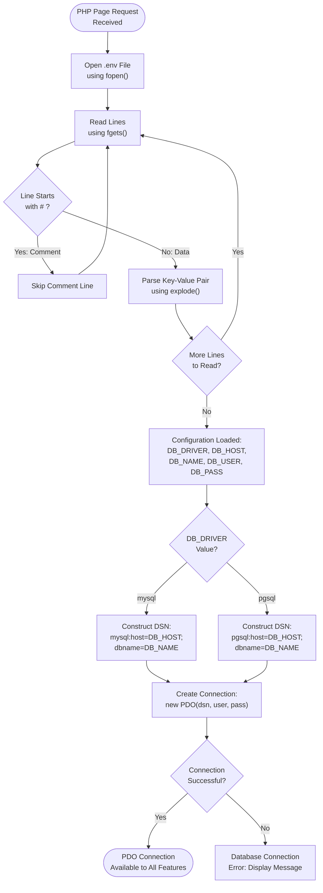
```mermaid
flowchart TD
    REQ_START(["PHP Page Request<br/>Received"]) --> ENV_OPEN["Open .env File<br/>using fopen()"]
    ENV_OPEN --> ENV_READ["Read Lines<br/>using fgets()"]
    ENV_READ --> ENV_CHECK{"Line Starts<br/>with # ?"}
    ENV_CHECK -->|"Yes: Comment"| ENV_SKIP["Skip Comment Line"]
    ENV_SKIP --> ENV_READ
    ENV_CHECK -->|"No: Data"| ENV_PARSE["Parse Key-Value Pair<br/>using explode()"]
    ENV_PARSE --> ENV_MORE{"More Lines<br/>to Read?"}
    ENV_MORE -->|"Yes"| ENV_READ
    ENV_MORE -->|"No"| ENV_DONE["Configuration Loaded:<br/>DB_DRIVER, DB_HOST,<br/>DB_NAME, DB_USER, DB_PASS"]

    ENV_DONE --> DRIVER_CHK{"DB_DRIVER<br/>Value?"}
    DRIVER_CHK -->|"mysql"| DSN_MYSQL["Construct DSN:<br/>mysql:host=DB_HOST;<br/>dbname=DB_NAME"]
    DRIVER_CHK -->|"pgsql"| DSN_PGSQL["Construct DSN:<br/>pgsql:host=DB_HOST;<br/>dbname=DB_NAME"]

    DSN_MYSQL --> PDO_INIT["Create Connection:<br/>new PDO(dsn, user, pass)"]
    DSN_PGSQL --> PDO_INIT

    PDO_INIT --> CONN_CHK{"Connection<br/>Successful?"}
    CONN_CHK -->|"Yes"| CONN_READY(["PDO Connection<br/>Available to All Features"])
    CONN_CHK -->|"No"| CONN_ERR["Database Connection<br/>Error: Display Message"]
```

---

## 4.6 DATA FLOW AND INTEGRATION

### 4.6.1 Cross-Role Data Integration

Features within the Londry system interact through shared database tables, establishing cross-role data integration points. Write operations by Kasir and Admin flow through the four database tables and are consumed by read operations across different roles. This pattern ensures data consistency and supports the separation of concerns between operational (write) and monitoring (read) roles.

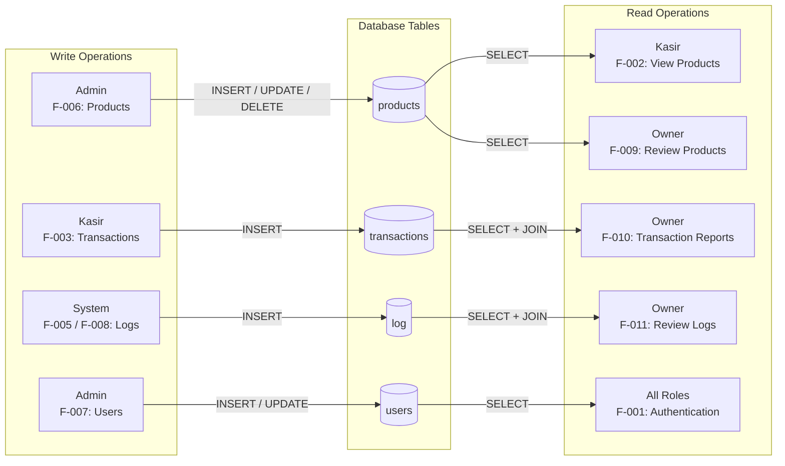
```mermaid
flowchart LR
    subgraph WriteOps["Write Operations"]
        W_TXN["Kasir<br/>F-003: Transactions"]
        W_PROD["Admin<br/>F-006: Products"]
        W_USER["Admin<br/>F-007: Users"]
        W_LOG["System<br/>F-005 / F-008: Logs"]
    end

    subgraph DataStore["Database Tables"]
        DB_TRANSACTIONS[("transactions")]
        DB_PRODUCTS[("products")]
        DB_USERS[("users")]
        DB_LOG[("log")]
    end

    subgraph ReadOps["Read Operations"]
        R_KASIR_PROD["Kasir<br/>F-002: View Products"]
        R_OWNER_PROD["Owner<br/>F-009: Review Products"]
        R_OWNER_TXN["Owner<br/>F-010: Transaction Reports"]
        R_OWNER_LOG["Owner<br/>F-011: Review Logs"]
        R_AUTH["All Roles<br/>F-001: Authentication"]
    end

    W_TXN -->|"INSERT"| DB_TRANSACTIONS
    W_PROD -->|"INSERT / UPDATE / DELETE"| DB_PRODUCTS
    W_USER -->|"INSERT / UPDATE"| DB_USERS
    W_LOG -->|"INSERT"| DB_LOG

    DB_TRANSACTIONS -->|"SELECT + JOIN"| R_OWNER_TXN
    DB_PRODUCTS -->|"SELECT"| R_KASIR_PROD
    DB_PRODUCTS -->|"SELECT"| R_OWNER_PROD
    DB_USERS -->|"SELECT"| R_AUTH
    DB_LOG -->|"SELECT + JOIN"| R_OWNER_LOG
```

#### Cross-Role Integration Points

| Integration Point | Writer | Reader(s) | Table | Data Flow |
|---|---|---|---|---|
| Product Catalog | Admin (F-006) | Kasir (F-002), Owner (F-009) | `products` | Admin manages catalog → Kasir views for transactions, Owner reviews |
| Transaction Records | Kasir (F-003) | Owner (F-010) | `transactions` | Kasir creates sales records → Owner generates reports with date filtering |
| User Credentials | Admin (F-007) | All roles (F-001) | `users` | Admin manages accounts → All roles authenticate against credentials |
| Audit Trail | System (F-005, F-008) | Owner (F-011) | `log` | Auto-logged actions → Owner reviews for accountability |

### 4.6.2 Transaction Processing Integration Sequence

The following sequence diagram illustrates the complete integration flow for the core transaction processing workflow, showing data movement across all system tiers from the client browser through the PHP application layer to the database:

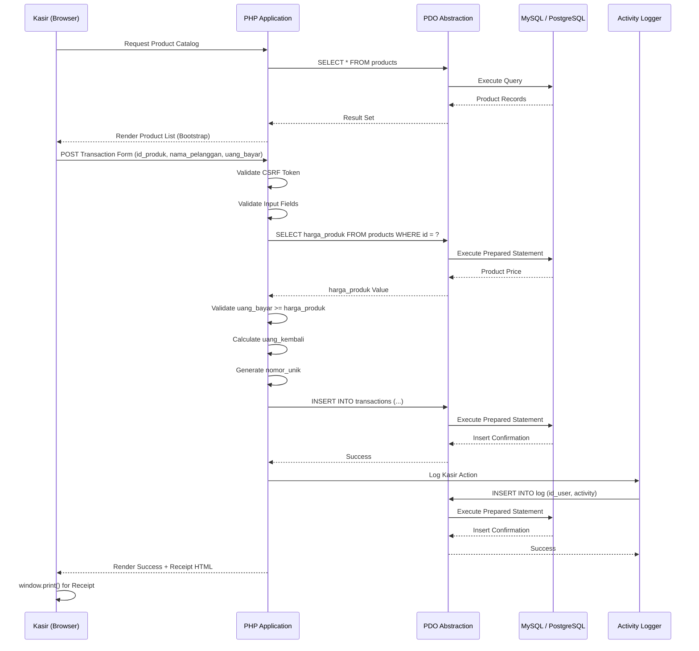
```mermaid
sequenceDiagram
    participant Kasir as Kasir (Browser)
    participant PHP as PHP Application
    participant PDO as PDO Abstraction
    participant DB as MySQL / PostgreSQL
    participant LogSvc as Activity Logger

    Kasir->>PHP: Request Product Catalog
    PHP->>PDO: SELECT * FROM products
    PDO->>DB: Execute Query
    DB-->>PDO: Product Records
    PDO-->>PHP: Result Set
    PHP-->>Kasir: Render Product List (Bootstrap)

    Kasir->>PHP: POST Transaction Form (id_produk, nama_pelanggan, uang_bayar)
    PHP->>PHP: Validate CSRF Token
    PHP->>PHP: Validate Input Fields
    PHP->>PDO: SELECT harga_produk FROM products WHERE id = ?
    PDO->>DB: Execute Prepared Statement
    DB-->>PDO: Product Price
    PDO-->>PHP: harga_produk Value

    PHP->>PHP: Validate uang_bayar >= harga_produk
    PHP->>PHP: Calculate uang_kembali
    PHP->>PHP: Generate nomor_unik

    PHP->>PDO: INSERT INTO transactions (...)
    PDO->>DB: Execute Prepared Statement
    DB-->>PDO: Insert Confirmation
    PDO-->>PHP: Success

    PHP->>LogSvc: Log Kasir Action
    LogSvc->>PDO: INSERT INTO log (id_user, activity)
    PDO->>DB: Execute Prepared Statement
    DB-->>PDO: Insert Confirmation
    PDO-->>LogSvc: Success

    PHP-->>Kasir: Render Success + Receipt HTML
    Kasir->>Kasir: window.print() for Receipt
```

---

## 4.7 STATE MANAGEMENT

### 4.7.1 Session State Lifecycle

The Londry system uses native PHP sessions (`$_SESSION`) for state management. Sessions are file-based (default PHP session handler on the server filesystem per §3.9.1). The following state diagram illustrates the complete session lifecycle:

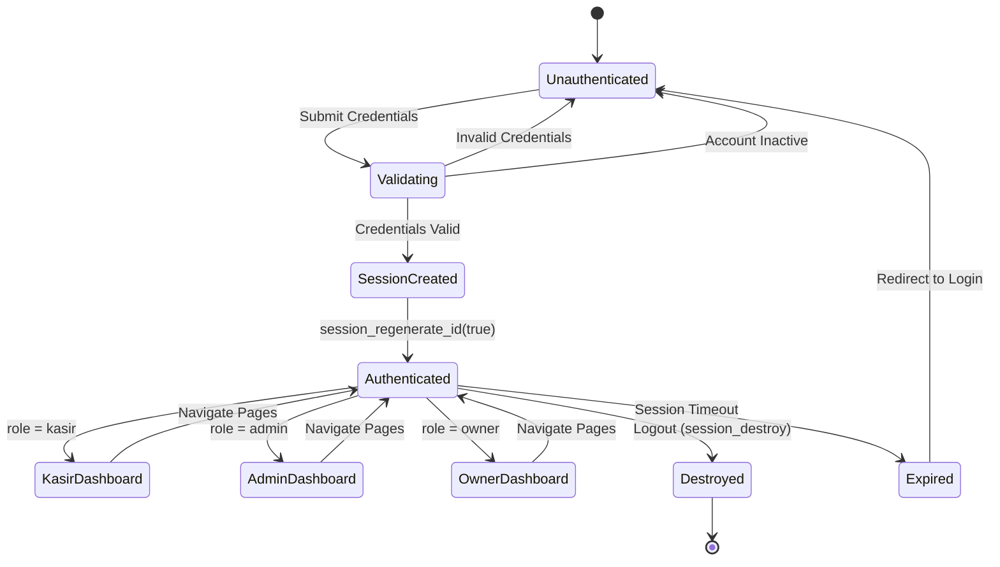
```mermaid
stateDiagram-v2
    [*] --> Unauthenticated
    Unauthenticated --> Validating : Submit Credentials
    Validating --> Unauthenticated : Invalid Credentials
    Validating --> Unauthenticated : Account Inactive
    Validating --> SessionCreated : Credentials Valid
    SessionCreated --> Authenticated : session_regenerate_id(true)
    Authenticated --> KasirDashboard : role = kasir
    Authenticated --> AdminDashboard : role = admin
    Authenticated --> OwnerDashboard : role = owner
    KasirDashboard --> Authenticated : Navigate Pages
    AdminDashboard --> Authenticated : Navigate Pages
    OwnerDashboard --> Authenticated : Navigate Pages
    Authenticated --> Destroyed : Logout (session_destroy)
    Authenticated --> Expired : Session Timeout
    Destroyed --> [*]
    Expired --> Unauthenticated : Redirect to Login
```

#### Session Variables

| Session Variable | Type | Purpose | Set When | Cleared When |
|---|---|---|---|---|
| `$_SESSION['user_id']` | Integer | Identifies authenticated user (FK for `log.id_user`) | Login success | Logout |
| `$_SESSION['username']` | String | Display name for UI | Login success | Logout |
| `$_SESSION['role']` | String | Access control routing (`"admin"`, `"kasir"`, `"owner"`) | Login success | Logout |
| CSRF Token | String | Form submission security | Login / page load | Logout / consumed |

### 4.7.2 Transaction State Transitions

Each customer transaction progresses through a defined set of states from initiation to completion. The following state diagram documents the lifecycle of a single transaction:

```mermaid
stateDiagram-v2
    [*] --> Initiated : Customer at Counter
    Initiated --> ProductSelected : Product Chosen from Catalog
    ProductSelected --> PaymentEntry : Customer Pays Cash
    PaymentEntry --> ValidationFailed : Insufficient Payment
    ValidationFailed --> PaymentEntry : Re-enter Amount
    PaymentEntry --> Calculated : Payment Validated
    Calculated --> Persisted : INSERT into transactions
    Persisted --> Logged : Activity Recorded in log
    Logged --> ReceiptReady : Receipt HTML Generated
    ReceiptReady --> Printed : window.print() Executed
    Printed --> [*] : Transaction Complete
    Printed --> Initiated : New Separate Order
```

### 4.7.3 Database Persistence Points

The four database tables serve as the system's persistence layer. Each table has defined write patterns and transaction boundaries:

| Table | Write Operations | Write Trigger | Immutability | Transaction Boundary |
|---|---|---|---|---|
| `users` | INSERT, UPDATE (status toggle) | Admin action (F-007) | Mutable (no DELETE) | Single-operation atomic |
| `products` | INSERT, UPDATE, DELETE | Admin action (F-006) | Mutable | Single-operation atomic |
| `transactions` | INSERT only | Kasir action (F-003) | Append-only | Paired with `log` INSERT as logical unit |
| `log` | INSERT only | System auto-trigger (F-005, F-008) | Immutable (no UPDATE/DELETE) | Paired with triggering action |

**Critical Transaction Boundary:** Each Kasir transaction comprises an INSERT into the `transactions` table and a corresponding INSERT into the `log` table. These two operations constitute a single logical unit — the transaction must not be considered complete without its accompanying audit log entry, as mandated by the audit completeness critical success factor in §1.2.3.

---

## 4.8 ERROR HANDLING AND RECOVERY

### 4.8.1 Comprehensive Error Handling Flowchart

The following diagram documents all error categories and their recovery paths across the system:

```mermaid
flowchart TD
    subgraph AuthErrorHandling["Authentication Error Handling"]
        AE_CRED["Invalid Credentials<br/>Submitted"] --> AE_CRED_R["Display Error Message<br/>Remain on Login Page"]
        AE_DEACT["Account Deactivated"] --> AE_DEACT_R["Display Deactivation<br/>Warning on Login Page"]
        AE_NOSESS["No Valid Session<br/>on Protected Page"] --> AE_NOSESS_R["HTTP 302 Redirect<br/>to Login Page"]
        AE_NOROLE["Unauthorized Role<br/>for Requested Page"] --> AE_NOROLE_R["Redirect to Own<br/>Role Dashboard"]
    end

    subgraph TxnErrorHandling["Transaction Error Handling"]
        TE_NAME["Empty Customer Name"] --> TE_NAME_R["Validation Error<br/>Return to Form"]
        TE_PAY["Insufficient Payment<br/>uang_bayar < harga_produk"] --> TE_PAY_R["Insufficient Payment Error<br/>Return to Form"]
        TE_UNIQ["Order Number<br/>Collision"] --> TE_UNIQ_R["System Regenerates<br/>nomor_unik Automatically"]
    end

    subgraph DataErrorHandling["Data Management Error Handling"]
        DE_PROD["Invalid Product Data<br/>(Empty Name or<br/>Non-Positive Price)"] --> DE_PROD_R["Validation Error<br/>Return to Form"]
        DE_FK["FK Constraint Violation<br/>on Product Delete"] --> DE_FK_R["Cannot Delete: Product<br/>Referenced by Transactions"]
        DE_DUP["Duplicate Username<br/>on User Add"] --> DE_DUP_R["Username Already Exists<br/>Return to Form"]
        DE_ROLE["Invalid Role Value<br/>on User Add/Edit"] --> DE_ROLE_R["Validation Error<br/>Return to Form"]
    end

    subgraph SecurityErrorHandling["Security Error Handling"]
        SE_CSRF["CSRF Token<br/>Mismatch"] --> SE_CSRF_R["Reject Form<br/>Submission"]
        SE_SQL["SQL Injection<br/>Attempt"] --> SE_SQL_R["Blocked by PDO<br/>Prepared Statements"]
        SE_XSS["XSS Payload<br/>in Input"] --> SE_XSS_R["Neutralized by<br/>htmlspecialchars()"]
        SE_SESSION["Session Fixation<br/>Attempt"] --> SE_SESSION_R["Mitigated by<br/>session_regenerate_id()"]
    end
```

### 4.8.2 Error Categories and Recovery Paths

#### Authentication Errors

| Error Condition | Detection Point | User Impact | Recovery Path |
|---|---|---|---|
| Invalid credentials | `password_verify()` returns false | Error message displayed | Re-enter credentials on login page |
| Account deactivated | Status flag check after credential validation | Warning message displayed | Contact Administrator to reactivate |
| Expired session | `$_SESSION` empty on protected page request | Interrupted workflow | Automatic redirect to login; re-authenticate |
| Unauthorized role | `$_SESSION['role']` does not match page ACL | Cannot access feature | Redirect to own dashboard |

#### Transaction Processing Errors

| Error Condition | Detection Point | User Impact | Recovery Path |
|---|---|---|---|
| Empty customer name | Input validation before DB insert | Form error displayed | Re-enter `nama_pelanggan` |
| Non-numeric payment | Input type validation | Form error displayed | Re-enter `uang_bayar` |
| Insufficient payment | `uang_bayar < harga_produk` comparison | Payment error displayed | Enter higher payment amount |
| Order number collision | Uniqueness check on `nomor_unik` | Transparent to user | System automatically regenerates unique ID |

#### Data Management Errors

| Error Condition | Detection Point | User Impact | Recovery Path |
|---|---|---|---|
| Empty product name | Input validation | Form error displayed | Re-enter `nama_produk` |
| Invalid price | Numeric/positive validation | Form error displayed | Re-enter `harga_produk` |
| FK constraint on delete | Database rejects DELETE (FK violation) | Error message displayed | Product cannot be deleted while referenced |
| Duplicate username | Uniqueness constraint on `users.username` | Form error displayed | Choose a different username |

### 4.8.3 Security Error Handling

Security protections are implemented as layered defenses across all form-based features, as documented in §3.8.1:

| Security Layer | Technology | Error Handling Behavior |
|---|---|---|
| **CSRF Protection** | `random_bytes()` + `bin2hex()` tokens in `$_SESSION` | Mismatched tokens result in form rejection; user must reload page |
| **SQL Injection Prevention** | PDO prepared statements (`$pdo->prepare()` with bound parameters) | Malicious SQL is parameterized and neutralized silently |
| **XSS Prevention** | `htmlspecialchars($input, ENT_QUOTES, 'UTF-8')` on all output | Script payloads are HTML-encoded before rendering |
| **Session Security** | `session_regenerate_id(true)` after authentication | Session fixation attempts are invalidated by ID rotation |
| **Audit Immutability** | `log` table has no UPDATE/DELETE operations for any role | Tampering attempts are architecturally prevented |

---

## 4.9 VALIDATION RULES SUMMARY

### 4.9.1 Authentication Validation

| Field / Check | Rule | Applies To |
|---|---|---|
| `username` | Non-empty string | F-001-RQ-002 |
| `password` | Non-empty string | F-001-RQ-002 |
| Password storage | Bcrypt hash via `password_hash(PASSWORD_DEFAULT)` | F-001-RQ-002, §3.8.1 |
| Password comparison | `password_verify()` against stored hash | F-001-RQ-002 |
| Role validation | Must match ENUM: `"admin"`, `"kasir"`, `"owner"` | F-001-RQ-003 |
| Session check | Active session validated on every protected page request | F-001-RQ-005 |
| CSRF token | Generated per-session; validated on every form POST | §3.8.1 |

### 4.9.2 Transaction and Reporting Validation

| Field / Check | Rule | Applies To |
|---|---|---|
| `nama_pelanggan` | Must be non-empty string | F-003-RQ-002 |
| `uang_bayar` | Must be numeric; must be >= `harga_produk` | F-003-RQ-003 |
| `uang_kembali` | Calculated: `uang_bayar - harga_produk` (result >= 0) | F-003-RQ-004 |
| `nomor_unik` | Must be unique across all transaction records | F-003-RQ-005 |
| Single product per transaction | Each transaction references exactly one `id_produk` | F-003-RQ-006 |
| No order appending | Additional orders require new separate transactions | F-003-RQ-006 |
| Cash-only payment | No digital or card payments | Spec constraint (*tunai*) |
| `date_from` / `date_to` | Both must be valid dates; `date_from <= date_to` | F-010-RQ-002 |

### 4.9.3 Data Management Validation

| Field / Check | Rule | Applies To |
|---|---|---|
| `nama_produk` | Must be non-empty string | F-006-RQ-001 |
| `harga_produk` | Must be positive numeric value (IDR) | F-006-RQ-001 |
| Product deletion | FK constraint: cannot delete products referenced by `transactions.id_produk` | Assumption A-006 |
| `username` (user) | Must be unique across `users` table | F-007-RQ-001 |
| `password` (user) | Must be non-empty; stored as hashed value | F-007-RQ-001 |
| `role` (user) | Must be one of `"admin"`, `"kasir"`, `"owner"` | F-007-RQ-001 |
| User deactivation | Status toggle only; no deletion (preserves `log` FK integrity) | F-007-RQ-003 |

### 4.9.4 Security Validation (All Forms)

| Check | Mechanism | Coverage |
|---|---|---|
| Input sanitization | `htmlspecialchars($input, ENT_QUOTES, 'UTF-8')` | All user inputs (XSS prevention) |
| SQL injection prevention | PDO prepared statements with bound parameters | All database queries |
| CSRF protection | Token-based form validation per session | All form POST submissions |
| Role-based access control | `$_SESSION['role']` checked on every protected page | All features F-002 through F-011 |
| Owner read-only enforcement | No write operations permitted for Owner role | F-009, F-010, F-011 |

---

## 4.10 REFERENCES

#### Technical Specification Sections Referenced

- `§1.1 Executive Summary` — Project overview, business context, stakeholder definitions, value proposition
- `§1.2 System Overview` — High-level architecture diagram, core modules, success criteria and KPIs, technical approach
- `§1.3 Scope` — In-scope features, primary customer workflow diagram, technical constraints, out-of-scope items, data domains and DB relationships
- `§2.1 Feature Catalog` — Complete eleven-feature registry with dependencies, technical context, and integration requirements per feature
- `§2.2 Functional Requirements` — Detailed requirements per feature (F-001 through F-011), validation rules, technical specifications
- `§2.3 Feature Relationships` — Feature dependency map, integration points and data flow diagrams, shared components and common services
- `§2.4 Implementation Considerations` — Technical constraints, performance requirements, security implications, maintenance requirements
- `§2.5 Requirements Traceability Matrix` — Feature-to-specification mapping, feature-to-database mapping, design assumptions (A-001 through A-006)
- `§3.3 Open Source Dependencies` — Zero dependency constraint, custom `.env` parser requirements, Bootstrap as non-package dependency
- `§3.5 Databases & Storage` — MySQL 8.4 LTS, PostgreSQL 17.x, dual database architecture diagram, schema, compatibility constraints
- `§3.7 Complete Technology Stack Overview` — Full stack summary, architecture stack diagram, deviation matrix
- `§3.8 Security Considerations` — Password hashing, SQL injection prevention, XSS prevention, CSRF protection, session security, RBAC, audit immutability
- `§3.9 Integration Requirements` — Component integration map (six integration points), compatibility matrix

#### Repository Artifacts

- `README.md` — Default GitLab template confirming greenfield project state; no source code, configuration files, or assets present

#### Design Assumptions Affecting Process Flows

| Assumption ID | Description | Impact on Flows |
|---|---|---|
| A-001 | `transactions` table includes a date/timestamp column | Required for PF-10 (date-range filtering in Owner reports) |
| A-002 | `users` table includes an active/status flag | Required for PF-08 (user deactivation) and PF-01 (active check during login) |
| A-003 | `nomor_unik` generation uses a system-determined algorithm | Affects PF-05 (unique order number generation step) |
| A-004 | All monetary values are in Indonesian Rupiah (IDR) | Affects PF-05 (payment and change calculation) |
| A-005 | Bootstrap loaded via CDN or local copy (no npm) | Affects presentation layer in all UI-rendering flows |
| A-006 | Product deletion restricted when referenced by transactions | Affects PF-07 (FK constraint error path on product delete) |

# 5. System Architecture

## 5.1 HIGH-LEVEL ARCHITECTURE

### 5.1.1 System Overview

The Londry system (Sistem Laundry) follows a **monolithic, server-rendered, three-tier architecture** designed to serve as a self-contained Point-of-Sale (POS) and operational management platform for a single-location laundry business in Indonesia. The architecture is organized into three distinct tiers: a Presentation Layer built with Bootstrap 5.3, a Business Logic Layer powered by Native PHP (≥ 8.4), and a Data Persistence Layer backed by MySQL 8.4 LTS or PostgreSQL 17.x/18.x, switchable via environment configuration.

This architecture was deliberately chosen for the following reasons:

- **Simplicity and Universal Hosting Compatibility**: The system deploys via simple file copy to any PHP-capable hosting environment — shared hosting, VPS, or local development stacks (XAMPP, WAMP, MAMP, LAMP) — without requiring package managers, build pipelines, or containerization.
- **Zero External Dependency Management**: No npm, no Composer, no `vendor/` directory, no `node_modules/`, no `package.json`, no `composer.json`. Every capability is delivered through PHP's built-in functions and extensions.
- **No Build Process**: PHP is an interpreted language (files execute at runtime), and Bootstrap is loaded as pre-compiled CSS/JS. No transpilation, bundling, or compilation is required.
- **Self-Contained Operation**: The system integrates with no external APIs, third-party services, payment gateways, microservices, or enterprise middleware. All data resides within its own relational database, and all processing occurs within its native PHP application boundary.
- **Single-Location Scope**: Designed exclusively for one laundry business establishment with no multi-tenant, multi-branch, or multi-currency capabilities. All UI labels, business terms, and data field identifiers are in **Bahasa Indonesia** (Indonesian language).

#### System Boundaries

The Londry system operates within clearly defined boundaries:

| Boundary | Description |
|---|---|
| **User Access** | Three internal roles (Kasir, Admin, Owner); customers have no system access |
| **Network** | Self-contained; no external network calls or API integrations |
| **Data** | All data stored in four relational database tables |
| **Platform** | Web-only; browser-based application with no native mobile or desktop clients |

#### Architectural Tiers Diagram

```mermaid
flowchart TB
    subgraph ClientTier["Client Tier"]
        BROWSER["Web Browser<br/>(Kasir / Admin / Owner)"]
    end

    subgraph ServerInfra["Server Infrastructure"]
        APACHE["Apache HTTP Server 2.4.66"]
    end

    subgraph PresentationTier["Presentation Tier — Bootstrap 5.3.8"]
        HTML["HTML5 Server-Rendered Templates"]
        CSS["Bootstrap CSS 5.3.8<br/>(CDN or Local)"]
        JS["Bootstrap JS Bundle<br/>(Vanilla ES6+)"]
    end

    subgraph ApplicationTier["Application Tier — Native PHP ≥ 8.4"]
        AUTH_MOD["Authentication &<br/>Authorization Module"]
        TXN_MOD["Transaction<br/>Processing Module"]
        PROD_MOD["Product<br/>Management Module"]
        USR_MOD["User<br/>Management Module"]
        RPT_MOD["Reporting &<br/>Filtering Module"]
        LOG_SVC["Activity<br/>Logging Service"]
        ENV_PARSER["Custom .env<br/>Parser"]
    end

    subgraph DataTier["Data Tier — PDO Abstraction"]
        PDO_CORE["PDO Core API"]
        PDO_MYSQL["PDO_MySQL Driver"]
        PDO_PGSQL["PDO_PGSQL Driver"]
    end

    subgraph StorageTier["Storage Tier"]
        MYSQL_DB[("MySQL 8.4 LTS")]
        PGSQL_DB[("PostgreSQL 17.x / 18.x")]
        ENV_FILE[".env Configuration"]
        SESS_STORE["PHP Session Files<br/>(Server Filesystem)"]
    end

    BROWSER -->|"HTTP / HTTPS"| APACHE
    APACHE -->|"mod_php / PHP-FPM"| AUTH_MOD
    AUTH_MOD --> TXN_MOD
    AUTH_MOD --> PROD_MOD
    AUTH_MOD --> USR_MOD
    AUTH_MOD --> RPT_MOD
    TXN_MOD --> LOG_SVC
    PROD_MOD --> LOG_SVC
    USR_MOD --> LOG_SVC
    TXN_MOD --> PDO_CORE
    PROD_MOD --> PDO_CORE
    USR_MOD --> PDO_CORE
    RPT_MOD --> PDO_CORE
    LOG_SVC --> PDO_CORE
    AUTH_MOD --> PDO_CORE
    PDO_CORE --> PDO_MYSQL
    PDO_CORE --> PDO_PGSQL
    PDO_MYSQL --> MYSQL_DB
    PDO_PGSQL --> PGSQL_DB
    ENV_PARSER --> ENV_FILE
    ENV_PARSER -.->|"Connection Config"| PDO_CORE
    AUTH_MOD -.->|"Session R/W"| SESS_STORE

    HTML --> BROWSER
    CSS --> BROWSER
    JS --> BROWSER
```

### 5.1.2 Core Components

The Londry system is composed of six functional modules and four shared services. The following table details each component's role within the architecture.

#### Functional Modules

| Component | Responsibility | Dependencies |
|---|---|---|
| **Authentication Module** (F-001) | Credential validation, PHP session creation, role-based dashboard routing | `users` table, PHP session engine |
| **Transaction Processing Module** (F-002, F-003, F-004) | Product catalog display, order creation, payment calculation, receipt generation | `products` table, `transactions` table, Activity Logger |
| **Product Management Module** (F-006) | Full CRUD on laundry product catalog | `products` table, Activity Logger |
| **User Management Module** (F-007) | User account creation, updates, and deactivation (never deletion) | `users` table, Activity Logger |
| **Reporting Module** (F-009, F-010, F-011) | Read-only product review, date-filtered transaction reports, log review | `products`, `transactions`, `log`, `users` tables |
| **Activity Logging Service** (F-005, F-008) | Immutable INSERT-only audit trail for all Kasir and Admin actions | `log` table, `users` table |

#### Shared Services

| Service | Description | Consumers |
|---|---|---|
| **Authentication Guard** | Session validation and role-based ACL on every protected page | All features F-002 through F-011 |
| **Activity Logger** | Shared mechanism inserting audit entries into the `log` table | Auto-triggered by F-003, F-004, F-006, F-007 |
| **Database Connector** | Centralized `.env`-driven PDO connection (MySQL/PostgreSQL) | All features requiring data access |
| **Bootstrap UI Layer** | Responsive presentation framework for all dashboards | All features with UI components |

### 5.1.3 Data Flow Description

Data flows within the Londry system follow a clear **write-store-read** pattern, where operational roles (Kasir and Admin) create data that monitoring roles (Owner) consume through read-only interfaces. All data exchange occurs through the four shared relational database tables; there are no message queues, event buses, or direct inter-component communication channels.

#### Primary Data Flows

The system's data movement is organized around four integration points:

1. **Product Catalog Flow**: The Admin creates and maintains products via CRUD operations on the `products` table (F-006). This catalog is consumed by the Kasir when viewing available services (F-002) and selecting products for transactions (F-003), and by the Owner when reviewing product data (F-009).

2. **Transaction Flow**: When a customer pays cash at the counter, the Kasir selects a product, enters the customer name and payment amount, and the system calculates change, generates a unique order number (`nomor_unik`), and persists the record to the `transactions` table (F-003). This data is subsequently read by the Owner for date-filtered reporting (F-010). Receipt content is derived from a JOIN between `transactions` and `products` (F-004).

3. **User Credential Flow**: The Admin manages user accounts in the `users` table (F-007) — creating, updating, or deactivating accounts. All three roles authenticate against this same table during login (F-001). Passwords are stored as bcrypt hashes and verified using `password_verify()`.

4. **Audit Trail Flow**: Every Kasir and Admin action auto-triggers an INSERT into the `log` table (F-005, F-008). The Owner reads this immutable audit trail for accountability monitoring (F-011). Log entries include the acting user's `id_user` (FK to `users`) and a Bahasa Indonesia activity description.

#### Data Flow Diagram

```mermaid
flowchart LR
    subgraph Writers["Write Operations"]
        W_ADMIN_PROD["Admin<br/>F-006: Product CRUD"]
        W_ADMIN_USER["Admin<br/>F-007: User Management"]
        W_KASIR_TXN["Kasir<br/>F-003: Transaction INSERT"]
        W_SYSTEM_LOG["System<br/>F-005/F-008: Log INSERT"]
    end

    subgraph Database["Database Tables"]
        DB_PROD[("products")]
        DB_USER[("users")]
        DB_TXN[("transactions")]
        DB_LOG[("log")]
    end

    subgraph Readers["Read Operations"]
        R_KASIR["Kasir<br/>F-002: View Products"]
        R_AUTH["All Roles<br/>F-001: Authentication"]
        R_OWNER_PROD["Owner<br/>F-009: Product Review"]
        R_OWNER_TXN["Owner<br/>F-010: Transaction Reports"]
        R_OWNER_LOG["Owner<br/>F-011: Log Review"]
    end

    W_ADMIN_PROD -->|"INSERT / UPDATE / DELETE"| DB_PROD
    W_ADMIN_USER -->|"INSERT / UPDATE"| DB_USER
    W_KASIR_TXN -->|"INSERT"| DB_TXN
    W_SYSTEM_LOG -->|"INSERT"| DB_LOG

    DB_PROD -->|"SELECT"| R_KASIR
    DB_PROD -->|"SELECT"| R_OWNER_PROD
    DB_USER -->|"SELECT"| R_AUTH
    DB_TXN -->|"SELECT + JOIN"| R_OWNER_TXN
    DB_LOG -->|"SELECT + JOIN"| R_OWNER_LOG
```

#### Data Transformation Points

| Transformation | Location | Description |
|---|---|---|
| Password hashing | Authentication Module | Plaintext → bcrypt hash via `password_hash(PASSWORD_DEFAULT)` |
| Change calculation | Transaction Module | `uang_kembali = uang_bayar - harga_produk` |
| Order number generation | Transaction Module | System-generated unique identifier (`nomor_unik`) |
| Input sanitization | All form handlers | Raw input → sanitized via `htmlspecialchars($input, ENT_QUOTES, 'UTF-8')` |
| Receipt assembly | Receipt Module | `transactions` JOIN `products` → formatted HTML for browser print |

---

## 5.2 COMPONENT DETAILS

### 5.2.1 Authentication and Authorization Module

#### Purpose and Responsibilities

The Authentication and Authorization Module serves as the universal gateway to all system functionality. It validates user credentials against the `users` table, creates secure PHP sessions, regenerates session IDs to prevent fixation attacks, and routes each user to their role-specific dashboard (Kasir, Admin, or Owner). On every subsequent request to a protected page, it verifies session validity and enforces role-based access control.

#### Technologies and Frameworks

| Technology | Usage |
|---|---|
| `password_hash(PASSWORD_DEFAULT)` / `password_verify()` | Bcrypt-based credential storage and verification |
| `$_SESSION` superglobal | Session state storage for `user_id`, `username`, `role`, CSRF token |
| `session_start()` / `session_regenerate_id(true)` | Session initialization and ID rotation |
| `session_destroy()` | Secure logout with complete session invalidation |
| `random_bytes()` + `bin2hex()` | CSRF token generation for form protection |
| PDO prepared statements | Secure credential lookup queries |

#### Key Interfaces

- **Login Endpoint**: Accepts POST with `username`, `password`, and CSRF token. Returns role-specific dashboard redirect (HTTP 302).
- **Logout Endpoint**: Invokes `session_destroy()` and redirects to login page.
- **Per-Request Guard**: Intercepts every protected page request — validates session, checks role against page ACL, validates CSRF on POST, sanitizes inputs.

#### Session State Variables

| Variable | Type | Set On | Cleared On |
|---|---|---|---|
| `$_SESSION['user_id']` | Integer | Login success | `session_destroy()` |
| `$_SESSION['username']` | String | Login success | `session_destroy()` |
| `$_SESSION['role']` | String (enum) | Login success | `session_destroy()` |
| CSRF Token | String | Login / page load | Logout / consumed |

#### Session State Lifecycle

```mermaid
stateDiagram-v2
    [*] --> Unauthenticated
    Unauthenticated --> Validating : Submit Credentials
    Validating --> Unauthenticated : Invalid Credentials
    Validating --> Unauthenticated : Account Inactive
    Validating --> SessionCreated : Credentials Valid
    SessionCreated --> Authenticated : session_regenerate_id(true)
    Authenticated --> KasirDashboard : role = kasir
    Authenticated --> AdminDashboard : role = admin
    Authenticated --> OwnerDashboard : role = owner
    KasirDashboard --> Authenticated : Navigate Pages
    AdminDashboard --> Authenticated : Navigate Pages
    OwnerDashboard --> Authenticated : Navigate Pages
    Authenticated --> Destroyed : Logout via session_destroy()
    Authenticated --> Expired : Session Timeout
    Destroyed --> [*]
    Expired --> Unauthenticated : Redirect to Login
```

#### Per-Request Access Control Sequence

```mermaid
sequenceDiagram
    participant Browser as Web Browser
    participant Apache as Apache HTTP Server
    participant PHP as PHP Runtime
    participant Session as PHP Session Store
    participant Logic as Business Logic
    participant DB as MySQL / PostgreSQL

    Browser->>Apache: HTTP Request (GET/POST)
    Apache->>PHP: Forward via mod_php / PHP-FPM
    PHP->>Session: session_start()

    alt No Valid Session
        Session-->>PHP: Session Empty or Expired
        PHP-->>Browser: HTTP 302 Redirect to Login
    else Valid Session
        Session-->>PHP: Return user_id, username, role
        PHP->>PHP: Check role against page ACL

        alt Role Not Authorized
            PHP-->>Browser: Redirect to Own Dashboard
        else Role Authorized
            alt POST Request
                PHP->>PHP: Validate CSRF Token
                alt CSRF Invalid
                    PHP-->>Browser: Reject Submission
                end
                PHP->>PHP: Sanitize Inputs
            end
            PHP->>Logic: Execute Business Logic
            Logic->>DB: PDO Prepared Statement
            DB-->>Logic: Query Result Set
            Logic-->>PHP: Processed Data
            PHP-->>Browser: Render Bootstrap HTML
        end
    end
```

### 5.2.2 Transaction Processing Module

#### Purpose and Responsibilities

The Transaction Processing Module implements the core revenue-generating process of the Londry system. It encompasses the Kasir's complete workflow: viewing the product catalog (F-002), creating a sales transaction with payment validation and change calculation (F-003), and generating a printable receipt with a unique order number (F-004). Each transaction auto-triggers an activity log entry, and any additional laundry items require a new, separate order.

#### Technologies and Frameworks

| Technology | Usage |
|---|---|
| PDO prepared statements | Secure INSERT into `transactions`, SELECT from `products` |
| CSRF token validation | Protects transaction form submissions |
| `htmlspecialchars()` | Input sanitization for `nama_pelanggan` |
| `window.print()` | Browser Print API for receipt generation |
| Bootstrap HTML templates | Receipt layout and product catalog display |

#### Key Business Constraints

- Payment is exclusively **cash-based** (*tunai*) — no digital or card methods supported.
- Each transaction references exactly **one product** via `transactions.id_produk` foreign key (Many-to-One).
- Additional laundry items require a **new, separate order** — appending to existing orders is not supported.
- The `nomor_unik` (unique order number) is the sole customer-facing pickup identifier.
- A corresponding `log` entry must be created for every transaction — the action must not proceed without its audit record.

#### Transaction State Lifecycle

```mermaid
stateDiagram-v2
    [*] --> Initiated : Customer at Counter
    Initiated --> ProductSelected : Product Chosen from Catalog
    ProductSelected --> PaymentEntry : Customer Pays Cash
    PaymentEntry --> ValidationFailed : Insufficient Payment
    ValidationFailed --> PaymentEntry : Re-enter Amount
    PaymentEntry --> Calculated : Payment Validated
    Calculated --> Persisted : INSERT into transactions
    Persisted --> Logged : Activity Recorded in log
    Logged --> ReceiptReady : Receipt HTML Generated
    ReceiptReady --> Printed : window.print() Executed
    Printed --> [*] : Transaction Complete
```

#### Transaction Processing Sequence

```mermaid
sequenceDiagram
    participant Kasir as Kasir (Browser)
    participant PHP as PHP Application
    participant PDO as PDO Abstraction
    participant DB as MySQL / PostgreSQL
    participant LogSvc as Activity Logger

    Kasir->>PHP: Request Product Catalog
    PHP->>PDO: SELECT * FROM products
    PDO->>DB: Execute Query
    DB-->>PDO: Product Records
    PDO-->>PHP: Result Set
    PHP-->>Kasir: Render Product List (Bootstrap)

    Kasir->>PHP: POST Transaction Form
    PHP->>PHP: Validate CSRF Token
    PHP->>PHP: Validate Inputs
    PHP->>PDO: SELECT harga_produk WHERE id = ?
    PDO->>DB: Execute Prepared Statement
    DB-->>PDO: Product Price
    PDO-->>PHP: harga_produk

    PHP->>PHP: Validate uang_bayar >= harga_produk
    PHP->>PHP: Calculate uang_kembali
    PHP->>PHP: Generate nomor_unik

    PHP->>PDO: INSERT INTO transactions
    PDO->>DB: Execute Prepared Statement
    DB-->>PDO: Insert Confirmation

    PHP->>LogSvc: Log Kasir Action
    LogSvc->>PDO: INSERT INTO log
    PDO->>DB: Execute Prepared Statement
    DB-->>PDO: Confirmation

    PHP-->>Kasir: Render Success + Receipt HTML
    Kasir->>Kasir: window.print() for Receipt
```

### 5.2.3 Product Management Module

#### Purpose and Responsibilities

The Product Management Module provides the Administrator with full CRUD operations on the `products` table (F-006). It manages the laundry service catalog that both Kasir and Owner consume. Products have two data fields — `nama_produk` (product name) and `harga_produk` (price in IDR). There is no product categorization or inventory/stock tracking.

#### Key Interfaces and Operations

| Operation | SQL Action | Validation Rules |
|---|---|---|
| **Add Product** | INSERT INTO products | `nama_produk` non-empty; `harga_produk` positive numeric |
| **Edit Product** | UPDATE products SET ... WHERE id = ? | Same as Add |
| **Delete Product** | DELETE FROM products WHERE id = ? | FK constraint check: fails if referenced by `transactions.id_produk` |
| **View Products** | SELECT * FROM products | No restrictions (also available to Kasir and Owner) |

Every Admin operation on products auto-triggers an INSERT into the `log` table with a Bahasa Indonesia activity description (e.g., "Admin menambah produk A", "Admin menghapus produk A").

#### Critical Constraint — Foreign Key Protection

The `transactions.id_produk → products.id` foreign key relationship prevents deletion of any product referenced by existing transaction records. This preserves historical transaction data integrity. If a product is referenced, the Admin receives an error message and the DELETE is rejected by the database.

### 5.2.4 User Management Module

#### Purpose and Responsibilities

The User Management Module enables the Administrator to manage user accounts (F-007) — adding, updating, and **deactivating** (never deleting) user records. Deactivation rather than deletion is a deliberate architectural decision that preserves referential integrity with the `log` table, where `log.id_user` references `users.id`.

#### Key Interfaces and Operations

| Operation | SQL Action | Validation Rules |
|---|---|---|
| **Add User** | INSERT INTO users | `username` unique; `password` non-empty (bcrypt hashed); `role` in enum set |
| **Edit User** | UPDATE users SET ... WHERE id = ? | Same validations; password re-hashed if changed |
| **Deactivate User** | UPDATE users SET status = inactive | Status toggle only; record preserved |

Only three role values are permitted by the ENUM constraint: `"admin"`, `"kasir"`, `"owner"`. Passwords are always stored as bcrypt hashes generated by `password_hash(PASSWORD_DEFAULT)` — plaintext passwords are never persisted.

### 5.2.5 Reporting Module

#### Purpose and Responsibilities

The Reporting Module serves the Owner role exclusively with strictly **read-only** access to three data views (F-009, F-010, F-011). No add, edit, or delete UI controls are rendered for the Owner. The module provides:

- **Product Data Review (F-009)**: SELECT queries against the `products` table for catalog verification.
- **Transaction Reporting (F-010)**: SELECT queries against `transactions` JOINed with `products`, with optional date-range WHERE clauses for filtering.
- **Activity Log Review (F-011)**: SELECT queries against `log` JOINed with `users` to display which user performed each action.

#### Data Access Pattern

All Owner features execute SELECT-only queries. The Owner role generates no write operations to any database table and therefore produces no `log` entries — the Owner is exempt from activity logging.

### 5.2.6 Activity Logging Service

#### Purpose and Responsibilities

The Activity Logging Service is a cross-cutting concern that fires automatically whenever a Kasir or Admin performs a data-modifying action. It implements both F-005 (Kasir Activity Logging) and F-008 (Admin Activity Logging) through a shared INSERT-only mechanism targeting the `log` table. This service enforces the critical success factor: **no Kasir or Admin action may execute without a corresponding log entry**.

#### Trigger Sources and Activity Descriptions

| Trigger Source | Feature Chain | Example Activity (Bahasa Indonesia) |
|---|---|---|
| Transaction created | F-003 → F-005 | "Kasir menambah transaksi B" |
| Receipt printed | F-004 → F-005 | "Kasir mencetak bukti transaksi" |
| Product added | F-006 → F-008 | "Admin menambah produk A" |
| Product updated | F-006 → F-008 | "Admin mengupdate produk A" |
| Product deleted | F-006 → F-008 | "Admin menghapus produk A" |
| User added | F-007 → F-008 | "Admin menambah user X" |
| User updated | F-007 → F-008 | "Admin mengupdate user X" |
| User deactivated | F-007 → F-008 | "Admin menonaktifkan user X" |

#### Immutability Guarantee

The `log` table permits INSERT operations only — no UPDATE or DELETE is allowed for any role. This architectural constraint ensures the audit trail remains tamper-proof and is readable only by the Owner (F-011).

### 5.2.7 Database Connection Service

#### Purpose and Responsibilities

The Database Connection Service initializes a PDO database connection on every PHP page request using a custom `.env` file parser. The `vlucas/phpdotenv` Composer package is explicitly prohibited by the zero-dependency constraint, so the system implements its own parser using native PHP file I/O functions (`fopen()`, `fgets()`, `explode()`).

#### Configuration Variables

| Variable | Purpose | Example Value |
|---|---|---|
| `DB_DRIVER` | Database engine selector | `mysql` or `pgsql` |
| `DB_HOST` | Database server hostname | `localhost` |
| `DB_NAME` | Database name | `londry` |
| `DB_USER` | Database credentials | `root` |
| `DB_PASS` | Database password | `****` |

#### Connection Initialization Flow

```mermaid
flowchart TD
    REQ_START(["PHP Page Request"]) --> ENV_OPEN["Open .env File<br/>using fopen()"]
    ENV_OPEN --> ENV_READ["Read Lines<br/>using fgets()"]
    ENV_READ --> ENV_CHECK{"Line Starts<br/>with # ?"}
    ENV_CHECK -->|"Yes"| ENV_SKIP["Skip Comment"]
    ENV_SKIP --> ENV_MORE
    ENV_CHECK -->|"No"| ENV_PARSE["Parse KEY=VALUE<br/>using explode()"]
    ENV_PARSE --> ENV_MORE{"More Lines?"}
    ENV_MORE -->|"Yes"| ENV_READ
    ENV_MORE -->|"No"| ENV_DONE["Config Loaded:<br/>DB_DRIVER, DB_HOST,<br/>DB_NAME, DB_USER, DB_PASS"]

    ENV_DONE --> DRIVER_CHK{"DB_DRIVER?"}
    DRIVER_CHK -->|"mysql"| DSN_MYSQL["DSN:<br/>mysql:host=...;dbname=..."]
    DRIVER_CHK -->|"pgsql"| DSN_PGSQL["DSN:<br/>pgsql:host=...;dbname=..."]

    DSN_MYSQL --> PDO_INIT["new PDO(dsn, user, pass)"]
    DSN_PGSQL --> PDO_INIT

    PDO_INIT --> CONN_CHK{"Connection OK?"}
    CONN_CHK -->|"Yes"| CONN_READY(["PDO Ready"])
    CONN_CHK -->|"No"| CONN_ERR["Display Error"]
```

#### Dual-Database Compatibility

The PDO abstraction layer enables transparent switching between MySQL and PostgreSQL. The only change required is the `DB_DRIVER` value in the `.env` file. Key SQL compatibility considerations that the application must handle are documented below.

| SQL Feature | MySQL | PostgreSQL | Strategy |
|---|---|---|---|
| Auto-increment PK | `AUTO_INCREMENT` | `SERIAL` / `GENERATED ALWAYS AS IDENTITY` | Use `PDO::lastInsertId()` post-insert |
| String Concat | `CONCAT()` | `CONCAT()` or `\|\|` | Use `CONCAT()` (both support) |
| Boolean Type | `TINYINT(1)` | `BOOLEAN` | Use integer values (0/1) |
| ENUM Type | Native `ENUM(...)` | `CHECK` constraint | Requires schema abstraction |
| Date Functions | `NOW()`, `CURDATE()` | `NOW()`, `CURRENT_DATE` | Use ANSI SQL standard |

### 5.2.8 Bootstrap UI Layer

#### Purpose and Responsibilities

The Bootstrap UI Layer provides the shared presentation framework for all user-facing dashboards, forms, tables, and receipt layouts. Bootstrap 5.3.8 is loaded via CDN (`cdn.jsdelivr.net`) or as local pre-compiled assets — no npm installation required.

#### Integration Method

Bootstrap CSS and JS Bundle are included in server-rendered PHP templates via standard `<link>` and `<script>` HTML tags. No custom JavaScript framework (React, Vue, Angular) is used; only Bootstrap's bundled vanilla JavaScript is present. The receipt printing function uses the browser Print API through a single `window.print()` call.

#### Key Advantages for This Architecture

| Criterion | Benefit |
|---|---|
| Zero Build Requirement | Pre-compiled CSS/JS usable directly |
| No jQuery Dependency | Bootstrap 5 uses vanilla JavaScript |
| Responsive Design | Built-in grid system for all device sizes |
| Bahasa Indonesia Compatible | No language constraints; all labels rendered by PHP |

---

## 5.3 TECHNICAL DECISIONS

### 5.3.1 Architecture Style Decisions

The following table documents the key architecture-level decisions, the alternatives that were considered, and the rationale for each choice. All decisions are driven by the project's non-negotiable constraints: native PHP only, zero external dependencies, and dual-database support.

| Decision | Chosen | Rejected Alternatives | Rationale |
|---|---|---|---|
| Architecture Style | Monolithic, Server-Rendered | Microservices, SPA + API | Single-location POS; simplicity mandate; no build tools |
| Backend Language | PHP (Native ≥ 8.4) | Python, Node.js | Explicit project mandate; universal hosting |
| Backend Framework | None | Laravel, Symfony, CodeIgniter | Zero framework overhead; native PHP only constraint |
| Frontend Framework | Bootstrap 5.3 (server-rendered) | React, Vue, Angular, Tailwind | Explicit requirement; no SPA; pre-compiled delivery |
| Authentication | Native PHP sessions | Auth0, JWT, OAuth | No external service dependencies |
| Database Engines | MySQL 8.4 LTS + PostgreSQL 17.x | MongoDB, SQLite | Relational schema; dual-DB mandate |
| DB Abstraction | PDO (PHP built-in) | ORM (Eloquent, Doctrine) | Native PHP only; zero Composer packages |
| Configuration | Custom `.env` parser | `vlucas/phpdotenv` | Zero Composer dependency constraint |
| Receipt Generation | `window.print()` | FPDF, TCPDF, DomPDF | No external PHP libraries |
| Build System | None | Webpack, Vite, Gulp | PHP interpreted; Bootstrap pre-compiled |
| Containerization | None | Docker, Kubernetes | File-copy deployment simplicity |
| Package Managers | None | npm, Composer | Explicit zero-dependency mandate |

### 5.3.2 Architecture Decision Records

```mermaid
flowchart TD
    REQ(["Project Requirements"]) --> D1{"Backend<br/>Language?"}
    D1 -->|"Mandate: PHP Native"| PHP["PHP ≥ 8.4<br/>No Framework"]
    PHP --> D2{"Database<br/>Strategy?"}
    D2 -->|"Mandate: Dual Support"| DUAL["MySQL + PostgreSQL<br/>via PDO"]
    DUAL --> D3{"Dependency<br/>Management?"}
    D3 -->|"Mandate: Zero External"| ZERO["No npm / No Composer<br/>Built-in PHP Only"]
    ZERO --> D4{"Frontend<br/>Approach?"}
    D4 -->|"Mandate: Bootstrap"| BOOT["Bootstrap 5.3 via CDN<br/>Server-Rendered Templates"]
    BOOT --> D5{"Deployment<br/>Model?"}
    D5 -->|"Simplicity Mandate"| DEPLOY["Zero-Build<br/>File-Copy Deployment"]
    DEPLOY --> D6{"Auth<br/>Strategy?"}
    D6 -->|"No External Services"| SESS["Native PHP Sessions<br/>Bcrypt Password Hashing"]
    SESS --> ARCH(["Monolithic Three-Tier<br/>Server-Rendered Architecture"])
```

### 5.3.3 Data Storage Solution Rationale

The system uses a relational database model with a four-table schema. MySQL 8.4 LTS serves as the primary database, chosen for its Long-Term Support lifecycle (5-year premier + 3-year extended support) and ubiquitous availability across PHP hosting environments. PostgreSQL 17.x/18.x is the mandated alternative, switchable via the `.env` configuration file's `DB_DRIVER` variable.

#### Database Schema Overview

| Table | Purpose | Primary Key | Foreign Keys | Write Pattern |
|---|---|---|---|---|
| `users` | User identity and access | `id` | — | INSERT, UPDATE (no DELETE) |
| `products` | Laundry service catalog | `id` | — | Full CRUD |
| `transactions` | Sales records | Auto-generated | `id_produk` → `products.id` | INSERT only (append-only) |
| `log` | Audit trail | Auto-generated | `id_user` → `users.id` | INSERT only (immutable) |

#### Schema Relationships

```mermaid
erDiagram
    users {
        int id PK
        string username
        string password
        enum role
    }
    products {
        int id PK
        string nama_produk
        decimal harga_produk
    }
    transactions {
        int id PK
        int id_produk FK
        string nama_pelanggan
        string nomor_unik
        decimal uang_bayar
        decimal uang_kembali
    }
    log {
        int id PK
        int id_user FK
        string activity
    }

    products ||--o{ transactions : "id_produk"
    users ||--o{ log : "id_user"
```

#### Storage Decision Rationale

- **No Caching Layer Required**: No Redis, Memcached, or dedicated cache. The system serves a single-location laundry with low concurrency. Standard PHP OPcache (bundled with PHP) is recommended for production performance.
- **No File/Object Storage**: All data resides in the relational database. No S3, media uploads, or server-side file generation. Receipts use browser-based printing.
- **No NoSQL Alternative**: The four-table schema with well-defined foreign key relationships is inherently relational. The dual MySQL/PostgreSQL mandate further reinforces the RDBMS choice.

### 5.3.4 Security Mechanism Selection

Security is implemented through PHP's built-in capabilities, with no external security libraries or services.

| Security Concern | Chosen Mechanism | Rationale |
|---|---|---|
| Password Storage | `password_hash(PASSWORD_DEFAULT)` (bcrypt) | Industry-standard adaptive hashing; built into PHP |
| SQL Injection | PDO prepared statements with bound parameters | Parameterizes all user input; eliminates injection vectors |
| XSS Prevention | `htmlspecialchars($input, ENT_QUOTES, 'UTF-8')` | HTML-encodes output; neutralizes script payloads |
| CSRF Protection | `random_bytes()` + `bin2hex()` tokens in `$_SESSION` | Per-session tokens validated on every form POST |
| Session Security | `session_regenerate_id(true)` + cookie flags | Prevents fixation; `HttpOnly`, `Secure`, `SameSite` attributes |
| Access Control | `$_SESSION['role']` checked on every protected page | Server-side role enforcement; no client-side bypass possible |
| Audit Immutability | INSERT-only `log` table (no UPDATE/DELETE for any role) | Architecturally prevents tampering |

#### Security Implications of Stack Choices

| Stack Decision | Risk | Mitigation |
|---|---|---|
| No framework CSRF handling | Must implement custom tokens | Per-session token generation and validation |
| Custom `.env` parser | Credential exposure if misconfigured | Place `.env` outside web root or protect with `.htaccess` |
| CDN for Bootstrap | Supply-chain risk | Subresource Integrity (SRI) hashes on tags |
| Native sessions | Session fixation/hijacking | ID regeneration on login; secure cookie flags |
| No HTTPS in specification | Cleartext transmission risk | Recommend `mod_ssl` with TLS certificates in production |

---

## 5.4 CROSS-CUTTING CONCERNS

### 5.4.1 Logging and Audit Trail Strategy

Activity logging is the primary cross-cutting concern in the Londry architecture. It is not a standalone feature invoked by users but rather a system-triggered mechanism that fires automatically whenever a Kasir or Admin performs a data-modifying action.

#### Design Principles

- **Immutability**: The `log` table supports INSERT operations exclusively. No role — including Admin — can UPDATE or DELETE log entries.
- **Completeness**: No Kasir or Admin action may be considered complete without its corresponding log entry. The transaction INSERT and its audit log INSERT constitute a single logical unit.
- **Exemption**: The Owner role is strictly read-only and therefore generates no log entries.
- **Language**: All activity descriptions are stored in Bahasa Indonesia (e.g., "Kasir menambah transaksi B", "Admin menghapus produk A").

#### Logging Flow

```mermaid
flowchart TD
    ACTION(["User Action Initiated"]) --> ROLE_CHECK{"Actor Role?"}

    ROLE_CHECK -->|"Kasir"| K_ACTIONS["Kasir Actions:<br/>F-003: Transaction<br/>F-004: Receipt"]
    ROLE_CHECK -->|"Admin"| A_ACTIONS["Admin Actions:<br/>F-006: Product CRUD<br/>F-007: User Mgmt"]
    ROLE_CHECK -->|"Owner"| O_SKIP(["Owner: Read-Only<br/>No Log Generated"])

    K_ACTIONS --> CAPTURE["Capture Context:<br/>id_user from SESSION<br/>activity description"]
    A_ACTIONS --> CAPTURE

    CAPTURE --> LOG_INSERT["INSERT INTO log<br/>(id_user, activity)"]
    LOG_INSERT --> RESULT{"Insert OK?"}
    RESULT -->|"Yes"| DONE(["Immutable Log Entry Created"])
    RESULT -->|"No"| CRITICAL["CRITICAL: Action<br/>Must Not Proceed"]
```

### 5.4.2 Authentication and Authorization Framework

The authentication and authorization framework operates as a layered defense applied to every HTTP request targeting a protected page.

#### Authorization Layer Sequence

1. **Session Initialization**: `session_start()` invoked on page load.
2. **Session Validation**: If `$_SESSION` is empty or expired → HTTP 302 redirect to login page.
3. **Role Authorization**: `$_SESSION['role']` compared against the page's ACL. If unauthorized → redirect to user's own dashboard.
4. **CSRF Validation**: On POST requests, the submitted CSRF token is compared against the session-stored token. Mismatch → form rejection.
5. **Input Sanitization**: All user-supplied inputs pass through `htmlspecialchars()` and type validation before any business logic.
6. **Business Logic Execution**: Feature-specific operations execute via PDO prepared statements.
7. **Response Rendering**: Bootstrap-styled HTML response returned to the browser.

#### Role-Permission Matrix

| Feature | Kasir | Admin | Owner |
|---|---|---|---|
| F-001: Login | ✓ | ✓ | ✓ |
| F-002: View Products | ✓ | — | — |
| F-003: Process Transactions | ✓ | — | — |
| F-004: Print Receipts | ✓ | — | — |
| F-006: Manage Products | — | ✓ | — |
| F-007: Manage Users | — | ✓ | — |
| F-009: Review Products | — | — | ✓ (Read-Only) |
| F-010: Transaction Reports | — | — | ✓ (Read-Only) |
| F-011: Review Logs | — | — | ✓ (Read-Only) |

### 5.4.3 Error Handling Patterns

The Londry system categorizes errors into four distinct groups, each with defined detection points and recovery paths. All error handling occurs server-side within the PHP application layer.

#### Error Handling Flow

```mermaid
flowchart TD
    subgraph AuthErrors["Authentication Errors"]
        AE1["Invalid Credentials"] --> AE1R["Display Error on Login"]
        AE2["Account Deactivated"] --> AE2R["Display Warning on Login"]
        AE3["Expired Session"] --> AE3R["Redirect to Login Page"]
        AE4["Unauthorized Role"] --> AE4R["Redirect to Own Dashboard"]
    end

    subgraph TxnErrors["Transaction Errors"]
        TE1["Empty Customer Name"] --> TE1R["Validation Error: Return to Form"]
        TE2["Insufficient Payment"] --> TE2R["Payment Error: Return to Form"]
        TE3["Order Number Collision"] --> TE3R["Auto-Regenerate nomor_unik"]
    end

    subgraph DataErrors["Data Management Errors"]
        DE1["Invalid Product Data"] --> DE1R["Validation Error: Return to Form"]
        DE2["FK Constraint on Delete"] --> DE2R["Cannot Delete: Referenced Product"]
        DE3["Duplicate Username"] --> DE3R["Username Exists: Return to Form"]
    end

    subgraph SecErrors["Security Errors"]
        SE1["CSRF Mismatch"] --> SE1R["Reject Form Submission"]
        SE2["SQL Injection Attempt"] --> SE2R["Blocked by PDO Prepared Stmts"]
        SE3["XSS Payload"] --> SE3R["Neutralized by htmlspecialchars()"]
        SE4["Session Fixation"] --> SE4R["Mitigated by session_regenerate_id()"]
    end
```

#### Error Recovery Summary

| Error Category | Detection Point | Recovery Path |
|---|---|---|
| Invalid credentials | `password_verify()` returns false | Re-enter on login page |
| Deactivated account | Status flag check post-validation | Contact Admin to reactivate |
| Expired session | Empty `$_SESSION` on protected page | Auto-redirect to login |
| Insufficient payment | `uang_bayar < harga_produk` | Re-enter payment amount |
| FK constraint violation | Database rejects DELETE | Product cannot be deleted while referenced |
| Duplicate username | Uniqueness constraint violation | Choose different username |
| CSRF token mismatch | Session token comparison fails | Reload page and resubmit |

### 5.4.4 Performance Considerations

The Londry system is designed for a single-location laundry POS with inherently low concurrency. Performance engineering focuses on correctness and responsiveness rather than high-throughput optimization.

| Consideration | Approach |
|---|---|
| **Transaction Response Time** | Standard web response times (sub-second) for all operations |
| **Report Generation** | Indexed primary keys and foreign keys for efficient queries |
| **Concurrent Users** | Simultaneous access by Kasir, Admin, and Owner without conflicts |
| **Session Management** | Configurable timeout via `session.gc_maxlifetime` |
| **Database Efficiency** | PDO prepared statements minimize query parsing overhead |
| **PHP Optimization** | Standard PHP OPcache recommended for production |
| **Log Table Growth** | Append-only `log` table grows indefinitely; pagination recommended |
| **Scalability Boundary** | Vertical scaling only; horizontal scaling out of scope |

---

## 5.5 DEPLOYMENT ARCHITECTURE

### 5.5.1 Deployment Model

The Londry system follows a **zero-build, file-copy deployment** model. The entire application is deployed by copying PHP files to a web server's document root. No compilation, transpilation, bundling, or container orchestration is required.

#### Compatible Deployment Environments

| Environment | Platform | Components |
|---|---|---|
| **XAMPP** | Windows, macOS, Linux | Apache, MySQL, PHP |
| **WAMP** | Windows | Apache, MySQL, PHP |
| **MAMP** | macOS | Apache, MySQL, PHP |
| **LAMP** | Linux | Apache, MySQL/MariaDB, PHP |
| **Shared Hosting** | Any | Apache + PHP pre-configured |
| **VPS** | Any | Full control over stack |

#### Required Server Components

| Component | Version | Purpose |
|---|---|---|
| Apache HTTP Server | 2.4.66 | HTTP request handling |
| PHP Runtime | ≥ 8.4 (recommend 8.5.x) | Application execution |
| MySQL | 8.4 LTS (8.4.8) | Primary database (or PostgreSQL) |
| PostgreSQL | 17.x or 18.x | Alternative database |

#### Required Apache Modules

| Module | Purpose |
|---|---|
| `mod_php` or `php-fpm` | PHP script execution |
| `mod_rewrite` | URL rewriting for clean routing |
| `mod_ssl` | HTTPS support (recommended) |
| `mod_headers` | Security header configuration |

#### Required PHP Extensions

| Extension | Purpose |
|---|---|
| PDO | Database abstraction layer |
| PDO_MySQL | MySQL connectivity via PDO |
| PDO_PGSQL | PostgreSQL connectivity via PDO |
| session | Native session management |
| password | Secure bcrypt password hashing |
| filter | Input filtering and validation |
| json | JSON encoding/decoding |
| date | Date/time handling for reports |

### 5.5.2 Component Integration Map

The following table documents the integration mechanisms between all technology components in the deployed system.

| Integration Point | Source | Target | Mechanism |
|---|---|---|---|
| HTTP Request Handling | Apache HTTP Server | PHP Runtime | `mod_php` or PHP-FPM (FastCGI) |
| Database Connection | PHP Application | MySQL / PostgreSQL | PDO with DSN from `.env` |
| UI Rendering | PHP Templates | Bootstrap CSS/JS | `<link>` and `<script>` tags |
| Session Persistence | PHP Runtime | Server Filesystem | Default PHP session handler |
| Configuration Loading | PHP Application | `.env` File | Custom parser (`fopen`/`fgets`/`explode`) |
| Receipt Printing | Bootstrap UI | Browser Print API | `window.print()` JavaScript call |

### 5.5.3 Compatibility Matrix

| Component A | Component B | Compatibility |
|---|---|---|
| PHP 8.5 | MySQL 8.4 LTS | Full (PDO_MySQL bundled) |
| PHP 8.5 | PostgreSQL 17.x/18.x | Full (PDO_PGSQL bundled) |
| PHP 8.5 | Apache 2.4.x | Supported (mod_php or PHP-FPM) |
| Bootstrap 5.3 | PHP templates | No coupling (client-side only) |
| MySQL 8.4 | PostgreSQL 17.x | ANSI SQL preferred for cross-compat |

---

## 5.6 ARCHITECTURAL ASSUMPTIONS

The following assumptions underpin the architecture and should be validated during implementation:

| ID | Assumption | Impact |
|---|---|---|
| AA-01 | The system operates on a single server; no distributed deployment | Eliminates need for load balancing, session sharing |
| AA-02 | Concurrent user count is low (single laundry location) | No need for connection pooling or caching layers |
| AA-03 | All users access the system from local network or internet via browser | No offline capability required |
| AA-04 | The `.env` file is placed outside the web root or protected by `.htaccess` | Prevents credential exposure |
| AA-05 | Bootstrap is loaded via CDN with SRI hashes or as local assets | Ensures frontend availability and security |
| AA-06 | The `transactions` table includes a timestamp column for date-based filtering | Required by F-010 but not explicitly in schema |
| AA-07 | Users are deactivated, never deleted, to preserve log integrity | `log.id_user` FK always references a valid `users.id` |
| AA-08 | PHP OPcache is enabled in production for performance | Standard PHP optimization |

---

## 5.7 FEATURE DEPENDENCY ARCHITECTURE

### 5.7.1 Feature Dependency Map

F-001 (Authentication) is the universal root prerequisite for all system features. Features are organized into three role-specific chains with cross-cutting logging dependencies.

```mermaid
flowchart TD
    F001["F-001: Authentication<br/>& Role-Based Access"]

    subgraph KasirFeatures["Kasir Role Features"]
        F002["F-002: Product<br/>Information View"]
        F003["F-003: Transaction<br/>Processing"]
        F004["F-004: Receipt<br/>Printing"]
        F005["F-005: Kasir<br/>Activity Logging"]
        F002 -->|"enables"| F003
        F003 -->|"enables"| F004
        F003 -.->|"auto-triggers"| F005
    end

    subgraph AdminFeatures["Admin Role Features"]
        F006["F-006: Product Data<br/>Management"]
        F007["F-007: User Data<br/>Management"]
        F008["F-008: Admin<br/>Activity Logging"]
        F006 -.->|"auto-triggers"| F008
        F007 -.->|"auto-triggers"| F008
    end

    subgraph OwnerFeatures["Owner Role Features"]
        F009["F-009: Product<br/>Data Review"]
        F010["F-010: Transaction<br/>Reporting"]
        F011["F-011: Activity<br/>Log Review"]
    end

    F001 -->|"Kasir login"| F002
    F001 -->|"Admin login"| F006
    F001 -->|"Admin login"| F007
    F001 -->|"Owner login"| F009
    F001 -->|"Owner login"| F010
    F001 -->|"Owner login"| F011
```

### 5.7.2 Complete Feature Registry

| Feature ID | Feature Name | Role | Priority | Status |
|---|---|---|---|---|
| F-001 | Authentication & Role-Based Access | All Users | Critical | Proposed |
| F-002 | Product Information View | Kasir | Critical | Proposed |
| F-003 | Transaction Processing | Kasir | Critical | Proposed |
| F-004 | Receipt Printing | Kasir | Critical | Proposed |
| F-005 | Kasir Activity Logging | Kasir | Critical | Proposed |
| F-006 | Product Data Management | Admin | High | Proposed |
| F-007 | User Data Management | Admin | High | Proposed |
| F-008 | Admin Activity Logging | Admin | Critical | Proposed |
| F-009 | Product Data Review | Owner | Medium | Proposed |
| F-010 | Transaction Reporting | Owner | High | Proposed |
| F-011 | Activity Log Review | Owner | High | Proposed |

---

#### References

- `README.md` — Default GitLab boilerplate; confirms greenfield state with no implementation artifacts
- `§1.1 EXECUTIVE SUMMARY` — Project overview, business context, and value proposition
- `§1.2 SYSTEM OVERVIEW` — High-level architecture description, technology stack rationale, success criteria, system boundaries
- `§1.3 SCOPE` — In-scope features, out-of-scope items, technical constraints, implementation boundaries
- `§2.1 FEATURE CATALOG` — Complete eleven-feature registry with dependencies, priorities, and technical context per feature
- `§2.3 FEATURE RELATIONSHIPS` — Feature dependency map, cross-role integration points, shared components and common services
- `§2.4 IMPLEMENTATION CONSIDERATIONS` — Technical constraints, performance/scalability, security implications, maintenance requirements
- `§3.2 FRAMEWORKS & LIBRARIES` — No backend framework constraint, Bootstrap 5.3.8 integration, PHP built-in extensions catalog
- `§3.5 DATABASES & STORAGE` — MySQL 8.4 LTS and PostgreSQL 17.x specifications, dual-database architecture, schema definition, compatibility constraints
- `§3.6 DEVELOPMENT & DEPLOYMENT` — Development environments, Apache 2.4.66, zero-build architecture, no containerization
- `§3.7 COMPLETE TECHNOLOGY STACK OVERVIEW` — Full stack summary table, architecture stack diagram, deviation matrix from defaults
- `§3.8 SECURITY CONSIDERATIONS` — Security-relevant technology decisions, stack security implications and mitigations
- `§3.9 INTEGRATION REQUIREMENTS` — Component integration map, technology compatibility matrix
- `§4.2 CORE BUSINESS PROCESS FLOWS` — Authentication login flow, transaction cycle, receipt generation process
- `§4.3 ADMINISTRATIVE PROCESS FLOWS` — Product CRUD operations, user management with deactivation pattern
- `§4.4 OWNER MONITORING AND REPORTING FLOWS` — Transaction reporting with date filtering, authorization boundaries
- `§4.5 CROSS-CUTTING SYSTEM FLOWS` — Activity logging mechanism, per-request access control sequence, database connection initialization
- `§4.6 DATA FLOW AND INTEGRATION` — Cross-role data integration points, transaction processing integration sequence
- `§4.7 STATE MANAGEMENT` — Session state lifecycle, transaction state transitions, database persistence points
- `§4.8 ERROR HANDLING AND RECOVERY` — Error categories, recovery paths, security error handling

# 6. SYSTEM COMPONENTS DESIGN

## 6.1 Core Services Architecture

### 6.1.1 Applicability Assessment

**Core Services Architecture is not applicable for the Londry system.**

The Londry system (Sistem Laundry) is a monolithic, server-rendered, three-tier PHP application designed as a self-contained Point-of-Sale (POS) platform for a single-location laundry business. The system does not implement, require, or benefit from microservices, distributed service components, service-oriented architecture (SOA), or any form of independently deployable service units. All processing occurs within a single PHP application boundary on a single server instance, and all data resides within one relational database.

This determination is grounded in the architectural decisions formally documented in Section 5.3.1, which explicitly records the rejection of microservices and SPA + API patterns in favor of a monolithic, server-rendered architecture. The following subsections provide a comprehensive justification for this determination, map every Core Services Architecture concept to its inapplicability rationale, and describe the actual internal architecture that the system employs in place of distributed services.

#### 6.1.1.1 Determination Criteria

The following criteria were evaluated to determine the applicability of Core Services Architecture to the Londry system:

| Criterion | Required for Core Services | Londry Status |
|---|---|---|
| Multiple independently deployable units | Yes | **Not present** — single monolith |
| Inter-service network communication | Yes | **Not present** — intra-process only |
| Service discovery mechanism | Yes | **Not applicable** — single server |
| Distributed data stores | Yes | **Not present** — single database instance |

Every criterion required for Core Services Architecture is absent from the system's design. The subsequent sections detail the evidence supporting this conclusion and describe the system's actual architectural composition.

---

### 6.1.2 Architectural Justification

The inapplicability of Core Services Architecture is not an oversight or limitation — it is a deliberate, specification-driven design decision. The Londry system's constraints and operational context make a distributed service architecture unnecessary, counterproductive, and explicitly excluded from scope.

#### 6.1.2.1 Specification-Driven Constraints

The following non-negotiable project constraints, mandated by the original specification and documented across Sections 1.3.1 and 2.4.1, collectively eliminate the possibility of a services-based architecture:

| Constraint | Specification | Impact on Services Architecture |
|---|---|---|
| **PHP Native Only** | No frameworks (Laravel, Symfony) | No API routing framework for service endpoints |
| **Zero External Dependencies** | No npm, no Composer | No service orchestration or HTTP client libraries |
| **Single-Location Business** | One laundry establishment | No multi-instance or distributed processing need |
| **Cash-Only Payments** | No digital payment methods | No payment gateway service integration |
| **Zero-Build Deployment** | File-copy to web server | No containerization or service orchestration tooling |

#### 6.1.2.2 Explicit Architectural Decisions

Section 5.3.1 formally documents the architecture style decision through an Architecture Decision Record. The following table reproduces the key rejection rationale:

| Decision | Chosen | Rejected Alternatives | Rationale |
|---|---|---|---|
| Architecture Style | Monolithic, Server-Rendered | Microservices, SPA + API | Single-location POS; simplicity mandate; no build tools |
| Containerization | None | Docker, Kubernetes | File-copy deployment simplicity |
| Package Managers | None | npm, Composer | Explicit zero-dependency mandate |
| Build System | None | Webpack, Vite, Gulp | PHP interpreted; Bootstrap pre-compiled |

Additionally, Section 3.7.3 documents the complete deviation from modern distributed stack defaults. Every cloud and container technology — AWS, Docker, Terraform, Auth0 — is explicitly marked as "Not applicable" or "Not required" for this system.

#### 6.1.2.3 Architectural Assumptions Confirming Single-Server Scope

Section 5.6 formally documents two foundational assumptions that eliminate any distributed architecture consideration:

| Assumption ID | Statement | Architectural Impact |
|---|---|---|
| AA-01 | The system operates on a single server; no distributed deployment | Eliminates need for load balancing, session sharing, service discovery |
| AA-02 | Concurrent user count is low (single laundry location) | No need for connection pooling, caching layers, or horizontal scaling |

These assumptions reflect the operational reality of a single-location laundry business serving approximately three concurrent internal users (one Kasir, one Admin, one Owner), with no customer-facing digital interface.

---

### 6.1.3 Core Services Concept Mapping

The following comprehensive mapping demonstrates why each concept within the Core Services Architecture domain is inapplicable to the Londry system.

#### 6.1.3.1 Service Components — Inapplicability Matrix

| Core Services Concept | Applicability | Rationale |
|---|---|---|
| **Service Boundaries** | Not Applicable | All modules run within a single PHP process; there are no independently deployable units |
| **Inter-Service Communication** | Not Applicable | All data exchange occurs through four shared relational database tables, with no message queues, event buses, or REST APIs between services (Section 5.1.3) |
| **Service Discovery** | Not Applicable | Single-server deployment (Assumption AA-01) requires no dynamic service registration or lookup |
| **Load Balancing** | Not Applicable | Single server with low concurrency eliminates any need for request distribution across instances |

#### 6.1.3.2 Scalability Design — Inapplicability Matrix

| Scalability Concept | Applicability | Rationale |
|---|---|---|
| **Horizontal Scaling** | Explicitly Out of Scope | Section 2.4.2 states: multi-branch support, multi-tenant architecture, and horizontal scaling are explicitly out of scope |
| **Auto-Scaling Triggers** | Not Applicable | No cloud platform, no containerization, no orchestration layer to drive auto-scaling |
| **Vertical Scaling** | Only applicable growth path | Improving the single server's resources is the sole scaling strategy (Section 5.4.4) |
| **Capacity Planning** | Minimal scope | Designed for sub-second response times with approximately three concurrent users at a single location |

#### 6.1.3.3 Resilience Patterns — Inapplicability Matrix

| Resilience Concept | Applicability | Rationale |
|---|---|---|
| **Circuit Breakers** | Not Applicable | No inter-service calls exist to protect with circuit breakers |
| **Retry / Fallback** | Not Applicable | No external service dependencies to retry against |
| **Fault Tolerance** | Not Applicable | Single-server architecture has no redundant nodes for failover |
| **Disaster Recovery** | Not Defined | Section 1.3.3 explicitly excludes backup/recovery policies from current scope |
| **Data Redundancy** | Not Applicable | All data resides in a single database instance; no replication configured |
| **Failover Configuration** | Not Applicable | No secondary server or database replica exists |
| **Service Degradation** | Not Applicable | No independent services exist that could be selectively degraded |

---

### 6.1.4 Actual Internal Architecture

While the Londry system does not implement a distributed Core Services Architecture, it does maintain a well-organized internal modular structure within its monolithic boundary. This subsection documents the actual composition to provide architectural context and clarify what exists in place of external services.

#### 6.1.4.1 Internal Module Composition

The system comprises six functional modules and four shared internal services, all executing within the same PHP runtime process and sharing a single database connection. These are PHP files and functions — not independently deployable service units.

#### Functional Modules

| Module | Features | Responsibility |
|---|---|---|
| Authentication Module | F-001 | Credential validation, session creation, role-based dashboard routing |
| Transaction Processing Module | F-002, F-003, F-004 | Product catalog display, order creation, payment calculation, receipt generation |
| Product Management Module | F-006 | Full CRUD on laundry product catalog |
| User Management Module | F-007 | User account creation, updates, and deactivation (never deletion) |
| Reporting Module | F-009, F-010, F-011 | Read-only product review, date-filtered transaction reports, log review |
| Activity Logging Service | F-005, F-008 | Immutable INSERT-only audit trail for Kasir and Admin actions |

#### Shared Internal Services

| Internal Service | Purpose | Consumers |
|---|---|---|
| Authentication Guard | Per-request session validation and role-based ACL enforcement | All protected features (F-002 through F-011) |
| Activity Logger | Shared INSERT mechanism into the `log` table | Auto-triggered by F-003, F-004, F-006, F-007 |
| Database Connector | Centralized `.env`-driven PDO connection factory (MySQL/PostgreSQL) | All features requiring database access |
| Bootstrap UI Layer | Responsive presentation framework for all dashboards and forms | All features with UI components |

#### 6.1.4.2 Monolithic Architecture vs. Core Services Architecture

The following diagram contrasts the Londry system's actual monolithic architecture with what a hypothetical Core Services Architecture would look like, illustrating why the distributed approach is unnecessary for this system's scope.

```mermaid
flowchart TB
    subgraph ActualArch["Londry Actual Architecture — Monolithic Single-Process"]
        direction TB
        CLIENT_A["Web Browser<br/>(Kasir / Admin / Owner)"]
        APACHE_A["Apache HTTP Server 2.4.66"]
        subgraph PHPProcess["Single PHP Application Process"]
            direction TB
            AUTH_A["Authentication<br/>Module"]
            TXN_A["Transaction<br/>Module"]
            PROD_A["Product<br/>Module"]
            USR_A["User<br/>Module"]
            RPT_A["Reporting<br/>Module"]
            LOG_A["Activity<br/>Logger"]
            DB_CONN["Database<br/>Connector"]
        end
        DB_A[("Single Database<br/>MySQL / PostgreSQL")]

        CLIENT_A -->|"HTTP"| APACHE_A
        APACHE_A -->|"mod_php"| AUTH_A
        AUTH_A --> TXN_A
        AUTH_A --> PROD_A
        AUTH_A --> USR_A
        AUTH_A --> RPT_A
        TXN_A --> LOG_A
        PROD_A --> LOG_A
        USR_A --> LOG_A
        LOG_A --> DB_CONN
        TXN_A --> DB_CONN
        PROD_A --> DB_CONN
        USR_A --> DB_CONN
        RPT_A --> DB_CONN
        DB_CONN --> DB_A
    end
```

#### 6.1.4.3 Internal Communication Pattern

All communication within the Londry system is **intra-process** — PHP function calls and shared memory within a single request lifecycle. There are no network hops, serialization/deserialization overhead, or asynchronous messaging between components. The following table documents the actual integration points, all of which are intra-application rather than inter-service:

| Integration Point | Mechanism | Type |
|---|---|---|
| HTTP Request Handling | Apache → PHP via `mod_php` / PHP-FPM | Server-to-runtime |
| Database Connection | PHP → MySQL/PostgreSQL via PDO | Application-to-database |
| UI Rendering | PHP → Bootstrap HTML via `<link>`/`<script>` tags | Template rendering |
| Session Persistence | PHP → Server filesystem | File-based storage |
| Configuration Loading | PHP → `.env` file via custom parser | File I/O |
| Receipt Printing | Bootstrap UI → Browser Print API via `window.print()` | Client-side |

#### 6.1.4.4 Data Architecture — Single Database Instance

All four database tables reside in a single database instance on the same server. There is no database sharding, replication, federation, or distributed transaction management. The data relationships are handled entirely through standard foreign key constraints within the same schema:

```mermaid
erDiagram
    users {
        int id PK
        string username
        string password
        enum role
    }
    products {
        int id PK
        string nama_produk
        decimal harga_produk
    }
    transactions {
        int id PK
        int id_produk FK
        string nama_pelanggan
        string nomor_unik
        decimal uang_bayar
        decimal uang_kembali
    }
    log {
        int id PK
        int id_user FK
        string activity
    }

    products ||--o{ transactions : "id_produk references"
    users ||--o{ log : "id_user references"
```

---

### 6.1.5 Scalability and Growth Considerations

Although a Core Services Architecture is not applicable, this section documents the system's actual scalability posture and the only applicable growth path for completeness.

#### 6.1.5.1 Vertical Scaling — The Sole Growth Path

As documented in Section 5.4.4 and Section 2.4.2, vertical scaling is the only applicable growth strategy for the Londry system. This involves upgrading the single server's resources (CPU, RAM, storage) if performance demands increase.

| Scaling Dimension | Strategy | Rationale |
|---|---|---|
| Compute | Upgrade server CPU/RAM | Single-process PHP application benefits from faster hardware |
| Storage | Expand disk capacity | `log` and `transactions` tables grow indefinitely via append-only INSERTs |
| Performance | Enable PHP OPcache | Standard PHP optimization recommended in Assumption AA-08 |
| Database | Optimize indexes and queries | Primary keys and foreign keys already indexed; ANSI SQL for cross-database compatibility |

#### 6.1.5.2 Performance Baseline

The system's performance requirements, as defined in Section 2.4.2, are modest and well within the capability of a single-server monolithic deployment:

| Performance Requirement | Target | Applicable Features |
|---|---|---|
| Transaction Response Time | Sub-second (standard web response) | F-003, F-004 |
| Report Generation | Efficient rendering for growing datasets | F-010 |
| Concurrent Users | Approximately 3 simultaneous users | All features |
| Session Management | Configurable timeout via `session.gc_maxlifetime` | F-001 |

#### 6.1.5.3 Future Scalability Boundary

Should the Londry business expand beyond its current single-location scope, the following capabilities — currently out of scope per Section 1.3.3 — would need to be addressed, potentially warranting a re-evaluation of Core Services Architecture:

| Future Capability | Current Status | Prerequisite for Services Architecture |
|---|---|---|
| Multi-branch support | Out of scope | Would require location-aware data partitioning |
| Multi-tenant architecture | Out of scope | Would require tenant isolation and service boundaries |
| Digital payment integration | Out of scope (cash-only) | Would require external payment gateway services |
| Customer self-service portal | Out of scope | Would introduce a separate user-facing service tier |
| External API integrations | Out of scope | Would necessitate inter-service communication patterns |

These future considerations are documented here solely for architectural awareness. None of them are planned, specified, or designed for in the current system.

---

### 6.1.6 Summary

The Londry system's architecture is deliberately and appropriately monolithic. The Core Services Architecture concepts of service boundaries, inter-service communication, service discovery, load balancing, circuit breakers, horizontal scaling, auto-scaling, fault tolerance, disaster recovery, data redundancy, and failover configurations are all categorically inapplicable to this system. This is not a limitation but a well-reasoned architectural choice aligned with the system's operational context: a single-location laundry POS application with three user roles, four database tables, eleven features, cash-only transactions, and a zero-external-dependency mandate.

The system achieves its functional objectives through a clean three-tier monolithic architecture (Presentation → Business Logic → Data Persistence) with well-organized internal modules that communicate via in-process PHP function calls and a shared relational database — an architecture fully appropriate for its scope, scale, and operational requirements.

---

#### References

- `Section 5.1 HIGH-LEVEL ARCHITECTURE` — Defines the monolithic three-tier architecture, system boundaries, core components, and data flow description confirming intra-process communication
- `Section 5.2 COMPONENT DETAILS` — Documents all six functional modules and four shared services as internal PHP components, not independently deployable services
- `Section 5.3 TECHNICAL DECISIONS` — Contains the Architecture Decision Record explicitly rejecting microservices, Docker, Kubernetes, and build tools in favor of monolithic deployment
- `Section 5.4 CROSS-CUTTING CONCERNS` — Confirms vertical-scaling-only boundary and performance design for low concurrency
- `Section 5.5 DEPLOYMENT ARCHITECTURE` — Documents zero-build, file-copy deployment model compatible with XAMPP, WAMP, MAMP, LAMP, shared hosting, and VPS
- `Section 5.6 ARCHITECTURAL ASSUMPTIONS` — Establishes Assumption AA-01 (single-server, no distributed deployment) and AA-02 (low concurrent user count)
- `Section 1.3 SCOPE` — Defines in-scope boundaries (self-contained web application, no external network calls) and out-of-scope exclusions (horizontal scaling, multi-branch, API integrations, backup/recovery)
- `Section 2.4 IMPLEMENTATION CONSIDERATIONS` — Confirms scalability boundaries: multi-branch, multi-tenant, and horizontal scaling explicitly out of scope
- `Section 3.7 COMPLETE TECHNOLOGY STACK OVERVIEW` — Documents absence of containerization, build tools, CI/CD, package managers, and cloud platform
- `Section 3.9 INTEGRATION REQUIREMENTS` — Confirms all integration points are intra-stack (Apache→PHP, PHP→DB, PHP→Bootstrap) with no inter-service communication

## 6.2 Database Design

The Londry system (Sistem Laundry) employs a relational database architecture centered on a four-table schema that supports all operational workflows for a single-location laundry Point-of-Sale application. The database layer is accessed exclusively through PHP's PDO abstraction, with environment-driven switching between MySQL 8.4 LTS (primary) and PostgreSQL 17.x/18.x (alternative). This section provides the authoritative reference for all schema definitions, data management policies, compliance mechanisms, and performance considerations governing the system's persistent data layer.

---

### 6.2.1 SCHEMA DESIGN

The Londry schema is intentionally compact — four tables with clearly defined relationships, enforced through foreign key constraints. The schema supports three user roles (Kasir, Admin, Owner), a flat product catalog, append-only transaction records, and an immutable audit trail. All primary keys are auto-generated integers, and the schema avoids advanced database-specific features to maintain portability between MySQL and PostgreSQL.

#### 6.2.1.1 Entity-Relationship Model

The schema defines two explicit foreign key relationships that establish cross-table dependencies essential to referential integrity and business logic enforcement:

- **Products → Transactions**: Each transaction record references exactly one product via `transactions.id_produk → products.id` (One-to-Many). This relationship prevents deletion of any product that has been sold, preserving historical transaction accuracy.
- **Users → Log**: Each audit log entry is attributed to the user who triggered the action via `log.id_user → users.id` (One-to-Many). This relationship is the architectural reason why users are deactivated rather than deleted.

The `users` and `products` tables have no direct relationship to each other; their interaction is mediated through application-level role-based access control enforced via PHP session state, as documented in Section 5.4.2.

```mermaid
erDiagram
    users {
        int id PK "Auto-increment primary key"
        string username "Unique constraint enforced"
        string password "Bcrypt hash via password_hash()"
        enum role "admin | kasir | owner"
        string status "active | inactive (implied by AA-07)"
    }
    products {
        int id PK "Auto-increment primary key"
        string nama_produk "Product name, non-empty"
        decimal harga_produk "Price in IDR, must be positive"
    }
    transactions {
        int id PK "Auto-generated primary key"
        int id_produk FK "References products.id"
        string nama_pelanggan "Customer name, non-empty"
        string nomor_unik "Unique order number"
        decimal uang_bayar "Cash payment amount"
        decimal uang_kembali "Change returned to customer"
        timestamp created_at "Implied by AA-06 for date filtering"
    }
    log {
        int id PK "Auto-generated primary key"
        int id_user FK "References users.id"
        string activity "Description in Bahasa Indonesia"
        timestamp created_at "Implied for chronological ordering"
    }

    products ||--o{ transactions : "id_produk references"
    users ||--o{ log : "id_user references"
```

> **Architectural Assumptions**: Two columns are not explicitly listed in the base schema specification but are required by functional requirements. Assumption AA-06 (Section 5.6) establishes that `transactions` must include a timestamp column to support date-based filtering for Owner transaction reports (F-010). Similarly, Assumption AA-07 establishes that `users` must include a status column to support deactivation without deletion (F-007). A timestamp on the `log` table is also implied for chronological ordering of audit entries.

#### 6.2.1.2 Table Definitions and Column Specifications

#### Users Table (`users`)

The `users` table stores identity and access credentials for all three system roles. Records are never deleted — only deactivated — to preserve referential integrity with the `log` table, as mandated by Assumption AA-07 (Section 5.6) and requirement F-007-RQ-003 (Section 5.2.4).

| Column | Data Type | Constraints | Description |
|---|---|---|---|
| `id` | INT | PK, Auto-increment | Unique user identifier |
| `username` | VARCHAR | NOT NULL, UNIQUE | Login credential; uniqueness enforced |
| `password` | VARCHAR | NOT NULL | Bcrypt hash via `password_hash()` |
| `role` | ENUM / CHECK | NOT NULL | Restricted to: `admin`, `kasir`, `owner` |

| Column (Implied) | Data Type | Constraints | Description |
|---|---|---|---|
| `status` | VARCHAR / INT | NOT NULL, DEFAULT `active` | Enables deactivation without deletion |

#### Products Table (`products`)

The `products` table maintains a flat laundry service catalog with no categorization, stock tracking, or inventory fields. It supports full CRUD operations by the Admin role (Section 5.2.3).

| Column | Data Type | Constraints | Description |
|---|---|---|---|
| `id` | INT | PK, Auto-increment | Unique product identifier |
| `nama_produk` | VARCHAR | NOT NULL | Product/service name |
| `harga_produk` | DECIMAL | NOT NULL, > 0 | Price in Indonesian Rupiah (IDR) |

#### Transactions Table (`transactions`)

The `transactions` table is an append-only ledger recording every sales transaction. Each row represents a single product sale to a single customer — additional laundry items require a new, separate order (Section 1.3.1). No UPDATE or DELETE operations are performed on this table.

| Column | Data Type | Constraints | Description |
|---|---|---|---|
| `id` | INT | PK, Auto-generated | Unique transaction identifier |
| `id_produk` | INT | FK → `products.id`, NOT NULL | Referenced product |
| `nama_pelanggan` | VARCHAR | NOT NULL | Customer name |
| `nomor_unik` | VARCHAR | NOT NULL, UNIQUE | Order number for pickup |
| `uang_bayar` | DECIMAL | NOT NULL | Cash payment received |
| `uang_kembali` | DECIMAL | NOT NULL | Change: `uang_bayar - harga_produk` |

| Column (Implied) | Data Type | Constraints | Description |
|---|---|---|---|
| `created_at` | TIMESTAMP | NOT NULL, DEFAULT NOW | Required by AA-06 for F-010 date filtering |

#### Log Table (`log`)

The `log` table is an immutable audit trail — INSERT-only with no UPDATE or DELETE permitted for any role. Activity descriptions are stored in Bahasa Indonesia (Section 5.2.6).

| Column | Data Type | Constraints | Description |
|---|---|---|---|
| `id` | INT | PK, Auto-generated | Unique log entry identifier |
| `id_user` | INT | FK → `users.id`, NOT NULL | User who performed the action |
| `activity` | VARCHAR / TEXT | NOT NULL | Activity description (Bahasa Indonesia) |

| Column (Implied) | Data Type | Constraints | Description |
|---|---|---|---|
| `created_at` | TIMESTAMP | NOT NULL, DEFAULT NOW | Chronological ordering of entries |

#### 6.2.1.3 Constraints and Referential Integrity

The schema enforces data integrity through a combination of primary keys, foreign keys, unique constraints, and application-level business rules. The following table documents all constraints and their behavioral impact on the system.

| Constraint Type | Table.Column | Rule | Behavioral Impact |
|---|---|---|---|
| Primary Key | All tables: `id` | Auto-generated, unique | Uniquely identifies every record |
| Foreign Key | `transactions.id_produk` | References `products.id` | Prevents product deletion if referenced |
| Foreign Key | `log.id_user` | References `users.id` | Requires user deactivation instead of deletion |
| Unique | `users.username` | No duplicate usernames | Duplicate username rejected at INSERT |
| Unique | `transactions.nomor_unik` | No duplicate order numbers | System auto-regenerates on collision |
| ENUM / CHECK | `users.role` | `admin`, `kasir`, `owner` only | Invalid role values rejected |
| NOT NULL | All required columns | No null values permitted | Enforces data completeness |

#### Foreign Key Behavioral Rules

The foreign key constraints enforce two critical business rules documented in Sections 5.2.3 and 5.2.4:

1. **Product Deletion Protection**: The `transactions.id_produk → products.id` constraint prevents deletion of any product that has been sold. When an Admin attempts to delete a referenced product, the database rejects the DELETE statement and the Admin receives an error message. This preserves the historical accuracy of all transaction records.

2. **User Deactivation over Deletion**: The `log.id_user → users.id` constraint necessitates that user records are deactivated (status toggled to inactive) rather than deleted. This ensures every audit log entry permanently references a valid user record, maintaining the integrity and traceability of the immutable audit trail.

#### 6.2.1.4 Indexing Strategy

The indexing strategy is driven by the system's query patterns: authentication lookups, transaction-to-product joins, log-to-user joins, and unique constraint enforcement. As documented in Sections 2.4.2 and 6.1.5.1, primary keys and foreign keys are indexed for query performance.

| Index Type | Table.Column | Purpose |
|---|---|---|
| Primary Key Index | `users.id` | Auto-indexed; user lookups |
| Primary Key Index | `products.id` | Auto-indexed; product lookups |
| Primary Key Index | `transactions.id` | Auto-indexed; transaction lookups |
| Primary Key Index | `log.id` | Auto-indexed; log entry lookups |
| Foreign Key Index | `transactions.id_produk` | JOIN performance for receipt and reports |
| Foreign Key Index | `log.id_user` | JOIN performance for activity log display |
| Unique Index | `users.username` | Authentication credential lookups |
| Unique Index | `transactions.nomor_unik` | Order number collision detection |
| Recommended Index | `transactions.created_at` | Date-range filtering for F-010 reports |
| Recommended Index | `log.created_at` | Chronological ordering of audit entries |

> **Note**: The `transactions.created_at` index is particularly important as the `transactions` table grows indefinitely through append-only INSERTs. Without this index, date-filtered transaction reports (F-010) would degrade to full table scans as data volume increases.

#### 6.2.1.5 Partitioning, Replication, and Backup Architecture

The Londry system operates as a single-server, single-database-instance application. As documented in Section 6.1.3.3 and Assumption AA-01 (Section 5.6), no distributed deployment is configured or required.

| Architecture Concept | Status | Rationale |
|---|---|---|
| Table Partitioning | Not Applicable | Single-server deployment; low data volume |
| Database Replication | Not Applicable | Single database instance; no replicas configured |
| Database Sharding | Not Applicable | Explicitly excluded per Section 6.1.4.4 |
| Federation | Not Applicable | No distributed transaction management |
| Backup / Recovery | Out of Scope | Explicitly excluded per Section 1.3.3; recommended for Phase 2 |
| Disaster Recovery | Not Defined | Section 6.1.3.3 confirms exclusion from current scope |
| Data Redundancy | Not Applicable | All data resides in a single database instance |
| Failover | Not Applicable | No secondary server or database replica exists |

The following diagram illustrates the single-instance data architecture — there is no replication topology to document because the system deliberately operates without redundancy in its current scope.

```mermaid
flowchart TD
    subgraph SingleServer["Single Server Deployment (AA-01)"]
        direction TB
        APACHE["Apache HTTP Server 2.4.66"]
        PHPRT["PHP Runtime ≥ 8.4"]
        subgraph DatabaseInstance["Single Database Instance"]
            direction LR
            TBL_USERS[("users")]
            TBL_PRODUCTS[("products")]
            TBL_TRANSACTIONS[("transactions")]
            TBL_LOG[("log")]
        end
        ENVFILE[".env Configuration File"]
    end

    APACHE -->|"mod_php / PHP-FPM"| PHPRT
    PHPRT -->|"PDO Connection"| TBL_USERS
    PHPRT -->|"PDO Connection"| TBL_PRODUCTS
    PHPRT -->|"PDO Connection"| TBL_TRANSACTIONS
    PHPRT -->|"PDO Connection"| TBL_LOG
    ENVFILE -.->|"DB_DRIVER, DB_HOST, DB_NAME"| PHPRT
```

> **Phase 2 Recommendation**: Backup and recovery policies are explicitly listed as out-of-scope exclusions (Section 1.3.3) but are identified as critical for production deployment. A scheduled database dump strategy (e.g., `mysqldump` / `pg_dump` via cron) should be prioritized for any production rollout.

---

### 6.2.2 DUAL DATABASE ARCHITECTURE

A defining architectural characteristic of the Londry system is its mandatory support for both MySQL and PostgreSQL, switchable through a single environment variable. This dual-database strategy is documented as a critical success factor in Section 3.5.3 and a non-negotiable implementation constraint in Section 2.4.1.

#### 6.2.2.1 Environment-Driven Configuration

Database connectivity is governed by a `.env` configuration file parsed by a custom native PHP parser. The `vlucas/phpdotenv` Composer package is explicitly prohibited by the zero-dependency mandate (Section 5.3.1), so the system implements its own parser using `fopen()`, `fgets()`, and `explode()` as documented in Section 5.2.7.

| Variable | Purpose | Example Value |
|---|---|---|
| `DB_DRIVER` | Database engine selector | `mysql` or `pgsql` |
| `DB_HOST` | Database server hostname | `localhost` |
| `DB_NAME` | Database name | `londry` |
| `DB_USER` | Database username | `root` |
| `DB_PASS` | Database password | `****` |

The `.env` file must be placed outside the web root or protected by `.htaccess` to prevent credential exposure, as specified in Assumption AA-04 (Section 5.6).

#### 6.2.2.2 SQL Compatibility Layer

Section 2.4.4 mandates that all SQL queries must function on both MySQL and PostgreSQL without modification, or use an abstraction layer. The following table documents the key syntactic differences and the compatibility strategies adopted to achieve cross-database portability.

| SQL Feature | MySQL Syntax | PostgreSQL Syntax | Strategy |
|---|---|---|---|
| Auto-increment PK | `AUTO_INCREMENT` | `SERIAL` / `GENERATED ALWAYS AS IDENTITY` | Use PDO `lastInsertId()` post-INSERT |
| String Concatenation | `CONCAT()` | `CONCAT()` or `\|\|` operator | Use `CONCAT()` function (both support) |
| Boolean Type | `TINYINT(1)` | `BOOLEAN` | Use integer values (0/1) for portability |
| ENUM Type | Native `ENUM(...)` | `CHECK` constraint or custom type | Requires schema abstraction |
| Date Functions | `NOW()`, `CURDATE()` | `NOW()`, `CURRENT_DATE` | Use ANSI SQL standard functions |
| LIMIT Syntax | `LIMIT n` | `LIMIT n` | Identical syntax (compatible) |
| NULL Handling | Standard | Standard | ANSI SQL behavior (compatible) |

#### ENUM Abstraction Strategy

The `users.role` column uses an ENUM-like constraint that behaves differently between the two engines. MySQL supports native `ENUM('admin', 'kasir', 'owner')` column definitions, while PostgreSQL requires a `CHECK` constraint (e.g., `CHECK (role IN ('admin', 'kasir', 'owner'))`) or a custom domain type. The schema creation scripts must account for this divergence, potentially maintaining separate DDL statements per database engine or using the CHECK constraint syntax which both engines support.

#### 6.2.2.3 PDO Connection Architecture

The Database Connection Service (Section 5.2.7) initializes a single PDO connection per PHP page request. The connection flow reads the `.env` file, constructs the appropriate DSN string based on `DB_DRIVER`, and creates a PDO instance. No connection pooling is required, as confirmed by Assumption AA-02 (low concurrent user count of approximately three simultaneous users).

```mermaid
flowchart TD
    REQ_START(["PHP Page Request Received"]) --> ENV_OPEN["Open .env file<br/>using fopen()"]
    ENV_OPEN --> ENV_READ["Read line<br/>using fgets()"]
    ENV_READ --> ENV_CHECK{"Line starts<br/>with # ?"}
    ENV_CHECK -->|"Yes"| ENV_SKIP["Skip comment line"]
    ENV_SKIP --> ENV_MORE
    ENV_CHECK -->|"No"| ENV_PARSE["Parse KEY=VALUE<br/>using explode()"]
    ENV_PARSE --> ENV_MORE{"More lines<br/>to read?"}
    ENV_MORE -->|"Yes"| ENV_READ
    ENV_MORE -->|"No"| ENV_DONE["Configuration loaded:<br/>DB_DRIVER, DB_HOST,<br/>DB_NAME, DB_USER, DB_PASS"]

    ENV_DONE --> DRIVER_CHK{"DB_DRIVER<br/>value?"}
    DRIVER_CHK -->|"mysql"| DSN_MYSQL["Build DSN:<br/>mysql:host=...;dbname=londry"]
    DRIVER_CHK -->|"pgsql"| DSN_PGSQL["Build DSN:<br/>pgsql:host=...;dbname=londry"]

    DSN_MYSQL --> PDO_CREATE["Create connection:<br/>new PDO(dsn, user, pass)"]
    DSN_PGSQL --> PDO_CREATE

    PDO_CREATE --> CONN_RESULT{"Connection<br/>successful?"}
    CONN_RESULT -->|"Yes"| CONN_READY(["PDO Ready —<br/>Serve Page Request"])
    CONN_RESULT -->|"No"| CONN_ERROR["Display connection<br/>error to user"]
```

---

### 6.2.3 DATA MANAGEMENT

#### 6.2.3.1 Write Patterns and Transaction Boundaries

Each of the four database tables has strictly defined write patterns that enforce the system's data integrity model. Write operations are governed by role-based permissions at the application level and referential constraints at the database level. The following table, derived from Sections 4.7.3 and 5.3.3, documents the complete write behavior for each table.

| Table | Permitted Writes | Triggered By | Immutability | Boundary |
|---|---|---|---|---|
| `users` | INSERT, UPDATE | Admin (F-007) | Mutable (no DELETE) | Single-operation atomic |
| `products` | INSERT, UPDATE, DELETE | Admin (F-006) | Mutable | Single-operation atomic |
| `transactions` | INSERT only | Kasir (F-003) | Append-only | Paired with `log` INSERT |
| `log` | INSERT only | System auto-trigger (F-005, F-008) | Immutable | Paired with triggering action |

#### Critical Transaction Boundary

Section 4.7.3 establishes that each Kasir transaction comprises two database INSERT operations that constitute a **single logical unit**:

1. **INSERT into `transactions`**: Records the sale (product, customer name, payment, change, unique order number).
2. **INSERT into `log`**: Records the corresponding audit entry (user ID, activity description).

The transaction must not be considered complete without its accompanying audit log entry, as mandated by the audit completeness critical success factor. While the specification does not explicitly mandate SQL-level transactions (BEGIN/COMMIT/ROLLBACK) to enforce this atomicity, the paired nature of these operations represents a strong candidate for database transaction wrapping during implementation.

#### 6.2.3.2 Data Retrieval Patterns

The system's read operations are characterized by role-based SELECT queries, many of which involve JOIN operations between related tables. The following table documents the key retrieval patterns mapped to functional requirements.

| Feature | SQL Pattern | Tables Involved | Role |
|---|---|---|---|
| F-001: Login | `SELECT ... WHERE username = ?` | `users` | All roles |
| F-002: View Products | `SELECT * FROM products` | `products` | Kasir |
| F-004: Receipt | `SELECT ... JOIN products ON ...` | `transactions`, `products` | Kasir |
| F-009: Product Review | `SELECT * FROM products` | `products` | Owner |
| F-010: Transaction Report | `SELECT ... JOIN products WHERE created_at BETWEEN ? AND ?` | `transactions`, `products` | Owner |
| F-011: Activity Log | `SELECT ... JOIN users ON ...` | `log`, `users` | Owner |

#### 6.2.3.3 Migration and Versioning Strategy

As documented in Section 1.2.1, the Londry system is a **greenfield project** with no predecessor system, no legacy constraints, no data migration requirements, and no backward-compatibility considerations. The zero-dependency mandate (no Composer) precludes the use of formal migration frameworks such as Doctrine Migrations or Phinx.

| Migration Aspect | Status | Detail |
|---|---|---|
| Legacy Data Migration | Not Required | Greenfield project; no predecessor system |
| Migration Framework | Not Available | Composer prohibited; no Phinx or Doctrine |
| Schema Versioning | Not Specified | No formal version tracking mechanism |
| Schema Initialization | Raw SQL Scripts | DDL executed directly against database engine |

Schema creation must be accomplished through raw SQL scripts executed directly against the target database engine. Given the dual-database mandate, separate DDL scripts (or conditional logic within a single script) may be required to handle syntactic differences such as `AUTO_INCREMENT` versus `SERIAL` and `ENUM` versus `CHECK` constraints.

#### 6.2.3.4 Archival and Growth Management

Two of the four tables — `transactions` and `log` — grow indefinitely through append-only INSERT operations. Neither table supports UPDATE or DELETE, creating a monotonically increasing data footprint. Section 2.4.4 explicitly acknowledges this growth pattern and recommends archival or pagination as mitigation strategies.

| Table | Growth Pattern | Risk | Recommended Mitigation |
|---|---|---|---|
| `log` | Append-only, indefinite | Unbounded table growth | Pagination for display (Section 5.4.4) |
| `transactions` | Append-only, indefinite | Storage expansion needed over time | Indexed date filtering; pagination |
| `users` | Slow growth (deactivation only) | Minimal risk | No mitigation needed |
| `products` | Stable (Admin-managed CRUD) | Minimal risk | No mitigation needed |

No formal archival policy is currently defined. Archival strategy development is recommended for Phase 2 alongside the backup/recovery policy (Section 1.3.3).

#### 6.2.3.5 Caching Policies

Section 3.5.5 explicitly states that no caching layer (Redis, Memcached, or PHP opcode cache configuration) is specified for this system. The operational context — a single-location laundry with approximately three concurrent users — does not warrant dedicated caching infrastructure.

| Caching Aspect | Status | Rationale |
|---|---|---|
| Application Cache (Redis/Memcached) | Not Required | Low concurrency; single-location |
| Query Result Cache | Not Implemented | Direct database queries sufficient |
| PHP OPcache | Recommended (AA-08) | Standard PHP optimization for production |
| Browser Cache | Bootstrap CDN assets only | CSS/JS cached by browser natively |

---

### 6.2.4 COMPLIANCE AND DATA GOVERNANCE

#### 6.2.4.1 Data Retention Rules

The Londry system enforces data retention through architectural constraints rather than time-based policies. Each table's retention behavior is determined by its write pattern and foreign key relationships.

| Table | Retention Policy | Mechanism | Rationale |
|---|---|---|---|
| `users` | Indefinite (never deleted) | Status toggle to inactive | Preserves `log.id_user` FK integrity |
| `products` | Retained while referenced | FK constraint blocks DELETE | Preserves `transactions.id_produk` accuracy |
| `transactions` | Permanent (append-only) | No DELETE operations exist | Complete sales history maintained |
| `log` | Permanent (immutable) | No UPDATE/DELETE for any role | Tamper-proof audit trail |

No time-based retention expiry or automated purging mechanisms are defined. All records persist indefinitely within the single database instance.

#### 6.2.4.2 Privacy Controls

Password security is the primary privacy concern addressed at the database level. As documented in Sections 3.8.1 and 5.3.4, passwords are stored exclusively as bcrypt hashes.

| Privacy Measure | Implementation | Scope |
|---|---|---|
| Password Hashing | `password_hash(PASSWORD_DEFAULT)` — bcrypt | `users.password` column |
| Password Verification | `password_verify()` against stored hash | Authentication module |
| Plaintext Prevention | Plaintext passwords never persisted | Enforced at application layer |
| Input Sanitization | `htmlspecialchars($input, ENT_QUOTES, 'UTF-8')` | All form handlers |
| SQL Injection Prevention | PDO prepared statements with bound parameters | All database queries |

Customer data privacy is limited to the `transactions.nama_pelanggan` field (customer name). No persistent customer profiles, contact details, or personally identifiable information beyond the transaction-level customer name are stored (Section 1.3.3 — customer self-service portal is out of scope).

#### 6.2.4.3 Audit Mechanisms

The `log` table serves as the system's sole audit mechanism. Its design principles, documented in Section 5.4.1, ensure complete, immutable, and traceable activity records.

| Audit Principle | Implementation | Evidence |
|---|---|---|
| **Immutability** | INSERT-only; no UPDATE/DELETE for any role | Section 5.3.4 — architectural prevention |
| **Completeness** | Every Kasir/Admin data-modifying action logged | Section 5.4.1 — no action without log entry |
| **Attribution** | `log.id_user` FK links to acting user | Section 1.3 — `log.id_user → users.id` |
| **Readability** | Owner (F-011) can review all entries | Section 5.2.5 — `log JOIN users` query |
| **Exemption** | Owner generates no log entries (read-only) | Section 5.4.1 — Owner exempt |
| **Language** | Descriptions in Bahasa Indonesia | Section 5.2.6 — e.g., "Kasir menambah transaksi B" |

#### Logged Actions Matrix

| Trigger Source | Feature Chain | Example Activity |
|---|---|---|
| Transaction created | F-003 → F-005 | "Kasir menambah transaksi B" |
| Receipt printed | F-004 → F-005 | "Kasir mencetak bukti transaksi" |
| Product added | F-006 → F-008 | "Admin menambah produk A" |
| Product updated | F-006 → F-008 | "Admin mengupdate produk A" |
| Product deleted | F-006 → F-008 | "Admin menghapus produk A" |
| User added | F-007 → F-008 | "Admin menambah user X" |
| User updated | F-007 → F-008 | "Admin mengupdate user X" |
| User deactivated | F-007 → F-008 | "Admin menonaktifkan user X" |

#### 6.2.4.4 Role-Based Database Access Controls

Access control is enforced at the PHP application layer through session-based role verification (`$_SESSION['role']`), not through database-level user permissions. Each role has a strictly defined set of permitted database operations, as documented in Section 5.4.2.

| Table | Kasir | Admin | Owner |
|---|---|---|---|
| `users` | SELECT (login only) | INSERT, UPDATE | No write access |
| `products` | SELECT (catalog view) | INSERT, UPDATE, DELETE | SELECT (read-only) |
| `transactions` | INSERT (create sales) | — | SELECT (reports) |
| `log` | INSERT (auto-triggered) | INSERT (auto-triggered) | SELECT (audit review) |

The **Owner role is strictly read-only** — it performs no write operations to any database table (Section 2.4.3). This is the architectural reason the Owner is exempt from activity logging: there are no data-modifying actions to audit.

---

### 6.2.5 PERFORMANCE OPTIMIZATION

#### 6.2.5.1 Query Optimization Patterns

Performance optimization in the Londry system focuses on efficient query execution through indexing, prepared statements, and ANSI SQL compliance. The system is designed for sub-second response times with approximately three concurrent users (Section 6.1.5.2).

| Optimization Technique | Implementation | Benefit |
|---|---|---|
| PDO Prepared Statements | All queries use `$pdo->prepare()` with bound parameters | Eliminates re-parsing; prevents SQL injection |
| Primary Key Indexing | Auto-indexed on all four tables | Constant-time record lookups |
| Foreign Key Indexing | `transactions.id_produk`, `log.id_user` | Efficient JOIN operations |
| Unique Indexing | `users.username`, `transactions.nomor_unik` | Fast uniqueness validation |
| Date-Range Indexing | `transactions.created_at` (recommended) | Efficient WHERE clause for F-010 reports |
| ANSI SQL Functions | `CONCAT()`, `NOW()`, standard `LIMIT` | Cross-database query plan optimization |

#### Key JOIN Patterns

The system executes two primary JOIN operations that benefit directly from the indexing strategy:

1. **Transaction Reports (F-010)**: `transactions JOIN products ON transactions.id_produk = products.id` — filtered by `WHERE created_at BETWEEN ? AND ?` for date-based Owner reports. The foreign key index on `id_produk` and the recommended timestamp index combine to optimize this query path.

2. **Activity Log Display (F-011)**: `log JOIN users ON log.id_user = users.id` — displays activity entries with the associated username. The foreign key index on `id_user` ensures efficient lookups even as the log table grows.

#### 6.2.5.2 Connection Strategy

The database connection strategy is intentionally minimal, reflecting the system's low-concurrency operational profile.

| Connection Aspect | Strategy | Rationale |
|---|---|---|
| Connections Per Request | Single PDO connection | One connection serves all queries within a page |
| Connection Pooling | Not Required | AA-02: ~3 concurrent users |
| Persistent Connections | Not Configured | PHP request lifecycle manages connections |
| Connection Timeout | PDO default behavior | Standard timeout handling |
| Read/Write Splitting | Not Applicable | Single database instance; no replicas |

#### 6.2.5.3 Scalability and Growth Considerations

As documented in Sections 5.4.4, 2.4.2, and 6.1.5.1, vertical scaling is the sole growth path for the Londry system. Horizontal scaling, multi-branch support, and multi-tenant architecture are explicitly out of scope.

| Growth Dimension | Strategy | Trigger Point |
|---|---|---|
| Compute | Upgrade server CPU / RAM | Response time degradation |
| Storage | Expand disk capacity | `log` and `transactions` table growth |
| Query Performance | Add targeted indexes | Report generation slowdown |
| PHP Performance | Enable OPcache (AA-08) | Production deployment |
| Data Volume | Implement pagination | Large result sets in F-010, F-011 |

---

### 6.2.6 DATA FLOW ARCHITECTURE

#### 6.2.6.1 Cross-Role Data Integration

The four database tables serve as the integration backbone between the three user roles. Write operations by Kasir and Admin flow into the database and are consumed by read operations across different roles, establishing a clear separation between operational (write) and monitoring (read) concerns (Section 4.6.1).

```mermaid
flowchart LR
    subgraph Writers["Write Operations"]
        W_KASIR["Kasir<br/>F-003: Create Transaction"]
        W_ADMIN_P["Admin<br/>F-006: Manage Products"]
        W_ADMIN_U["Admin<br/>F-007: Manage Users"]
        W_SYSTEM["System<br/>F-005/F-008: Auto-Log"]
    end

    subgraph DataTables["Database Tables (londry)"]
        DB_TXN[("transactions")]
        DB_PROD[("products")]
        DB_USR[("users")]
        DB_LOG[("log")]
    end

    subgraph Readers["Read Operations"]
        R_KASIR["Kasir<br/>F-002: View Products"]
        R_OWNER_P["Owner<br/>F-009: Review Products"]
        R_OWNER_T["Owner<br/>F-010: Transaction Reports"]
        R_OWNER_L["Owner<br/>F-011: Review Activity Log"]
        R_ALL["All Roles<br/>F-001: Authentication"]
    end

    W_KASIR -->|"INSERT"| DB_TXN
    W_ADMIN_P -->|"INSERT / UPDATE / DELETE"| DB_PROD
    W_ADMIN_U -->|"INSERT / UPDATE"| DB_USR
    W_SYSTEM -->|"INSERT"| DB_LOG

    DB_TXN -->|"SELECT + JOIN"| R_OWNER_T
    DB_PROD -->|"SELECT"| R_KASIR
    DB_PROD -->|"SELECT"| R_OWNER_P
    DB_USR -->|"SELECT"| R_ALL
    DB_LOG -->|"SELECT + JOIN"| R_OWNER_L
```

| Integration Point | Writer Role | Reader Role(s) | Table |
|---|---|---|---|
| Product Catalog | Admin (F-006) | Kasir (F-002), Owner (F-009) | `products` |
| Transaction Records | Kasir (F-003) | Owner (F-010) | `transactions` |
| User Credentials | Admin (F-007) | All roles (F-001) | `users` |
| Audit Trail | System (F-005, F-008) | Owner (F-011) | `log` |

#### 6.2.6.2 Data Transformation Points

Data undergoes several transformations between user input and database persistence. These transformations occur within the PHP application layer before or after database interaction, as documented in Section 5.1.3.

| Transformation | Module | Direction | Description |
|---|---|---|---|
| Password hashing | Authentication / User Mgmt | Input → Storage | Plaintext → bcrypt hash via `password_hash()` |
| Change calculation | Transaction Processing | Computation → Storage | `uang_kembali = uang_bayar - harga_produk` |
| Order number generation | Transaction Processing | System → Storage | Auto-generated unique `nomor_unik` |
| Input sanitization | All form handlers | Input → Processing | `htmlspecialchars($input, ENT_QUOTES, 'UTF-8')` |
| Receipt assembly | Receipt Generation | Storage → Output | `transactions JOIN products` → Bootstrap HTML |
| Log composition | Activity Logger | Event → Storage | Action context → Bahasa Indonesia description |

---

### 6.2.7 DATABASE ERROR HANDLING

#### 6.2.7.1 Error Conditions and Recovery Paths

The system defines specific error handling behaviors for all database-related failure scenarios, as documented in Sections 4.8 and 5.4.3. All error detection and recovery occurs server-side within the PHP application layer.

| Error Condition | Detection Mechanism | User Impact | Recovery Path |
|---|---|---|---|
| FK constraint on product DELETE | Database rejects DELETE | Error message displayed | Product cannot be deleted while referenced |
| Duplicate username | UNIQUE constraint violation on `users.username` | Form error displayed | Admin must choose a different username |
| Order number collision | Uniqueness check on `nomor_unik` | Transparent to user | System auto-regenerates unique ID |
| Database connection failure | PDO constructor exception | Error page displayed | Verify `.env` configuration and database server status |
| Insufficient payment | Application logic: `uang_bayar < harga_produk` | Payment error displayed | Kasir re-enters payment amount |
| Invalid product data | Validation before INSERT/UPDATE | Form error displayed | Re-enter `nama_produk` or `harga_produk` |
| Invalid role value | ENUM/CHECK constraint on `users.role` | Form error displayed | Select valid role from permitted set |
| Deactivated account login | Status flag check post-credential validation | Warning message displayed | Contact Admin to reactivate account |

---

### 6.2.8 REQUIRED PHP EXTENSIONS

The following PHP extensions are required to support the database layer, as documented in Section 5.5.1.

| Extension | Purpose | Required For |
|---|---|---|
| `PDO` | Database abstraction layer | All database operations |
| `PDO_MySQL` | MySQL connectivity via PDO | MySQL deployments |
| `PDO_PGSQL` | PostgreSQL connectivity via PDO | PostgreSQL deployments |
| `password` | Secure bcrypt password hashing | `users.password` column |
| `filter` | Input filtering and validation | All form-to-database operations |
| `date` | Date/time handling | Timestamp columns; F-010 reports |
| `session` | Native PHP session management | Role-based access control |

---

#### References

- `Section 1.3 SCOPE` — Defines the four data domains, database relationships, in-scope features, and out-of-scope exclusions including backup/recovery
- `Section 2.4 IMPLEMENTATION CONSIDERATIONS` — Technical constraints (dual-database mandate, zero dependencies), performance requirements (indexing, response times), security implications (password hashing, SQL injection prevention), and maintenance requirements (log growth, database portability)
- `Section 3.5 DATABASES & STORAGE` — Primary database (MySQL 8.4 LTS), alternative database (PostgreSQL 17.x/18.x), dual database architecture, schema overview, caching decisions, and SQL compatibility constraints
- `Section 3.8 SECURITY CONSIDERATIONS` — Password storage mechanism (bcrypt), SQL injection prevention (PDO prepared statements), audit immutability, and `.env` credential protection
- `Section 4.6 DATA FLOW AND INTEGRATION` — Cross-role data integration points, write/read operation mapping, and transaction processing integration sequence
- `Section 4.7 STATE MANAGEMENT` — Database persistence points, write patterns per table, and critical transaction boundary (transaction + log INSERT as logical unit)
- `Section 4.8 ERROR HANDLING AND RECOVERY` — All database-related error conditions, detection mechanisms, and recovery paths
- `Section 5.2 COMPONENT DETAILS` — All six functional modules and four shared services including Database Connection Service (.env parser, PDO initialization flow), User Management (deactivation design), Product Management (FK constraint protection), Activity Logging Service (immutability guarantee)
- `Section 5.3 TECHNICAL DECISIONS` — Architecture decision records, data storage solution rationale, schema relationships ERD, and security mechanism selection
- `Section 5.4 CROSS-CUTTING CONCERNS` — Logging design principles (immutability, completeness, exemption), role-permission matrix, error handling patterns, and performance considerations
- `Section 5.5 DEPLOYMENT ARCHITECTURE` — Required PHP extensions (PDO, PDO_MySQL, PDO_PGSQL), compatible deployment environments, and component integration map
- `Section 5.6 ARCHITECTURAL ASSUMPTIONS` — AA-01 (single server), AA-02 (low concurrency), AA-04 (.env protection), AA-06 (transactions timestamp column), AA-07 (user deactivation), AA-08 (OPcache recommendation)
- `Section 6.1 Core Services Architecture` — Single database instance confirmation, no sharding/replication/federation, vertical scaling only, performance baseline, and ERD diagram
- `README.md` — GitLab boilerplate template; repository is in pre-implementation state with no database-related source files

## 6.3 Integration Architecture

**Integration Architecture is not applicable for the Londry system.** The Londry system (Sistem Laundry) is a standalone, self-contained, monolithic PHP application that does not integrate with any external services, third-party APIs, payment gateways, message brokers, or enterprise middleware. This determination is not an omission but a deliberate, specification-driven architectural decision confirmed across the system's project scope (Section 1.3), system overview (Section 1.2), high-level architecture (Section 5.1), technical decisions (Section 5.3), third-party service assessment (Section 3.4), and integration requirements (Section 3.9).

All data resides within a single relational database instance, all processing occurs within a single PHP application boundary on a single server, and all communication between components is intra-process — PHP function calls and shared memory within a single request lifecycle. The only external infrastructure dependency is a web server capable of executing PHP and connecting to a MySQL or PostgreSQL database instance.

The following subsections provide a comprehensive justification for this determination, map every Integration Architecture concept to its inapplicability rationale, document the internal integration points that exist in place of external integrations, and outline future considerations for completeness.

---

### 6.3.1 Applicability Assessment

#### 6.3.1.1 Determination Criteria

The following criteria were evaluated to determine whether an Integration Architecture is required for the Londry system. Every criterion required for external integration architecture is absent from the system's design.

| Criterion | Required for Integration Architecture | Londry Status |
|---|---|---|
| External API endpoints | Yes | **Not present** — no REST, GraphQL, or SOAP APIs |
| Third-party service connections | Yes | **Not present** — zero external services |
| Message queues or event buses | Yes | **Not present** — no asynchronous messaging |
| Inter-service communication | Yes | **Not present** — single monolithic process |

#### 6.3.1.2 Specification-Driven Justification

The inapplicability of Integration Architecture is grounded in five non-negotiable project constraints, mandated by the original specification and documented across Sections 1.3.1, 2.4.1, and 5.3.1.

| Constraint | Specification Origin | Impact on Integration |
|---|---|---|
| **PHP Native Only** | No frameworks (Laravel, Symfony) | No API routing framework for endpoints |
| **Zero External Dependencies** | No npm, no Composer | No HTTP client libraries or SDKs |
| **Cash-Only Payments** | "Laundry hanya menerima pembayaran secara tunai" | No payment gateway integration |
| **Single-Location Business** | One laundry establishment | No distributed processing need |
| **Zero-Build Deployment** | File-copy to web server | No containerization or orchestration |

Section 1.2.1 states explicitly: "Londry is designed as a standalone, self-contained system. It does not integrate with external services, third-party APIs, payment gateways, or enterprise middleware." Section 5.1.1 further confirms: "The system integrates with no external APIs, third-party services, payment gateways, microservices, or enterprise middleware."

#### 6.3.1.3 Architectural Decision Records

The formal Architecture Decision Records in Section 5.3.1 document the deliberate rejection of integration-capable alternatives in favor of the self-contained monolithic approach.

| Decision | Chosen | Rejected | Rationale |
|---|---|---|---|
| Architecture Style | Monolithic, Server-Rendered | Microservices, SPA + API | Single-location POS; simplicity mandate |
| Authentication | Native PHP sessions | Auth0, JWT, OAuth | No external service dependencies |
| Configuration | Custom `.env` parser | `vlucas/phpdotenv` | Zero Composer dependency |
| Receipt Generation | `window.print()` | FPDF, TCPDF, DomPDF | No external PHP libraries |
| Containerization | None | Docker, Kubernetes | File-copy deployment simplicity |
| Package Managers | None | npm, Composer | Explicit zero-dependency mandate |

---

### 6.3.2 External Integration Inapplicability Analysis

This subsection maps each external integration architecture domain — API Design, Message Processing, and External Systems — to its specific inapplicability rationale within the Londry system.

#### 6.3.2.1 API Design — Not Applicable

The Londry system defines no API layer of any kind. It is a server-rendered application where PHP generates full HTML pages delivered directly to the browser. There are no REST endpoints, no GraphQL schemas, no SOAP services, and no webhook receivers. The following table maps each API Design sub-domain to its inapplicability rationale.

| API Design Concept | Applicability | Rationale |
|---|---|---|
| Protocol Specifications | Not Applicable | No API endpoints exist; all interaction is browser-to-server HTML |
| Authentication Methods (JWT, OAuth) | Not Applicable | Native PHP session-based auth against `users` table |
| Authorization Framework (API Scopes) | Not Applicable | Role-based ACL via `$_SESSION['role']`; no token-based auth |
| Rate Limiting Strategy | Not Applicable | No API surface to rate-limit; ~3 concurrent users |
| Versioning Approach | Not Applicable | No API to version; monolithic single-version deployment |
| Documentation Standards (OpenAPI) | Not Applicable | No API contracts to document |

The system's only HTTP interaction is the standard browser request/response cycle: a web browser sends HTTP requests to Apache, which delegates to PHP via `mod_php` or PHP-FPM, and PHP renders complete HTML pages with Bootstrap styling. This is the Presentation Tier pattern documented in Section 5.1.1, not an API architecture.

#### 6.3.2.2 Message Processing — Not Applicable

The Londry system implements no asynchronous message processing of any kind. Section 5.1.3 states explicitly: "All data exchange occurs through the four shared relational database tables; there are no message queues, event buses, or direct inter-component communication channels." Section 6.1.4.3 further confirms: "All communication within the Londry system is intra-process — PHP function calls and shared memory within a single request lifecycle."

| Message Processing Concept | Applicability | Rationale |
|---|---|---|
| Event Processing Patterns | Not Applicable | No event bus or pub/sub mechanism |
| Message Queue Architecture | Not Applicable | No RabbitMQ, Kafka, SQS, or equivalent |
| Stream Processing Design | Not Applicable | No data streaming requirements |
| Batch Processing Flows | Not Applicable | All operations are synchronous per-request |
| Error Handling (Async) | Not Applicable | All error handling is synchronous within PHP |

The system's only event-like pattern is the auto-triggered activity logging (Features F-005 and F-008), where Kasir and Admin actions automatically generate an INSERT into the `log` table. This is a synchronous PHP function call within the same request lifecycle — not an asynchronous message or event system. The Activity Logger is a shared internal service invoked via direct PHP function calls, as documented in Sections 5.1.2 and 6.1.4.1.

#### 6.3.2.3 External Systems — Not Applicable

The Londry system has zero external system dependencies. Section 3.4.1 performs a comprehensive assessment across all common external service categories, confirming that none are applicable.

| Service Category | Status | Rationale |
|---|---|---|
| Payment Gateways (GoPay, OVO, DANA) | Not Applicable | Cash-only payments (*tunai*) |
| Authentication Services (Auth0, OAuth) | Not Applicable | Native PHP session-based authentication |
| Monitoring / APM Tools | Not Specified | No observability tooling mandated |
| Cloud Services (AWS, Azure, GCP) | Not Required | Self-hosted on any PHP-capable server |
| Email / SMS Services | Not Specified | No notification mechanisms in scope |
| CDN (Bootstrap delivery) | Optional only | jsDelivr CDN for Bootstrap; system functions without it |
| AI / ML Services | Not Applicable | No artificial intelligence features |

Section 3.3.1 further confirms zero external package dependencies across all dependency types:

| Dependency Type | Count | Evidence |
|---|---|---|
| npm packages | 0 | No `package.json`, no `node_modules/` |
| Composer packages | 0 | No `composer.json`, no `vendor/` |
| PECL extensions | 0 | Only standard PHP built-in extensions |
| External PHP libraries | 0 | No third-party `.php` files |

The sole infrastructure dependency is a web server (Apache 2.4.66) capable of executing PHP (≥ 8.4) and connecting to a MySQL 8.4 LTS or PostgreSQL 17.x/18.x database instance, as stated in Section 3.4.2.

---

### 6.3.3 Internal Component Integration Architecture

While no external integrations exist, the Londry system maintains well-defined internal integration points — all intra-process or intra-stack. These internal integration mechanisms are documented here to provide a complete architectural picture of how the system's components connect and communicate.

#### 6.3.3.1 Intra-Stack Integration Points

Section 3.9.1 documents six integration points between the system's technology components. All integration occurs within the server boundary with no external network calls.

| Integration Point | Source Component | Target Component | Mechanism |
|---|---|---|---|
| HTTP Request Handling | Apache HTTP Server | PHP Runtime | `mod_php` module or PHP-FPM via FastCGI |
| Database Connection | PHP Application | MySQL / PostgreSQL | PDO extension with DSN from `.env` |
| UI Rendering | PHP Templates | Bootstrap CSS/JS | `<link>` and `<script>` tags in HTML output |
| Session Persistence | PHP Runtime | Server Filesystem | Default PHP session handler (file-based) |
| Configuration Loading | PHP Application | `.env` File | Custom file parser (`fopen()`/`fgets()`/`explode()`) |
| Receipt Printing | Bootstrap UI | Browser Print API | `window.print()` JavaScript call |

The following diagram illustrates the complete internal integration flow from the client browser through all technology layers to the database, showing how each integration point connects within the single-server deployment boundary.

```mermaid
flowchart TB
    subgraph ClientLayer["Client Layer"]
        BROWSER["Web Browser<br/>(Kasir / Admin / Owner)"]
    end

    subgraph ServerBoundary["Single Server Deployment Boundary"]
        direction TB
        subgraph WebServer["Web Server Layer"]
            APACHE["Apache HTTP Server 2.4.66"]
        end

        subgraph AppLayer["Application Layer — Native PHP ≥ 8.4"]
            direction TB
            AUTH["Authentication<br/>Module"]
            TXN["Transaction<br/>Processing"]
            PROD["Product<br/>Management"]
            USR["User<br/>Management"]
            RPT["Reporting<br/>Module"]
            LOGGER["Activity<br/>Logger"]
            ENVPARSER["Custom .env<br/>Parser"]
            DBCONN["PDO Database<br/>Connector"]
        end

        subgraph DataLayer["Data Persistence Layer"]
            direction LR
            MYSQL[("MySQL 8.4 LTS")]
            PGSQL[("PostgreSQL 17.x")]
        end

        subgraph FileSystem["Server Filesystem"]
            ENVFILE[".env Configuration"]
            SESSIONS["PHP Session Files"]
        end
    end

    BROWSER -->|"HTTP Request"| APACHE
    APACHE -->|"mod_php / PHP-FPM"| AUTH
    AUTH --> TXN
    AUTH --> PROD
    AUTH --> USR
    AUTH --> RPT
    TXN --> LOGGER
    PROD --> LOGGER
    USR --> LOGGER
    TXN --> DBCONN
    PROD --> DBCONN
    USR --> DBCONN
    RPT --> DBCONN
    LOGGER --> DBCONN
    AUTH --> DBCONN
    ENVPARSER --> ENVFILE
    ENVPARSER -.->|"DSN Config"| DBCONN
    AUTH -.->|"Session R/W"| SESSIONS
    DBCONN -->|"PDO_MySQL"| MYSQL
    DBCONN -->|"PDO_PGSQL"| PGSQL
    APACHE -->|"HTML + Bootstrap CSS/JS"| BROWSER
```

#### 6.3.3.2 Technology Compatibility Matrix

Section 3.9.2 documents the compatibility requirements between all technology components in the stack. All pairings are verified as compatible within the single-server boundary.

| Component A | Component B | Compatibility |
|---|---|---|
| PHP 8.5 | MySQL 8.4 LTS | PDO_MySQL driver bundled with PHP; full compatibility |
| PHP 8.5 | PostgreSQL 17.x/18.x | PDO_PGSQL driver bundled with PHP; full compatibility |
| PHP 8.5 | Apache 2.4.x | Supported via `mod_php` (prefork MPM) or PHP-FPM (event MPM) |
| Bootstrap 5.3 | PHP templates | No version coupling; Bootstrap is purely client-side |
| MySQL 8.4 | PostgreSQL 17.x | ANSI SQL preferred for cross-database compatibility |

#### 6.3.3.3 Database-Mediated Data Integration

The four shared relational database tables serve as the sole integration backbone between the three user roles. This is the Londry system's only "integration pattern" — a write-store-read model where operational roles (Kasir, Admin) create data that monitoring roles (Owner) consume through read-only interfaces. Section 4.6.1 documents this cross-role integration in detail.

| Integration Point | Writer Role | Reader Role(s) | Table |
|---|---|---|---|
| Product Catalog | Admin (F-006) | Kasir (F-002), Owner (F-009) | `products` |
| Transaction Records | Kasir (F-003) | Owner (F-010) | `transactions` |
| User Credentials | Admin (F-007) | All roles (F-001) | `users` |
| Audit Trail | System (F-005, F-008) | Owner (F-011) | `log` |

```mermaid
flowchart LR
    subgraph Writers["Write Operations (Operational Roles)"]
        W_ADMIN_PROD["Admin<br/>F-006: Product CRUD"]
        W_ADMIN_USER["Admin<br/>F-007: User Management"]
        W_KASIR_TXN["Kasir<br/>F-003: Transaction INSERT"]
        W_SYSTEM_LOG["System<br/>F-005/F-008: Log INSERT"]
    end

    subgraph Database["Shared Database Tables"]
        DB_PROD[("products")]
        DB_USER[("users")]
        DB_TXN[("transactions")]
        DB_LOG[("log")]
    end

    subgraph Readers["Read Operations (Monitoring Role)"]
        R_KASIR["Kasir<br/>F-002: View Products"]
        R_AUTH["All Roles<br/>F-001: Authentication"]
        R_OWNER_PROD["Owner<br/>F-009: Product Review"]
        R_OWNER_TXN["Owner<br/>F-010: Transaction Reports"]
        R_OWNER_LOG["Owner<br/>F-011: Log Review"]
    end

    W_ADMIN_PROD -->|"INSERT / UPDATE / DELETE"| DB_PROD
    W_ADMIN_USER -->|"INSERT / UPDATE"| DB_USER
    W_KASIR_TXN -->|"INSERT"| DB_TXN
    W_SYSTEM_LOG -->|"INSERT"| DB_LOG

    DB_PROD -->|"SELECT"| R_KASIR
    DB_PROD -->|"SELECT"| R_OWNER_PROD
    DB_USER -->|"SELECT"| R_AUTH
    DB_TXN -->|"SELECT + JOIN"| R_OWNER_TXN
    DB_LOG -->|"SELECT + JOIN"| R_OWNER_LOG
```

#### 6.3.3.4 PDO Dual Database Connection Architecture

The only noteworthy integration-adjacent pattern within the Londry system is the dual database support via PDO abstraction, documented in Section 6.2.2. A single `.env` file controls database engine switching between MySQL and PostgreSQL. The custom `.env` parser, built with native PHP functions (`fopen()`, `fgets()`, `explode()`) per the zero-dependency mandate, reads configuration values and constructs the appropriate PDO Data Source Name (DSN) string.

#### Environment Configuration Variables

| Variable | Purpose | Example Value |
|---|---|---|
| `DB_DRIVER` | Database engine selector | `mysql` or `pgsql` |
| `DB_HOST` | Database server hostname | `localhost` |
| `DB_NAME` | Database name | `londry` |
| `DB_USER` | Database username | `root` |
| `DB_PASS` | Database password | `****` |

#### Connection Strategy

| Connection Aspect | Strategy | Rationale |
|---|---|---|
| Connections Per Request | Single PDO connection | One connection serves all queries within a page |
| Connection Pooling | Not Required | ~3 concurrent users (Assumption AA-02) |
| Persistent Connections | Not Configured | PHP request lifecycle manages connections |
| Read/Write Splitting | Not Applicable | Single database instance; no replicas |

The following diagram illustrates the complete PDO connection initialization flow, from `.env` file parsing through DSN construction to PDO instance creation.

```mermaid
flowchart TD
    START(["PHP Page Request<br/>Received"]) --> OPEN["Open .env file<br/>using fopen()"]
    OPEN --> READ["Read line<br/>using fgets()"]
    READ --> COMMENT{"Line starts<br/>with # ?"}
    COMMENT -->|"Yes"| SKIP["Skip comment line"]
    SKIP --> MORE
    COMMENT -->|"No"| PARSE["Parse KEY=VALUE<br/>using explode()"]
    PARSE --> MORE{"More lines<br/>to read?"}
    MORE -->|"Yes"| READ
    MORE -->|"No"| LOADED["Configuration Loaded:<br/>DB_DRIVER, DB_HOST,<br/>DB_NAME, DB_USER, DB_PASS"]

    LOADED --> DRIVER{"DB_DRIVER<br/>value?"}
    DRIVER -->|"mysql"| DSN_MY["Build DSN:<br/>mysql:host=...;dbname=londry"]
    DRIVER -->|"pgsql"| DSN_PG["Build DSN:<br/>pgsql:host=...;dbname=londry"]

    DSN_MY --> CREATE["Create PDO Instance:<br/>new PDO(dsn, user, pass)"]
    DSN_PG --> CREATE

    CREATE --> RESULT{"Connection<br/>successful?"}
    RESULT -->|"Yes"| READY(["PDO Ready —<br/>Serve Page Request"])
    RESULT -->|"No"| ERROR["Display Connection<br/>Error to User"]
```

---

### 6.3.4 Integration Flow Diagrams

#### 6.3.4.1 Core Transaction Integration Sequence

The following sequence diagram illustrates the complete integration flow for the core transaction processing workflow — the system's primary revenue-generating process. It shows data movement across all internal system tiers, from the client browser through the PHP application layer to the database. This is the most complex "integration" flow in the system, and it operates entirely within the single-server boundary via synchronous PHP function calls.

```mermaid
sequenceDiagram
    participant Browser as Kasir (Browser)
    participant PHP as PHP Application
    participant PDO as PDO Abstraction
    participant DB as MySQL / PostgreSQL
    participant Logger as Activity Logger

    Browser->>PHP: Request Product Catalog
    PHP->>PDO: SELECT * FROM products
    PDO->>DB: Execute Query
    DB-->>PDO: Product Records
    PDO-->>PHP: Result Set
    PHP-->>Browser: Render Product List (Bootstrap HTML)

    Browser->>PHP: POST Transaction Form<br/>(id_produk, nama_pelanggan, uang_bayar)
    PHP->>PHP: Validate CSRF Token
    PHP->>PHP: Validate Input Fields
    PHP->>PDO: SELECT harga_produk FROM products WHERE id = ?
    PDO->>DB: Execute Prepared Statement
    DB-->>PDO: Product Price
    PDO-->>PHP: harga_produk Value

    PHP->>PHP: Validate uang_bayar >= harga_produk
    PHP->>PHP: Calculate uang_kembali
    PHP->>PHP: Generate nomor_unik

    PHP->>PDO: INSERT INTO transactions (...)
    PDO->>DB: Execute Prepared Statement
    DB-->>PDO: Insert Confirmation
    PDO-->>PHP: Success

    PHP->>Logger: Log Kasir Action (synchronous call)
    Logger->>PDO: INSERT INTO log (id_user, activity)
    PDO->>DB: Execute Prepared Statement
    DB-->>PDO: Insert Confirmation
    PDO-->>Logger: Success

    PHP-->>Browser: Render Success + Receipt HTML
    Browser->>Browser: window.print() for Receipt
```

#### 6.3.4.2 Authentication and Session Integration Flow

The authentication flow demonstrates the session-based integration pattern that replaces external authentication services. All credential verification and session management occurs within the PHP runtime using built-in extensions.

```mermaid
sequenceDiagram
    participant Browser as User (Browser)
    participant Apache as Apache HTTP Server
    participant PHP as PHP Application
    participant Session as PHP Session Handler
    participant PDO as PDO Abstraction
    participant DB as MySQL / PostgreSQL

    Browser->>Apache: POST /login (username, password)
    Apache->>PHP: Forward via mod_php / PHP-FPM
    PHP->>PHP: Validate CSRF Token
    PHP->>PHP: Sanitize Input (htmlspecialchars)
    PHP->>PDO: SELECT * FROM users WHERE username = ?
    PDO->>DB: Execute Prepared Statement
    DB-->>PDO: User Record (id, password_hash, role, status)
    PDO-->>PHP: Result

    alt User Not Found or Inactive
        PHP-->>Browser: Login Error Message
    else Credentials Valid
        PHP->>PHP: password_verify(input, hash)
        PHP->>PHP: session_regenerate_id(true)
        PHP->>Session: Store $_SESSION[role], $_SESSION[user_id]
        Session-->>PHP: Session ID Cookie Set
        PHP-->>Browser: Redirect to Role Dashboard
    end

    Note over Browser,DB: Subsequent Requests
    Browser->>Apache: GET /dashboard (Session Cookie)
    Apache->>PHP: Forward Request
    PHP->>Session: Read $_SESSION[role]
    Session-->>PHP: Role Value
    PHP->>PHP: Verify Role Authorization
    PHP->>PDO: Execute Feature Query
    PDO->>DB: Query Execution
    DB-->>PDO: Results
    PDO-->>PHP: Data
    PHP-->>Browser: Render Authorized Page
```

#### 6.3.4.3 Internal Communication Pattern Summary

All communication within the Londry system is intra-process. There are no network hops, serialization/deserialization overhead, or asynchronous messaging between components. The following table documents the type classification for every integration point.

| Integration Point | Mechanism | Type |
|---|---|---|
| HTTP Request Handling | Apache → PHP via `mod_php` / PHP-FPM | Server-to-runtime |
| Database Connection | PHP → MySQL/PostgreSQL via PDO | Application-to-database |
| UI Rendering | PHP → Bootstrap HTML via `<link>`/`<script>` tags | Template rendering |
| Session Persistence | PHP → Server filesystem | File-based I/O |
| Configuration Loading | PHP → `.env` file via custom parser | File-based I/O |
| Receipt Printing | Bootstrap UI → Browser Print API via `window.print()` | Client-side JavaScript |
| Activity Logging | PHP function call within same request | Intra-process |
| Role Authorization | `$_SESSION['role']` check per request | Intra-process |

---

### 6.3.5 Future Integration Considerations

Although no external integration architecture is applicable in the current scope, the following capabilities — explicitly excluded per Section 1.3.3 — could necessitate Integration Architecture if the Londry business expands beyond its current single-location scope. These are documented solely for architectural awareness and forward planning.

| Future Capability | Current Status | Integration Prerequisite |
|---|---|---|
| Digital Payment Integration | Out of scope (cash-only) | Payment gateway APIs (GoPay, OVO, DANA) |
| Multi-Branch Support | Out of scope | Location-aware data partitioning; inter-branch sync |
| Customer Self-Service Portal | Out of scope | Separate user-facing service tier; API layer |
| SMS / Email Notifications | Out of scope | External notification service integration |
| External API Integrations | Out of scope | Inter-service communication; API gateway |
| Accounting Software Sync | Out of scope | Third-party API contracts; data export |

Should any of these capabilities be pursued in a future phase, a re-evaluation of the Integration Architecture would be required, potentially introducing REST API endpoints, authentication token mechanisms (JWT/OAuth), message queuing for asynchronous operations, and external service contracts. The current monolithic architecture provides a clean foundation from which these capabilities could be incrementally introduced without requiring a complete architectural rewrite.

---

### 6.3.6 Summary

The Londry system's integration architecture is entirely internal by deliberate design. The following diagram provides a consolidated view contrasting what the system implements (internal integration) versus what it explicitly excludes (external integration), summarizing the complete findings of this section.

```mermaid
flowchart TB
    subgraph Implemented["Implemented — Internal Integration Points"]
        direction TB
        IP1["Apache → PHP<br/>(mod_php / PHP-FPM)"]
        IP2["PHP → Database<br/>(PDO Abstraction)"]
        IP3["PHP → .env File<br/>(Custom Parser)"]
        IP4["PHP → Session Files<br/>(Built-in Handler)"]
        IP5["PHP → Bootstrap<br/>(HTML link/script Tags)"]
        IP6["Browser → Print API<br/>(window.print)"]
    end

    subgraph NotApplicable["Not Applicable — External Integration Patterns"]
        direction TB
        NA1["REST / GraphQL APIs"]
        NA2["Message Queues / Event Buses"]
        NA3["Payment Gateways"]
        NA4["OAuth / JWT Auth Services"]
        NA5["Cloud Services / CDN"]
        NA6["Email / SMS Services"]
    end

    subgraph Rationale["Architectural Rationale"]
        direction TB
        R1["Standalone Self-Contained System"]
        R2["Zero External Dependencies"]
        R3["Cash-Only Business Model"]
        R4["Single-Location Scope"]
        R5["~3 Concurrent Users"]
    end

    Rationale -->|"Drives"| Implemented
    Rationale -->|"Eliminates Need For"| NotApplicable
```

The Londry system achieves all eleven specified features (F-001 through F-011) through a clean three-tier monolithic architecture where integration is mediated exclusively by four shared relational database tables and synchronous intra-process PHP function calls. No external APIs, message brokers, third-party services, or distributed communication patterns are required, specified, or designed for in the current system. This is a well-reasoned architectural choice aligned with the operational context of a single-location laundry POS application serving three internal user roles with cash-only transactions and a zero-external-dependency mandate.

---

#### References

- `Section 1.2 SYSTEM OVERVIEW` — Defines Londry as a standalone, self-contained system with no external service integration; establishes the greenfield project context
- `Section 1.3 SCOPE` — Documents in-scope features (cash-only transactions, three roles), out-of-scope exclusions (digital payments, external APIs, mobile app), and system boundaries (no external network calls)
- `Section 3.3 OPEN SOURCE DEPENDENCIES` — Confirms zero external package dependencies: 0 npm, 0 Composer, 0 PECL, 0 third-party PHP files
- `Section 3.4 THIRD-PARTY SERVICES` — Comprehensive assessment of all external service categories; confirms "None" across all categories
- `Section 3.9 INTEGRATION REQUIREMENTS` — Documents the six intra-stack integration points and technology compatibility matrix
- `Section 4.6 DATA FLOW AND INTEGRATION` — Cross-role data integration points via shared database tables; transaction processing integration sequence
- `Section 5.1 HIGH-LEVEL ARCHITECTURE` — Defines the monolithic three-tier architecture; confirms no message queues, event buses, or direct inter-component communication channels
- `Section 5.3 TECHNICAL DECISIONS` — Architecture Decision Records rejecting microservices, OAuth, Docker, Kubernetes, npm, and Composer
- `Section 5.5 DEPLOYMENT ARCHITECTURE` — Zero-build file-copy deployment model; component integration map; compatibility matrix
- `Section 6.1 Core Services Architecture` — Complete inapplicability assessment for distributed services; internal module composition; monolithic architecture diagram; intra-process communication confirmation
- `Section 6.2 Database Design` — Four-table schema; dual database architecture via PDO; `.env`-driven connection configuration; cross-role data flow architecture
- `README.md` — GitLab boilerplate template; confirms repository is in pre-implementation (greenfield) state with no source code

## 6.4 Security Architecture

The Londry system (Sistem Laundry) implements a layered, defense-in-depth security architecture that relies exclusively on native PHP security functions and built-in extensions — no external security libraries, authentication services, or third-party dependencies are used. The security model is designed for a single-location laundry Point-of-Sale (POS) system with three internal user roles (Kasir, Admin, Owner) and no customer-facing digital interface. All security controls operate within a single monolithic PHP application process on a single server, as confirmed by Assumption AA-01 (Section 5.6) and the architectural decisions documented in Section 5.3.1.

This section provides the authoritative reference for all authentication, authorization, data protection, and audit mechanisms governing the Londry system's security posture.

---

### 6.4.1 AUTHENTICATION FRAMEWORK

The Authentication and Authorization Module (Section 5.2.1) serves as the universal gateway to all system functionality. It validates user credentials against the `users` table, creates secure PHP sessions, and routes each authenticated user to their role-specific dashboard. External authentication services such as Auth0, JWT, and OAuth were explicitly rejected (Section 5.3.1) in favor of native PHP session-based authentication, consistent with the system's zero-external-dependency mandate.

#### 6.4.1.1 Identity Management

User identity is managed through the `users` database table, which stores credentials and role assignments for all three system roles. There is no customer identity management — customers have no system access and only a `nama_pelanggan` (customer name) is stored at the transaction level.

| Identity Attribute | Implementation | Storage |
|---|---|---|
| User Identifier | Auto-increment integer PK | `users.id` |
| Login Credential | Unique username string | `users.username` (UNIQUE constraint) |
| Password Credential | Bcrypt adaptive hash | `users.password` via `password_hash(PASSWORD_DEFAULT)` |
| Role Assignment | Restricted ENUM / CHECK | `users.role` — `admin`, `kasir`, or `owner` only |
| Account Status | Active/Inactive toggle | `users.status` (implied by Assumption AA-07) |

#### Account Lifecycle Policy

User accounts follow a deactivation-over-deletion policy (Section 5.2.4, Assumption AA-07). Users are never physically deleted from the `users` table; instead, they are deactivated by toggling the `status` field to `inactive`. This architectural decision preserves referential integrity with the `log` table, where `log.id_user` is a foreign key referencing `users.id`. A deactivated account cannot authenticate — the status check occurs after credential validation, and deactivated accounts receive a specific warning message directing the user to contact an Administrator for reactivation (Section 4.2.1).

#### 6.4.1.2 Session Management

The session management subsystem uses native PHP file-based sessions as its sole state management mechanism. No external session stores (Redis, Memcached) or token-based alternatives (JWT) are employed.

| Session Mechanism | PHP Implementation | Purpose |
|---|---|---|
| Initialization | `session_start()` | Invoked on every page load |
| ID Regeneration | `session_regenerate_id(true)` | Prevents session fixation attacks |
| Destruction | `session_destroy()` | Complete invalidation on logout |
| Timeout | `session.gc_maxlifetime` | Configurable server-side expiry |

#### Session Variables

The following session variables are established upon successful authentication and persist for the duration of the session:

| Variable | Type | Set On | Cleared On |
|---|---|---|---|
| `$_SESSION['user_id']` | Integer | Login success | `session_destroy()` |
| `$_SESSION['username']` | String | Login success | `session_destroy()` |
| `$_SESSION['role']` | String (enum) | Login success | `session_destroy()` |
| CSRF Token | String | Login / page load | Logout / consumed |

#### Session Cookie Security Flags

All session cookies are configured with hardened security attributes as specified in Section 3.8.1:

| Cookie Attribute | Value | Protection |
|---|---|---|
| `HttpOnly` | `true` | Prevents JavaScript access to cookie |
| `Secure` | `true` | Restricts cookie to HTTPS connections |
| `SameSite` | Enforced | Mitigates cross-site request attachment |

#### Session State Lifecycle

The following state diagram (sourced from Section 5.2.1) illustrates the complete session lifecycle from unauthenticated access through role-based routing to session destruction:

```mermaid
stateDiagram-v2
    [*] --> Unauthenticated
    Unauthenticated --> Validating : Submit Credentials
    Validating --> Unauthenticated : Invalid Credentials
    Validating --> Unauthenticated : Account Inactive
    Validating --> SessionCreated : Credentials Valid
    SessionCreated --> Authenticated : session_regenerate_id(true)
    Authenticated --> KasirDashboard : role = kasir
    Authenticated --> AdminDashboard : role = admin
    Authenticated --> OwnerDashboard : role = owner
    KasirDashboard --> Authenticated : Navigate Pages
    AdminDashboard --> Authenticated : Navigate Pages
    OwnerDashboard --> Authenticated : Navigate Pages
    Authenticated --> Destroyed : Logout via session_destroy()
    Authenticated --> Expired : Session Timeout
    Destroyed --> [*]
    Expired --> Unauthenticated : Redirect to Login
```

#### 6.4.1.3 Token Handling and CSRF Protection

The Londry system employs a custom CSRF token mechanism for all form-based interactions. Since no framework provides built-in CSRF handling (Section 3.8.2), the system implements its own token generation and validation using PHP's cryptographic functions.

| CSRF Aspect | Implementation | Detail |
|---|---|---|
| Token Generation | `random_bytes()` + `bin2hex()` | Cryptographically secure random token |
| Token Storage | `$_SESSION` (server-side) | Token never exposed in URL or hidden DB |
| Token Delivery | Embedded in HTML form as hidden field | Rendered within server-side PHP template |
| Token Validation | Server-side comparison on POST | Session token matched against submitted token |
| Mismatch Behavior | Form submission rejected | User must reload page and resubmit |

No JWT tokens, API keys, or OAuth tokens are used anywhere in the system. Authentication and authorization are exclusively session-based, consistent with the monolithic server-rendered architecture (Section 5.1.1).

#### 6.4.1.4 Password Policies

Password security is enforced through PHP's built-in bcrypt hashing functions. The specification prioritizes hashing integrity over complexity rules, given the system's internal-only user base.

| Password Policy | Specification | Enforcement Point |
|---|---|---|
| Hashing Algorithm | Bcrypt via `password_hash(PASSWORD_DEFAULT)` | User creation and password update |
| Verification | `password_verify()` against stored hash | Login authentication flow |
| Plaintext Prevention | Never persisted in any form | Application-layer enforcement |
| Minimum Validation | Non-empty string required | Input validation on login and user management forms |
| Password Display | Excluded from user list views | F-007-RQ-004 (Section 2.2) |
| Re-hashing on Update | `password_hash()` applied on every password change | User Management Module (Section 5.2.4) |

The specification does not define explicit password complexity rules (minimum length, character class requirements) beyond the non-empty constraint. This is appropriate for the system's operational context — a small-scale internal POS with supervised access.

#### 6.4.1.5 Complete Authentication Flow

The following diagram documents the complete login process with all security checkpoints, sourced from Section 4.2.1. The flow encompasses twelve sequential validation steps from initial access to role-based dashboard routing:

```mermaid
flowchart TD
    START(["User Navigates to System URL"]) --> SESS_CHK{"Active Session Exists?"}

    SESS_CHK -->|"Yes"| ROLE_ROUTE{"Route by Session Role"}
    SESS_CHK -->|"No"| RENDER_LOGIN["Render Login Page<br/>HTML Form + CSRF Token"]

    ROLE_ROUTE -->|"role = kasir"| DASH_K(["Kasir Dashboard"])
    ROLE_ROUTE -->|"role = admin"| DASH_A(["Admin Dashboard"])
    ROLE_ROUTE -->|"role = owner"| DASH_O(["Owner Dashboard"])

    RENDER_LOGIN --> SUBMIT["User Submits<br/>Username + Password"]
    SUBMIT --> CSRF_VAL{"CSRF Token Valid?"}
    CSRF_VAL -->|"No"| CSRF_ERR["Reject: CSRF<br/>Token Mismatch"]
    CSRF_ERR --> RENDER_LOGIN
    CSRF_VAL -->|"Yes"| EMPTY_VAL{"Fields Non-Empty?"}
    EMPTY_VAL -->|"No"| EMPTY_ERR["Validation Error:<br/>Fields Required"]
    EMPTY_ERR --> RENDER_LOGIN
    EMPTY_VAL -->|"Yes"| DB_QUERY["Query users Table<br/>SELECT WHERE username = ?<br/>PDO Prepared Statement"]
    DB_QUERY --> USER_FOUND{"User Record Found?"}
    USER_FOUND -->|"No"| CRED_ERR["Error: Invalid Credentials"]
    CRED_ERR --> RENDER_LOGIN
    USER_FOUND -->|"Yes"| PWD_CHECK{"password_verify<br/>Matches Hash?"}
    PWD_CHECK -->|"No"| CRED_ERR
    PWD_CHECK -->|"Yes"| ACTIVE_CHECK{"Account Active?"}
    ACTIVE_CHECK -->|"No"| DEACT_ERR["Warning: Account Deactivated"]
    DEACT_ERR --> RENDER_LOGIN
    ACTIVE_CHECK -->|"Yes"| CREATE_SESS["session_start()<br/>session_regenerate_id(true)"]
    CREATE_SESS --> STORE_SESS["Store in Session:<br/>user_id, username, role"]
    STORE_SESS --> ROLE_ROUTE
```

#### Authentication Validation Checkpoint Summary

| Checkpoint | Rule Type | Implementation | Requirement |
|---|---|---|---|
| CSRF Validation | Security | `random_bytes()` + `bin2hex()` token comparison | §3.8.1 |
| Field Validation | Data | Non-empty string check for username and password | F-001-RQ-002 |
| Credential Lookup | Security | `SELECT WHERE username = ?` via PDO prepared statement | F-001-RQ-002 |
| Password Verification | Security | `password_verify()` against bcrypt hash | F-001-RQ-002 |
| Account Status | Business Rule | `users.status` must be `active` | F-007-RQ-003 |
| Session Hardening | Security | `session_regenerate_id(true)` post-authentication | §3.8.1 |
| Role Routing | Business Rule | HTTP 302 redirect to role-specific dashboard | F-001-RQ-003 |

#### Logout Process

The logout flow implements F-001-RQ-006 (Section 4.2.1) through complete session invalidation:

1. User triggers logout action from any dashboard page.
2. System invokes `session_destroy()` to remove all session data from the server.
3. The session ID is invalidated server-side.
4. System issues an HTTP 302 redirect to the login page.
5. User returns to the `Unauthenticated` state.

---

### 6.4.2 AUTHORIZATION SYSTEM

The Londry system implements application-layer Role-Based Access Control (RBAC) enforced through PHP session state. Authorization is not enforced at the database level via database user permissions — instead, the single PDO connection executes queries on behalf of all roles, and the PHP application layer ensures each role can only perform its permitted operations.

#### 6.4.2.1 Role-Based Access Control Model

Three strictly defined roles govern all system access. Role values are constrained at the database level via ENUM (MySQL) or CHECK constraint (PostgreSQL), and at the application level through `$_SESSION['role']` validation on every protected page request.

| Role | System Designation | Access Profile |
|---|---|---|
| **Kasir** | `kasir` | Operational — transaction processing, product viewing, receipt printing |
| **Admin** | `admin` | Administrative — product and user management |
| **Owner** | `owner` | Monitoring — strictly read-only access to all data |

#### Role-Permission Matrix

The following matrix (sourced from Section 5.4.2) defines the complete feature-to-role access mapping:

| Feature | Kasir | Admin | Owner |
|---|---|---|---|
| F-001: Login / Logout | ✓ | ✓ | ✓ |
| F-002: View Products | ✓ | — | — |
| F-003: Process Transactions | ✓ | — | — |
| F-004: Print Receipts | ✓ | — | — |
| F-006: Manage Products | — | ✓ | — |
| F-007: Manage Users | — | ✓ | — |
| F-009: Review Products | — | — | ✓ (Read-Only) |
| F-010: Transaction Reports | — | — | ✓ (Read-Only) |
| F-011: Review Logs | — | — | ✓ (Read-Only) |

#### 6.4.2.2 Database-Level Write Permission Controls

While access control is enforced at the application layer, the following matrix (Section 6.2.4.4) documents the permitted database write operations per role. The Owner role is strictly read-only — it performs no write operations to any database table.

| Table | Kasir | Admin | Owner |
|---|---|---|---|
| `users` | SELECT (login only) | INSERT, UPDATE | No write access |
| `products` | SELECT (catalog view) | INSERT, UPDATE, DELETE | SELECT (read-only) |
| `transactions` | INSERT (create sales) | — | SELECT (reports) |
| `log` | INSERT (auto-triggered) | INSERT (auto-triggered) | SELECT (audit review) |

#### 6.4.2.3 Per-Request Authorization Sequence

Every HTTP request targeting a protected page undergoes a seven-layer defense sequence (Section 5.4.2) before any business logic executes. This ensures that authorization is enforced consistently, without exception.

```mermaid
sequenceDiagram
    participant Browser as Web Browser
    participant Apache as Apache HTTP Server
    participant PHP as PHP Runtime
    participant Session as PHP Session Store
    participant Logic as Business Logic
    participant DB as MySQL / PostgreSQL

    Browser->>Apache: HTTP Request (GET/POST)
    Apache->>PHP: Forward via mod_php / PHP-FPM

    Note over PHP: Layer 1: Session Initialization
    PHP->>Session: session_start()

    alt Layer 2: No Valid Session
        Session-->>PHP: Session Empty or Expired
        PHP-->>Browser: HTTP 302 Redirect to Login Page
    else Valid Session Exists
        Session-->>PHP: Return user_id, username, role

        Note over PHP: Layer 3: Role Authorization
        PHP->>PHP: Check role against page ACL

        alt Role Not Authorized
            PHP-->>Browser: Redirect to Own Dashboard
        else Role Authorized
            alt POST Request
                Note over PHP: Layer 4: CSRF Validation
                PHP->>PHP: Compare CSRF token from form vs session
                alt CSRF Invalid
                    PHP-->>Browser: Reject Form Submission
                end
                Note over PHP: Layer 5: Input Sanitization
                PHP->>PHP: htmlspecialchars + type validation
            end

            Note over PHP: Layer 6: Business Logic
            PHP->>Logic: Execute Feature-Specific Operations
            Logic->>DB: PDO Prepared Statement
            DB-->>Logic: Query Result Set
            Logic-->>PHP: Processed Data

            Note over PHP: Layer 7: Response Rendering
            PHP-->>Browser: Render Bootstrap HTML Response
        end
    end
```

#### Authorization Defense Layers Summary

| Layer | Security Function | Failure Response |
|---|---|---|
| 1. Session Initialization | `session_start()` on every page load | N/A — always succeeds |
| 2. Session Validation | Check for non-empty, non-expired session | HTTP 302 redirect to login |
| 3. Role Authorization | `$_SESSION['role']` vs page ACL | Redirect to user's own dashboard |
| 4. CSRF Validation | Token comparison on POST requests | Form submission rejected |
| 5. Input Sanitization | `htmlspecialchars()` and type checking | Invalid input rejected |
| 6. Business Logic | Feature operations via PDO prepared statements | Feature-specific error handling |
| 7. Response Rendering | Bootstrap HTML output | N/A — final output |

#### 6.4.2.4 Policy Enforcement Points

The per-request access control chain traverses the following system components (Section 4.5.2). All enforcement occurs server-side within the PHP application layer, ensuring no client-side bypass is possible.

| Enforcement Point | Component | Mechanism |
|---|---|---|
| Network Entry | Apache HTTP Server 2.4.66 | `mod_ssl` (HTTPS), `mod_headers` (security headers) |
| Application Entry | PHP Runtime (≥ 8.4) | `session_start()`, session validation |
| Role Gate | Authentication Guard | `$_SESSION['role']` vs page ACL |
| Form Protection | CSRF Validator | Token comparison on every POST |
| Input Gate | Sanitization Layer | `htmlspecialchars()`, type validation |
| Data Access | PDO Abstraction | Prepared statements with bound parameters |
| Audit Gate | Activity Logger | Mandatory INSERT into `log` for all write actions |

#### 6.4.2.5 Audit Logging

The Activity Logging Service (Section 5.2.6) implements an immutable, append-only audit trail that records every data-modifying action performed by Kasir and Admin users. This is a critical success factor as stated in Section 1.2: "No Kasir or Admin action may execute without a corresponding entry in the `log` table."

#### Audit Design Principles

| Principle | Implementation | Evidence |
|---|---|---|
| **Immutability** | INSERT only — no UPDATE or DELETE for any role | Architecturally enforced; no update/delete queries exist |
| **Completeness** | Every write action paired with log INSERT | Action must not proceed without audit entry |
| **Attribution** | `log.id_user` FK → `users.id` | Every entry traceable to acting user |
| **Readability** | Owner reviews via F-011 (`log JOIN users`) | Read-only audit access for Owner role |
| **Exemption** | Owner generates no log entries | Owner is strictly read-only; no actions to audit |
| **Language** | Descriptions in Bahasa Indonesia | e.g., "Kasir menambah transaksi B" |

#### Logged Actions Matrix

| Trigger Source | Feature Chain | Example Activity |
|---|---|---|
| Transaction created | F-003 → F-005 | "Kasir menambah transaksi B" |
| Receipt printed | F-004 → F-005 | "Kasir mencetak bukti transaksi" |
| Product added | F-006 → F-008 | "Admin menambah produk A" |
| Product updated | F-006 → F-008 | "Admin mengupdate produk A" |
| Product deleted | F-006 → F-008 | "Admin menghapus produk A" |
| User added | F-007 → F-008 | "Admin menambah user X" |
| User updated | F-007 → F-008 | "Admin mengupdate user X" |
| User deactivated | F-007 → F-008 | "Admin menonaktifkan user X" |

#### Audit Logging Flow

```mermaid
flowchart TD
    ACTION(["User Action Initiated"]) --> ROLE_CHECK{"Actor Role?"}

    ROLE_CHECK -->|"Kasir"| K_ACTIONS["Kasir Actions:<br/>F-003: Transaction<br/>F-004: Receipt"]
    ROLE_CHECK -->|"Admin"| A_ACTIONS["Admin Actions:<br/>F-006: Product CRUD<br/>F-007: User Mgmt"]
    ROLE_CHECK -->|"Owner"| O_SKIP(["Owner: Read-Only<br/>No Log Generated"])

    K_ACTIONS --> CAPTURE["Capture Context:<br/>id_user from SESSION<br/>activity description<br/>in Bahasa Indonesia"]
    A_ACTIONS --> CAPTURE

    CAPTURE --> LOG_INSERT["INSERT INTO log<br/>(id_user, activity)"]
    LOG_INSERT --> RESULT{"Insert OK?"}
    RESULT -->|"Yes"| DONE(["Immutable Log Entry Created"])
    RESULT -->|"No"| CRITICAL["CRITICAL: Action<br/>Must Not Proceed<br/>Without Log Entry"]
```

---

### 6.4.3 DATA PROTECTION

Data protection in the Londry system is implemented through a combination of cryptographic hashing, input validation, parameterized queries, and server-level configuration. The protection model addresses the primary threat vectors relevant to a PHP-based web application while respecting the zero-external-dependency constraint.

#### 6.4.3.1 Encryption and Hashing Standards

| Security Domain | Mechanism | Implementation |
|---|---|---|
| Password Storage | Bcrypt adaptive hashing | `password_hash(PASSWORD_DEFAULT)` |
| Password Verification | Bcrypt comparison | `password_verify()` |
| CSRF Token Generation | Cryptographic randomness | `random_bytes()` + `bin2hex()` |
| Transport Encryption | TLS (recommended) | Apache `mod_ssl` with certificates |
| Data-at-Rest Encryption | Not specified | Beyond password hashing, no at-rest encryption |

#### Transport Layer Security

The specification recommends but does not enforce HTTPS for production deployments (Section 3.8.2). Apache `mod_ssl` with TLS certificates is the recommended mechanism. Session cookie `Secure` flags are configured to restrict cookie transmission to HTTPS connections when enabled.

#### 6.4.3.2 Key Management

The Londry system does not employ a formal key management system. All cryptographic operations use PHP's built-in functions which manage their own key material internally:

| Cryptographic Function | Key Management | Detail |
|---|---|---|
| `password_hash()` | Automatic salt generation | Bcrypt salt embedded in hash output |
| `random_bytes()` | OS-level entropy source | CSPRNG provided by PHP runtime |
| TLS Certificates | Server-level configuration | Managed via Apache `mod_ssl` config |

#### 6.4.3.3 Data Masking and Privacy Controls

Customer data privacy is inherently limited by the system's data model — only `nama_pelanggan` (customer name) is stored per transaction, and no persistent customer profiles, contact details, or additional personally identifiable information (PII) are maintained (Section 6.2.4.2).

| Privacy Control | Implementation | Scope |
|---|---|---|
| Password Display Exclusion | Passwords excluded from user list views | F-007-RQ-004 (Section 2.2) |
| Bcrypt Hash Storage | Plaintext passwords never persisted | `users.password` column |
| Limited Customer PII | Only `nama_pelanggan` stored | `transactions` table; no customer profiles |
| Input Sanitization | `htmlspecialchars($input, ENT_QUOTES, 'UTF-8')` | All form handlers system-wide |

#### 6.4.3.4 Secure Communication and Credential Protection

| Communication Aspect | Status | Implementation |
|---|---|---|
| HTTPS/TLS | Recommended for production | Apache `mod_ssl` with TLS certificates |
| `.env` Credential Protection | Mandatory | Outside web root OR `.htaccess`-protected (AA-04) |
| Session Cookie Flags | Enforced | `HttpOnly`, `Secure`, `SameSite` attributes |
| Bootstrap CDN Integrity | Enforced | Subresource Integrity (SRI) hashes on tags (AA-05) |
| Database Credentials | Externalized | Stored in `.env` file, never in source code |

#### 6.4.3.5 Input Protection and Attack Mitigation

The following table documents the complete input protection matrix, mapping each attack vector to its prevention mechanism as specified across Sections 3.8.1, 4.9, and 5.3.4:

| Attack Vector | Prevention Mechanism | Implementation | Behavior on Attack |
|---|---|---|---|
| SQL Injection | Parameterized queries | PDO `$pdo->prepare()` with bound parameters | Malicious SQL neutralized silently |
| XSS | Output encoding | `htmlspecialchars($input, ENT_QUOTES, 'UTF-8')` | Script payloads HTML-encoded |
| CSRF | Token-based validation | `random_bytes()` + `bin2hex()` tokens per session | Form submission rejected |
| Session Fixation | ID regeneration | `session_regenerate_id(true)` post-authentication | Old session ID invalidated |
| Session Hijacking | Secure cookie flags | `HttpOnly`, `Secure`, `SameSite` attributes | Cookie inaccessible to scripts |
| Credential Exposure | Externalized config | `.env` outside web root or `.htaccess`-protected | Credentials not web-accessible |
| CDN Tampering | Integrity verification | SRI hashes on Bootstrap `<link>` and `<script>` | Modified assets rejected by browser |

#### 6.4.3.6 Compliance Controls

The Londry system does not target a formal compliance framework (e.g., GDPR, PCI-DSS) as it is a small-scale internal POS application for a single-location laundry business. However, the following compliance-relevant controls are implemented by design:

| Compliance Concern | Control Implemented | Mechanism |
|---|---|---|
| Audit Trail Integrity | Immutable, INSERT-only `log` table | No UPDATE/DELETE operations exist for any role |
| Data Retention | All records persist indefinitely | No automated purging or time-based expiry |
| Referential Integrity | FK constraints across all relationships | Prevents orphaned records system-wide |
| User Accountability | Every log entry attributed via `log.id_user` FK | Traceable to specific user identity |
| User Non-Deletion | Deactivation policy preserves audit linkage | AA-07: Users deactivated, never deleted |
| Access Segregation | Three distinct roles with no overlap | Each role restricted to its feature set |

---

### 6.4.4 SECURITY ZONE ARCHITECTURE

The Londry system's security zones are defined by the single-server deployment boundary and the layered defense architecture within the PHP application process. The following diagram illustrates the trust boundaries and security enforcement points across the system's tiers.

#### 6.4.4.1 Security Zone Diagram

```mermaid
flowchart TB
    subgraph UntrustedZone["Untrusted Zone — Client Layer"]
        BROWSER["Web Browser<br/>(Kasir / Admin / Owner)"]
    end

    subgraph DMZ["Network Boundary — Apache"]
        APACHE["Apache HTTP Server 2.4.66<br/>mod_ssl: TLS Encryption<br/>mod_headers: Security Headers"]
    end

    subgraph TrustedZone["Trusted Zone — Application Layer"]
        subgraph AuthGate["Authentication Gate"]
            SESS_MGR["Session Manager<br/>session_start()<br/>session_regenerate_id()"]
            CSRF_GUARD["CSRF Guard<br/>random_bytes() + bin2hex()<br/>Token Validation"]
        end

        subgraph AuthzGate["Authorization Gate"]
            ROLE_CHK["Role Checker<br/>SESSION role vs Page ACL"]
            INPUT_SAN["Input Sanitizer<br/>htmlspecialchars()<br/>Type Validation"]
        end

        subgraph BusinessZone["Business Logic Zone"]
            TXN_MOD["Transaction Module"]
            PROD_MOD["Product Module"]
            USR_MOD["User Module"]
            RPT_MOD["Reporting Module"]
            AUDIT_LOG["Activity Logger<br/>INSERT-only Audit"]
        end
    end

    subgraph DataZone["Data Zone — Persistence Layer"]
        PDO_LAYER["PDO Abstraction<br/>Prepared Statements Only"]
        DB["MySQL / PostgreSQL<br/>Single Database Instance"]
        SESS_FILES["PHP Session Files<br/>Server Filesystem"]
        ENV_FILE[".env Configuration<br/>Outside Web Root"]
    end

    BROWSER -->|"HTTPS Recommended"| APACHE
    APACHE -->|"mod_php / PHP-FPM"| SESS_MGR
    SESS_MGR --> CSRF_GUARD
    CSRF_GUARD --> ROLE_CHK
    ROLE_CHK --> INPUT_SAN
    INPUT_SAN --> TXN_MOD
    INPUT_SAN --> PROD_MOD
    INPUT_SAN --> USR_MOD
    INPUT_SAN --> RPT_MOD
    TXN_MOD --> AUDIT_LOG
    PROD_MOD --> AUDIT_LOG
    USR_MOD --> AUDIT_LOG
    TXN_MOD --> PDO_LAYER
    PROD_MOD --> PDO_LAYER
    USR_MOD --> PDO_LAYER
    RPT_MOD --> PDO_LAYER
    AUDIT_LOG --> PDO_LAYER
    PDO_LAYER --> DB
    SESS_MGR -.->|"Read/Write"| SESS_FILES
    ENV_FILE -.->|"Config Load"| PDO_LAYER
```

#### 6.4.4.2 Trust Boundary Definitions

| Security Zone | Trust Level | Components | Protection Mechanism |
|---|---|---|---|
| Untrusted Zone | None | Web browser, user input | All input treated as untrusted |
| Network Boundary | Controlled | Apache HTTP Server | TLS encryption, security headers |
| Authentication Gate | Verified Identity | Session manager, CSRF guard | Session validation, token comparison |
| Authorization Gate | Verified Permissions | Role checker, input sanitizer | ACL enforcement, output encoding |
| Business Logic Zone | Trusted Execution | Feature modules, audit logger | Prepared statements, mandatory logging |
| Data Zone | Protected Storage | Database, session files, `.env` | FK constraints, filesystem protection |

---

### 6.4.5 SECURITY ERROR HANDLING

Security-related errors are handled within the PHP application layer as layered defenses. Each security control silently neutralizes its targeted attack vector or rejects the offending request with an appropriate user-facing response (Section 4.8.3).

#### 6.4.5.1 Security Error Handling Matrix

| Security Layer | Technology | Detection | Response |
|---|---|---|---|
| CSRF Protection | `random_bytes()` + `bin2hex()` tokens | Token mismatch on POST comparison | Form submission rejected; page reload required |
| SQL Injection Prevention | PDO prepared statements | Parameterization neutralizes malicious SQL | Attack silently blocked; query executes safely |
| XSS Prevention | `htmlspecialchars()` | Script payloads detected during encoding | Payload HTML-encoded before rendering |
| Session Fixation | `session_regenerate_id(true)` | Old session ID invalidated post-login | Fixation attempt receives new, empty session |
| Audit Immutability | INSERT-only `log` table | No UPDATE/DELETE operations exist | Tampering architecturally impossible |

#### 6.4.5.2 Authentication Error Recovery Paths

| Error Condition | Detection Point | User Impact | Recovery Path |
|---|---|---|---|
| Invalid credentials | `password_verify()` returns `false` | Generic error message | Re-enter credentials on login page |
| Account deactivated | Status flag check post-validation | Deactivation warning message | Contact Administrator for reactivation |
| Expired session | Empty `$_SESSION` on protected page | Workflow interrupted | Auto-redirect to login; re-authenticate |
| Unauthorized role | `$_SESSION['role']` fails page ACL check | Cannot access feature | Redirect to user's own role dashboard |

---

### 6.4.6 SECURITY IMPLICATIONS OF STACK CHOICES

The deliberate selection of native PHP without frameworks introduces specific security responsibilities that must be addressed through custom implementation rather than framework-provided defaults (Section 3.8.2).

#### 6.4.6.1 Stack Risk Mitigation Matrix

| Stack Decision | Security Risk | Mitigation Strategy |
|---|---|---|
| No framework CSRF handling | Manual CSRF implementation required | Per-session tokens via `random_bytes()` + `bin2hex()`; validate on every POST |
| Custom `.env` parser | Credential exposure if misconfigured | `.env` placed outside web root or protected by `.htaccess` (AA-04) |
| CDN for Bootstrap | Supply-chain compromise risk | SRI hashes on `<link>` and `<script>` tags (AA-05) |
| Native PHP sessions | Session fixation/hijacking risk | ID regeneration on login; `HttpOnly`, `Secure`, `SameSite` flags |
| No HTTPS enforcement | Cleartext data transmission | `mod_ssl` with TLS recommended for production |
| No ORM framework | SQL injection if queries not parameterized | All queries via PDO prepared statements with bound parameters |

#### 6.4.6.2 Required Server Components for Security

The following Apache modules and PHP extensions are required to support the security architecture (Section 5.5.1):

| Component | Type | Security Purpose |
|---|---|---|
| `mod_ssl` | Apache Module | HTTPS/TLS support for transport encryption |
| `mod_headers` | Apache Module | Security header configuration |
| `session` | PHP Extension | Native session management for authentication |
| `password` | PHP Extension | Bcrypt hashing via `password_hash()` / `password_verify()` |
| `filter` | PHP Extension | Input filtering and validation |
| `PDO` | PHP Extension | Database abstraction with prepared statement support |
| `PDO_MySQL` | PHP Extension | MySQL connectivity for PDO |
| `PDO_PGSQL` | PHP Extension | PostgreSQL connectivity for PDO |

---

### 6.4.7 SECURITY CONTROL SUMMARY MATRIX

The following comprehensive matrix consolidates all security controls implemented across the Londry system, mapping each control to its protection domain, implementation mechanism, and specification source.

#### 6.4.7.1 Consolidated Security Control Matrix

| Control ID | Security Domain | Control Description | Implementation |
|---|---|---|---|
| SC-01 | Authentication | Bcrypt password hashing | `password_hash(PASSWORD_DEFAULT)` |
| SC-02 | Authentication | Password verification | `password_verify()` |
| SC-03 | Authentication | Session ID regeneration | `session_regenerate_id(true)` post-login |
| SC-04 | Authentication | Complete session destruction | `session_destroy()` on logout |
| SC-05 | Authorization | Per-page role-based ACL | `$_SESSION['role']` vs page permission |
| SC-06 | Authorization | Three-role RBAC model | ENUM/CHECK: `admin`, `kasir`, `owner` |
| SC-07 | Authorization | Owner read-only enforcement | No write queries in Owner feature set |
| SC-08 | Input Protection | SQL injection prevention | PDO prepared statements everywhere |
| SC-09 | Input Protection | XSS prevention | `htmlspecialchars(ENT_QUOTES, UTF-8)` |
| SC-10 | Input Protection | CSRF protection | `random_bytes()` + `bin2hex()` tokens |
| SC-11 | Session Security | HttpOnly cookie flag | Prevents JavaScript cookie access |
| SC-12 | Session Security | Secure cookie flag | Restricts to HTTPS transmission |
| SC-13 | Session Security | SameSite cookie flag | Prevents cross-site attachment |
| SC-14 | Audit | Immutable log table | INSERT-only; no UPDATE/DELETE exists |
| SC-15 | Audit | Mandatory action logging | Write actions require log entry |
| SC-16 | Audit | User attribution | `log.id_user` FK to `users.id` |
| SC-17 | Data Integrity | User deactivation policy | Never deleted; preserves FK integrity |
| SC-18 | Data Integrity | FK constraint enforcement | `transactions.id_produk`, `log.id_user` |
| SC-19 | Infrastructure | Credential externalization | `.env` file outside web root (AA-04) |
| SC-20 | Infrastructure | CDN integrity verification | SRI hashes on Bootstrap assets (AA-05) |

#### 6.4.7.2 Multi-Factor Authentication and Advanced Security Note

Multi-Factor Authentication (MFA) is **not implemented** in the Londry system. Authentication is single-factor only (username + password). This is an appropriate decision for the system's operational context — a single-location laundry POS with only internal users (~3 concurrent), no customer-facing digital interface, and no exposure to public internet-facing authentication threats. Should the system's threat model evolve (e.g., remote access, internet-facing deployment), MFA would be a recommended enhancement for Phase 2.

---

### 6.4.8 ARCHITECTURAL SECURITY ASSUMPTIONS

The following assumptions from Section 5.6 have direct security implications and must be validated during deployment:

| Assumption ID | Statement | Security Impact |
|---|---|---|
| AA-01 | Single server; no distributed deployment | No session sharing, no load balancer security config needed |
| AA-02 | Low concurrent user count (~3 users) | No rate limiting or DDoS protection required |
| AA-04 | `.env` file outside web root or `.htaccess`-protected | Prevents database credential exposure via HTTP |
| AA-05 | Bootstrap loaded with SRI hashes or as local assets | Mitigates CDN supply-chain compromise risk |
| AA-07 | Users deactivated, never deleted | Preserves immutable audit trail FK integrity |

---

#### References

- `Section 3.8 SECURITY CONSIDERATIONS` — Core security technology decisions, bcrypt hashing, CSRF implementation, stack risk mitigation strategies
- `Section 5.4 CROSS-CUTTING CONCERNS` — Authentication/authorization framework, role-permission matrix, logging design principles, error handling patterns
- `Section 5.2 COMPONENT DETAILS` — Authentication Module, session management, CSRF handling, User Management Module (deactivation policy), Activity Logging Service (immutability guarantee)
- `Section 4.2 CORE BUSINESS PROCESS FLOWS` — Complete login flowchart with all security checkpoints, logout process, authentication validation rules
- `Section 6.2 Database Design` — Complete schema with security columns (`users.password`, `users.role`, `users.status`), privacy controls, audit mechanisms, role-based database access matrix
- `Section 5.3 TECHNICAL DECISIONS` — Architecture Decision Records rejecting Auth0/JWT/OAuth in favor of native sessions
- `Section 2.4 IMPLEMENTATION CONSIDERATIONS` — Security constraints and requirements (RBAC, password hashing, session security, CSRF, audit immutability)
- `Section 4.5 CROSS-CUTTING SYSTEM FLOWS` — Per-request access control sequence diagram, activity logging trigger flow
- `Section 4.8 ERROR HANDLING AND RECOVERY` — Security error handling (CSRF mismatch, SQL injection, XSS, session fixation behaviors)
- `Section 5.5 DEPLOYMENT ARCHITECTURE` — Required Apache modules (`mod_ssl`, `mod_headers`), required PHP extensions (`session`, `password`, `filter`, `PDO`)
- `Section 5.6 ARCHITECTURAL ASSUMPTIONS` — AA-01 (single server), AA-04 (`.env` protection), AA-05 (SRI hashes), AA-07 (user deactivation)
- `Section 5.1 HIGH-LEVEL ARCHITECTURE` — Monolithic three-tier architecture, system boundaries, security module placement in architectural tiers
- `Section 6.1 Core Services Architecture` — Single-server scope confirmation, no distributed security considerations, intra-process communication model
- `Section 6.3 Integration Architecture` — Confirmation of zero external service dependencies, no external authentication or authorization services
- `Section 1.2 SYSTEM OVERVIEW` — Critical success factors including role isolation and audit completeness
- `README.md` — GitLab boilerplate; repository is in pre-implementation state with no security-related source code

## 6.5 Monitoring and Observability

**Detailed Monitoring Architecture is not applicable for the Londry system.** The Londry system (Sistem Laundry) is a monolithic, self-contained, single-server PHP application designed for a single-location laundry Point-of-Sale (POS) operation with approximately three concurrent internal users. The system operates under a zero-external-dependency mandate (no npm, no Composer packages), deploys via zero-build file-copy to standard PHP hosting environments, and integrates with no external services, cloud platforms, or container orchestration infrastructure. These architectural constraints collectively eliminate the need for — and feasibility of — formal monitoring and observability infrastructure such as metrics collection agents, log aggregation pipelines, distributed tracing, alert management platforms, or dedicated monitoring dashboards.

This determination is not an oversight but a deliberate, specification-driven architectural decision. Section 3.4.1 explicitly confirms that "Monitoring/APM Tools: Not specified — No observability tooling mandated." Section 6.1.3.1 establishes that all communication is intra-process with no inter-service calls to trace. Assumptions AA-01 (single server, no distributed deployment) and AA-02 (low concurrent user count) from Section 5.6 further eliminate the operational context in which formal monitoring becomes necessary.

Despite the inapplicability of formal monitoring infrastructure, the Londry system incorporates several built-in observability mechanisms — most notably an immutable audit logging system, an Owner monitoring dashboard, implicit database health checks, and standard web server logging — that provide adequate operational visibility for the system's scope and scale. This section documents these mechanisms as the system's basic monitoring practices.

---

### 6.5.1 APPLICABILITY ASSESSMENT

#### 6.5.1.1 Determination Criteria

The following criteria were evaluated to determine whether formal Monitoring and Observability infrastructure is required for the Londry system. Every criterion necessary for a dedicated monitoring architecture is absent from the system's design.

| Criterion | Required for Monitoring Architecture | Londry Status |
|---|---|---|
| Multiple service instances | Yes — drives need for aggregated metrics | **Not present** — single monolithic process |
| Distributed processing nodes | Yes — requires distributed tracing | **Not present** — single server (AA-01) |
| External service dependencies | Yes — requires dependency health monitoring | **Not present** — zero external services |
| High-concurrency user base | Yes — requires throughput and capacity metrics | **Not present** — ~3 concurrent users (AA-02) |
| Cloud/container infrastructure | Yes — provides monitoring integration points | **Not present** — self-hosted, no Docker/Kubernetes |
| Defined SLAs or SLOs | Yes — requires automated SLA monitoring | **Not defined** — KPIs are feature-completeness focused (Section 1.2.3) |
| External monitoring tool integration | Yes — agents or APIs for telemetry export | **Not specified** — no APM tools mandated (Section 3.4.1) |

#### 6.5.1.2 Specification-Driven Justification

The inapplicability of formal monitoring infrastructure is grounded in five non-negotiable project constraints, mandated by the original specification and documented across multiple sections of this Technical Specification.

| Constraint | Specification Origin | Impact on Monitoring |
|---|---|---|
| **PHP Native Only** | Section 1.3.1 — No frameworks | No monitoring library integration points |
| **Zero External Dependencies** | Section 1.3.1 — No npm, no Composer | Cannot install monitoring agents or SDKs |
| **Single-Server Deployment** | Section 5.6 — AA-01 | No distributed tracing, load balancer metrics, or service mesh observability |
| **Low Concurrency (~3 Users)** | Section 5.6 — AA-02 | No throughput monitoring, connection pooling metrics, or capacity planning tooling |
| **Zero-Build File-Copy Deployment** | Section 5.5.1 | No containerization or orchestration to provide built-in health checks |

Additionally, Section 1.3.3 explicitly excludes backup/recovery policies and automated testing frameworks from scope, and no incident management, alerting, or runbook infrastructure is specified anywhere in the project requirements.

#### 6.5.1.3 Formal Monitoring Concept Inapplicability Matrix

The following comprehensive matrix maps every standard monitoring and observability concept to its inapplicability rationale within the Londry system.

| Monitoring Concept | Status | Rationale |
|---|---|---|
| Metrics Collection (Prometheus, StatsD) | Not Applicable | Zero external dependencies; no APM tools specified (Section 3.4.1) |
| Log Aggregation (ELK, Loki) | Not Applicable | Application logs stored only in the `log` database table; no log shipping (Section 5.4.1) |
| Distributed Tracing (Jaeger, Zipkin) | Not Applicable | Single monolithic process; no inter-service calls (Section 6.1.3.1) |
| Alert Management (PagerDuty, OpsGenie) | Not Applicable | No external services; no alerting infrastructure (Section 3.4.1) |
| Metrics Dashboards (Grafana) | Not Applicable | Owner dashboard is the only monitoring view; no time-series metrics (Section 4.4) |

| Observability Concept | Status | Rationale |
|---|---|---|
| Health Check Endpoints | Not Applicable | No REST API layer exists; implicit checks only (Section 6.3.2.1) |
| SLA Monitoring | Not Applicable | No SLAs defined; KPIs are feature-completeness focused only (Section 1.2.3) |
| Capacity Tracking | Not Applicable | ~3 concurrent users; vertical scaling only (Section 6.1.3.2) |
| Circuit Breakers | Not Applicable | No inter-service calls exist to protect (Section 6.1.3.3) |
| Service Degradation | Not Applicable | No independent services to selectively degrade (Section 6.1.3.3) |

| Incident Response Concept | Status | Rationale |
|---|---|---|
| Alert Routing | Not Applicable | No alerting infrastructure defined |
| Escalation Procedures | Not Applicable | No formal incident management framework |
| Runbooks | Not Applicable | No operational procedures documented beyond this specification |
| Post-Mortem Processes | Not Applicable | No formal incident lifecycle defined |
| Improvement Tracking | Not Applicable | No continuous improvement framework specified |

---

### 6.5.2 BUILT-IN OBSERVABILITY MECHANISMS

While formal monitoring infrastructure is not applicable, the Londry system incorporates several built-in observability mechanisms that provide adequate operational visibility for its scope. These mechanisms are architectural byproducts of the system's security, audit, and reporting requirements — not purpose-built monitoring tools — but they collectively serve as the system's primary monitoring practices.

#### 6.5.2.1 Application-Level Audit Logging (Primary Observability Mechanism)

The Activity Logging Service (Section 5.2.6, Section 5.4.1) is the Londry system's primary and most comprehensive observability mechanism. It provides an immutable, append-only audit trail of all data-modifying actions performed by Kasir and Admin users. This mechanism is architecturally integrated into every write operation and serves as the system's single source of truth for operational activity monitoring.

#### Audit Logging Design Principles

| Design Principle | Implementation | Observability Value |
|---|---|---|
| **Immutability** | `log` table supports INSERT only — no UPDATE or DELETE for any role | Tamper-proof operational record |
| **Completeness** | No Kasir or Admin action may complete without its log entry | 100% coverage of operational activity |
| **Attribution** | `log.id_user` FK → `users.id` traces every entry to a specific user | Complete user accountability |
| **Readability** | Owner reviews via F-011 using `log JOIN users` query | Human-accessible monitoring interface |

#### Logged Actions (Eight Trigger Sources)

| Trigger Source | Feature Chain | Observable Activity (Bahasa Indonesia) |
|---|---|---|
| Transaction created | F-003 → F-005 | "Kasir menambah transaksi B" |
| Receipt printed | F-004 → F-005 | "Kasir mencetak bukti transaksi" |
| Product added | F-006 → F-008 | "Admin menambah produk A" |
| Product updated | F-006 → F-008 | "Admin mengupdate produk A" |
| Product deleted | F-006 → F-008 | "Admin menghapus produk A" |
| User added | F-007 → F-008 | "Admin menambah user X" |
| User updated | F-007 → F-008 | "Admin mengupdate user X" |
| User deactivated | F-007 → F-008 | "Admin menonaktifkan user X" |

#### Log Table Schema

| Column | Data Type | Constraints |
|---|---|---|
| `id` | INT | PK, Auto-generated |
| `id_user` | INT | FK → `users.id`, NOT NULL |
| `activity` | VARCHAR / TEXT | NOT NULL |
| `created_at` | TIMESTAMP | NOT NULL, DEFAULT NOW |

The Owner role is strictly read-only and therefore generates no log entries — it is exempt from activity logging because there are no data-modifying actions to audit (Section 5.4.1).

#### 6.5.2.2 Owner Monitoring Dashboard

The Owner role functions as the system's built-in business monitoring interface. Through three dedicated features — F-009, F-010, and F-011 — the Owner has read-only access to all operational data produced by Kasir and Admin activities (Section 4.4, Section 5.2.5). This dashboard is not a metrics visualization tool but a data inspection interface that provides business-level observability.

#### Owner Dashboard Feature Matrix

| Feature | Operation | Data Source | Monitoring Value |
|---|---|---|---|
| F-009: Product Data Review | SELECT from `products` | `products` table | Catalog integrity verification |
| F-010: Transaction Reporting | SELECT with JOIN and date filter | `transactions` JOIN `products` | Revenue and sales activity monitoring |
| F-011: Activity Log Review | SELECT with JOIN | `log` JOIN `users` | User behavior and compliance audit |

All Owner features are strictly read-only with no write access to any database table (Section 4.4.2). No add, edit, or delete UI controls are rendered for the Owner role.

#### Owner Dashboard as Monitoring Interface

```mermaid
flowchart TD
    OWNER_LOGIN(["Owner Authenticates<br/>role = owner"]) --> DASHBOARD["Owner Dashboard<br/>(Business Monitoring Hub)"]

    DASHBOARD -->|"Product<br/>Monitoring"| F009["F-009: Product Review<br/>SELECT * FROM products"]
    DASHBOARD -->|"Transaction<br/>Monitoring"| F010["F-010: Transaction Reports<br/>SELECT transactions JOIN products"]
    DASHBOARD -->|"Activity<br/>Monitoring"| F011["F-011: Activity Log Review<br/>SELECT log JOIN users"]

    F009 --> F009_OUT["Read-Only Product Table<br/>Verify catalog data integrity"]
    F010 --> F010_FILTER{"Apply Date<br/>Filter?"}
    F010_FILTER -->|"No"| F010_ALL["Display All Transactions"]
    F010_FILTER -->|"Yes"| F010_DATE["WHERE created_at<br/>BETWEEN date_from AND date_to"]
    F010_DATE --> F010_RESULT["Display Filtered<br/>Transaction Results"]
    F011 --> F011_OUT["Display Log Entries<br/>(username + activity description)"]

    subgraph MonitoringInsights["Business Observability Insights"]
        INSIGHT_1["Sales volume and trends"]
        INSIGHT_2["User activity patterns"]
        INSIGHT_3["Product catalog changes"]
        INSIGHT_4["Compliance verification"]
    end

    F009_OUT -.-> INSIGHT_3
    F010_ALL -.-> INSIGHT_1
    F010_RESULT -.-> INSIGHT_1
    F011_OUT -.-> INSIGHT_2
    F011_OUT -.-> INSIGHT_4
end
```

#### 6.5.2.3 Implicit Health Checking via Per-Request Validation

Every HTTP request to a protected page undergoes a seven-layer validation sequence (Section 5.4.2) that functions as an implicit health check of the system's core components — session storage, application logic, and database connectivity. While not a purpose-built health check endpoint, this per-request validation provides continuous verification that all system layers are operational.

#### Per-Request Health Verification Layers

| Layer | Validation Performed | Component Verified |
|---|---|---|
| 1. Session Initialization | `session_start()` on every page load | PHP session handler; filesystem access |
| 2. Session Validation | Check for non-empty, non-expired session | Session persistence; timeout configuration |
| 3. Role Authorization | `$_SESSION['role']` vs page ACL | Application logic; session data integrity |
| 4. CSRF Validation | Token comparison on POST requests | Session state; form integrity |
| 5. Input Sanitization | `htmlspecialchars()` and type checking | PHP runtime; input processing |
| 6. Business Logic | Feature operations via PDO prepared statements | Database connectivity; query execution |
| 7. Response Rendering | Bootstrap HTML output | Template rendering; output pipeline |

If any layer fails, the system produces an observable signal — either a redirect to the login page (session failure), a redirect to the user's own dashboard (authorization failure), a form rejection (CSRF failure), or an error message (business logic or database failure). These signals serve as implicit health indicators.

---

### 6.5.3 INFRASTRUCTURE-LEVEL MONITORING

#### 6.5.3.1 Web Server Logging (Apache)

The Apache HTTP Server 2.4.66 (Section 5.5.1) provides standard access and error logging as part of its default configuration. While no custom log configuration is specified in the Londry system's requirements, Apache's built-in logging capabilities serve as the infrastructure-level observability layer.

| Apache Log Type | Default File | Observable Information |
|---|---|---|
| Access Log | `access.log` | HTTP method, URL path, response code, response time, client IP |
| Error Log | `error.log` | PHP errors, module warnings, server-level failures |

These logs are available on all compatible deployment environments (XAMPP, WAMP, MAMP, LAMP, shared hosting, VPS) as documented in Section 5.5.1, providing a baseline infrastructure monitoring capability without any additional configuration.

#### 6.5.3.2 PHP Runtime Error Logging

The PHP runtime (≥ 8.4) provides built-in error reporting and logging capabilities that capture application-level errors, warnings, and notices. Combined with the recommendation to enable PHP OPcache in production (Assumption AA-08, Section 5.6), PHP's native error logging provides runtime observability.

| PHP Logging Aspect | Configuration | Observable Information |
|---|---|---|
| Error Reporting Level | `error_reporting` directive | Controls which error types are reported |
| Error Log File | `error_log` directive | File path for PHP error output |
| Display Errors | `display_errors` (Off in production) | Controls user-visible error output |
| OPcache Statistics | `opcache_get_status()` | Cache hit ratio, memory usage (if enabled) |

#### 6.5.3.3 Database Connection Health Monitoring

On every PHP page request, the Database Connection Service (Section 5.2.7) performs an implicit health check of the database by initializing a PDO connection. This process — parsing the `.env` file using `fopen()`, `fgets()`, and `explode()`, constructing the appropriate DSN, and calling `new PDO(dsn, user, pass)` — verifies both filesystem access (`.env` readability) and database availability on every single request.

```mermaid
flowchart TD
    REQUEST(["HTTP Request Received"]) --> ENV_CHECK["Parse .env File<br/>(fopen, fgets, explode)"]

    ENV_CHECK --> ENV_OK{".env File<br/>Readable?"}
    ENV_OK -->|"No"| ENV_FAIL["SIGNAL: Filesystem<br/>Access Error"]
    ENV_OK -->|"Yes"| CONFIG_LOADED["Configuration Loaded:<br/>DB_DRIVER, DB_HOST,<br/>DB_NAME, DB_USER, DB_PASS"]

    CONFIG_LOADED --> PDO_INIT["Initialize Connection:<br/>new PDO(dsn, user, pass)"]
    PDO_INIT --> CONN_OK{"Connection<br/>Successful?"}
    CONN_OK -->|"No"| DB_FAIL["SIGNAL: Database<br/>Connection Error<br/>(Displayed to User)"]
    CONN_OK -->|"Yes"| HEALTHY(["System Healthy:<br/>Serve Page Request"])

    style ENV_FAIL fill:#f96,stroke:#333,stroke-width:2px
    style DB_FAIL fill:#f96,stroke:#333,stroke-width:2px
    style HEALTHY fill:#9f9,stroke:#333,stroke-width:2px
```

| Health Check Point | Detection Mechanism | Failure Signal |
|---|---|---|
| `.env` file availability | `fopen()` return value | PHP error/warning |
| `.env` file readability | `fgets()` / `explode()` parsing | Configuration parsing failure |
| Database server availability | PDO constructor exception | Connection error displayed to user |
| Database credentials validity | PDO authentication | Authentication failure displayed |
| Database schema accessibility | First query execution | Query execution error |

---

### 6.5.4 ERROR HANDLING AS OBSERVABILITY

#### 6.5.4.1 Error Detection and Observable Signals

The Londry system categorizes errors into four distinct groups (Section 4.8, Section 5.4.3), each producing observable signals that provide operational awareness. While these signals are user-facing rather than routed to monitoring tools, they constitute the system's error observability model.

| Error Category | Detection Point | Observable Signal |
|---|---|---|
| Invalid credentials | `password_verify()` returns false | Error message on login page |
| Account deactivated | Status flag check | Warning message on login page |
| Expired session | Empty `$_SESSION` on protected page | Auto-redirect to login |
| Insufficient payment | `uang_bayar < harga_produk` | Payment error displayed |
| FK constraint violation | Database rejects DELETE | Error message displayed |
| Duplicate username | UNIQUE constraint violation | Form error displayed |
| CSRF token mismatch | Token comparison fails | Form submission rejected |
| Database connection failure | PDO constructor exception | Error page displayed |
| SQL injection attempt | PDO prepared statements | Silently neutralized |
| XSS payload | `htmlspecialchars()` output encoding | Payload HTML-encoded |
| Session fixation attempt | `session_regenerate_id(true)` | Old session invalidated |

#### 6.5.4.2 Error Observability Flow

The following diagram illustrates how errors flow through the system and produce observable signals at different layers, serving as the Londry system's implicit alert mechanism.

```mermaid
flowchart TD
    USER_ACTION(["User Action<br/>(HTTP Request)"]) --> LAYER1{"Layer 1-2:<br/>Session<br/>Valid?"}

    LAYER1 -->|"No"| SIG_AUTH["SIGNAL: Auth Failure<br/>Redirect to Login Page"]
    LAYER1 -->|"Yes"| LAYER3{"Layer 3:<br/>Role<br/>Authorized?"}

    LAYER3 -->|"No"| SIG_ROLE["SIGNAL: Access Denied<br/>Redirect to Own Dashboard"]
    LAYER3 -->|"Yes"| LAYER4{"Layer 4:<br/>CSRF Token<br/>Valid?"}

    LAYER4 -->|"No (POST)"| SIG_CSRF["SIGNAL: Security Alert<br/>Form Submission Rejected"]
    LAYER4 -->|"Yes / GET"| LAYER5["Layer 5:<br/>Input Sanitization"]

    LAYER5 --> LAYER6{"Layer 6:<br/>Business Logic<br/>Succeeds?"}

    LAYER6 -->|"Validation Error"| SIG_VAL["SIGNAL: Data Error<br/>Form Error Displayed"]
    LAYER6 -->|"DB Constraint Error"| SIG_DB["SIGNAL: Integrity Error<br/>Constraint Message Displayed"]
    LAYER6 -->|"Success"| LOG_CHECK{"Write Action?"}

    LOG_CHECK -->|"Yes (Kasir/Admin)"| AUDIT_LOG["Activity Logger:<br/>INSERT INTO log"]
    LOG_CHECK -->|"No (Owner/Read)"| RESPONSE["Render Response"]
    AUDIT_LOG --> RESPONSE

    RESPONSE --> LAYER7(["Layer 7:<br/>Bootstrap HTML Response<br/>Returned to Browser"])

    style SIG_AUTH fill:#ffd,stroke:#333
    style SIG_ROLE fill:#ffd,stroke:#333
    style SIG_CSRF fill:#f96,stroke:#333
    style SIG_VAL fill:#ffd,stroke:#333
    style SIG_DB fill:#ffd,stroke:#333
```

#### 6.5.4.3 Security Error Handling Matrix

Security errors are handled as layered defenses that silently neutralize threats or reject offending requests (Section 4.8.3, Section 6.4.5). Each security control provides an implicit monitoring signal.

| Security Layer | Technology | Detection Signal |
|---|---|---|
| CSRF Protection | `random_bytes()` + `bin2hex()` tokens | Form submission rejected; page reload required |
| SQL Injection Prevention | PDO prepared statements | Attack silently neutralized; no visible signal |
| XSS Prevention | `htmlspecialchars()` encoding | Payload HTML-encoded in output |
| Session Fixation | `session_regenerate_id(true)` | Old session invalidated; attacker loses access |
| Audit Immutability | INSERT-only `log` table | Tampering architecturally impossible |

---

### 6.5.5 MONITORING ARCHITECTURE OVERVIEW

#### 6.5.5.1 Consolidated Observability Architecture

The following diagram presents the complete monitoring and observability architecture of the Londry system — a composite of all built-in mechanisms documented in this section. It illustrates how operational visibility flows from the infrastructure layer through the application layer to the business monitoring layer, all within the single-server deployment boundary.

```mermaid
flowchart TB
    subgraph InfraLayer["Infrastructure Monitoring Layer"]
        direction LR
        APACHE_LOG["Apache Logs<br/>(access.log, error.log)<br/>HTTP-level visibility"]
        PHP_LOG["PHP Error Logs<br/>(error_log directive)<br/>Runtime-level visibility"]
        DB_LOG["Database Engine Logs<br/>(MySQL/PostgreSQL native)<br/>Query-level visibility"]
    end

    subgraph AppLayer["Application Monitoring Layer"]
        direction TB
        PER_REQ["Per-Request<br/>7-Layer Validation<br/>(Implicit Health Check)"]
        ERROR_SIG["Error Signals<br/>(User-Facing Messages,<br/>Redirects, Form Rejections)"]
        AUDIT_SVC["Activity Logging Service<br/>(Immutable log Table)<br/>INSERT-only Audit Trail"]
    end

    subgraph BizLayer["Business Monitoring Layer"]
        direction LR
        F009["F-009: Product Review<br/>(Catalog Integrity)"]
        F010["F-010: Transaction Reports<br/>(Sales Activity + Date Filter)"]
        F011["F-011: Activity Log Review<br/>(User Behavior + Compliance)"]
    end

    subgraph Consumers["Monitoring Consumers"]
        direction LR
        SYSADMIN["System Administrator<br/>(Server Log Access)"]
        OWNER_ROLE["Owner Role<br/>(Business Dashboard)"]
    end

    InfraLayer --> SYSADMIN
    PER_REQ --> ERROR_SIG
    AUDIT_SVC --> F011
    AppLayer --> BizLayer
    BizLayer --> OWNER_ROLE

    style InfraLayer fill:#e8f4f8,stroke:#333
    style AppLayer fill:#fff3e0,stroke:#333
    style BizLayer fill:#e8f5e9,stroke:#333
```

#### 6.5.5.2 Observability Layer Summary

| Monitoring Layer | Mechanism | Consumers | Visibility Scope |
|---|---|---|---|
| **Infrastructure** | Apache access/error logs, PHP error logs, database engine logs | System Administrator | HTTP requests, PHP runtime errors, query performance |
| **Application** | Per-request 7-layer validation, error signals, CSRF/XSS/SQLi defense signals | End users (via error messages) | Session health, authorization, input integrity |
| **Business** | Owner dashboard (F-009, F-010, F-011), immutable `log` table | Owner role | Product catalog, sales activity, user behavior audit |

#### 6.5.5.3 Alert Awareness Channels

In the absence of formal alert management infrastructure, the Londry system relies on implicit alert awareness channels — observable signals that indicate system issues through user experience or log inspection rather than automated notifications.

| Alert Type | Detection Channel | Observer |
|---|---|---|
| Database connectivity failure | Error page displayed to all users | Any authenticated user attempting access |
| Session infrastructure failure | All users redirected to login | Any user experiencing unexpected logouts |
| Application PHP error | Apache error log entry + potential user-facing message | System Administrator via log inspection |
| Security attack attempt | CSRF rejection, silent SQL injection neutralization | System Administrator via Apache logs |
| Unusual activity pattern | High volume of log entries in `log` table | Owner via F-011 activity log review |
| Product catalog anomaly | Unexpected product data changes | Owner via F-009 product review |

---

### 6.5.6 PERFORMANCE AND CAPACITY BASELINE

#### 6.5.6.1 Performance Metrics Baseline

The Londry system is designed for a single-location laundry POS with inherently low concurrency (Section 5.4.4). Performance engineering focuses on correctness and responsiveness rather than high-throughput optimization. The following table documents the system's performance baseline — the expected operational parameters that serve as implicit performance "SLAs" in the absence of formally defined Service Level Agreements.

| Performance Metric | Expected Baseline | Optimization Approach |
|---|---|---|
| Transaction Response Time | Sub-second (standard web response) | Standard PHP execution; PDO prepared statements |
| Report Generation | Sub-second to low-second for growing datasets | Indexed PKs, FKs, and recommended `created_at` index |
| Concurrent User Capacity | ~3 simultaneous users without conflicts | Single PDO connection per request; no pooling needed |
| Session Timeout | Configurable via `session.gc_maxlifetime` | Server-side PHP configuration |
| Database Query Efficiency | Minimal parsing overhead | PDO prepared statements; ANSI SQL |
| PHP Execution Speed | Standard PHP ≥ 8.4 performance | OPcache recommended for production (AA-08) |

#### 6.5.6.2 Data Growth Monitoring Considerations

Two of the four database tables — `transactions` and `log` — grow indefinitely through append-only INSERT operations (Section 6.2.3.4). While no formal data growth monitoring or automated archival exists, awareness of these growth patterns is essential for long-term operational health.

| Table | Growth Pattern | Risk Level | Recommended Monitoring Practice |
|---|---|---|---|
| `log` | Append-only, indefinite | Moderate — unbounded growth | Pagination for display; periodic manual size review |
| `transactions` | Append-only, indefinite | Moderate — storage expansion needed | Indexed date filtering; pagination; periodic size review |
| `users` | Slow growth (deactivation-only policy) | Low — minimal risk | No special monitoring needed |
| `products` | Stable (Admin-managed CRUD) | Low — minimal risk | No special monitoring needed |

No formal archival policy is currently defined. Archival strategy development is recommended for Phase 2 alongside the backup/recovery policy (Section 1.3.3, Section 6.2.3.4).

#### 6.5.6.3 Capacity and Scalability Boundary

As documented in Sections 5.4.4 and 6.1.5.1, vertical scaling is the sole growth path for the Londry system. The following table defines the system's capacity boundaries and the only applicable scaling strategies.

| Capacity Dimension | Current Capacity | Scaling Strategy |
|---|---|---|
| Compute | Single server CPU/RAM | Upgrade server hardware |
| Storage | Single disk for database + application | Expand disk capacity as `log`/`transactions` grow |
| PHP Performance | Standard PHP execution | Enable OPcache (AA-08) |
| Database Performance | Single-instance with indexed queries | Add targeted indexes for slow queries |
| User Concurrency | ~3 simultaneous users | Vertical scaling only; horizontal scaling out of scope |

---

### 6.5.7 BASIC MONITORING PRACTICES SUMMARY

#### 6.5.7.1 Recommended Operational Monitoring Practices

Given the absence of formal monitoring infrastructure, the following basic monitoring practices are recommended for the Londry system's operational lifecycle. These practices leverage the system's built-in observability mechanisms and standard infrastructure logging.

| Practice | Mechanism | Frequency |
|---|---|---|
| **Activity Log Review** | Owner accesses F-011 to review Kasir/Admin actions | Daily or as needed |
| **Transaction Report Review** | Owner accesses F-010 with date filtering | Daily or weekly |
| **Product Catalog Verification** | Owner accesses F-009 to verify product data integrity | Weekly or as needed |
| **Apache Log Inspection** | System Administrator reviews `access.log` and `error.log` | Weekly or on reported issues |
| **PHP Error Log Review** | System Administrator reviews PHP `error_log` | Weekly or on reported issues |
| **Database Size Check** | Manual inspection of `log` and `transactions` table sizes | Monthly |
| **Disk Space Monitoring** | Standard OS-level disk usage check | Monthly |

#### 6.5.7.2 Monitoring Responsibility Matrix

| Monitoring Domain | Responsible Role | Access Method |
|---|---|---|
| Business activity audit | Owner | F-011 Activity Log Review dashboard |
| Sales and revenue monitoring | Owner | F-010 Transaction Reports dashboard |
| Product catalog integrity | Owner | F-009 Product Data Review dashboard |
| Server and PHP health | System Administrator | Apache and PHP log files on server |
| Database health | System Administrator | Database engine logs; manual connection verification |
| Disk and storage capacity | System Administrator | OS-level filesystem tools |

#### 6.5.7.3 Deployment Environment Monitoring Capabilities

The Londry system's compatible deployment environments (Section 5.5.1) offer varying levels of built-in monitoring capabilities. The following table documents the monitoring availability per deployment target.

| Deployment Environment | Log Access | Database Tools | Monitoring Notes |
|---|---|---|---|
| **XAMPP** (Windows/macOS/Linux) | Apache logs in `xampp/apache/logs/` | phpMyAdmin bundled | Local development; full log access |
| **WAMP** (Windows) | Apache logs via WAMP console | phpMyAdmin bundled | Local development; full log access |
| **MAMP** (macOS) | Apache logs in MAMP log directory | phpMyAdmin bundled | Local development; full log access |
| **LAMP** (Linux) | `/var/log/apache2/` or `/var/log/httpd/` | CLI tools or phpMyAdmin | Production-ready; standard Linux logging |
| **Shared Hosting** | May restrict log access | cPanel/Plesk database tools | Limited monitoring; depends on host provider |
| **VPS** | Full server log access | Full database administration | Complete monitoring capability |

---

### 6.5.8 FUTURE MONITORING CONSIDERATIONS

#### 6.5.8.1 Phase 2 Recommendations

Should the Londry system evolve beyond its current single-location scope, the following monitoring enhancements — currently out of scope per Section 1.3.3 — would be recommended for a future phase.

| Future Capability | Current Status | Monitoring Prerequisite |
|---|---|---|
| Automated database backup monitoring | Out of scope | Backup/recovery policy (Section 1.3.3) |
| Automated disk space alerts | Out of scope | Server monitoring agent or cron-based script |
| Application performance monitoring | Out of scope | APM tool integration (requires Composer) |
| Centralized log aggregation | Out of scope | ELK/Loki stack (requires infrastructure) |
| Uptime monitoring | Out of scope | External ping service or health check endpoint |
| Error rate alerting | Out of scope | Log analysis tool or custom error counter |
| Multi-branch monitoring dashboard | Out of scope | Multi-tenant architecture (Section 6.1.5.3) |

These future considerations are documented solely for architectural awareness. None are planned, specified, or designed for in the current system. The current built-in observability mechanisms — immutable audit logging, Owner monitoring dashboard, implicit health checks, and standard infrastructure logging — are fully appropriate for the system's operational context: a single-location laundry POS application with three user roles, four database tables, eleven features, and approximately three concurrent users.

---

### 6.5.9 SUMMARY

The Londry system's monitoring and observability posture is deliberately minimal and appropriately scoped. Formal monitoring infrastructure — metrics collection, log aggregation, distributed tracing, alert management, dedicated dashboards, SLA monitoring, capacity tracking, and incident response frameworks — is categorically inapplicable to this system. This is not a limitation but a well-reasoned architectural alignment with the system's operational context.

The system achieves adequate operational visibility through five built-in mechanisms:

1. **Immutable Audit Logging** — The `log` table provides a complete, tamper-proof record of all Kasir and Admin actions, reviewable by the Owner via F-011.
2. **Owner Monitoring Dashboard** — Features F-009, F-010, and F-011 provide business-level visibility into product catalog integrity, sales activity, and user behavior.
3. **Implicit Per-Request Health Checks** — The seven-layer validation sequence on every HTTP request verifies session, authorization, input, database, and rendering health.
4. **Database Connection Verification** — PDO initialization on every request serves as a continuous database availability check.
5. **Standard Infrastructure Logging** — Apache access/error logs, PHP error logs, and database engine logs provide infrastructure-level observability without additional configuration.

These mechanisms collectively provide the monitoring and observability required for a single-location, low-concurrency, self-contained PHP application — precisely matching the system's architectural profile and operational requirements.

---

#### References

- `Section 1.2 SYSTEM OVERVIEW` — System context, critical success factors, KPIs focused on feature completeness, no SLA definitions
- `Section 1.3 SCOPE` — In-scope features, out-of-scope exclusions (backup/recovery, external APIs, testing frameworks), system boundaries
- `Section 3.4 THIRD-PARTY SERVICES` — Explicit confirmation: "Monitoring/APM Tools: Not specified — No observability tooling mandated"
- `Section 4.4 OWNER MONITORING AND REPORTING FLOWS` — Owner's transaction reporting with date filtering, product review, activity log review; all strictly read-only
- `Section 4.8 ERROR HANDLING AND RECOVERY` — Four error categories (authentication, transaction, data management, security) with detection points and recovery paths
- `Section 5.2 COMPONENT DETAILS` — Activity Logging Service (immutability guarantee, eight trigger sources), Database Connection Service (.env parser, PDO initialization), Reporting Module (read-only Owner features)
- `Section 5.4 CROSS-CUTTING CONCERNS` — Logging design principles (immutability, completeness, attribution, exemption), authentication framework, error handling patterns, performance considerations
- `Section 5.5 DEPLOYMENT ARCHITECTURE` — Compatible deployment environments (XAMPP, WAMP, MAMP, LAMP, shared hosting, VPS), required Apache modules, required PHP extensions
- `Section 5.6 ARCHITECTURAL ASSUMPTIONS` — AA-01 (single server, no distributed deployment), AA-02 (low concurrent user count), AA-08 (OPcache recommendation)
- `Section 6.1 Core Services Architecture` — Inapplicability of distributed services, resilience patterns (circuit breakers, retry/fallback, fault tolerance all N/A), vertical-scaling-only boundary
- `Section 6.2 Database Design` — Log table schema, data growth management (`log` and `transactions` append-only), archival recommendations, performance optimization
- `Section 6.3 Integration Architecture` — Zero external integrations confirmation, no REST API layer, intra-process communication only
- `Section 6.4 Security Architecture` — Audit logging design within security context, per-request authorization sequence, security error handling matrix
- `README.md` — GitLab boilerplate template; repository is in pre-implementation (greenfield) state with no source code

## 6.6 Testing Strategy

**A formal Automated Testing Framework is not applicable for the Londry system.** The Londry system (Sistem Laundry) is a monolithic, self-contained, single-server PHP native application designed for a single-location laundry Point-of-Sale (POS) operation with approximately three concurrent internal users. The system operates under a strict zero-external-dependency mandate (no npm, no Composer packages), deploys via zero-build file-copy to standard PHP hosting environments, and integrates with no external services, cloud platforms, or containerization infrastructure. These architectural constraints collectively prohibit the installation and use of standard PHP testing frameworks (PHPUnit, Pest, Codeception) — all of which require Composer — and standard JavaScript testing tools (Jest, Cypress, Playwright) — all of which require npm.

This determination is not an oversight but a deliberate, specification-driven architectural decision. Section 1.3.3 explicitly excludes "Automated Testing Framework — No testing requirements specified" from the project scope, with a recommendation for future quality assurance consideration. Section 3.6.5 confirms that "No CI/CD pipeline is mandated by the project specification," eliminating automated test triggers. The zero-build deployment model (Section 3.6.3) and the absence of any build tools, package managers, or containerization (Section 3.7.1) remove all conventional integration points for test automation infrastructure.

Despite the inapplicability of formal test automation, the Londry system's eleven features, four database tables, three user roles, and twenty security controls require systematic verification. This section documents a comprehensive **manual testing strategy** supplemented by **PHP native verification capabilities** that provides adequate quality assurance for the system's scope and scale. It catalogs all testable scenarios derived from the functional requirements (Section 2.2), validation rules (Section 4.9), error handling behaviors (Section 4.8), and security controls (Section 6.4.7.1), establishing the authoritative testing reference for the Londry system.

---

### 6.6.1 APPLICABILITY ASSESSMENT

#### 6.6.1.1 Determination Criteria

The following criteria were evaluated to determine whether a formal Automated Testing Framework is feasible and required for the Londry system. Every prerequisite for conventional test automation is absent from the system's architecture and specification.

| Criterion | Required for Test Automation | Londry Status |
|---|---|---|
| Package manager (Composer) | Yes — installs PHPUnit, Pest, Mockery | **Prohibited** — zero external dependencies (Section 1.3.1) |
| Package manager (npm) | Yes — installs Jest, Cypress, Playwright | **Prohibited** — zero external dependencies (Section 1.3.1) |
| Build pipeline | Yes — triggers test execution | **Not present** — zero-build architecture (Section 3.6.3) |
| CI/CD infrastructure | Yes — automates test runs on commit | **Not specified** — out of scope (Section 3.6.5) |
| Containerization (Docker) | Yes — isolated test environments | **Not required** — no Docker (Section 3.6.4) |
| Testing framework in stack | Yes — assertion engine and runner | **Not available** — no framework installed or installable |
| Defined test coverage targets | Yes — measurable quality gates | **Not defined** — no testing requirements specified |

#### 6.6.1.2 Specification-Driven Justification

The inapplicability of formal test automation is grounded in five non-negotiable project constraints, mandated by the original specification and documented across multiple sections of this Technical Specification.

| Constraint | Specification Origin | Impact on Testing |
|---|---|---|
| **PHP Native Only** | Section 1.3.1 — No frameworks | No PHPUnit, no Pest, no Codeception, no testing utilities |
| **Zero External Dependencies** | Section 1.3.1 — No npm, no Composer | Cannot install any testing library, mocking framework, or coverage tool |
| **No Build System** | Section 3.6.3 — Zero-build deployment | No pipeline to integrate test execution hooks |
| **No CI/CD Pipeline** | Section 3.6.5 — Out of scope | No automated triggers, no pre-merge gates, no test reporting |
| **Greenfield Repository** | Section 3.6.6 — Only `README.md` | No source code exists to test; testing procedures apply to future implementation |

#### 6.6.1.3 Formal Testing Concept Inapplicability Matrix

The following comprehensive matrix maps every standard testing concept to its inapplicability rationale within the Londry system, establishing clear architectural justification for each exclusion.

| Testing Concept | Status | Rationale |
|---|---|---|
| Unit Test Framework (PHPUnit) | Not Applicable | Requires Composer installation; prohibited by zero-dependency mandate |
| JavaScript Testing (Jest/Mocha) | Not Applicable | Requires npm installation; no custom JavaScript to test |
| E2E Browser Automation (Cypress/Playwright) | Not Applicable | Requires npm installation; prohibited by dependency mandate |
| Code Coverage Tools (Xdebug + phpunit/coverage) | Not Applicable | Requires Composer-installed coverage reporter |
| Mocking Libraries (Mockery/Prophecy) | Not Applicable | Requires Composer; no external services to mock regardless |
| API Testing (Postman/Newman) | Not Applicable | No REST API layer exists (Section 6.3.2.1) |
| Load/Performance Testing (k6/JMeter) | Not Applicable | ~3 concurrent users (Assumption AA-02); load testing unnecessary |
| Contract Testing (Pact) | Not Applicable | No inter-service contracts; monolithic architecture (Section 6.1) |
| Mutation Testing (Infection) | Not Applicable | Requires Composer installation |
| Visual Regression Testing | Not Applicable | Requires npm-based screenshot tools |
| CI/CD Test Integration | Not Applicable | No CI/CD pipeline specified (Section 3.6.5) |
| Test Data Factories (Faker) | Not Applicable | Requires Composer; manual test data preparation instead |
| Database Test Isolation (Transactions) | Not Applicable | No test framework to manage transaction rollbacks |

---

### 6.6.2 TESTING APPROACH

Despite the absence of automated testing infrastructure, the Londry system requires systematic verification of all eleven features, all validation rules, all error handling paths, and all twenty security controls. The testing approach consists of four complementary strategies: manual browser-based testing, PHP native verification scripts, direct database validation, and structured security testing.

#### 6.6.2.1 Manual Browser-Based Testing (Primary Strategy)

Browser-based manual testing is the primary quality assurance mechanism for the Londry system. Each feature is verified by a tester (developer or designated QA personnel) through direct interaction with the system's Bootstrap-rendered web interface across all three user roles.

```mermaid
flowchart TD
    START([Start Manual Test Cycle]) --> ENV_SETUP[Set Up Test Environment<br/>XAMPP / WAMP / MAMP / LAMP]
    ENV_SETUP --> DB_INIT[Initialize Database<br/>Execute DDL Scripts<br/>MySQL or PostgreSQL]
    DB_INIT --> SEED[Seed Test Data<br/>Insert Users, Products<br/>via SQL Scripts]
    SEED --> AUTH_TEST[Test Authentication<br/>F-001: All 6 Requirements]
    AUTH_TEST --> KASIR_TEST[Test Kasir Features<br/>F-002 through F-005]
    KASIR_TEST --> ADMIN_TEST[Test Admin Features<br/>F-006 through F-008]
    ADMIN_TEST --> OWNER_TEST[Test Owner Features<br/>F-009 through F-011]
    OWNER_TEST --> SEC_TEST[Test Security Controls<br/>SC-01 through SC-20]
    SEC_TEST --> ERROR_TEST[Test Error Handling<br/>All Negative Scenarios]
    ERROR_TEST --> DB_VERIFY[Verify Database State<br/>Direct SQL Queries]
    DB_VERIFY --> CROSS_DB{Tested on<br/>Both Databases?}
    CROSS_DB -->|No| SWITCH_DB[Switch DB_DRIVER<br/>in .env File]
    SWITCH_DB --> DB_INIT
    CROSS_DB -->|Yes| REPORT[Document Test Results]
    REPORT --> FINISH([End Manual Test Cycle])
```

#### Test Environment Requirements

| Component | Requirement | Configuration |
|---|---|---|
| PHP Runtime | ≥ 8.4 (recommended 8.5.x) | All required extensions enabled |
| Primary Database | MySQL 8.4 LTS | Local instance via XAMPP/WAMP/LAMP |
| Alternative Database | PostgreSQL 17.x or 18.x | Local instance or separate installation |
| Web Server | Apache 2.4.66 | Standard development stack configuration |
| Web Browser | Any modern browser | Chrome, Firefox, or Edge recommended |
| Test Data | Predefined SQL seed scripts | Separate seed file per database engine |

#### 6.6.2.2 PHP Native Verification Scripts (Supplementary Strategy)

While formal testing frameworks are prohibited, PHP's built-in capabilities provide a basic verification mechanism. The `assert()` function, available natively in all PHP installations without any external dependencies, can be used to create lightweight verification scripts that validate critical business logic functions in isolation.

#### Available PHP Native Testing Capabilities

| PHP Capability | Purpose | Usage in Testing |
|---|---|---|
| `assert()` | Assertion-based validation | Verify function return values and logic correctness |
| `var_dump()` / `print_r()` | Output inspection | Debug and verify data structures during testing |
| `error_reporting(E_ALL)` | Full error visibility | Expose all warnings, notices, and errors during testing |
| `try/catch` (PDOException) | Exception verification | Validate database error handling behavior |
| `password_verify()` | Hash verification | Confirm bcrypt hashing produces verifiable hashes |
| `htmlspecialchars()` | Sanitization verification | Confirm XSS payloads are neutralized |

#### Native Verification Script Approach

Standalone PHP scripts — executed independently from the web application — can verify core business logic functions. These scripts are invoked via the command line (`php test_verify.php`) and use `assert()` with descriptive messages to report pass/fail status. This approach requires no Composer, no framework, and no build tools — only the PHP runtime that is already a mandatory system component.

| Verification Target | Script Approach | Validation Logic |
|---|---|---|
| Password hashing | Create hash; verify with `password_verify()` | Assert: `password_verify(plain, hash) === true` |
| Change calculation | Compute `uang_bayar - harga_produk` | Assert: result matches expected `uang_kembali` |
| Input sanitization | Pass XSS payload through `htmlspecialchars()` | Assert: output contains no executable script tags |
| Role ENUM validation | Check value against allowed set | Assert: role value is one of `admin`, `kasir`, `owner` |
| Date range validation | Compare `date_from` and `date_to` | Assert: `date_from <= date_to` evaluates correctly |
| Payment sufficiency | Compare `uang_bayar` against `harga_produk` | Assert: insufficient payment is correctly detected |

#### 6.6.2.3 Direct Database Validation (Data Integrity Strategy)

Database state verification is performed through direct SQL queries against the test database, validating that application operations produce the correct data persistence outcomes. This strategy verifies referential integrity, constraint enforcement, and data accuracy after each test scenario.

| Validation Target | SQL Verification Query | Expected Outcome |
|---|---|---|
| User creation | `SELECT * FROM users WHERE username = ?` | Record exists with correct role and hashed password |
| User deactivation | `SELECT status FROM users WHERE id = ?` | Status is `inactive`; record not deleted |
| Product insertion | `SELECT * FROM products WHERE nama_produk = ?` | Record exists with correct `harga_produk` |
| FK constraint (product) | `DELETE FROM products WHERE id = ?` (referenced) | Database rejects DELETE; FK violation error |
| Transaction creation | `SELECT * FROM transactions WHERE nomor_unik = ?` | Record exists with all fields populated correctly |
| Change calculation | `SELECT uang_kembali FROM transactions WHERE id = ?` | Value equals `uang_bayar - harga_produk` |
| Audit log creation | `SELECT * FROM log ORDER BY id DESC LIMIT 1` | Latest entry matches the last performed action |
| Log immutability | `UPDATE log SET activity = 'tampered'` (attempted) | Application has no UPDATE query for `log` table |
| Username uniqueness | `INSERT INTO users (username, ...) VALUES ('duplicate', ...)` | UNIQUE constraint violation error |
| Order number uniqueness | Verify `COUNT(DISTINCT nomor_unik) = COUNT(*)` | All order numbers are unique across transactions |

---

### 6.6.3 TEST CASE CATALOG

This section provides a comprehensive catalog of all test cases organized by functional module, derived from the functional requirements (Section 2.2), validation rules (Section 4.9), and error handling specifications (Section 4.8). Each test case is classified as either a positive (expected behavior) or negative (error condition) scenario.

#### 6.6.3.1 Authentication Module Test Cases (F-001)

| Test ID | Scenario | Type | Expected Result |
|---|---|---|---|
| TC-AUTH-001 | Login page renders with username and password fields | Positive | HTML form with both fields and submit button displayed |
| TC-AUTH-002 | Valid Kasir credentials submitted | Positive | Session created; redirect to Kasir Dashboard |
| TC-AUTH-003 | Valid Admin credentials submitted | Positive | Session created; redirect to Admin Dashboard |
| TC-AUTH-004 | Valid Owner credentials submitted | Positive | Session created; redirect to Owner Dashboard |
| TC-AUTH-005 | Invalid username submitted | Negative | Error message displayed; remain on login page |
| TC-AUTH-006 | Invalid password submitted | Negative | Error message displayed; remain on login page |
| TC-AUTH-007 | Empty username field | Negative | Validation error; form not submitted |
| TC-AUTH-008 | Empty password field | Negative | Validation error; form not submitted |
| TC-AUTH-009 | Deactivated account login attempt | Negative | Warning message; contact Admin to reactivate |
| TC-AUTH-010 | Access protected page without session | Negative | HTTP 302 redirect to login page |
| TC-AUTH-011 | Kasir attempts Admin page access | Negative | Redirect to Kasir Dashboard |
| TC-AUTH-012 | Owner attempts Kasir page access | Negative | Redirect to Owner Dashboard |
| TC-AUTH-013 | Logout action triggered | Positive | Session destroyed; redirect to login page |
| TC-AUTH-014 | Session regeneration on login | Security | New session ID after authentication |

#### 6.6.3.2 Kasir Feature Test Cases (F-002 through F-005)

| Test ID | Scenario | Type | Expected Result |
|---|---|---|---|
| TC-KAS-001 | Product catalog displays all products | Positive | All `products` records rendered in table |
| TC-KAS-002 | Product name and price visible | Positive | `nama_produk` and `harga_produk` displayed |
| TC-KAS-003 | Create transaction with valid data | Positive | Transaction saved; unique `nomor_unik` generated |
| TC-KAS-004 | Customer name captured correctly | Positive | `nama_pelanggan` stored in `transactions` |
| TC-KAS-005 | Change calculated correctly | Positive | `uang_kembali = uang_bayar - harga_produk` |
| TC-KAS-006 | Empty customer name submitted | Negative | Validation error; return to form |
| TC-KAS-007 | Payment less than product price | Negative | Insufficient payment error displayed |
| TC-KAS-008 | Non-numeric payment entered | Negative | Input validation error |
| TC-KAS-009 | Receipt contains all transaction details | Positive | `nomor_unik`, `nama_pelanggan`, product, amounts shown |
| TC-KAS-010 | Print dialog triggered via `window.print()` | Positive | Browser print dialog opens |
| TC-KAS-011 | Activity log created for transaction | Positive | New `log` entry with Kasir `id_user` |
| TC-KAS-012 | Activity log created for receipt print | Positive | New `log` entry for receipt action |

#### 6.6.3.3 Admin Feature Test Cases (F-006 through F-008)

| Test ID | Scenario | Type | Expected Result |
|---|---|---|---|
| TC-ADM-001 | Add new product with valid data | Positive | Product inserted into `products` table |
| TC-ADM-002 | Update existing product | Positive | `nama_produk` or `harga_produk` updated |
| TC-ADM-003 | Delete unreferenced product | Positive | Product removed from `products` table |
| TC-ADM-004 | Delete product referenced by transaction | Negative | FK constraint error; product retained |
| TC-ADM-005 | Add product with empty name | Negative | Validation error; return to form |
| TC-ADM-006 | Add product with non-positive price | Negative | Validation error; return to form |
| TC-ADM-007 | Add new user with valid data | Positive | User inserted with hashed password |
| TC-ADM-008 | Add user with duplicate username | Negative | UNIQUE constraint error displayed |
| TC-ADM-009 | Update existing user data | Positive | User record updated correctly |
| TC-ADM-010 | Deactivate user account | Positive | Status toggled to inactive; record not deleted |
| TC-ADM-011 | Add user with invalid role | Negative | ENUM/CHECK constraint violation |
| TC-ADM-012 | Activity log for product add | Positive | Log entry: "Admin menambah produk A" |
| TC-ADM-013 | Activity log for user deactivation | Positive | Log entry: "Admin menonaktifkan user X" |

#### 6.6.3.4 Owner Feature Test Cases (F-009 through F-011)

| Test ID | Scenario | Type | Expected Result |
|---|---|---|---|
| TC-OWN-001 | View product catalog (read-only) | Positive | Products displayed; no write controls rendered |
| TC-OWN-002 | View all transaction reports | Positive | All transactions with product JOIN displayed |
| TC-OWN-003 | Filter transactions by date range | Positive | Only transactions within range shown |
| TC-OWN-004 | Invalid date range (from > to) | Negative | Validation error or empty result set |
| TC-OWN-005 | View activity log with usernames | Positive | `log JOIN users` displays username + activity |
| TC-OWN-006 | Attempt write operation (if URL manipulated) | Security | No write operation executed; access denied |

---

### 6.6.4 SECURITY TESTING PROCEDURES

Security testing is a critical dimension of the Londry system's quality assurance, covering all twenty security controls documented in Section 6.4.7.1. Each control requires manual verification to confirm its correct implementation.

#### 6.6.4.1 Security Control Verification Matrix

| Control ID | Domain | Test Procedure | Pass Criteria |
|---|---|---|---|
| SC-01 | Authentication | Create user; verify `users.password` is bcrypt hash | Hash starts with `$2y$` prefix |
| SC-02 | Authentication | Login with correct password; login with incorrect | Correct: access granted; Incorrect: denied |
| SC-03 | Authentication | Compare session ID before and after login | Session ID changes post-authentication |
| SC-04 | Authentication | Click logout; attempt accessing protected page | Session destroyed; redirected to login |
| SC-05 | Authorization | Access each role's pages as different roles | Unauthorized access redirected to own dashboard |
| SC-06 | Authorization | Verify only `admin`, `kasir`, `owner` values accepted | Invalid role values rejected at INSERT |
| SC-07 | Authorization | Login as Owner; verify no add/edit/delete controls | UI renders read-only; no write forms present |
| SC-08 | Input Protection | Submit SQL payload: `' OR 1=1 --` in form fields | PDO prepared statement neutralizes; no data leak |
| SC-09 | Input Protection | Submit XSS payload: `` | Payload HTML-encoded in output; no script execution |
| SC-10 | Input Protection | Modify CSRF token in form; submit | Form submission rejected |
| SC-11 | Session Security | Inspect session cookie via browser DevTools | `HttpOnly` flag present |
| SC-12 | Session Security | Inspect session cookie attributes | `Secure` flag present (when HTTPS enabled) |
| SC-13 | Session Security | Inspect session cookie attributes | `SameSite` attribute present |
| SC-14 | Audit | Attempt direct SQL UPDATE/DELETE on `log` table | No application route permits this operation |
| SC-15 | Audit | Perform Kasir/Admin action; check `log` table | Corresponding log entry exists |
| SC-16 | Audit | Verify `log.id_user` matches acting user | FK references correct `users.id` |
| SC-17 | Data Integrity | Deactivate user; verify record persists in `users` | User record exists with inactive status |
| SC-18 | Data Integrity | Delete referenced product; verify FK enforcement | DELETE rejected by database constraint |
| SC-19 | Infrastructure | Attempt HTTP access to `.env` file via browser | File not accessible (outside web root or .htaccess protected) |
| SC-20 | Infrastructure | Inspect Bootstrap `<link>` and `<script>` tags | SRI `integrity` attribute present on CDN assets |

#### 6.6.4.2 Security Testing Flow

```mermaid
flowchart TD
    START([Begin Security Test Suite]) --> AUTH_TESTS[Authentication Tests<br/>SC-01 through SC-04]
    AUTH_TESTS --> AUTHZ_TESTS[Authorization Tests<br/>SC-05 through SC-07]
    AUTHZ_TESTS --> INPUT_TESTS[Input Protection Tests<br/>SC-08 through SC-10]
    INPUT_TESTS --> SESSION_TESTS[Session Security Tests<br/>SC-11 through SC-13]
    SESSION_TESTS --> AUDIT_TESTS[Audit Integrity Tests<br/>SC-14 through SC-16]
    AUDIT_TESTS --> DATA_TESTS[Data Integrity Tests<br/>SC-17 through SC-18]
    DATA_TESTS --> INFRA_TESTS[Infrastructure Tests<br/>SC-19 through SC-20]
    INFRA_TESTS --> RESULTS{All 20 Controls<br/>Verified?}
    RESULTS -->|Yes| PASS([Security Test Suite PASSED])
    RESULTS -->|No| FAIL[Document Failures<br/>and Remediate]
    FAIL --> AUTH_TESTS
```

#### 6.6.4.3 Attack Simulation Scenarios

The following negative security test cases simulate common web application attack vectors to validate the system's defense mechanisms as documented in Section 6.4.3.5.

| Attack Vector | Test Method | Defense Mechanism | Expected Behavior |
|---|---|---|---|
| SQL Injection | Submit `'; DROP TABLE users; --` in login form | PDO prepared statements | Query parameterized; attack neutralized |
| Stored XSS | Submit `` in product name | `htmlspecialchars()` encoding | Payload HTML-encoded on display |
| CSRF | Craft POST request with invalid/missing token | Session-stored CSRF token comparison | Form submission rejected entirely |
| Session Fixation | Set known session ID before authentication | `session_regenerate_id(true)` | Old session ID invalidated; new ID issued |
| Privilege Escalation | Modify `$_SESSION['role']` via URL parameter | Server-side session storage | Session data unmodifiable from client-side |
| Direct Object Reference | Access another user's dashboard URL | Per-page role ACL check | Redirected to own role's dashboard |
| Credential Exposure | Request `.env` file via HTTP URL | `.htaccess` protection or placement outside web root | HTTP 403 Forbidden or 404 Not Found |

---

### 6.6.5 DUAL-DATABASE COMPATIBILITY TESTING

A defining architectural characteristic of the Londry system is its mandatory support for both MySQL 8.4 LTS and PostgreSQL 17.x/18.x, switchable via the `DB_DRIVER` variable in the `.env` file (Section 6.2.2). Every functional test case must be executed against both database engines to verify cross-database portability.

#### 6.6.5.1 Database-Specific Test Concerns

| SQL Feature | MySQL Behavior | PostgreSQL Behavior | Test Verification |
|---|---|---|---|
| Auto-increment PK | `AUTO_INCREMENT` keyword | `SERIAL` or `GENERATED ALWAYS AS IDENTITY` | Verify `lastInsertId()` returns correct value on both engines |
| ENUM constraint | Native `ENUM('admin','kasir','owner')` | `CHECK (role IN ('admin','kasir','owner'))` | Insert invalid role; confirm rejection on both engines |
| Boolean representation | `TINYINT(1)` | `BOOLEAN` native | Verify active/inactive status handling on both |
| Date functions | `NOW()`, `CURDATE()` | `NOW()`, `CURRENT_DATE` | Verify date-filtered reports return correct results |
| String concatenation | `CONCAT()` function | `CONCAT()` or `\|\|` operator | Verify activity log descriptions render correctly |
| FK constraint behavior | `RESTRICT` on delete | `RESTRICT` on delete | Attempt product deletion with references on both |

#### 6.6.5.2 Cross-Database Test Execution Procedure

```mermaid
flowchart TD
    INIT([Start Cross-Database Test]) --> MYSQL_CONFIG[Configure .env<br/>DB_DRIVER=mysql]
    MYSQL_CONFIG --> MYSQL_DDL[Execute MySQL DDL<br/>Schema Creation Script]
    MYSQL_DDL --> MYSQL_SEED[Load Test Data<br/>MySQL INSERT Statements]
    MYSQL_SEED --> MYSQL_RUN[Execute Full Test Suite<br/>All TC-* Test Cases]
    MYSQL_RUN --> MYSQL_RESULT[Record MySQL Results]
    MYSQL_RESULT --> PG_CONFIG[Configure .env<br/>DB_DRIVER=pgsql]
    PG_CONFIG --> PG_DDL[Execute PostgreSQL DDL<br/>Schema Creation Script]
    PG_DDL --> PG_SEED[Load Test Data<br/>PostgreSQL INSERT Statements]
    PG_SEED --> PG_RUN[Execute Full Test Suite<br/>All TC-* Test Cases]
    PG_RUN --> PG_RESULT[Record PostgreSQL Results]
    PG_RESULT --> COMPARE{Compare Results<br/>MySQL vs PostgreSQL}
    COMPARE -->|Identical| PASS([Cross-Database<br/>Compatibility Verified])
    COMPARE -->|Differences Found| INVESTIGATE[Investigate SQL<br/>Compatibility Issues]
    INVESTIGATE --> FIX[Fix Cross-DB<br/>SQL Divergence]
    FIX --> MYSQL_CONFIG
```

#### 6.6.5.3 DDL Compatibility Checklist

| Schema Element | MySQL DDL | PostgreSQL DDL | Verification |
|---|---|---|---|
| `users.id` PK | `INT AUTO_INCREMENT` | `SERIAL` or `INT GENERATED ALWAYS AS IDENTITY` | Both generate sequential IDs |
| `users.role` | `ENUM('admin','kasir','owner')` | `VARCHAR + CHECK` constraint | Both reject invalid values |
| `transactions.id_produk` FK | `FOREIGN KEY REFERENCES products(id)` | `FOREIGN KEY REFERENCES products(id)` | Both enforce referential integrity |
| `log.id_user` FK | `FOREIGN KEY REFERENCES users(id)` | `FOREIGN KEY REFERENCES users(id)` | Both prevent user deletion |
| `transactions.created_at` | `TIMESTAMP DEFAULT NOW()` | `TIMESTAMP DEFAULT NOW()` | Both populate timestamp automatically |

---

### 6.6.6 TEST ENVIRONMENT ARCHITECTURE

#### 6.6.6.1 Environment Configuration

The Londry system's test environments mirror its deployment environments (Section 5.5.1), as no separate test infrastructure or containerized environments are available. Testing is performed directly on the development environment using the same PHP hosting stacks that serve as deployment targets.

```mermaid
flowchart TB
    subgraph TestEnv[Test Environment - Local Development Stack]
        subgraph WebLayer[Web Server Layer]
            APACHE[Apache HTTP Server 2.4.66<br/>Serves PHP Application]
        end
        subgraph AppLayer[Application Layer]
            PHP_RUNTIME[PHP Runtime ≥ 8.4<br/>Required Extensions Enabled]
            APP_FILES[Londry PHP Source Files<br/>Copied to Document Root]
            ENV_FILE[.env Configuration<br/>DB_DRIVER: mysql OR pgsql]
        end
        subgraph DataLayer[Database Layer]
            MYSQL_INST[MySQL 8.4 LTS<br/>Test Database: londry_test]
            PGSQL_INST[PostgreSQL 17.x/18.x<br/>Test Database: londry_test]
        end
        subgraph ToolsLayer[Testing Tools]
            BROWSER_TEST[Web Browser<br/>Manual Test Execution]
            PHP_CLI[PHP CLI<br/>Native Verification Scripts]
            SQL_CLIENT[SQL Client<br/>phpMyAdmin / pgAdmin / CLI]
        end
    end

    BROWSER_TEST -->|HTTP Requests| APACHE
    APACHE -->|mod_php| PHP_RUNTIME
    PHP_RUNTIME --> APP_FILES
    APP_FILES --> ENV_FILE
    PHP_RUNTIME -->|PDO MySQL| MYSQL_INST
    PHP_RUNTIME -->|PDO PGSQL| PGSQL_INST
    PHP_CLI -->|Execute| APP_FILES
    SQL_CLIENT -->|Direct Queries| MYSQL_INST
    SQL_CLIENT -->|Direct Queries| PGSQL_INST
```

#### 6.6.6.2 Test Environment per Development Stack

| Development Stack | Platform | Test Database Access | Notes |
|---|---|---|---|
| **XAMPP** | Windows, macOS, Linux | phpMyAdmin (bundled); PostgreSQL requires separate install | Most common local development setup |
| **WAMP** | Windows | phpMyAdmin (bundled); PostgreSQL via separate installer | Windows-only development |
| **MAMP** | macOS | phpMyAdmin (bundled); PostgreSQL via Homebrew | macOS-only development |
| **LAMP** | Linux | CLI tools (`mysql`, `psql`); phpMyAdmin optional | Production-equivalent environment |
| **PHP Built-in Server** | Any OS | Requires separate database server | Quick testing via `php -S localhost:8000` |

#### 6.6.6.3 Required PHP Extensions for Testing

All PHP extensions required for the application are also required for testing, as tests execute against the live application. No additional test-specific extensions are needed.

| Extension | Test Purpose | Verification Command |
|---|---|---|
| `PDO` | Database test execution | `php -m \| grep PDO` |
| `PDO_MySQL` | MySQL compatibility tests | `php -m \| grep pdo_mysql` |
| `PDO_PGSQL` | PostgreSQL compatibility tests | `php -m \| grep pdo_pgsql` |
| `session` | Authentication and session tests | `php -m \| grep session` |
| `password` | Bcrypt hashing verification | Built-in with PHP ≥ 5.5 |
| `filter` | Input validation tests | `php -m \| grep filter` |
| `json` | JSON handling verification | `php -m \| grep json` |
| `date` | Date filtering tests (F-010) | Built-in with PHP |

---

### 6.6.7 TEST DATA MANAGEMENT

#### 6.6.7.1 Test Data Seeding Strategy

Test data must be prepared through raw SQL seed scripts — one per database engine to account for DDL syntax differences — that populate the four database tables with a known, deterministic dataset. No ORM seeders or factory libraries (Faker, Factory) are available due to the zero-dependency constraint.

| Table | Seed Data | Purpose |
|---|---|---|
| `users` | 3 users: 1 admin, 1 kasir, 1 owner (active); 1 deactivated user | Test all roles and deactivation scenario |
| `products` | 3–5 products with varied prices | Test catalog display, transaction creation, FK constraints |
| `transactions` | 5–10 pre-existing transactions with varied dates | Test Owner reports and date filtering |
| `log` | 5–10 pre-existing log entries linked to users | Test Owner activity log review and JOIN rendering |

#### 6.6.7.2 Test Data Setup and Teardown

| Phase | Method | Purpose |
|---|---|---|
| **Setup** | Execute `seed_test_data_mysql.sql` or `seed_test_data_pgsql.sql` | Populate database with known state |
| **Execution** | Perform manual test scenarios through browser | Execute test cases against seeded data |
| **Verification** | Run SQL queries against database | Confirm data state matches expected outcomes |
| **Teardown** | `DROP DATABASE londry_test; CREATE DATABASE londry_test;` | Reset to clean state for next test cycle |

#### 6.6.7.3 Test User Credentials

| Role | Username | Password (Plaintext) | Status | Purpose |
|---|---|---|---|
| Admin | `test_admin` | `admin_pass_123` | Active | Admin feature testing (F-006, F-007) |
| Kasir | `test_kasir` | `kasir_pass_123` | Active | Kasir feature testing (F-002 through F-005) |
| Owner | `test_owner` | `owner_pass_123` | Active | Owner feature testing (F-009 through F-011) |
| Kasir | `test_inactive` | `inactive_pass` | Inactive | Deactivated account test (TC-AUTH-009) |

> **Note**: All test user passwords must be stored in the database as bcrypt hashes generated by `password_hash()`. Plaintext values are documented here solely for test execution reference — they are never persisted in the database.

---

### 6.6.8 TEST AUTOMATION AND QUALITY METRICS

#### 6.6.8.1 Test Automation Assessment

Formal test automation, CI/CD integration, automated test triggers, parallel test execution, and automated test reporting are all categorically inapplicable to the Londry system. This assessment is summarized in the following matrix.

| Automation Concept | Status | Rationale |
|---|---|---|
| CI/CD Test Integration | Not Applicable | No CI/CD pipeline specified (Section 3.6.5) |
| Automated Test Triggers | Not Applicable | No build system or commit hooks configured |
| Parallel Test Execution | Not Applicable | No test runner framework available |
| Automated Test Reporting | Not Applicable | No coverage or reporting tools installable |
| Failed Test Handling | Manual | Failures documented in test log; developer fixes and re-tests |
| Flaky Test Management | Not Applicable | No automated tests to exhibit flakiness |
| Code Coverage Metrics | Not Measurable | No Xdebug coverage integration; no coverage reporter |
| Regression Testing | Manual | Full test suite re-executed after code changes |

#### 6.6.8.2 Quality Assurance Metrics (Manual Process)

In the absence of automated quality gates, the following manual quality metrics serve as the system's acceptance criteria for each development milestone.

| Quality Metric | Target | Measurement Method |
|---|---|---|
| Feature Test Completion | 100% of TC-* cases executed | Manual test log checklist |
| Security Control Coverage | All 20 SC-* controls verified | Security verification checklist |
| Dual-Database Parity | Identical results on MySQL and PostgreSQL | Cross-database comparison report |
| Validation Rule Coverage | All rules from Section 4.9 tested | Validation test checklist |
| Error Handling Coverage | All paths from Section 4.8 tested | Error scenario test log |
| Zero Critical Defects | No authentication, authorization, or data integrity failures | Manual defect tracking |

#### 6.6.8.3 Test Execution Tracking

Test results are documented in a simple test execution log — a spreadsheet or markdown document — maintained alongside the codebase in the GitLab repository. Each test execution cycle records:

| Tracking Field | Description |
|---|---|
| Test Cycle ID | Sequential identifier (e.g., `TC-2025-001`) |
| Execution Date | Date the test cycle was performed |
| Tester | Person executing the tests |
| Database Engine | MySQL or PostgreSQL |
| PHP Version | Runtime version used |
| Environment | XAMPP / WAMP / MAMP / LAMP |
| Test Case Results | Pass/Fail status for each TC-* case |
| Defects Found | Description of any failures |
| Notes | Additional observations |

---

### 6.6.9 COMPREHENSIVE TEST REQUIREMENTS MATRIX

#### 6.6.9.1 Feature-to-Test-Case Traceability

The following matrix maps every functional requirement to its corresponding test cases, ensuring complete traceability from specification to verification.

| Feature | Requirement | Test Cases | Priority |
|---|---|---|---|
| F-001: Authentication | F-001-RQ-001 through RQ-006 | TC-AUTH-001 through TC-AUTH-014 | Must-Have |
| F-002: Product View | F-002-RQ-001, RQ-002 | TC-KAS-001, TC-KAS-002 | Must-Have |
| F-003: Transaction | F-003-RQ-001 through RQ-006 | TC-KAS-003 through TC-KAS-008 | Must-Have |
| F-004: Receipt | F-004-RQ-001, RQ-002 | TC-KAS-009, TC-KAS-010 | Must-Have |
| F-005: Kasir Logging | F-005-RQ-001, RQ-002 | TC-KAS-011, TC-KAS-012 | Must-Have |
| F-006: Product CRUD | F-006-RQ-001 through RQ-004 | TC-ADM-001 through TC-ADM-006 | Must-Have |
| F-007: User Management | F-007-RQ-001 through RQ-004 | TC-ADM-007 through TC-ADM-011 | Must-Have |
| F-008: Admin Logging | F-008-RQ-001, RQ-002 | TC-ADM-012, TC-ADM-013 | Must-Have |
| F-009: Product Review | F-009-RQ-001 | TC-OWN-001 | Must-Have |
| F-010: Transaction Reports | F-010-RQ-001 through RQ-003 | TC-OWN-002, TC-OWN-003, TC-OWN-004 | Must-Have |
| F-011: Log Review | F-011-RQ-001, RQ-002 | TC-OWN-005 | Must-Have |

#### 6.6.9.2 Testing Strategy Summary Matrix

| Testing Dimension | Approach | Tools | Scope |
|---|---|---|---|
| Functional Testing | Manual browser-based | Web browser, test data seeds | All 11 features (F-001 through F-011) |
| Security Testing | Manual attack simulation | Web browser, browser DevTools | All 20 security controls (SC-01 through SC-20) |
| Database Testing | Direct SQL verification | SQL client (phpMyAdmin, pgAdmin, CLI) | All 4 tables, all constraints, all FK behaviors |
| Cross-DB Testing | Full suite on both engines | `.env` switching between MySQL and PostgreSQL | Complete test suite on each database |
| Input Validation | Manual form submission | Web browser with malformed inputs | All validation rules from Section 4.9 |
| Error Handling | Negative scenario execution | Web browser, intentional error triggers | All error paths from Section 4.8 |
| Logic Verification | PHP native `assert()` scripts | PHP CLI (`php verify_*.php`) | Business logic functions (change calc, hash, etc.) |

---

### 6.6.10 FUTURE TESTING CONSIDERATIONS

#### 6.6.10.1 Phase 2 Recommendations

Should the Londry system evolve beyond its current scope, or should the zero-external-dependency constraint be relaxed in a future phase, the following testing enhancements would be recommended. These are documented solely for architectural awareness — none are planned, specified, or designed for in the current system.

| Future Capability | Prerequisite | Recommended Tool |
|---|---|---|
| Automated Unit Testing | Composer allowed | PHPUnit 11.x or Pest 3.x |
| Code Coverage Reporting | Xdebug + PHPUnit | Xdebug coverage driver with `--coverage-html` |
| Browser Automation | npm allowed | Playwright or Cypress |
| CI/CD Integration | GitLab CI/CD pipeline | `.gitlab-ci.yml` with test stages |
| Mocking Framework | Composer allowed | Mockery or PHPUnit built-in mocks |
| Database Test Isolation | PHPUnit + Traits | Transaction-wrapped test cases with rollback |
| Load Testing | External tooling | Apache JMeter or k6 (if concurrency grows) |
| Static Analysis | Composer allowed | PHPStan or Psalm for type-safety checking |
| API Testing | REST API layer added | Postman/Newman or PHPUnit HTTP tests |

#### 6.6.10.2 GitLab CI/CD Potential

The Londry repository is hosted on GitLab (`https://gitlab.com/mzkrl/londry.git`), which provides built-in CI/CD capabilities. Should testing automation be introduced in a future phase, a `.gitlab-ci.yml` file could define test stages that execute PHPUnit tests against both MySQL and PostgreSQL within Docker containers. This capability exists in the hosting platform but is explicitly not activated or configured in the current scope (Section 3.6.5).

#### 6.6.10.3 Migration Path from Manual to Automated Testing

| Phase | Testing Level | Infrastructure Change |
|---|---|---|
| Current | Manual-only; PHP `assert()` scripts | None — zero-dependency environment |
| Phase 2a | PHPUnit introduced via Composer | `composer.json` added; `vendor/` directory created |
| Phase 2b | CI/CD pipeline with automated tests | `.gitlab-ci.yml` configured; Docker runners enabled |
| Phase 2c | Browser automation and coverage gates | npm added for Playwright; Xdebug coverage integrated |

---

### 6.6.11 SUMMARY

The Londry system's testing strategy is deliberately manual and appropriately scoped. Formal test automation infrastructure — unit test frameworks, E2E browser automation, CI/CD integration, code coverage tools, mocking libraries, and load testing platforms — is categorically inapplicable to this system due to the zero-external-dependency mandate, the absence of build tools and CI/CD pipelines, and the explicit exclusion of automated testing from the project scope (Section 1.3.3).

The system achieves adequate quality assurance through five complementary manual testing mechanisms:

1. **Manual Browser-Based Testing** — Systematic verification of all eleven features across all three user roles (Kasir, Admin, Owner) through direct web interface interaction.
2. **PHP Native Verification Scripts** — Lightweight `assert()`-based scripts that validate critical business logic (password hashing, change calculation, input sanitization) without requiring any external dependencies.
3. **Direct Database Validation** — SQL-level verification of data persistence outcomes, constraint enforcement, referential integrity, and audit log completeness across all four tables.
4. **Security Control Verification** — Structured testing of all twenty security controls covering authentication, authorization, input protection, session security, audit integrity, data integrity, and infrastructure hardening.
5. **Dual-Database Compatibility Testing** — Complete test suite execution against both MySQL 8.4 LTS and PostgreSQL 17.x/18.x to verify cross-database SQL portability.

These mechanisms collectively provide the testing rigor required for a single-location laundry POS application with three user roles, four database tables, eleven features, twenty security controls, and approximately three concurrent users — precisely matching the system's architectural profile and operational requirements.

---

#### References

- `Section 1.3 SCOPE` — In-scope features, out-of-scope exclusions including "Automated Testing Framework — No testing requirements specified," implementation boundaries, and zero-external-dependency mandate
- `Section 2.2 FUNCTIONAL REQUIREMENTS` — All eleven feature requirements (F-001 through F-011) with acceptance criteria, technical specifications, and validation rules; primary source for test case derivation
- `Section 3.6 DEVELOPMENT & DEPLOYMENT` — Development environments (XAMPP, WAMP, MAMP, LAMP), zero-build architecture, no containerization, no CI/CD pipeline, GitLab repository hosting
- `Section 3.7 COMPLETE TECHNOLOGY STACK OVERVIEW` — Full stack summary confirming no package managers, no build tools, no CI/CD; deviation matrix documenting exclusion of standard testing infrastructure
- `Section 4.8 ERROR HANDLING AND RECOVERY` — All error categories (authentication, transaction, data management, security) with detection points and recovery paths; source for negative test scenarios
- `Section 4.9 VALIDATION RULES SUMMARY` — Complete validation rules for authentication, transaction/reporting, data management, and security; source for input validation test cases
- `Section 5.1 HIGH-LEVEL ARCHITECTURE` — Monolithic three-tier architecture, system boundaries, core components, data flow patterns; establishes testing scope and component inventory
- `Section 6.2 Database Design` — Complete schema definitions, dual-database architecture (MySQL/PostgreSQL), SQL compatibility layer, constraint specifications, DDL differences; source for database testing procedures
- `Section 6.4 Security Architecture` — Twenty consolidated security controls (SC-01 through SC-20), authentication framework, authorization system, data protection mechanisms, attack mitigation matrix; source for security test cases
- `Section 6.5 MONITORING AND OBSERVABILITY` — Established precedent for documenting inapplicability of formal infrastructure while detailing built-in alternatives; pattern followed for testing strategy documentation
- `README.md` — GitLab boilerplate template; confirms repository is in pre-implementation (greenfield) state with no source code to test

# 7. User Interface Design

The Londry system (Sistem Laundry) employs a server-rendered, Bootstrap-powered user interface that provides role-specific dashboards for three internal user roles: Kasir (Cashier), Administrator, and Owner. All UI screens are rendered as HTML by native PHP templates with Bootstrap 5.3.8 providing the responsive presentation framework. The system is a monolithic, server-rendered web application — there is no Single Page Application (SPA) architecture, no client-side routing, and no custom JavaScript framework. All UI labels, button text, form labels, and error/success messages are rendered in **Bahasa Indonesia** (Indonesian language).

> **Repository State**: The repository (`gitlab.com/mzkrl/londry.git`) is in a pre-implementation (greenfield) state. The root folder contains only a default GitLab `README.md` boilerplate. No PHP source files, Bootstrap templates, CSS/JS assets, or UI screen implementations exist yet. All specifications below represent the planned UI design derived from the Technical Specification's functional requirements (Sections 2.2, 4.2–4.4, 5.2).

---

## 7.1 CORE UI TECHNOLOGIES

### 7.1.1 Technology Stack Overview

The presentation tier relies exclusively on pre-compiled, dependency-free technologies that require no build tools, no package managers, and no transpilation step. This aligns with the system's zero-external-dependency mandate as documented in Section 1.3.1.

| Layer | Technology | Version | Integration Method |
|---|---|---|---|
| **Frontend Framework** | Bootstrap | 5.3.8 | CDN (`cdn.jsdelivr.net`) or local pre-compiled assets |
| **Template Engine** | PHP (Native) | ≥ 8.4 | Native `<?php ?>` tags embedded in `.php` files |
| **Markup** | HTML5 | Living Standard | Server-rendered PHP templates |
| **Styling** | CSS3 | Level 3+ | Delivered via Bootstrap CSS distribution |
| **Client Scripting** | JavaScript (Vanilla) | ES6+ | Bootstrap JS Bundle only — no custom JS frameworks |
| **Print Mechanism** | Browser Print API | N/A | `window.print()` for receipt generation |

### 7.1.2 Bootstrap CDN Integration

Bootstrap 5.3.8 assets are loaded via CDN references in the HTML `<head>` section of every PHP template. As documented in Section 3.2.2 and Assumption AA-05, Subresource Integrity (SRI) hashes are required on all CDN `<link>` and `<script>` tags to mitigate supply-chain compromise risk.

| Asset | CDN URL |
|---|---|
| **CSS** | `cdn.jsdelivr.net/npm/bootstrap@5.3.8/dist/css/bootstrap.min.css` |
| **JS Bundle** | `cdn.jsdelivr.net/npm/bootstrap@5.3.8/dist/js/bootstrap.bundle.min.js` |

For environments without reliable internet access, the compiled Bootstrap CSS and JS files may be downloaded and served as local static assets — no build tools are required, only the pre-compiled distribution files (Section 3.2.2).

### 7.1.3 Technology Constraints

The following constraints govern all UI implementation decisions, as established in Sections 1.3.1, 3.1, and 5.3.1:

| Constraint | Description |
|---|---|
| **No Custom JS Frameworks** | React, Vue, Angular, jQuery are all prohibited |
| **No TypeScript** | Only vanilla ES6+ JavaScript via Bootstrap's bundled JS |
| **No Build Tools** | No Webpack, Vite, Gulp, or any transpilation pipeline |
| **No npm / No Composer** | Zero external dependency management — no `node_modules/`, no `vendor/` |
| **Bahasa Indonesia** | All UI text, labels, placeholders, error messages, and business terms in Indonesian |
| **No Server-Side PDF** | FPDF, TCPDF, DomPDF explicitly rejected (Section 5.3.1) — receipts use `window.print()` |
| **No SPA Architecture** | All navigation via standard HTTP requests; server returns full HTML pages |

---

## 7.2 UI / BACKEND INTERACTION ARCHITECTURE

### 7.2.1 Server-Rendered Interaction Model

The Londry system follows a monolithic, three-tier, server-rendered architecture as defined in Section 5.1.1. Every user interaction follows a traditional HTTP request-response cycle — the browser sends requests to the PHP backend, which processes business logic and returns complete HTML pages. There are no JSON API endpoints, no AJAX calls, and no client-side state management.

```mermaid
flowchart LR
    subgraph ClientTier["Client Tier — Browser"]
        BROWSER["Web Browser<br/>(Kasir / Admin / Owner)"]
    end

    subgraph PresentationTier["Presentation Tier — Bootstrap 5.3.8"]
        HTML["HTML5 Templates"]
        CSS["Bootstrap CSS"]
        JSBOOT["Bootstrap JS Bundle"]
    end

    subgraph ApplicationTier["Application Tier — Native PHP ≥ 8.4"]
        AUTH["Authentication<br/>Module"]
        BIZ["Business Logic<br/>Modules"]
        RENDER["PHP Template<br/>Rendering"]
    end

    subgraph DataTier["Data Tier — PDO"]
        DB[("MySQL 8.4 LTS /<br/>PostgreSQL 17.x")]
    end

    BROWSER -->|"HTTP GET/POST"| AUTH
    AUTH -->|"Session + Role Check"| BIZ
    BIZ -->|"PDO Prepared Statements"| DB
    DB -->|"Result Set"| BIZ
    BIZ -->|"Data Binding"| RENDER
    RENDER -->|"Full HTML Page"| BROWSER
    HTML --> BROWSER
    CSS --> BROWSER
    JSBOOT --> BROWSER
```

### 7.2.2 Request-Response Lifecycle

Every page interaction traverses a seven-layer per-request defense sequence as documented in Section 6.4.2.3. This defines the precise boundary between the UI (browser) and the backend (PHP server):

| Layer | Function | UI Impact |
|---|---|---|
| **1. Session Initialization** | `session_start()` on every page load | Transparent to user |
| **2. Session Validation** | Check for non-empty, non-expired session | Expired → redirect to Login |
| **3. Role Authorization** | `$_SESSION['role']` vs. page ACL | Unauthorized → redirect to own dashboard |
| **4. CSRF Validation** | Token comparison on POST requests | Mismatch → form submission rejected |
| **5. Input Sanitization** | `htmlspecialchars()` and type checking | Invalid input → validation error displayed |
| **6. Business Logic** | Feature operations via PDO prepared statements | Data persisted/retrieved |
| **7. Response Rendering** | Bootstrap HTML output returned to browser | Full page rendered |

### 7.2.3 Form Submission Pattern

All data-modifying user interactions follow a standardized form submission pattern:

1. **Server renders form** — PHP template outputs an HTML `<form>` with a hidden CSRF token field, pre-populated data (for edit operations), and Bootstrap-styled input controls.
2. **User completes and submits** — Standard HTTP POST to the same or designated PHP endpoint.
3. **Server validates** — CSRF token check → input sanitization → business rule validation.
4. **On success** — Database operation via PDO → activity log INSERT → success message or redirect.
5. **On failure** — Return to same form with error messages displayed via Bootstrap `.alert` components; user input preserved where possible.

### 7.2.4 Client-Side Interactions

Client-side JavaScript usage is minimal and limited exclusively to Bootstrap's bundled vanilla JavaScript behaviors and the browser Print API:

| Interaction | Mechanism | Trigger |
|---|---|---|
| Modal dialogs (e.g., delete confirmation) | Bootstrap `.modal` JS component | User clicks Delete button |
| Dropdown menus | Bootstrap `.dropdown` JS component | User clicks role selection or navigation menu |
| Collapsible sections | Bootstrap `.collapse` JS component | User toggles responsive navbar |
| Receipt printing | `window.print()` | User clicks Print button on receipt view |

---

## 7.3 SCREEN INVENTORY AND LAYOUT SPECIFICATIONS

The Londry system requires a total of **10 distinct screens** organized across a shared login gateway and three role-specific dashboard areas. No screen is shared across roles — each role accesses its own dedicated set of views as dictated by the role-permission matrix (Section 5.4.2).

### 7.3.1 Complete Screen Map

```mermaid
flowchart TD
    LOGIN["Login Page<br/>(F-001)<br/>All Roles"] --> ROUTE{{"Role-Based<br/>Routing"}}

    ROUTE -->|"role = kasir"| KASIR_DASH["Kasir Dashboard"]
    ROUTE -->|"role = admin"| ADMIN_DASH["Admin Dashboard"]
    ROUTE -->|"role = owner"| OWNER_DASH["Owner Dashboard"]

    subgraph KasirScreens["Kasir Screens"]
        KASIR_DASH --> K_CATALOG["Product Catalog<br/>(F-002)"]
        KASIR_DASH --> K_TXN["Transaction Form<br/>(F-003)"]
        K_TXN --> K_RECEIPT["Receipt View / Print<br/>(F-004)"]
    end

    subgraph AdminScreens["Admin Screens"]
        ADMIN_DASH --> A_PRODUCTS["Product Management<br/>(F-006)"]
        ADMIN_DASH --> A_USERS["User Management<br/>(F-007)"]
    end

    subgraph OwnerScreens["Owner Screens"]
        OWNER_DASH --> O_PRODUCTS["Product Review<br/>(F-009)"]
        OWNER_DASH --> O_REPORTS["Transaction Reports<br/>(F-010)"]
        OWNER_DASH --> O_LOGS["Activity Log Review<br/>(F-011)"]
    end
```

### 7.3.2 Login Page (F-001)

**Purpose**: Universal authentication gateway for all three system roles. This is the only screen accessible without an active session.

#### Screen Elements

| Element | Type | Bootstrap Class | Description |
|---|---|---|---|
| Username field | Text input | `.form-control` | Accepts `username` credential |
| Password field | Password input | `.form-control` | Accepts `password` credential |
| CSRF token | Hidden field | — | Generated via `random_bytes()` + `bin2hex()` |
| Submit button | Button | `.btn .btn-primary` | Triggers HTTP POST for authentication |
| Error message area | Alert | `.alert .alert-danger` | Displays validation and authentication errors |
| Page container | Card | `.card` | Centered login card layout |

#### Behavioral Specification

As defined in Sections 4.2.1 and 6.4.1.5, the login page follows a multi-step validation flow:

- If an active session already exists, the user is immediately redirected to their role-specific dashboard (HTTP 302) without rendering the login form.
- On form submission: CSRF validation → field emptiness check → credential lookup via PDO prepared statement → `password_verify()` → account status check → session creation with `session_regenerate_id(true)` → redirect to role dashboard.
- Role routing: `kasir` → Kasir Dashboard, `admin` → Admin Dashboard, `owner` → Owner Dashboard.
- Logout from any dashboard invokes `session_destroy()` and redirects back to this Login Page.

#### Error Messages (Bahasa Indonesia)

| Condition | Message |
|---|---|
| Empty fields | Validation error: fields required |
| Invalid credentials | Error: invalid username or password |
| Deactivated account | Warning: account deactivated, contact Admin |
| CSRF mismatch | Form submission rejected; reload and retry |

### 7.3.3 Kasir Dashboard Screens

The Kasir role has access to three functional screens supporting the core transaction processing workflow (F-002, F-003, F-004). All Kasir actions are automatically recorded in the activity log (F-005).

#### 7.3.3.1 Product Catalog View (F-002)

**Purpose**: Display the complete laundry service catalog for the Kasir to reference during transactions.

| Element | Type | Bootstrap Class | Data Source |
|---|---|---|---|
| Product table | Data table | `.table .table-striped` | `SELECT * FROM products` |
| Column: Nama Produk | Table column | — | `products.nama_produk` |
| Column: Harga Produk | Table column | — | `products.harga_produk` (IDR) |
| Navigation bar | Navbar | `.navbar` | Links to Kasir screens + Logout |

**Key Constraint**: This is a **read-only** view for the Kasir. No CRUD action buttons (Add, Edit, Delete) are rendered. Product presence in the catalog implies availability — there is no stock or inventory tracking (Section 5.2.2).

#### 7.3.3.2 Transaction Form (F-003)

**Purpose**: Process a new laundry transaction — the core revenue-generating interface of the system.

| Element | Type | Bootstrap Class | Validation Rule |
|---|---|---|---|
| Product selection | Select/dropdown | `.form-select` | Required; maps to `products.id` |
| Customer name input | Text input | `.form-control` | Required; non-empty string (`nama_pelanggan`) |
| Cash payment input | Number input | `.form-control` | Required; numeric; ≥ `harga_produk` (`uang_bayar`) |
| Calculated change | Display field | `.form-control` (readonly) | System-calculated: `uang_kembali = uang_bayar - harga_produk` |
| CSRF token | Hidden field | — | Auto-generated per-session token |
| Submit button | Button | `.btn .btn-primary` | Triggers transaction persistence |
| Validation errors | Alert(s) | `.alert .alert-danger` | Inline error messages per field |

**Behavioral Rules** (from Sections 2.2.2 and 4.2.3):
- Each transaction references exactly **one product** (single `id_produk` foreign key).
- Payment is exclusively **cash-based** (*tunai*) — no digital payment methods supported.
- If the customer needs additional laundry services, a **new, separate order** must be created.
- On successful submission: system generates a unique order number (`nomor_unik`), INSERTs into `transactions`, auto-logs the activity, and renders the receipt.

#### 7.3.3.3 Receipt View and Print (F-004)

**Purpose**: Display and print the transaction receipt as the customer's laundry pickup identifier.

| Receipt Field | Data Source | Description |
|---|---|---|
| Nomor Unik | `transactions.nomor_unik` | Unique order number for pickup |
| Nama Pelanggan | `transactions.nama_pelanggan` | Customer name |
| Nama Produk | `products.nama_produk` (via JOIN) | Laundry service name |
| Harga Produk | `products.harga_produk` (via JOIN) | Product price (IDR) |
| Uang Bayar | `transactions.uang_bayar` | Cash amount paid |
| Uang Kembali | `transactions.uang_kembali` | Change returned |

| UI Element | Type | Behavior |
|---|---|---|
| Receipt layout | Bootstrap card | Print-optimized HTML template |
| Print button | Button (`.btn .btn-success`) | Invokes `window.print()` → browser print dialog |

**Implementation Detail**: As decided in Section 5.3.1, receipt generation uses the browser Print API (`window.print()`) rather than server-side PDF libraries (FPDF, TCPDF, DomPDF were explicitly rejected). The receipt HTML layout must include print-specific CSS (`@media print`) to produce clean output when printed. Receipt data is assembled from `SELECT transactions JOIN products ON transactions.id_produk = products.id`.

### 7.3.4 Admin Dashboard Screens

The Admin role has access to two management screens providing full CRUD operations on products and users (F-006, F-007). All Admin actions are automatically recorded in the activity log (F-008).

#### 7.3.4.1 Product Management (F-006)

**Purpose**: Full Create, Read, Update, Delete management of the laundry product catalog.

**List View Elements**:

| Element | Type | Bootstrap Class | Description |
|---|---|---|---|
| Product table | Data table | `.table .table-striped` | All products with action controls |
| Column: Nama Produk | Table column | — | Product/service name |
| Column: Harga Produk | Table column | — | Price in IDR |
| Column: Actions | Table column | — | Edit / Delete buttons per row |
| Add Product button | Button | `.btn .btn-primary` | Opens the Add Product form |

**Add/Edit Form Elements**:

| Element | Type | Bootstrap Class | Validation Rule |
|---|---|---|---|
| Product name input | Text input | `.form-control` | Required; non-empty (`nama_produk`) |
| Product price input | Number input | `.form-control` | Required; positive numeric (`harga_produk`) |
| CSRF token | Hidden field | — | Per-session token |
| Submit button | Button | `.btn .btn-primary` | Triggers INSERT or UPDATE |
| Cancel button | Button | `.btn .btn-secondary` | Returns to product list |

**Delete Behavior** (Section 5.2.3): When the Admin attempts to delete a product, the system checks the foreign key constraint `transactions.id_produk → products.id`. If the product is referenced by any existing transaction, the DELETE is rejected and an error message is displayed: "Cannot delete product with existing transactions." Otherwise, the product is deleted and an activity log entry is created.

#### 7.3.4.2 User Management (F-007)

**Purpose**: Manage system user accounts — add, edit, and deactivate users.

**List View Elements**:

| Element | Type | Bootstrap Class | Description |
|---|---|---|---|
| User table | Data table | `.table .table-striped` | All users — **passwords excluded** (F-007-RQ-004) |
| Column: Username | Table column | — | Login credential |
| Column: Role | Table column | — | `admin`, `kasir`, or `owner` |
| Column: Status | Table column | — | Active / Inactive |
| Column: Actions | Table column | — | Edit / Deactivate buttons per row |
| Add User button | Button | `.btn .btn-primary` | Opens the Add User form |

**Add/Edit Form Elements**:

| Element | Type | Bootstrap Class | Validation Rule |
|---|---|---|---|
| Username input | Text input | `.form-control` | Required; must be unique across `users` table |
| Password input | Password input | `.form-control` | Required; non-empty; hashed via `password_hash()` |
| Role selection | Select dropdown | `.form-select` | Required; values: `admin`, `kasir`, `owner` |
| CSRF token | Hidden field | — | Per-session token |
| Submit button | Button | `.btn .btn-primary` | Triggers INSERT or UPDATE |

**Deactivation Behavior** (Section 5.2.4): Users are **deactivated, not deleted** — the `users.status` field is toggled to `inactive`. This preserves referential integrity with the `log.id_user` foreign key. Deactivated users can no longer authenticate. The UI renders a Deactivate toggle rather than a Delete button.

### 7.3.5 Owner Dashboard Screens

The Owner role has access to three **strictly read-only** screens for monitoring and reporting (F-009, F-010, F-011). No add, edit, or delete UI controls are rendered for any Owner screen. The Owner generates no activity log entries because the role performs no write operations (Section 5.2.5).

#### 7.3.5.1 Product Data Review (F-009)

**Purpose**: Read-only inspection of the complete product catalog.

| Element | Type | Bootstrap Class | Description |
|---|---|---|---|
| Product table | Data table | `.table .table-striped` | Read-only — same data as Kasir view |
| Column: Nama Produk | Table column | — | Product name |
| Column: Harga Produk | Table column | — | Price in IDR |
| Navigation bar | Navbar | `.navbar` | Links to Owner screens + Logout |

**Key Constraint**: No CRUD buttons or action controls are rendered. Data source is `SELECT * FROM products`.

#### 7.3.5.2 Transaction Reports (F-010)

**Purpose**: View complete transaction history with optional date-range filtering.

| Element | Type | Bootstrap Class | Description |
|---|---|---|---|
| Transaction table | Data table | `.table .table-striped` | Transaction records with product details |
| Column: Nomor Unik | Table column | — | Unique order number |
| Column: Nama Pelanggan | Table column | — | Customer name |
| Column: Nama Produk | Table column | — | Product name (via JOIN) |
| Column: Harga Produk | Table column | — | Product price (IDR) |
| Column: Uang Bayar | Table column | — | Cash payment amount |
| Column: Uang Kembali | Table column | — | Change returned |
| Date From input | Date input | `.form-control` | Start of filter range (`date_from`) |
| Date To input | Date input | `.form-control` | End of filter range (`date_to`) |
| Filter button | Button | `.btn .btn-primary` | Applies date filter to table |

**Data Source**: `SELECT transactions JOIN products ON transactions.id_produk = products.id WHERE created_at BETWEEN ? AND ?` — the `created_at` timestamp column enables date-based filtering as required by Assumption AA-06 (Section 5.6).

**Validation**: `date_from` must be a valid date, `date_to` must be a valid date, and `date_from` must not be after `date_to` (Section 2.2.4).

#### 7.3.5.3 Activity Log Review (F-011)

**Purpose**: Read-only review of all Kasir and Admin activity for audit and accountability.

| Element | Type | Bootstrap Class | Description |
|---|---|---|---|
| Log table | Data table | `.table .table-striped` | Immutable audit entries |
| Column: Username | Table column | — | Resolved from `users.username` via JOIN |
| Column: Aktivitas | Table column | — | Activity description in Bahasa Indonesia |
| Navigation bar | Navbar | `.navbar` | Links to Owner screens + Logout |

**Data Source**: `SELECT log JOIN users ON log.id_user = users.id` — resolves the acting user's username for each log entry. Activity descriptions are stored in Bahasa Indonesia (e.g., "Kasir menambah transaksi B", "Admin menghapus produk A").

**Key Constraint**: The log table is immutable — no modification or deletion of log entries is permitted for any role (Section 5.2.6).

---

## 7.4 UI FORM SCHEMAS

### 7.4.1 Form Input/Output Specifications

Each interactive form in the system follows a defined schema mapping user inputs to database operations and system outputs.

#### Login Form Schema

| Direction | Field | Type | Constraints |
|---|---|---|---|
| **Input** | `username` | text | Required; non-empty string |
| **Input** | `password` | password | Required; non-empty string |
| **Input** | `csrf_token` | hidden | Auto-generated; validated server-side |
| **Output (Success)** | HTTP 302 redirect | — | Redirect to role-specific dashboard |
| **Output (Failure)** | Error message | `.alert-danger` | Credential error, deactivation warning, or CSRF mismatch |

#### Transaction Form Schema

| Direction | Field | Type | Constraints |
|---|---|---|---|
| **Input** | `id_produk` | select | Required; FK to `products.id` |
| **Input** | `nama_pelanggan` | text | Required; non-empty string |
| **Input** | `uang_bayar` | number | Required; numeric; ≥ `harga_produk` |
| **Input** | `csrf_token` | hidden | Auto-generated |
| **Output** | `nomor_unik` | auto-generated | Unique order number for pickup |
| **Output** | `uang_kembali` | calculated | `uang_bayar - harga_produk` |
| **Output** | Receipt HTML | rendered | Bootstrap-styled printable receipt |

#### Product Form Schema (Admin)

| Direction | Field | Type | Constraints |
|---|---|---|---|
| **Input** | `nama_produk` | text | Required; non-empty string |
| **Input** | `harga_produk` | number | Required; positive numeric (IDR) |
| **Input** | `csrf_token` | hidden | Auto-generated |
| **Output (Success)** | Updated product list | table refresh | Product list re-rendered |
| **Output (Failure)** | Validation error | `.alert-danger` | Invalid name or price |

#### User Form Schema (Admin)

| Direction | Field | Type | Constraints |
|---|---|---|---|
| **Input** | `username` | text | Required; unique across `users` table |
| **Input** | `password` | password | Required; non-empty; bcrypt-hashed on server |
| **Input** | `role` | select | Required; `admin` \| `kasir` \| `owner` |
| **Input** | `csrf_token` | hidden | Auto-generated |
| **Output (Success)** | Updated user list | table refresh | User list re-rendered (passwords excluded) |
| **Output (Failure)** | Validation error | `.alert-danger` | Duplicate username, empty password, or invalid role |

#### Date Filter Schema (Owner)

| Direction | Field | Type | Constraints |
|---|---|---|---|
| **Input** | `date_from` | date | Required; valid date |
| **Input** | `date_to` | date | Required; valid date; ≥ `date_from` |
| **Output** | Filtered transaction table | table update | Transactions within date range |
| **Output (Failure)** | Validation error | `.alert-danger` | Invalid date or reversed range |

### 7.4.2 CSRF Token Integration Pattern

Every form in the system embeds a CSRF token as a hidden field. The token lifecycle, as documented in Sections 6.4.1.3 and 5.3.4, follows this pattern:

1. **Generation**: Server generates token via `random_bytes()` + `bin2hex()` and stores it in `$_SESSION`.
2. **Delivery**: Token is embedded as a hidden `<input>` field within the HTML form.
3. **Submission**: Browser sends the token as part of the HTTP POST body.
4. **Validation**: Server compares submitted token against `$_SESSION` token.
5. **Mismatch**: Form submission is rejected; user must reload the page and resubmit.

---

## 7.5 USER INTERACTION FLOWS

### 7.5.1 Customer Transaction Cycle (End-to-End)

This is the primary revenue-generating workflow of the Londry system, spanning the physical customer-Kasir interaction through system processing. As documented in Section 4.2.2:

```mermaid
flowchart TD
    C1([Customer Arrives<br/>at Counter]) --> C2[Selects Laundry<br/>Product / Service]
    C2 --> C3[Pays Cash<br/>to Kasir]
    C3 --> K1[Kasir Opens<br/>Product Catalog F-002]
    K1 --> K2[Selects Product<br/>from System]
    K2 --> K3[Enters Customer<br/>Name]
    K3 --> K4[Enters Payment<br/>Amount]
    K4 --> SYS1{Payment >=<br/>Price?}
    SYS1 -->|No| ERR1[Error:<br/>Insufficient Payment]
    ERR1 --> K4
    SYS1 -->|Yes| SYS2[Calculate Change]
    SYS2 --> SYS3[Generate<br/>nomor_unik]
    SYS3 --> SYS4[INSERT into<br/>transactions]
    SYS4 --> SYS5[Auto-Log<br/>Activity F-005]
    SYS5 --> SYS6[Render Receipt<br/>HTML]
    SYS6 --> K5[Kasir Clicks<br/>Print Button]
    K5 --> SYS7["window.print()<br/>Browser Dialog"]
    SYS7 --> C4[Customer Receives<br/>Receipt]
    C4 --> C5{Need Additional<br/>Laundry?}
    C5 -->|Yes: New Order| C2
    C5 -->|No| C6([Customer Returns<br/>Later for Pickup])
```

### 7.5.2 Admin Product Management Cycle

As documented in Section 4.3.1, the Admin performs CRUD operations on the product catalog:

1. Admin views the product list table with action buttons (Add, Edit, Delete).
2. **Add**: Opens form → enters `nama_produk` + `harga_produk` → validation → INSERT → auto-log → return to list.
3. **Edit**: Selects product → form pre-populated → modifies fields → validation → UPDATE → auto-log → return to list.
4. **Delete**: Selects product → FK constraint check → if product is referenced in `transactions`: error message displayed, deletion blocked → if safe: DELETE → auto-log → return to list.

### 7.5.3 Admin User Management Cycle

As documented in Section 4.3.2, the Admin manages user accounts:

1. Admin views the user list table — passwords are excluded from display (F-007-RQ-004).
2. **Add**: Opens form → enters `username` + `password` + `role` → uniqueness check → password hash → INSERT → auto-log → return to list.
3. **Edit**: Selects user → form pre-populated (password field empty) → modifies fields → validation → UPDATE (re-hash if password changed) → auto-log → return to list.
4. **Deactivate**: Selects user → status toggled from `active` to `inactive` → auto-log → return to list.

### 7.5.4 Owner Reporting Cycle

As documented in Section 4.4.1, the Owner accesses three read-only views:

1. Owner selects a view from the dashboard navigation: Product Review, Transaction Reports, or Activity Logs.
2. **Product Review (F-009)**: Read-only table of all products — no action controls.
3. **Transaction Reports (F-010)**: Full transaction history displayed → optional date filter applied → validated dates → filtered results rendered.
4. **Activity Logs (F-011)**: Complete audit trail displayed with username resolution via JOIN.

---

## 7.6 VISUAL DESIGN CONSIDERATIONS

### 7.6.1 Bootstrap Component Usage Matrix

The following Bootstrap components are utilized across the UI to deliver a consistent and professional presentation layer, as referenced in Sections 3.2.2 and 5.2.8:

| Bootstrap Component | CSS Classes | Usage Context |
|---|---|---|
| **Tables** | `.table`, `.table-striped`, `.table-hover` | Product lists, transaction reports, user lists, activity logs |
| **Forms** | `.form-control`, `.form-select`, `.form-group` | Login, transaction, product CRUD, user CRUD, date filter |
| **Buttons** | `.btn`, `.btn-primary`, `.btn-danger`, `.btn-success`, `.btn-secondary` | Submit, Edit, Delete, Print, Deactivate, Cancel, Logout |
| **Alerts** | `.alert`, `.alert-danger`, `.alert-success`, `.alert-warning` | Error messages, success notifications, deactivation warnings |
| **Cards** | `.card`, `.card-body`, `.card-header` | Login container, dashboard section panels, receipt layout |
| **Navbar** | `.navbar`, `.navbar-expand-*`, `.nav-link` | Role-specific navigation menus with Logout action |
| **Modals** | `.modal`, `.modal-dialog`, `.modal-content` | Delete confirmation dialogs (e.g., product/user actions) |
| **Responsive Grid** | `.container`, `.row`, `.col-*` | Page layout structure for all screen sizes |
| **Dropdowns** | `.dropdown`, `.dropdown-menu` | Role selection in user management form |
| **Badges** | `.badge`, `.bg-success`, `.bg-danger` | Status indicators (Active/Inactive) on user list |

### 7.6.2 Responsive Design Strategy

Bootstrap 5.3's built-in responsive grid system provides layout adaptation across device sizes. The system is designed as a web-only, browser-based application (Section 5.1.1) with no native mobile or desktop clients. The responsive grid ensures usability on tablets used at laundry counters.

| Breakpoint | Target Devices | Layout Behavior |
|---|---|---|
| `xs` (<576px) | Mobile phones | Single-column stacked layout |
| `sm` (≥576px) | Large phones | Minor layout adjustments |
| `md` (≥768px) | Tablets | Two-column layouts where applicable |
| `lg` (≥992px) | Desktop/laptop | Full multi-column dashboard layouts |
| `xl` (≥1200px) | Large screens | Maximum content width with centered container |

### 7.6.3 Bahasa Indonesia Terminology Reference

All UI labels use Indonesian-language terms as mandated by the project scope (Section 1.3.2). The following reference table maps UI terms to their English equivalents and system context:

| UI Label (Bahasa Indonesia) | English Equivalent | System Usage |
|---|---|---|
| *Produk* | Product | Laundry service type |
| *Nama Produk* | Product Name | `products.nama_produk` |
| *Harga Produk* | Product Price | `products.harga_produk` (IDR) |
| *Transaksi* | Transaction | Sales record |
| *Nomor Unik / Nomor Pesanan* | Unique Order Number | `transactions.nomor_unik` — pickup identifier |
| *Nama Pelanggan* | Customer Name | `transactions.nama_pelanggan` |
| *Uang Bayar* | Cash Payment | `transactions.uang_bayar` |
| *Uang Kembali* | Change | `transactions.uang_kembali` |
| *Bukti Transaksi* | Transaction Receipt | Printed proof of payment |
| *Log Aktivitas* | Activity Log | Audit trail entry |
| *Pengguna* | User | System user account |
| *Masuk* | Login | Authentication action |
| *Keluar* | Logout | Session termination action |
| *Tambah* | Add | Create operation |
| *Ubah / Edit* | Edit / Update | Modify operation |
| *Hapus* | Delete | Remove operation |
| *Nonaktifkan* | Deactivate | User status toggle |
| *Cetak* | Print | Receipt print action |
| *Cari / Filter* | Search / Filter | Date filtering action |

### 7.6.4 Print-Specific Styling

The receipt screen (F-004) requires print-optimized CSS to produce clean output through the browser Print API. The following considerations apply:

| Consideration | Implementation |
|---|---|
| **Print CSS media query** | `@media print { }` block hides navigation, buttons, and non-receipt content |
| **Receipt dimensions** | Optimized for standard receipt/thermal printer widths |
| **Font sizing** | Clear, readable text for customer-facing receipt |
| **Action buttons hidden** | Print and navigation buttons suppressed in print output |
| **Bootstrap grid** | Full-width single column for print layout |

### 7.6.5 Accessibility Baseline

While no formal accessibility standard (e.g., WCAG) is specified, Bootstrap 5.3 provides baseline accessibility features that are inherited by the UI:

- Semantic HTML5 elements for screen readers
- ARIA attributes on Bootstrap interactive components (modals, dropdowns, alerts)
- Keyboard navigability for Bootstrap form controls and buttons
- Sufficient color contrast in Bootstrap's default theme

---

## 7.7 UI ERROR HANDLING AND FEEDBACK

### 7.7.1 Error Display Patterns

All errors are rendered server-side within Bootstrap alert components and displayed inline on the form or page where they occurred. As documented in Sections 4.8.1 through 4.8.3, errors follow a consistent display pattern:

| Display Pattern | Bootstrap Component | Usage |
|---|---|---|
| Validation error | `.alert .alert-danger` | Invalid form input (empty fields, wrong types) |
| Business rule violation | `.alert .alert-danger` | Insufficient payment, FK constraint, duplicate username |
| Success notification | `.alert .alert-success` | Successful creation, update, or deactivation |
| Warning message | `.alert .alert-warning` | Account deactivation notice on login |
| Security rejection | Page reload required | CSRF token mismatch |

### 7.7.2 Comprehensive Error Matrix by Screen

| Screen | Error Condition | UI Feedback | Recovery Path |
|---|---|---|---|
| **Login** | Empty username/password | Error: fields required | Re-enter credentials |
| **Login** | Invalid credentials | Error: invalid username or password | Re-enter credentials |
| **Login** | Account deactivated | Warning: account deactivated | Contact Admin |
| **Login** | CSRF mismatch | Form submission rejected | Reload page, retry |
| **Login** | Expired session | Auto-redirect to login | Re-authenticate |
| **Transaction** | Empty customer name | Validation error on form | Re-enter `nama_pelanggan` |
| **Transaction** | Non-numeric payment | Validation error on form | Re-enter `uang_bayar` |
| **Transaction** | Insufficient payment | Payment error on form | Enter higher amount |
| **Product Mgmt** | Empty product name | Validation error on form | Re-enter `nama_produk` |
| **Product Mgmt** | Invalid/non-positive price | Validation error on form | Re-enter `harga_produk` |
| **Product Mgmt** | FK constraint on delete | Error: product has transactions | Cannot delete; return to list |
| **User Mgmt** | Duplicate username | Error: username exists | Choose different username |
| **User Mgmt** | Empty password | Validation error on form | Re-enter password |
| **User Mgmt** | Invalid role value | Validation error on form | Select valid role from dropdown |
| **Transaction Reports** | Invalid date | Validation error on form | Re-enter valid dates |
| **Transaction Reports** | `date_from` > `date_to` | Error: invalid date range | Correct date range |
| **Any protected page** | Unauthorized role | Silent redirect | User redirected to own dashboard |

---

## 7.8 ROLE-BASED UI VISIBILITY MATRIX

### 7.8.1 Feature-to-Screen Access Control

The UI enforces strict role isolation through server-side session checks. Each role sees only its permitted screens and UI controls. As defined in Sections 5.4.2 and 6.4.2.1:

| Feature / Screen | Kasir UI | Admin UI | Owner UI |
|---|---|---|---|
| **F-001**: Login / Logout | ✓ (form + logout link) | ✓ (form + logout link) | ✓ (form + logout link) |
| **F-002**: Product Catalog | ✓ (read-only table) | — | — |
| **F-003**: Transaction Processing | ✓ (input form) | — | — |
| **F-004**: Receipt View/Print | ✓ (receipt + print button) | — | — |
| **F-006**: Product Management | — | ✓ (CRUD table + forms) | — |
| **F-007**: User Management | — | ✓ (CRUD table + forms) | — |
| **F-009**: Product Data Review | — | — | ✓ (read-only table) |
| **F-010**: Transaction Reports | — | — | ✓ (table + date filter) |
| **F-011**: Activity Log Review | — | — | ✓ (read-only table) |

### 7.8.2 UI Control Visibility by Role

Beyond screen-level access, the rendered UI controls differ by role:

| UI Control | Kasir | Admin | Owner |
|---|---|---|---|
| Navigation to transaction screens | ✓ | — | — |
| Add/Edit/Delete product buttons | — | ✓ | — |
| Add/Edit/Deactivate user buttons | — | ✓ | — |
| Print receipt button | ✓ | — | — |
| Date filter controls | — | — | ✓ |
| CRUD form inputs | — | ✓ | — |
| Read-only data tables | ✓ | ✓ (with action buttons) | ✓ (without action buttons) |
| Logout action | ✓ | ✓ | ✓ |

### 7.8.3 Authorization Enforcement

UI visibility is enforced entirely server-side through `$_SESSION['role']` validation on every protected page request (Section 6.4.2.3). No client-side security mechanisms exist — the server never renders HTML for unauthorized features:

- If a Kasir attempts to access an Admin URL: redirect to Kasir Dashboard.
- If an Admin attempts to access an Owner URL: redirect to Admin Dashboard.
- If an unauthenticated user attempts to access any protected URL: redirect to Login Page.

---

## 7.9 UI NAVIGATION STRUCTURE

### 7.9.1 Role-Specific Navigation

Each role has a dedicated navigation bar rendered within their dashboard layout. Navigation links are role-restricted and always include a Logout action.

```mermaid
flowchart TD
    subgraph KasirNav["Kasir Navigation Bar"]
        KN1["Katalog Produk<br/>(F-002)"]
        KN2["Transaksi Baru<br/>(F-003)"]
        KN3["Keluar<br/>(Logout)"]
    end

    subgraph AdminNav["Admin Navigation Bar"]
        AN1["Kelola Produk<br/>(F-006)"]
        AN2["Kelola Pengguna<br/>(F-007)"]
        AN3["Keluar<br/>(Logout)"]
    end

    subgraph OwnerNav["Owner Navigation Bar"]
        ON1["Data Produk<br/>(F-009)"]
        ON2["Laporan Transaksi<br/>(F-010)"]
        ON3["Log Aktivitas<br/>(F-011)"]
        ON4["Keluar<br/>(Logout)"]
    end
```

### 7.9.2 Post-Login Routing

Upon successful authentication, users are routed to their role-specific dashboard via HTTP 302 redirect as documented in Section 4.2.1:

| Session Role | Redirect Target | Landing Screen |
|---|---|---|
| `kasir` | Kasir Dashboard | Product Catalog (F-002) or Transaction Form (F-003) |
| `admin` | Admin Dashboard | Product Management (F-006) |
| `owner` | Owner Dashboard | Dashboard overview with navigation to F-009, F-010, F-011 |

---

## 7.10 DEPLOYMENT AND BROWSER COMPATIBILITY

### 7.10.1 Browser Requirements

The UI requires any modern browser supporting Bootstrap 5.3 and ES6+ JavaScript (Section 5.5). No browser-specific polyfills or compatibility shims are needed.

| Requirement | Specification |
|---|---|
| **Bootstrap 5.3 support** | Chrome 60+, Firefox 60+, Safari 12+, Edge 79+ |
| **ES6+ JavaScript** | Required for Bootstrap's vanilla JS bundle |
| **`window.print()` support** | All modern browsers — used for receipt printing |
| **No offline capability** | Active web server and database connection required |

### 7.10.2 Concurrent User Capacity

The UI is designed to serve approximately **three simultaneous users** — one Kasir, one Admin, and one Owner — as established by Assumption AA-02 (Section 5.6). No connection pooling, WebSocket connections, or real-time collaboration features are required.

---

#### References

- `README.md` — Confirmed greenfield repository state; no UI source files exist
- `Section 1.3 SCOPE` — In-scope features, Bahasa Indonesia mandate, Bootstrap requirement, out-of-scope exclusions
- `Section 2.2 FUNCTIONAL REQUIREMENTS` — Detailed requirements for all features (F-001 through F-011) with input/output specs and validation rules
- `Section 3.2 FRAMEWORKS & LIBRARIES` — Bootstrap 5.3.8 CDN integration, zero jQuery, responsive design justification, PHP built-in extensions
- `Section 4.2 CORE BUSINESS PROCESS FLOWS` — Login flowchart, customer transaction cycle, receipt generation flow
- `Section 4.3 ADMINISTRATIVE PROCESS FLOWS` — Product CRUD flow with FK constraint handling, user management with deactivation logic
- `Section 4.4 OWNER MONITORING AND REPORTING FLOWS` — Transaction reporting with date filter, product review, activity log review
- `Section 4.8 ERROR HANDLING AND RECOVERY` — All error categories, detection points, user impact, and recovery paths
- `Section 5.1 HIGH-LEVEL ARCHITECTURE` — Three-tier architecture diagram, system boundaries, data flow patterns
- `Section 5.2 COMPONENT DETAILS` — All six functional modules, Bootstrap UI Layer, receipt generation via `window.print()`
- `Section 5.3 TECHNICAL DECISIONS` — Architecture Decision Records: Bootstrap chosen over SPA frameworks, `window.print()` over PDF libraries
- `Section 6.2 Database Design` — Complete four-table schema with column specifications for UI field mapping
- `Section 6.4 Security Architecture` — CSRF token handling, session management, per-request authorization sequence, role-permission matrix

# 8. Infrastructure

**Detailed Infrastructure Architecture is not applicable for the Londry system.** The Londry system (Sistem Laundry) is a monolithic, self-contained, single-server PHP native application designed as a Point-of-Sale (POS) platform for a single-location laundry business in Indonesia. The system operates under a zero-external-dependency mandate (no npm, no Composer packages), deploys via zero-build file-copy to standard PHP hosting environments, and integrates with no external cloud services, container platforms, or orchestration infrastructure. These architectural constraints collectively eliminate the need for — and feasibility of — enterprise-grade deployment infrastructure such as cloud service configurations, container orchestration, CI/CD pipelines, or formal infrastructure monitoring.

This determination is grounded in five non-negotiable project constraints documented across the Technical Specification: PHP Native Only (Section 1.3.1), Zero External Dependencies (Section 1.3.1), Single-Server Deployment (Section 5.6, Assumption AA-01), Low Concurrent User Count of approximately three users (Section 5.6, Assumption AA-02), and Zero-Build File-Copy Deployment (Section 5.5.1). Section 3.7.3 explicitly documents the deviation from every enterprise infrastructure default — AWS, Docker, Terraform, and GitHub Actions CI/CD are all marked as "Not applicable" or "Not required" for this system.

This section documents the minimal deployment environment requirements, server component specifications, and basic operational practices that constitute the Londry system's infrastructure posture.

---

## 8.1 INFRASTRUCTURE APPLICABILITY ASSESSMENT

### 8.1.1 Determination Summary

The following criteria were evaluated to determine whether each major infrastructure domain is applicable to the Londry system. Every criterion necessary for enterprise deployment infrastructure is absent from the system's design.

| Infrastructure Domain | Applicable | Determination Rationale |
|---|---|---|
| Cloud Services | **No** | Self-hosted on any PHP-capable server |
| Containerization | **No** | Zero-build file-copy deployment |
| Orchestration | **No** | Single monolithic process, single server |
| CI/CD Pipeline | **No** | No build process, no automated testing |
| Infrastructure as Code | **No** | No cloud infrastructure to manage |
| Formal Monitoring | **No** | ~3 concurrent users; no APM tools specified |

### 8.1.2 Infrastructure Concept Inapplicability Matrix

The following comprehensive matrix maps every standard infrastructure concept to its inapplicability rationale within the Londry system, as established by the architectural decisions documented in Section 5.3.1 and the deviation matrix in Section 3.7.3.

| Infrastructure Concept | Status | Specification Evidence |
|---|---|---|
| Cloud Platform (AWS, Azure, GCP) | Not Required | Section 3.7.3: "Self-hosted / Shared hosting" |
| Docker / Containerization | Not Required | Section 3.6.4: "Docker and containerization are explicitly not required" |
| Kubernetes / Docker Swarm | Not Applicable | No containers to orchestrate |
| Terraform / IaC | Not Applicable | Section 3.7.3: "No cloud infrastructure to manage" |
| CI/CD Pipeline | Not Specified | Section 3.6.5: "No CI/CD pipeline is mandated" |
| Load Balancing | Not Applicable | Section 5.6 AA-01: Single server deployment |
| Auto-Scaling | Not Applicable | Section 6.1.3.2: Horizontal scaling out of scope |
| Service Discovery | Not Applicable | Section 6.1.3.1: Single monolithic process |
| Message Queues / Event Buses | Not Applicable | Section 5.1.3: No inter-component messaging |
| CDN (application assets) | Not Required | Bootstrap via CDN or local assets (AA-05) |
| Caching Layer (Redis, Memcached) | Not Required | Section 3.5.5: Low concurrency, no caching needed |

### 8.1.3 Specification-Driven Justification

The inapplicability of enterprise infrastructure is driven by five non-negotiable project constraints, each independently sufficient to eliminate entire infrastructure domains.

| Constraint | Origin | Infrastructure Impact |
|---|---|---|
| **PHP Native Only** | Section 1.3.1 | No framework endpoints for service mesh; no monitoring SDK integration |
| **Zero External Dependencies** | Section 1.3.1 | Cannot install Docker, monitoring agents, or orchestration clients |
| **Single-Server Deployment** | Section 5.6 (AA-01) | No load balancing, session sharing, service discovery, or failover |
| **Low Concurrency (~3 Users)** | Section 5.6 (AA-02) | No connection pooling, caching, rate limiting, or capacity scaling |
| **Zero-Build Deployment** | Section 5.5.1 | No build artifacts, container images, or deployment pipelines |

---

## 8.2 DEPLOYMENT ENVIRONMENT

### 8.2.1 Target Environment Assessment

The Londry system targets a self-hosted, on-premises or shared-hosting deployment model. As confirmed by Section 3.7.3, the system explicitly deviates from the default cloud platform template: "Cloud Platform: AWS → Self-hosted / Shared hosting — Standalone system; no cloud dependency." Section 5.1.1 states the system "deploys via simple file copy to any PHP-capable hosting environment."

#### Environment Type Determination

| Assessment Dimension | Specification |
|---|---|
| **Environment Type** | Self-hosted / On-premises / Shared hosting |
| **Geographic Distribution** | Single location (Indonesia) |
| **Multi-Region Requirements** | None — single-location laundry business |
| **Compliance Framework** | None targeted (Section 6.4.3.6) |

### 8.2.2 Compatible Deployment Platforms

The Londry system is compatible with any environment providing the Apache-PHP-MySQL/PostgreSQL stack. Section 5.5.1 and Section 3.6.1 document the following supported platforms.

| Environment | Platform | Included Components |
|---|---|---|
| **XAMPP** | Windows, macOS, Linux | Apache, MySQL, PHP |
| **WAMP** | Windows | Apache, MySQL, PHP |
| **MAMP** | macOS | Apache, MySQL, PHP |
| **LAMP** | Linux | Apache, MySQL/MariaDB, PHP |
| **Shared Hosting** | Any provider | Apache + PHP pre-configured |
| **VPS** | Any cloud or hosting provider | Full control over stack |

Additionally, the PHP Built-in Server (`php -S localhost:8000`) is available on any OS with PHP installed, suitable for quick testing during development as documented in Section 3.6.1.

### 8.2.3 Required Server Components

The following server software components must be present in the deployment environment, as specified in Section 5.5.1 and Section 3.6.2.

#### Server Software Stack

| Component | Version | Purpose |
|---|---|---|
| Apache HTTP Server | 2.4.66 | HTTP request handling, URL rewriting, TLS |
| PHP Runtime | ≥ 8.4 (recommend 8.5.x) | Application execution (interpreted) |
| MySQL | 8.4 LTS (8.4.8) | Primary relational database |
| PostgreSQL | 17.x or 18.x | Alternative relational database |

Section 3.5.1 confirms MySQL 8.4.8 was released on 2026-01-20 as an LTS release with 5-year premier and 3-year extended support. Section 3.5.2 confirms PostgreSQL 18.3 and 17.9 were released on 2026-02-26, with a 5-year major version support lifecycle.

#### Required Apache Modules

| Module | Purpose |
|---|---|
| `mod_php` or `php-fpm` | PHP script execution |
| `mod_rewrite` | URL rewriting for clean routing |
| `mod_ssl` | HTTPS/TLS support (recommended for production) |
| `mod_headers` | Security header configuration |

#### Required PHP Extensions

All required PHP extensions are bundled with standard PHP distributions, requiring no external package installation — consistent with the zero-dependency mandate (Section 3.2.3).

| Extension | Purpose |
|---|---|
| PDO | Database abstraction layer |
| PDO_MySQL | MySQL connectivity via PDO |
| PDO_PGSQL | PostgreSQL connectivity via PDO |
| session | Native session management |
| password | Secure bcrypt password hashing |
| filter | Input filtering and validation |
| json | JSON encoding/decoding |
| date | Date/time handling for reports |

### 8.2.4 Resource Requirements and Sizing

The Londry system's resource demands are minimal, driven by its operational context of approximately three concurrent users at a single location (Section 5.4.4, Section 5.6 AA-02).

| Resource Dimension | Requirement | Rationale |
|---|---|---|
| **Concurrent Users** | ~3 (1 Kasir, 1 Admin, 1 Owner) | Single-location laundry business |
| **Response Time** | Sub-second for all transactions | Standard PHP execution with PDO |
| **Database Connections** | Single PDO connection per request | No connection pooling required |
| **PHP Optimization** | OPcache recommended for production | Assumption AA-08 (Section 5.6) |
| **Scaling Strategy** | Vertical only | Horizontal scaling explicitly out of scope |

#### Estimated Minimum Resource Sizing

| Resource | Minimum | Recommended | Notes |
|---|---|---|---|
| CPU | 1 vCPU / core | 2 vCPU / cores | Standard PHP request processing |
| RAM | 512 MB | 1–2 GB | PHP + Apache + Database |
| Disk (Application) | < 50 MB | 100 MB | PHP files + Bootstrap assets |
| Disk (Database) | 100 MB initial | Expandable | `log` and `transactions` grow indefinitely |

### 8.2.5 Environment Configuration

Database connectivity and environment selection are managed through a `.env` configuration file parsed by a custom PHP parser using `fopen()`, `fgets()`, and `explode()` — no external library such as `vlucas/phpdotenv` is used (Section 3.5.3, Section 5.5.2).

| Variable | Purpose | Example Value |
|---|---|---|
| `DB_DRIVER` | Database engine selector | `mysql` or `pgsql` |
| `DB_HOST` | Database server hostname | `localhost` |
| `DB_NAME` | Database name | `londry` |
| `DB_USER` | Database username | `root` |
| `DB_PASS` | Database password | `****` |

The `.env` file must be placed outside the web document root or protected by `.htaccess` to prevent credential exposure via HTTP (Section 5.6, Assumption AA-04).

---

## 8.3 CLOUD SERVICES

### 8.3.1 Applicability Determination

**Cloud services are not applicable for the Londry system.**

The system is explicitly designed as a self-hosted application with no cloud provider dependency. Section 3.7.3 documents the deviation: "Cloud Platform: AWS → Self-hosted / Shared hosting — Standalone system; no cloud dependency." Section 6.3.2.3 confirms: "Cloud Services (AWS, Azure, GCP) — Not Required — Self-hosted on any PHP-capable server."

### 8.3.2 Justification

| Cloud Service Category | Status | Rationale |
|---|---|---|
| Compute (EC2, Cloud Run) | Not Required | Single-server PHP hosting suffices |
| Managed Database (RDS, Cloud SQL) | Not Required | Local MySQL/PostgreSQL installation |
| Object Storage (S3, GCS) | Not Required | No file uploads or media storage |
| CDN (CloudFront) | Not Required | Bootstrap loaded via CDN or locally |
| Identity (Cognito, IAM) | Not Required | Native PHP session authentication |
| Monitoring (CloudWatch) | Not Required | No APM tools specified |

### 8.3.3 Cloud Migration Considerations

Should the system evolve to require cloud deployment (e.g., for a VPS hosted on a cloud provider), the self-contained architecture ensures straightforward migration — the same file-copy deployment model works identically on cloud-hosted Linux VPS instances running LAMP stacks. No application code changes would be required.

---

## 8.4 CONTAINERIZATION

### 8.4.1 Applicability Determination

**Containerization is not applicable for the Londry system.**

Section 3.6.4 explicitly states: "Docker and containerization are explicitly not required for this system." Section 1.2.2 confirms the system is deployable "without requiring package managers, build pipelines, or containerization." Section 5.3.1 formally records the Architecture Decision Record rejecting Docker and Kubernetes.

### 8.4.2 Justification

| Containerization Aspect | Status | Rationale |
|---|---|---|
| Docker | Not Required | Zero-build PHP files run directly on host |
| Docker Compose | Not Required | Single-process application, no multi-container orchestration |
| Container Registry | Not Required | No container images to store or version |
| Base Image Strategy | Not Applicable | No Dockerfile exists |
| Image Security Scanning | Not Applicable | No container images to scan |

### 8.4.3 Rationale for Exclusion

The intentionally simple PHP-native stack ensures compatibility with the broadest possible range of hosting environments, including shared hosting where Docker is unavailable. The zero-build file-copy deployment model eliminates every problem that containerization solves — dependency isolation, reproducible builds, and environment parity are inherently achieved by having zero external dependencies and using only built-in PHP functions.

---

## 8.5 ORCHESTRATION

### 8.5.1 Applicability Determination

**Orchestration is not applicable for the Londry system.**

No containers exist to orchestrate. The system runs as a single monolithic PHP application process on a single server (Section 5.6, Assumption AA-01). Kubernetes, Docker Swarm, and all orchestration platforms are categorically inapplicable. Section 6.1.3.2 confirms: "Horizontal Scaling — Explicitly Out of Scope."

### 8.5.2 Inapplicability Matrix

| Orchestration Concept | Status | Rationale |
|---|---|---|
| Kubernetes | Not Applicable | No containers; no distributed deployment |
| Docker Swarm | Not Applicable | No containers; single-server scope |
| Auto-Scaling | Not Applicable | No cloud platform or orchestration layer |
| Service Mesh | Not Applicable | Single monolithic process |
| Load Balancing | Not Applicable | ~3 concurrent users; single server |
| Health Check Probes | Not Applicable | No orchestration layer to consume probes |

---

## 8.6 CI/CD PIPELINE

### 8.6.1 Current State Assessment

No CI/CD pipeline is mandated by the project specification. Section 3.6.5 states: "No CI/CD pipeline is mandated by the project specification." Section 1.3.3 explicitly excludes automated testing: "Automated Testing Framework — No testing requirements specified." The zero-build architecture means there are no build artifacts, quality gates, or deployment automation defined.

### 8.6.2 Build Pipeline: Not Required

The Londry system requires no build process. Section 3.6.3 documents this as a direct consequence of the technology stack choices.

| Typical Build Step | Why Not Needed |
|---|---|
| JavaScript bundling/minification | No custom JavaScript; Bootstrap loaded pre-compiled |
| CSS preprocessing (Sass/LESS) | Bootstrap used as pre-compiled CSS |
| TypeScript compilation | No TypeScript in the stack |
| PHP compilation | PHP is an interpreted language |
| Asset pipeline (Webpack, Vite, Gulp) | No build tools required |
| Dependency installation (`npm install`, `composer install`) | Zero external dependencies |

### 8.6.3 Deployment Model: Zero-Build File-Copy

The entire application is deployed by copying PHP files to a web server's document root. This is the sole deployment strategy as documented in Section 5.5.1.

```mermaid
flowchart TD
    START([Deployment Initiated]) --> COPY[Step 1: Copy PHP Application Files<br/>to Apache Document Root]
    COPY --> ENV[Step 2: Create and Configure .env File<br/>DB_DRIVER, DB_HOST, DB_NAME,<br/>DB_USER, DB_PASS]
    ENV --> PROTECT[Step 3: Secure .env File<br/>Place Outside Web Root<br/>OR Protect via .htaccess]
    PROTECT --> SCHEMA[Step 4: Initialize Database Schema<br/>Execute DDL SQL Scripts<br/>on MySQL or PostgreSQL]
    SCHEMA --> VERIFY[Step 5: Verify Server Components<br/>Apache Running, PHP Enabled,<br/>Database Accessible]
    VERIFY --> OPCACHE{Step 6: Production<br/>Environment?}
    OPCACHE -->|Yes| ENABLE_OPC[Enable PHP OPcache<br/>per Assumption AA-08]
    OPCACHE -->|No| DEV_READY([Development<br/>Environment Ready])
    ENABLE_OPC --> PROD_READY([Production<br/>Environment Ready])

    style PROD_READY fill:#9f9,stroke:#333,stroke-width:2px
    style DEV_READY fill:#9f9,stroke:#333,stroke-width:2px
```

#### Deployment Step Details

| Step | Action | Validation Criteria |
|---|---|---|
| 1. File Copy | Copy all PHP files and Bootstrap assets to document root | Files accessible via Apache |
| 2. Configure `.env` | Set `DB_DRIVER`, `DB_HOST`, `DB_NAME`, `DB_USER`, `DB_PASS` | `.env` file parseable by custom PHP parser |
| 3. Secure Credentials | `.env` outside web root or `.htaccess`-protected | `.env` not accessible via HTTP request |
| 4. Initialize Database | Run DDL scripts to create `users`, `products`, `transactions`, `log` tables | Tables exist with correct FK constraints |
| 5. Verify Connectivity | Test Apache → PHP → Database chain | Application loads login page without errors |
| 6. Enable OPcache | Set `opcache.enable=1` in `php.ini` (production only) | `opcache_get_status()` returns active |

### 8.6.4 Version Control

The repository is hosted on GitLab, which provides CI/CD capabilities that could be adopted in future phases (Section 3.6.6).

| Attribute | Specification |
|---|---|
| **VCS** | Git |
| **Hosting Platform** | GitLab |
| **Repository URL** | `https://gitlab.com/mzkrl/londry.git` |
| **Current State** | Greenfield (single `README.md` file) |
| **CI/CD Status** | GitLab CI/CD available but not configured |

### 8.6.5 Rollback Procedure

Given the zero-build, file-copy deployment model, rollback is accomplished by restoring previous PHP file versions and — if schema changes were involved — restoring a database backup. No formal rollback automation exists.

| Rollback Scenario | Procedure |
|---|---|
| Application code rollback | Replace current PHP files with previous version files |
| Database schema rollback | Restore from manual database dump |
| Configuration rollback | Restore previous `.env` file |

---

## 8.7 INFRASTRUCTURE MONITORING

### 8.7.1 Formal Monitoring: Not Applicable

Formal monitoring infrastructure — Prometheus, Grafana, ELK Stack, Datadog, or any dedicated monitoring platform — is categorically not applicable to the Londry system. Section 6.5 states: "Detailed Monitoring Architecture is not applicable for the Londry system." Section 3.4.1 confirms: "Monitoring/APM Tools: Not specified — No observability tooling mandated."

This determination is driven by the same five constraints that govern all infrastructure decisions: zero external dependencies (no monitoring agents installable), single-server deployment (no distributed tracing needed), low concurrency (no throughput metrics required), no cloud/container infrastructure (no built-in monitoring hooks), and no defined SLAs (no automated SLA monitoring needed).

### 8.7.2 Built-In Observability Mechanisms

Despite the absence of formal monitoring, the Londry system incorporates several built-in observability mechanisms documented in Section 6.5.2.

| Mechanism | Description | Consumer |
|---|---|---|
| **Immutable Audit Logging** | `log` table: complete, INSERT-only record of all Kasir/Admin actions | Owner (via F-011) |
| **Owner Monitoring Dashboard** | F-009, F-010, F-011: business-level visibility | Owner role |
| **Per-Request Health Checks** | Seven-layer validation on every HTTP request | End users (via error signals) |
| **Database Connection Verification** | PDO initialization on every request verifies DB availability | System (automatic) |
| **Standard Infrastructure Logging** | Apache access/error logs, PHP error logs | System Administrator |

### 8.7.3 Infrastructure-Level Log Sources

Standard web server and runtime logging provides the infrastructure-level observability layer without additional configuration, as documented in Section 6.5.3.

| Log Source | Default Location | Observable Information |
|---|---|---|
| Apache Access Log | `access.log` (varies by environment) | HTTP method, URL, response code, client IP |
| Apache Error Log | `error.log` (varies by environment) | PHP errors, module warnings, server failures |
| PHP Error Log | `error_log` directive in `php.ini` | Runtime errors, warnings, notices |
| Database Engine Logs | MySQL/PostgreSQL native logging | Query execution, connection events |

#### Log Access by Deployment Environment

| Deployment Environment | Log Access Method | Database Tools |
|---|---|---|
| **XAMPP** | `xampp/apache/logs/` | phpMyAdmin bundled |
| **WAMP** | Via WAMP console | phpMyAdmin bundled |
| **MAMP** | MAMP log directory | phpMyAdmin bundled |
| **LAMP** (Linux) | `/var/log/apache2/` or `/var/log/httpd/` | CLI tools or phpMyAdmin |
| **Shared Hosting** | May restrict log access | cPanel/Plesk database tools |
| **VPS** | Full server log access | Full DB administration |

### 8.7.4 Recommended Monitoring Practices

Given the absence of automated monitoring, the following operational practices are recommended, leveraging built-in observability mechanisms (Section 6.5.7.1).

| Practice | Mechanism | Frequency |
|---|---|---|
| Activity Log Review | Owner accesses F-011 | Daily or as needed |
| Transaction Report Review | Owner accesses F-010 with date filtering | Daily or weekly |
| Product Catalog Verification | Owner accesses F-009 | Weekly or as needed |
| Apache Log Inspection | System Admin reviews `access.log` and `error.log` | Weekly or on reported issues |
| PHP Error Log Review | System Admin reviews PHP `error_log` | Weekly or on reported issues |
| Database Size Check | Manual inspection of `log` and `transactions` table sizes | Monthly |
| Disk Space Monitoring | Standard OS-level disk usage check | Monthly |

### 8.7.5 Monitoring Responsibility Matrix

| Monitoring Domain | Responsible Role | Access Method |
|---|---|---|
| Business activity audit | Owner | F-011 Activity Log Review |
| Sales and revenue monitoring | Owner | F-010 Transaction Reports |
| Product catalog integrity | Owner | F-009 Product Data Review |
| Server and PHP health | System Administrator | Apache and PHP log files |
| Database health | System Administrator | Database engine logs |
| Disk and storage capacity | System Administrator | OS-level filesystem tools |

---

## 8.8 INFRASTRUCTURE ARCHITECTURE

### 8.8.1 Single-Server Deployment Architecture

The following diagram illustrates the complete infrastructure architecture of the Londry system — a single-server deployment with all components co-located on one machine. This represents the production topology as mandated by Assumption AA-01 (Section 5.6).

```mermaid
flowchart TB
    subgraph ClientLayer[Client Layer]
        KASIR_BROWSER[Kasir Browser<br/>Chrome 60+ / Firefox 60+]
        ADMIN_BROWSER[Admin Browser<br/>Chrome 60+ / Firefox 60+]
        OWNER_BROWSER[Owner Browser<br/>Chrome 60+ / Firefox 60+]
    end

    subgraph SingleServer[Single Server — On-Premises or VPS]
        subgraph WebLayer[Web Server Layer]
            APACHE[Apache HTTP Server 2.4.66<br/>mod_php / PHP-FPM<br/>mod_rewrite / mod_ssl / mod_headers]
        end

        subgraph AppLayer[Application Layer]
            PHP_RUNTIME[PHP Runtime 8.4+ / 8.5.x<br/>OPcache Enabled in Production]
            ENV_PARSER[Custom .env Parser<br/>fopen / fgets / explode]
            SESSION_STORE[PHP Session Files<br/>Server Filesystem]
        end

        subgraph DataLayer[Data Persistence Layer]
            MYSQL_DB[(MySQL 8.4 LTS)]
            PGSQL_DB[(PostgreSQL 17.x / 18.x)]
        end

        subgraph ConfigLayer[Configuration Layer]
            ENV_FILE[.env Configuration File<br/>Outside Web Root]
            HTACCESS[.htaccess<br/>Credential Protection]
        end
    end

    KASIR_BROWSER -->|HTTP / HTTPS| APACHE
    ADMIN_BROWSER -->|HTTP / HTTPS| APACHE
    OWNER_BROWSER -->|HTTP / HTTPS| APACHE
    APACHE --> PHP_RUNTIME
    PHP_RUNTIME --> SESSION_STORE
    ENV_PARSER --> ENV_FILE
    ENV_PARSER -.->|Connection Config| MYSQL_DB
    ENV_PARSER -.->|Connection Config| PGSQL_DB
    PHP_RUNTIME -->|PDO_MySQL| MYSQL_DB
    PHP_RUNTIME -->|PDO_PGSQL| PGSQL_DB
    HTACCESS -.->|Protects| ENV_FILE
```

### 8.8.2 Component Integration Map

The following table documents all integration mechanisms between infrastructure components, as specified in Section 5.5.2.

| Integration Point | Source | Target | Mechanism |
|---|---|---|---|
| HTTP Request Handling | Apache HTTP Server | PHP Runtime | `mod_php` or PHP-FPM (FastCGI) |
| Database Connection | PHP Application | MySQL / PostgreSQL | PDO with DSN from `.env` |
| UI Rendering | PHP Templates | Bootstrap CSS/JS | `<link>` and `<script>` tags |
| Session Persistence | PHP Runtime | Server Filesystem | Default PHP session handler |
| Configuration Loading | PHP Application | `.env` File | Custom parser (`fopen`/`fgets`/`explode`) |
| Receipt Printing | Bootstrap UI | Browser Print API | `window.print()` JavaScript call |

### 8.8.3 Version Compatibility Matrix

All technology components have been verified for compatibility, as documented in Section 5.5.3.

| Component A | Component B | Compatibility |
|---|---|---|
| PHP 8.5 | MySQL 8.4 LTS | Full (PDO_MySQL bundled) |
| PHP 8.5 | PostgreSQL 17.x/18.x | Full (PDO_PGSQL bundled) |
| PHP 8.5 | Apache 2.4.x | Supported (mod_php or PHP-FPM) |
| Bootstrap 5.3 | PHP templates | No coupling (client-side only) |
| MySQL 8.4 | PostgreSQL 17.x | ANSI SQL preferred for cross-compat |

---

## 8.9 SECURITY INFRASTRUCTURE

### 8.9.1 Server-Level Security Components

The security infrastructure relies on Apache modules and PHP extensions for all protective functions, with no external security services or third-party dependencies (Section 6.4.4).

| Component | Security Function | Status |
|---|---|---|
| Apache `mod_ssl` | HTTPS/TLS transport encryption | Recommended (not enforced) |
| Apache `mod_headers` | Security response header configuration | Required |
| `.htaccess` | Protect `.env` from web access | Mandatory if `.env` in web root |
| PHP `session` extension | Secure session management | Required |
| PHP `password` extension | Bcrypt password hashing | Required |

### 8.9.2 Credential Protection Infrastructure

Database credentials are externalized to the `.env` configuration file and must never appear in source code (Section 6.4.3.4).

| Protection Measure | Implementation | Enforcement |
|---|---|---|
| `.env` placement | Outside web document root | Assumption AA-04 (Section 5.6) |
| `.htaccess` fallback | Deny HTTP access to `.env` if in web root | Server configuration |
| Session cookie: `HttpOnly` | `true` — prevents JavaScript access | PHP configuration |
| Session cookie: `Secure` | `true` — restricts to HTTPS | PHP configuration |
| Session cookie: `SameSite` | Enforced — mitigates CSRF attachment | PHP configuration |
| Bootstrap CDN integrity | SRI hashes on `<link>` and `<script>` | Assumption AA-05 (Section 5.6) |

### 8.9.3 Security Zone Architecture

The following diagram illustrates the trust boundaries within the single-server infrastructure, as defined in Section 6.4.4.

```mermaid
flowchart TB
    subgraph Untrusted[Untrusted Zone — Client]
        BROWSER[Web Browser<br/>All Input Untrusted]
    end

    subgraph NetworkBoundary[Network Boundary — Apache]
        APACHE_SEC[Apache 2.4.66<br/>mod_ssl: TLS Encryption<br/>mod_headers: Security Headers]
    end

    subgraph TrustedZone[Trusted Zone — PHP Application]
        AUTH_GATE[Authentication Gate<br/>Session Validation + CSRF Guard]
        AUTHZ_GATE[Authorization Gate<br/>Role ACL + Input Sanitization]
        BIZ_ZONE[Business Logic Zone<br/>PDO Prepared Statements<br/>Mandatory Audit Logging]
    end

    subgraph DataZone[Data Zone — Persistence]
        DB_ZONE[(MySQL / PostgreSQL<br/>FK Constraints)]
        SESSION_FS[PHP Session Files]
        ENV_PROTECTED[.env File<br/>Outside Web Root]
    end

    BROWSER -->|HTTPS Recommended| APACHE_SEC
    APACHE_SEC --> AUTH_GATE
    AUTH_GATE --> AUTHZ_GATE
    AUTHZ_GATE --> BIZ_ZONE
    BIZ_ZONE --> DB_ZONE
    AUTH_GATE -.-> SESSION_FS
    ENV_PROTECTED -.->|Config Load| BIZ_ZONE
```

### 8.9.4 Compliance Posture

The system does not target any formal compliance framework (Section 6.4.3.6). However, compliance-relevant controls exist by design.

| Compliance Concern | Control Present |
|---|---|
| Audit Trail Integrity | Immutable, INSERT-only `log` table |
| User Accountability | `log.id_user` FK attributes every action |
| Access Segregation | Three distinct roles with no permission overlap |
| Data Retention | All records persist indefinitely |
| User Non-Deletion | Deactivation policy preserves audit linkage (AA-07) |

---

## 8.10 BACKUP AND DISASTER RECOVERY

### 8.10.1 Current State: Explicitly Out of Scope

Backup and disaster recovery are explicitly excluded from the current project scope. Section 1.3.3 lists "Data Backup / Recovery" as an out-of-scope exclusion with the rationale: "No backup or archival policies defined." Section 6.1.3.3 confirms: "Disaster Recovery — Not Defined."

### 8.10.2 Single Points of Failure

The single-server architecture introduces inherent single points of failure that should be acknowledged.

| Component | Redundancy | Impact of Failure |
|---|---|---|
| Apache HTTP Server | None (single instance) | Complete service outage |
| PHP Runtime | None (single instance) | Complete service outage |
| MySQL/PostgreSQL | None (single instance) | Complete data inaccessibility |
| Server Hardware | None (single server, AA-01) | Complete system unavailability |
| `.env` Configuration | None | Database connection failure |

### 8.10.3 Phase 2 Recommendations

For any production deployment, the following backup and recovery capabilities are strongly recommended as documented in Section 6.5.8.1 and Section 6.2.1.5.

| Capability | Recommended Approach |
|---|---|
| Database Backup | Scheduled `mysqldump` or `pg_dump` via cron job |
| Application Backup | Git-based version control (repository already on GitLab) |
| Configuration Backup | Secure copy of `.env` file to offline storage |
| Backup Frequency | Daily for database; on-change for application files |
| Recovery Testing | Periodic restore verification to test environment |

---

## 8.11 SCALABILITY AND CAPACITY

### 8.11.1 Vertical Scaling: The Sole Growth Path

As documented in Sections 5.4.4 and 6.1.5.1, vertical scaling is the only applicable growth strategy. Horizontal scaling is explicitly out of scope (Section 6.1.3.2).

| Dimension | Current Capacity | Scaling Strategy | Trigger |
|---|---|---|---|
| Compute | Single server CPU/RAM | Upgrade server hardware | Response time degradation |
| Storage | Single disk | Expand disk capacity | `log`/`transactions` table growth |
| PHP Performance | Standard execution | Enable OPcache (AA-08) | Production deployment |
| Database | Single instance with indexed queries | Add targeted indexes | Report generation slowdown |
| Concurrent Users | ~3 simultaneous | Vertical scaling only | No horizontal scaling |

### 8.11.2 Data Growth Considerations

Two of the four database tables grow indefinitely through append-only INSERT operations, as documented in Section 6.5.6.2.

| Table | Growth Pattern | Risk Level |
|---|---|---|
| `log` | Append-only, indefinite | Moderate — unbounded growth |
| `transactions` | Append-only, indefinite | Moderate — storage expansion needed |
| `users` | Slow growth (deactivation-only policy) | Low — minimal risk |
| `products` | Stable (Admin-managed CRUD) | Low — minimal risk |

No formal archival policy or automated purging mechanism is currently defined. Archival strategy development is recommended for Phase 2, as noted in Section 6.2.3.4.

### 8.11.3 Performance Baseline

The system's expected performance parameters serve as implicit benchmarks in the absence of formally defined SLAs (Section 6.5.6.1).

| Performance Metric | Expected Baseline |
|---|---|
| Transaction Response Time | Sub-second (standard web response) |
| Report Generation | Sub-second to low-second for growing datasets |
| Concurrent User Capacity | ~3 users without conflicts |
| Session Timeout | Configurable via `session.gc_maxlifetime` |
| PHP Execution Speed | Standard PHP ≥ 8.4 performance |

---

## 8.12 BROWSER COMPATIBILITY REQUIREMENTS

### 8.12.1 Client-Side Infrastructure

The Londry system's client-side infrastructure requirement is limited to a modern web browser. No native applications, mobile clients, or browser extensions are needed (Section 7.10.1).

| Requirement | Specification |
|---|---|
| Bootstrap 5.3 support | Chrome 60+, Firefox 60+, Safari 12+, Edge 79+ |
| ES6+ JavaScript | Required for Bootstrap's vanilla JS bundle |
| `window.print()` support | All modern browsers (receipt printing) |
| Offline capability | None — active server and database connection required |

---

## 8.13 FUTURE INFRASTRUCTURE CONSIDERATIONS

### 8.13.1 Phase 2 Enhancement Roadmap

Should the Londry system evolve beyond its current single-location scope, the following infrastructure capabilities — currently out of scope per Section 1.3.3 — would be recommended for future phases, as documented across Sections 6.5.8.1 and 6.1.5.3.

| Future Capability | Current Status | Infrastructure Prerequisite |
|---|---|---|
| Automated database backup | Out of scope | Cron-based `mysqldump`/`pg_dump` script |
| Disk space alerts | Out of scope | Server monitoring agent or cron script |
| Application performance monitoring | Out of scope | Requires Composer (currently prohibited) |
| Centralized log aggregation | Out of scope | ELK/Loki stack (requires infrastructure) |
| Uptime monitoring | Out of scope | External ping service or health endpoint |
| CI/CD pipeline | Out of scope | GitLab CI/CD available for future adoption |
| Multi-branch support | Out of scope | Multi-tenant architecture with data partitioning |
| Digital payment integration | Out of scope | Payment gateway APIs (GoPay, OVO, DANA) |

### 8.13.2 Infrastructure Evolution Triggers

| Evolution Trigger | Infrastructure Impact |
|---|---|
| Business expansion to multiple locations | Requires multi-tenant architecture, database partitioning |
| Internet-facing deployment | Requires HTTPS enforcement, rate limiting, DDoS mitigation |
| Regulatory compliance requirement | May require data encryption at rest, audit log archival |
| Digital payment adoption | Requires payment gateway API integration |
| Growing data volume | Requires archival strategy, pagination, index optimization |

---

## 8.14 INFRASTRUCTURE COST ESTIMATES

### 8.14.1 Deployment Cost Profile

The Londry system's infrastructure costs are minimal due to the self-hosted, zero-dependency architecture. The following estimates represent typical hosting costs across compatible deployment environments.

| Environment | Estimated Monthly Cost | Notes |
|---|---|---|
| XAMPP / WAMP / MAMP (local) | $0 (existing hardware) | Development and small-scale production |
| Shared Hosting (Indonesia) | $2–10 USD / month | Pre-configured Apache + PHP + MySQL |
| VPS (basic) | $5–20 USD / month | Full server control; 1–2 vCPU, 1–2 GB RAM |
| Dedicated Server | $20–50 USD / month | Maximum performance for single-location use |

### 8.14.2 Software Licensing

All software components use open-source licenses with no licensing costs.

| Component | License | Cost |
|---|---|---|
| PHP | PHP License | Free |
| Apache | Apache License 2.0 | Free |
| MySQL | GPLv2 (Community Edition) | Free |
| PostgreSQL | PostgreSQL License | Free |
| Bootstrap | MIT License | Free |

---

## 8.15 ARCHITECTURAL ASSUMPTIONS IMPACTING INFRASTRUCTURE

The following assumptions from Section 5.6 directly govern infrastructure decisions and must be validated during deployment.

| ID | Assumption | Infrastructure Impact |
|---|---|---|
| AA-01 | Single server; no distributed deployment | No load balancing, session sharing, or failover |
| AA-02 | Low concurrent user count (~3) | No connection pooling, caching layers, or scaling |
| AA-03 | Access from local network or internet via browser | No offline capability; active server required |
| AA-04 | `.env` outside web root or `.htaccess`-protected | Credential protection at server configuration level |
| AA-05 | Bootstrap via CDN with SRI hashes or local assets | Frontend availability and CDN integrity verification |
| AA-07 | Users deactivated, never deleted | Preserves audit trail FK integrity; no data purging |
| AA-08 | PHP OPcache enabled in production | Standard PHP optimization for production environments |

---

## 8.16 ENVIRONMENT PROMOTION FLOW

### 8.16.1 Promotion Strategy

Given the zero-build deployment model, environment promotion follows a manual file-copy approach. No formal dev/staging/production pipeline is specified, but the following logical promotion flow applies.

```mermaid
flowchart LR
    subgraph DevEnv[Development Environment]
        DEV_STACK[XAMPP / WAMP / MAMP<br/>or PHP Built-in Server]
        DEV_DB[(Local MySQL /<br/>PostgreSQL)]
    end

    subgraph TestEnv[Testing Environment]
        TEST_STACK[LAMP Stack or<br/>Shared Hosting Test Instance]
        TEST_DB[(Test Database<br/>with Sample Data)]
    end

    subgraph ProdEnv[Production Environment]
        PROD_STACK[LAMP / VPS / Shared Hosting<br/>OPcache Enabled]
        PROD_DB[(Production Database<br/>with Live Data)]
    end

    DEV_STACK -->|File Copy +<br/>Manual Verification| TEST_STACK
    DEV_DB -->|Schema Export /<br/>SQL DDL Scripts| TEST_DB
    TEST_STACK -->|File Copy +<br/>Verification| PROD_STACK
    TEST_DB -->|Schema Migration<br/>Manual Execution| PROD_DB
```

### 8.16.2 Environment Promotion Checklist

| Promotion Step | Action | Validation |
|---|---|---|
| Dev → Test | Copy PHP files to test server | All pages load; database connection verified |
| Dev → Test | Configure test `.env` | Test database credentials correct |
| Dev → Test | Execute DDL scripts | All four tables created with FK constraints |
| Test → Production | Copy verified PHP files | Application fully functional |
| Test → Production | Configure production `.env` | Production database credentials secure |
| Test → Production | Enable OPcache | `opcache_get_status()` returns active |
| Test → Production | Secure `.env` file | Not accessible via HTTP request |

---

## 8.17 EXTERNAL DEPENDENCIES

### 8.17.1 Runtime Dependencies

The Londry system has zero external runtime dependencies beyond the base server stack. All capabilities are delivered through PHP's built-in functions and extensions.

| Dependency | Type | Version | Required |
|---|---|---|---|
| Apache HTTP Server | Web Server | 2.4.66 | Yes |
| PHP Runtime | Language Runtime | ≥ 8.4 | Yes |
| MySQL | Database Engine | 8.4 LTS | Yes (or PostgreSQL) |
| PostgreSQL | Database Engine | 17.x / 18.x | Yes (or MySQL) |
| Bootstrap | CSS/JS Framework | 5.3.8 | Yes (CDN or local) |

### 8.17.2 Absent Dependencies

| Dependency Type | Status | Rationale |
|---|---|---|
| npm packages | None | Zero external dependency mandate |
| Composer packages | None | Zero external dependency mandate |
| Docker images | None | Containerization not required |
| Cloud service SDKs | None | Self-hosted deployment |
| Monitoring agents | None | No APM tools specified |
| CI/CD runners | None | No pipeline configured |

---

## 8.18 MAINTENANCE PROCEDURES

### 8.18.1 Routine Maintenance

| Procedure | Frequency | Responsible Role |
|---|---|---|
| Review Apache/PHP error logs | Weekly | System Administrator |
| Check database table sizes | Monthly | System Administrator |
| Monitor disk space usage | Monthly | System Administrator |
| Verify database connectivity | On reported issues | System Administrator |
| Review activity logs (F-011) | Daily | Owner |
| Review transaction reports (F-010) | Daily/Weekly | Owner |

### 8.18.2 Software Updates

| Component | Update Strategy | Risk Mitigation |
|---|---|---|
| PHP Runtime | Follow minor/patch releases | Test in development environment first |
| Apache HTTP Server | Follow patch releases | Verify module compatibility |
| MySQL / PostgreSQL | Follow LTS patch releases | Backup database before updating |
| Bootstrap | Follow 5.3.x patch releases | Verify UI rendering after update |

---

#### References

- `README.md` — GitLab boilerplate template confirming greenfield repository state; no application source code, no CI/CD configuration, no Dockerfile
- `Section 1.2 SYSTEM OVERVIEW` — System context: standalone POS, zero-build deployment, single-location scope
- `Section 1.3 SCOPE` — In-scope features and explicit out-of-scope exclusions (backup/recovery, automated testing, external APIs, multi-branch support)
- `Section 3.5 DATABASES & STORAGE` — MySQL 8.4 LTS and PostgreSQL 17.x/18.x specifications, dual database architecture, `.env` configuration schema, caching and file storage not required
- `Section 3.6 DEVELOPMENT & DEPLOYMENT` — Compatible development stacks (XAMPP/WAMP/MAMP/LAMP), Apache 2.4.66 specification, no build system, no containerization, no CI/CD, Git/GitLab version control
- `Section 3.7 COMPLETE TECHNOLOGY STACK OVERVIEW` — Complete stack summary table, architecture stack diagram, default stack deviation matrix (AWS → Self-hosted, Docker → Not required, Terraform → Not applicable)
- `Section 3.8 SECURITY CONSIDERATIONS` — Stack risk mitigation strategies applicable to infrastructure security
- `Section 5.1 HIGH-LEVEL ARCHITECTURE` — Monolithic three-tier architecture, system boundaries, component integration, data flow description
- `Section 5.5 DEPLOYMENT ARCHITECTURE` — Zero-build file-copy deployment model, compatible environments, required server components, Apache modules, PHP extensions, component integration map, compatibility matrix
- `Section 5.6 ARCHITECTURAL ASSUMPTIONS` — AA-01 (single server), AA-02 (low concurrency), AA-03 (browser access), AA-04 (.env protection), AA-05 (Bootstrap CDN/SRI), AA-07 (user deactivation), AA-08 (OPcache)
- `Section 6.1 Core Services Architecture` — Inapplicability of distributed services, vertical-scaling-only boundary, scalability considerations, future growth triggers
- `Section 6.4 Security Architecture` — Authentication framework, authorization system, data protection, security zone architecture, credential protection, compliance controls
- `Section 6.5 Monitoring and Observability` — Inapplicability of formal monitoring, built-in observability mechanisms, infrastructure-level monitoring, recommended monitoring practices, data growth considerations, future monitoring recommendations
- `Section 7.10 DEPLOYMENT AND BROWSER COMPATIBILITY` — Browser requirements (Chrome 60+, Firefox 60+, Safari 12+, Edge 79+), concurrent user capacity (~3)

# 9. Appendices

This section consolidates supplementary technical information, domain terminology, and abbreviation references that support the Londry (Sistem Laundry) Technical Specification. All content herein is derived exclusively from the preceding specification sections and the user-provided project context. As a greenfield project with no existing source code — only a default `README.md` in the GitLab repository at `https://gitlab.com/mzkrl/londry.git` — all appendix material represents the intended design contract for implementation.

---

## 9.1 ADDITIONAL TECHNICAL INFORMATION

This subsection consolidates reference registries, configuration details, compatibility matrices, and supplementary technical data that are cross-referenced throughout the document but benefit from a single, unified point of access.

### 9.1.1 Consolidated Reference ID Registry

The Technical Specification employs a systematic identification scheme across multiple domains. Each ID prefix denotes a specific category of traceable artifact, enabling precise cross-referencing between sections.

| ID Prefix | Domain | Range |
|---|---|---|
| F-xxx | Feature Identifier | F-001 through F-011 |
| Req x | Original Specification Requirement | Req 1 through Req 10 |
| SO-x | Success Objective | SO-1 through SO-6 |
| A-xxx | Requirement Assumption | A-001 through A-006 |

| ID Prefix | Domain | Range |
|---|---|---|
| AA-xx | Architectural Assumption | AA-01 through AA-08 |
| SC-xx | Security Control | SC-01 through SC-20 |
| PF-xx | Process Flow | PF-01 through PF-14 |

#### Feature ID Registry

The system comprises eleven discrete features (F-001 through F-011) spanning one cross-cutting infrastructure concern and three role-specific domains, as cataloged in Section 2.1.

| Feature ID | Feature Name | Role |
|---|---|---|
| F-001 | Authentication & Role-Based Access | All Users |
| F-002 | Product Information View | Kasir |
| F-003 | Transaction Processing | Kasir |
| F-004 | Receipt Printing | Kasir |

| Feature ID | Feature Name | Role |
|---|---|---|
| F-005 | Kasir Activity Logging | Kasir |
| F-006 | Product Data Management | Admin |
| F-007 | User Data Management | Admin |
| F-008 | Admin Activity Logging | Admin |

| Feature ID | Feature Name | Role |
|---|---|---|
| F-009 | Product Data Review | Owner |
| F-010 | Transaction Reporting | Owner |
| F-011 | Activity Log Review | Owner |

#### Feature-to-Specification Requirement Mapping

Each feature maps to a numbered specification requirement (Req 1–10) with the exception of F-001 (Authentication), which is an implicit infrastructure prerequisite derived from the business process description, as established in Sections 2.1 and 2.5.

| Feature ID | Spec Req # | Category | Priority |
|---|---|---|---|
| F-001 | Implicit | Infrastructure | Critical |
| F-002 | Req 1 | Operations | Critical |
| F-003 | Req 2 | Operations | Critical |
| F-004 | Req 3 | Operations | Critical |

| Feature ID | Spec Req # | Category | Priority |
|---|---|---|---|
| F-005 | Req 4 | Audit & Compliance | Critical |
| F-006 | Req 5 | Data Management | High |
| F-007 | Req 6 | Data Management | High |
| F-008 | Req 7 | Audit & Compliance | Critical |

| Feature ID | Spec Req # | Category | Priority |
|---|---|---|---|
| F-009 | Req 8 | Monitoring | Medium |
| F-010 | Req 9 | Business Intelligence | High |
| F-011 | Req 10 | Monitoring | High |

#### Success Objectives Registry

Six measurable success objectives (SO-1 through SO-6) are defined in Section 1.2.3, each mapping to verifiable system behaviors.

| ID | Objective | Verification Method |
|---|---|---|
| SO-1 | All three roles authenticate and access dashboards | Login test per role |
| SO-2 | Kasir completes full transaction cycle | End-to-end workflow test |
| SO-3 | Admin performs full CRUD on product data | CRUD operations on `products` |
| SO-4 | Admin adds, updates, and deactivates users | User lifecycle test |
| SO-5 | Owner views date-filtered transaction reports | Report and filter validation |
| SO-6 | All Kasir/Admin activities recorded in log | Log table inspection |

#### Requirement Assumptions Registry

Six requirement-level assumptions (A-001 through A-006) bridge gaps between the explicitly stated specification and the functional requirements, as documented in Section 2.5.3.

| ID | Assumption | Rationale |
|---|---|---|
| A-001 | `transactions` includes date/timestamp column | Req 9 requires date filtering |
| A-002 | `users` includes active/status flag | Req 6 specifies deactivation |
| A-003 | `nomor_unik` uses system-determined algorithm | No format specified |
| A-004 | All monetary values in IDR | Single-location Indonesian business |
| A-005 | Bootstrap loaded via CDN or local copy | Zero external dependency constraint |
| A-006 | Product deletion restricted when FK-referenced | Preserves transaction integrity |

#### Architectural Assumptions Registry

Eight architectural assumptions (AA-01 through AA-08) underpin the system architecture and must be validated during implementation, as defined in Section 5.6.

| ID | Assumption | Impact |
|---|---|---|
| AA-01 | Single server; no distributed deployment | No load balancing or session sharing |
| AA-02 | Low concurrent user count (~3 users) | No connection pooling or caching |
| AA-03 | All users access via browser | No offline capability required |
| AA-04 | `.env` file protected from web access | Prevents credential exposure |
| AA-05 | Bootstrap loaded with SRI or locally | Frontend availability and security |
| AA-06 | `transactions` includes timestamp column | Required by F-010 |
| AA-07 | Users deactivated, never deleted | Preserves `log.id_user` FK integrity |
| AA-08 | PHP OPcache enabled in production | Standard performance optimization |

#### Process Flow Registry

Fourteen discrete process flows (PF-01 through PF-14) are cataloged in Section 4.1.2 across seven functional domains.

| Flow ID | Flow Name | Category |
|---|---|---|
| PF-01 | Authentication and Login | Infrastructure |
| PF-02 | Logout and Session Destruction | Infrastructure |
| PF-03 | Customer Transaction Cycle (E2E) | Core Business |
| PF-04 | Product Information View | Operations |
| PF-05 | Transaction Processing (Detailed) | Core Business |
| PF-06 | Receipt Generation and Printing | Core Business |
| PF-07 | Product Data Management (CRUD) | Data Management |

| Flow ID | Flow Name | Category |
|---|---|---|
| PF-08 | User Data Management | Data Management |
| PF-09 | Product Data Review (Read-Only) | Monitoring |
| PF-10 | Transaction Reporting with Date Filtering | Business Intelligence |
| PF-11 | Activity Log Review | Monitoring |
| PF-12 | Activity Logging (Auto-Triggered) | Audit |
| PF-13 | Database Connection Initialization | Infrastructure |
| PF-14 | Session Management and Access Control | Security |

#### Security Controls Registry

Twenty security controls (SC-01 through SC-20) form the consolidated security posture, as documented in Section 6.4.7.

| Control ID | Domain | Description |
|---|---|---|
| SC-01 | Authentication | Bcrypt password hashing |
| SC-02 | Authentication | Password verification |
| SC-03 | Authentication | Session ID regeneration |
| SC-04 | Authentication | Complete session destruction |
| SC-05 | Authorization | Per-page role-based ACL |
| SC-06 | Authorization | Three-role RBAC model |
| SC-07 | Authorization | Owner read-only enforcement |

| Control ID | Domain | Description |
|---|---|---|
| SC-08 | Input Protection | SQL injection prevention |
| SC-09 | Input Protection | XSS prevention |
| SC-10 | Input Protection | CSRF protection |
| SC-11 | Session Security | HttpOnly cookie flag |
| SC-12 | Session Security | Secure cookie flag |
| SC-13 | Session Security | SameSite cookie flag |

| Control ID | Domain | Description |
|---|---|---|
| SC-14 | Audit | Immutable log table |
| SC-15 | Audit | Mandatory action logging |
| SC-16 | Audit | User attribution |
| SC-17 | Data Integrity | User deactivation policy |
| SC-18 | Data Integrity | FK constraint enforcement |
| SC-19 | Infrastructure | Credential externalization |
| SC-20 | Infrastructure | CDN integrity verification |

### 9.1.2 Complete Technology Version Matrix

The following table consolidates all technology components, their version specifications, and licensing information as documented across Sections 3.1, 3.2, 3.5, 3.6, and 3.7.

| Technology | Recommended Version | Minimum Version |
|---|---|---|
| PHP | 8.5.x (8.5.3) | 8.4.x |
| Bootstrap | 5.3.8 | 5.3.x |
| MySQL | 8.4 LTS (8.4.8) | 8.4 |
| PostgreSQL | 17.x or 18.x | 17.x |

| Technology | License | Status |
|---|---|---|
| PHP | PHP License v3.01 | Active Support |
| Bootstrap | MIT License | Stable |
| MySQL | GPLv2 (Community Edition) | LTS |
| PostgreSQL | PostgreSQL License | Active Support |

| Technology | Recommended Version | Notes |
|---|---|---|
| Apache HTTP Server | 2.4.66 | Included in XAMPP/WAMP/LAMP |
| HTML | HTML5 (Living Standard) | Server-rendered templates |
| CSS | CSS3 (Level 3+) | Delivered via Bootstrap |
| JavaScript | ES6+ (Vanilla) | Bootstrap JS bundle only |

#### PHP Version Support Timeline

Version support windows are relevant for production planning, as documented in Section 3.1.1.

| PHP Version | Release Date | Bug Fix Until | Security Until |
|---|---|---|---|
| 8.5 | November 2025 | ~November 2027 | ~November 2029 |
| 8.4 | November 2024 | ~December 2026 | ~December 2028 |
| 8.3 | November 2023 | — (Security-Only) | ~December 2027 |

### 9.1.3 Required PHP Extensions

All required PHP extensions are bundled with standard PHP distributions, requiring no external installation — consistent with the zero-dependency mandate defined in Sections 3.2.3, 5.5.1, 6.2.8, and 8.2.3.

| Extension | Purpose |
|---|---|
| PDO | Database abstraction layer |
| PDO_MySQL | MySQL connectivity via PDO |
| PDO_PGSQL | PostgreSQL connectivity via PDO |
| session | Native PHP session management |
| password | Bcrypt hashing via `password_hash()` |
| filter | Input filtering and validation |
| json | JSON encoding/decoding |
| date | Date/time handling for reports |

### 9.1.4 Required Apache Modules

The Apache HTTP Server modules below are required or recommended for the Londry system, as specified across Sections 3.6.2, 5.5.1, 6.4.6.2, and 8.2.3.

| Module | Purpose | Status |
|---|---|---|
| `mod_php` or `php-fpm` | PHP script execution | Required |
| `mod_rewrite` | URL rewriting for clean routing | Required |
| `mod_ssl` | HTTPS/TLS support | Recommended (production) |
| `mod_headers` | Security header configuration | Recommended (production) |

### 9.1.5 Environment Variables Configuration

Database connectivity is governed by a `.env` configuration file parsed by a custom native PHP parser (using `fopen()`, `fgets()`, and `explode()`), as the `vlucas/phpdotenv` Composer package is prohibited. This configuration is documented in Sections 3.5.3, 5.2.7, 6.2.2.1, and 8.2.5.

| Variable | Purpose | Example Value |
|---|---|---|
| `DB_DRIVER` | Database engine selector | `mysql` or `pgsql` |
| `DB_HOST` | Database server hostname | `localhost` |
| `DB_NAME` | Database name | `londry` |
| `DB_USER` | Database username | `root` |
| `DB_PASS` | Database password | `****` |

The `.env` file must be placed outside the web document root or protected by `.htaccess` to prevent credential exposure via HTTP, as mandated by Architectural Assumption AA-04 (Section 5.6).

### 9.1.6 Database Schema Quick Reference

The Londry database uses a four-table relational schema with two foreign key relationships, as documented in Sections 1.3, 5.3.3, 6.2.1, and 6.2.3.

```mermaid
erDiagram
    users {
        int id PK
        string username
        string password
        enum role
        string status
    }
    products {
        int id PK
        string nama_produk
        decimal harga_produk
    }
    transactions {
        int id PK
        int id_produk FK
        string nama_pelanggan
        string nomor_unik
        decimal uang_bayar
        decimal uang_kembali
        timestamp created_at
    }
    log {
        int id PK
        int id_user FK
        string activity
        timestamp created_at
    }

    products ||--o{ transactions : "id_produk references"
    users ||--o{ log : "id_user references"
```

#### Table Write Patterns

Each table has strictly defined write patterns enforced by role-based application logic and database constraints, as documented in Sections 6.2.3.1 and 6.2.4.4.

| Table | Permitted Writes | Immutability |
|---|---|---|
| `users` | INSERT, UPDATE (no DELETE) | Mutable (deactivation only) |
| `products` | INSERT, UPDATE, DELETE | Mutable (full CRUD) |
| `transactions` | INSERT only | Append-only |
| `log` | INSERT only | Immutable |

#### Role-Based Database Access

| Table | Kasir | Admin | Owner |
|---|---|---|---|
| `users` | SELECT (login) | INSERT, UPDATE | No write access |
| `products` | SELECT (view) | Full CRUD | SELECT (read-only) |
| `transactions` | INSERT (sales) | — | SELECT (reports) |
| `log` | INSERT (auto) | INSERT (auto) | SELECT (review) |

#### Foreign Key Relationships

| Relationship | Behavioral Rule |
|---|---|
| `transactions.id_produk` → `products.id` | Prevents product deletion when referenced |
| `log.id_user` → `users.id` | Necessitates user deactivation over deletion |

### 9.1.7 Deployment Platform Compatibility

The Londry system supports zero-build deployment via simple file copy to any PHP-capable hosting environment, as established in Sections 3.6.1, 5.5.1, 8.2.1, and 8.2.2.

| Platform | OS Support | Included Components |
|---|---|---|
| XAMPP | Windows, macOS, Linux | Apache, MySQL, PHP |
| WAMP | Windows | Apache, MySQL, PHP |
| MAMP | macOS | Apache, MySQL, PHP |
| LAMP | Linux | Apache, MySQL/MariaDB, PHP |
| Shared Hosting | Any provider | Apache + PHP pre-configured |
| VPS | Any provider | Full stack control |

#### Minimum Resource Requirements

As specified in Section 8.2.4, the system's resource demands are minimal for its single-location, low-concurrency operational profile.

| Resource | Minimum | Recommended |
|---|---|---|
| CPU | 1 vCPU / core | 2 vCPU / cores |
| RAM | 512 MB | 1–2 GB |
| Disk (Application) | < 50 MB | 100 MB |
| Disk (Database) | 100 MB initial | Expandable |

### 9.1.8 Default Technology Stack Deviation Matrix

The Londry system deliberately deviates from the default technology stack template across all major categories, as documented in Section 3.7.3. This matrix provides a consolidated view of these deviations and their rationale.

| Category | Default Template | Londry Actual |
|---|---|---|
| Cloud Platform | AWS | Self-hosted / Shared hosting |
| Containerization | Docker | Not required |
| Infrastructure as Code | Terraform | Not applicable |
| CI/CD | GitHub Actions | Not specified |

| Category | Default Template | Londry Actual |
|---|---|---|
| Backend Language | Python | PHP (Native) |
| Backend Framework | Flask | None (zero framework) |
| Authentication | Auth0 | Native PHP sessions |
| Primary Database | MongoDB | MySQL (relational) |

| Category | Default Template | Londry Actual |
|---|---|---|
| Frontend Framework | React + TypeScript | Server-rendered PHP + Bootstrap |
| CSS Framework | TailwindCSS | Bootstrap 5.3 |
| AI Framework | Langchain | Not applicable |
| Mobile Framework | React-Native | Not applicable |

### 9.1.9 Out-of-Scope Items and Future Considerations

The following capabilities are explicitly excluded from the current scope, as documented in Section 1.3.3. Future consideration triggers are drawn from Section 8.13.

| Excluded Capability | Rationale |
|---|---|
| Digital / Card Payments | Specification mandates cash-only (*tunai*) |
| Customer Self-Service Portal | Customers have no system access |
| Mobile Application | Web-based only; Bootstrap responsive |
| Order Modification / Appending | New order required for additional items |
| Multi-Branch Support | Single-location business |
| Inventory / Stock Tracking | No quantity fields in `products` |

| Excluded Capability | Rationale |
|---|---|
| External API Integrations | No third-party services specified |
| External Package Dependencies | npm and Composer prohibited |
| Automated Testing Framework | No testing requirements specified |
| Data Backup / Recovery | Out of scope; Phase 2 recommended |

#### Unsupported Use Cases

The following use cases are not supported by the system's architecture:

| Unsupported Use Case | Constraint Origin |
|---|---|
| Multi-user concurrent editing | No conflict resolution mechanism |
| Offline operation | Active server/database required |
| Customer account creation | No persistent customer profiles |
| Product categorization | Flat product list; no category field |
| Discount / promotional pricing | No price override mechanism |
| Multi-currency transactions | All values in IDR only |

#### Phase 2 Enhancement Roadmap

Section 8.13.1 identifies future infrastructure capabilities that could be adopted should the system evolve beyond its current scope.

| Future Capability | Infrastructure Prerequisite |
|---|---|
| Automated database backup | Cron-based `mysqldump` / `pg_dump` |
| Application performance monitoring | Requires Composer (currently prohibited) |
| CI/CD pipeline | GitLab CI/CD available for adoption |
| Digital payment integration | Payment gateway APIs (GoPay, OVO, DANA) |
| Multi-branch support | Multi-tenant architecture |

### 9.1.10 Activity Log Message Format

Activity log descriptions are stored in Bahasa Indonesia and follow a consistent format documenting the actor role, the action verb, and the affected entity. This format is defined across Sections 5.2.6, 6.2.4.3, and 6.4.2.5.

| Trigger Source | Feature Chain | Example Activity |
|---|---|---|
| Transaction created | F-003 → F-005 | "Kasir menambah transaksi B" |
| Receipt printed | F-004 → F-005 | "Kasir mencetak bukti transaksi" |
| Product added | F-006 → F-008 | "Admin menambah produk A" |
| Product updated | F-006 → F-008 | "Admin mengupdate produk A" |
| Product deleted | F-006 → F-008 | "Admin menghapus produk A" |
| User added | F-007 → F-008 | "Admin menambah user X" |
| User updated | F-007 → F-008 | "Admin mengupdate user X" |
| User deactivated | F-007 → F-008 | "Admin menonaktifkan user X" |

The Owner role is exempt from activity logging as it performs no data-modifying actions — all Owner operations are strictly read-only (SELECT queries only), as documented in Section 6.4.2.5.

### 9.1.11 Validation Rules Quick Reference

The following tables summarize all validation rules implemented across the system, as consolidated from Section 4.9.

#### Authentication Validation

| Field / Check | Rule |
|---|---|
| `username` | Non-empty string |
| `password` | Non-empty string |
| Password storage | Bcrypt hash via `password_hash(PASSWORD_DEFAULT)` |
| Password comparison | `password_verify()` against stored hash |
| Role validation | ENUM: `"admin"`, `"kasir"`, `"owner"` |
| Session check | Active session on every protected page |
| CSRF token | Per-session; validated on every POST |

#### Transaction and Reporting Validation

| Field / Check | Rule |
|---|---|
| `nama_pelanggan` | Non-empty string |
| `uang_bayar` | Numeric; must be ≥ `harga_produk` |
| `uang_kembali` | Calculated: `uang_bayar - harga_produk` (≥ 0) |
| `nomor_unik` | Unique across all transactions |
| Products per transaction | Exactly one `id_produk` per transaction |
| Payment method | Cash-only (*tunai*) |
| Date range filters | Valid dates; `date_from` ≤ `date_to` |

#### Data Management Validation

| Field / Check | Rule |
|---|---|
| `nama_produk` | Non-empty string |
| `harga_produk` | Positive numeric value (IDR) |
| Product deletion | FK constraint prevents if referenced |
| `username` (user) | Unique across `users` table |
| `role` (user) | One of `"admin"`, `"kasir"`, `"owner"` |
| User deactivation | Status toggle; no deletion |

#### Security Validation (All Forms)

| Check | Mechanism |
|---|---|
| Input sanitization | `htmlspecialchars($input, ENT_QUOTES, 'UTF-8')` |
| SQL injection prevention | PDO prepared statements with bound params |
| CSRF protection | Token-based form validation per session |
| Role-based access control | `$_SESSION['role']` checked per page |
| Owner read-only enforcement | No write operations for Owner role |

### 9.1.12 Consolidated System Architecture Diagram

The following diagram provides a unified view of the Londry system's monolithic three-tier architecture, consolidating the component relationships documented across Sections 5.1, 3.7, and 6.4.4.

```mermaid
flowchart TB
    subgraph ClientTier["Client Tier"]
        BROWSER["Web Browser<br/>(Kasir / Admin / Owner)"]
    end

    subgraph ServerLayer["Server Infrastructure"]
        APACHE["Apache HTTP Server 2.4.66<br/>mod_ssl · mod_rewrite · mod_headers"]
    end

    subgraph PresentationTier["Presentation Tier — Bootstrap 5.3.8"]
        HTML["HTML5 Templates"]
        CSS["Bootstrap CSS"]
        JSLIB["Bootstrap JS Bundle"]
    end

    subgraph ApplicationTier["Application Tier — Native PHP ≥ 8.4"]
        AUTH_GUARD["Authentication Guard<br/>Session + CSRF"]
        TXN_MOD["Transaction Module"]
        PROD_MOD["Product Module"]
        USR_MOD["User Module"]
        RPT_MOD["Reporting Module"]
        LOG_SVC["Activity Logger<br/>(INSERT-only)"]
        ENV_PARSER["Custom .env Parser"]
    end

    subgraph DataTier["Data Tier — PDO Abstraction"]
        PDO_CORE["PDO Core API"]
        PDO_MY["PDO_MySQL Driver"]
        PDO_PG["PDO_PGSQL Driver"]
    end

    subgraph StorageTier["Storage Tier"]
        MYSQL_DB[("MySQL 8.4 LTS")]
        PGSQL_DB[("PostgreSQL 17+")]
        ENV_FILE[".env Config"]
        SESS_STORE["Session Files"]
    end

    BROWSER -->|"HTTP / HTTPS"| APACHE
    APACHE -->|"mod_php / PHP-FPM"| AUTH_GUARD
    AUTH_GUARD --> TXN_MOD
    AUTH_GUARD --> PROD_MOD
    AUTH_GUARD --> USR_MOD
    AUTH_GUARD --> RPT_MOD
    TXN_MOD --> LOG_SVC
    PROD_MOD --> LOG_SVC
    USR_MOD --> LOG_SVC
    TXN_MOD --> PDO_CORE
    PROD_MOD --> PDO_CORE
    USR_MOD --> PDO_CORE
    RPT_MOD --> PDO_CORE
    LOG_SVC --> PDO_CORE
    AUTH_GUARD --> PDO_CORE
    PDO_CORE --> PDO_MY
    PDO_CORE --> PDO_PG
    PDO_MY --> MYSQL_DB
    PDO_PG --> PGSQL_DB
    ENV_PARSER --> ENV_FILE
    ENV_PARSER -.->|"Connection Config"| PDO_CORE
    AUTH_GUARD -.->|"Session R/W"| SESS_STORE

    HTML --> BROWSER
    CSS --> BROWSER
    JSLIB --> BROWSER
```

### 9.1.13 Project Repository Information

| Attribute | Value |
|---|---|
| Project Name | Londry (Sistem Laundry) |
| Project Type | Web-based POS & Operations Management |
| Repository URL | `https://gitlab.com/mzkrl/londry.git` |
| Version Control | Git (GitLab) |
| Default Branch | `main` |
| Current State | Greenfield (pre-implementation) |
| Repository Contents | Single `README.md` (GitLab template) |

---

## 9.2 GLOSSARY

This glossary defines all domain-specific, Indonesian-language, and technical terms used throughout the Technical Specification. Given that the Londry system operates within the Indonesian laundry service market and all UI labels, business terminology, and database field names are in Bahasa Indonesia, the bilingual domain glossary is a critical reference for all stakeholders.

### 9.2.1 Bahasa Indonesia Domain Terms

The following Indonesian terms appear throughout the specification, the database schema, and the user interface. They are presented alongside their English equivalents and system-specific context, as introduced in Sections 1.2.1, 1.4.1, and 4.9.

#### User Roles and Actors

| Indonesian Term | English Equivalent | System Context |
|---|---|---|
| Kasir | Cashier | Authenticated role for transaction processing |
| Administrator / Admin | Administrator | Authenticated role for data management |
| Owner / Manajer | Owner / Manager | Authenticated role for monitoring and reporting |
| Pelanggan | Customer | External actor; no system access |

#### Business Domain Terms

| Indonesian Term | English Equivalent | System Context |
|---|---|---|
| Produk | Product | Laundry service type (`products` table) |
| Jenis Produk | Product Types | Types of laundry services available |
| Nama Produk | Product Name | Service name (`products.nama_produk`) |
| Harga Produk | Product Price | Price in IDR (`products.harga_produk`) |
| Transaksi | Transaction | A completed sale (`transactions` table) |
| Tunai | Cash | The only accepted payment method |

#### Transaction-Specific Terms

| Indonesian Term | English Equivalent | System Context |
|---|---|---|
| Nomor Unik / Nomor Pesanan | Unique Order Number | Pickup identifier (`transactions.nomor_unik`) |
| Bukti Transaksi | Transaction Receipt | Printed proof of payment via `window.print()` |
| Uang Bayar | Payment Amount | Cash received (`transactions.uang_bayar`) |
| Uang Kembali | Change | Money returned (`transactions.uang_kembali`) |
| Nama Pelanggan | Customer Name | Customer identifier (`transactions.nama_pelanggan`) |

#### System and Audit Terms

| Indonesian Term | English Equivalent | System Context |
|---|---|---|
| Log Aktivitas | Activity Log | Audit trail (`log` table) |
| Sistem Laundry | Laundry System | Overall application name |
| Usaha Laundry | Laundry Business | Business domain context |
| Pengecekan | Checking / Reviewing | Owner's read-only access pattern |

#### Action Verbs (Used in Activity Log)

| Indonesian Term | English Equivalent | System Context |
|---|---|---|
| Menambah | Add | CRUD operation — create |
| Mengupdate | Update | CRUD operation — modify |
| Menghapus | Delete | CRUD operation — remove |
| Menonaktifkan | Deactivate | User status change (not deletion) |
| Mencetak | Print | Receipt printing action |

### 9.2.2 Technical and Architectural Terms

The following technical terms are used throughout the specification to describe architectural patterns, design decisions, and implementation mechanisms.

#### Architecture Terms

| Term | Definition |
|---|---|
| Greenfield Project | A new software project with no legacy code, predecessor system, or existing infrastructure |
| Monolithic Architecture | Software architecture where all components exist within a single deployable unit |
| Three-Tier Architecture | Pattern with Presentation, Business Logic, and Data Persistence layers |
| Server-Rendered | Web architecture where HTML is generated on the server and sent as complete pages |
| Zero-Build Deployment | Deployment model requiring no compilation, transpilation, or bundling |

#### Dependency and Constraint Terms

| Term | Definition |
|---|---|
| Zero External Dependencies | No npm, Composer, or PECL packages required |
| Custom `.env` Parser | Native PHP implementation replacing the `vlucas/phpdotenv` Composer package |
| Dual-Database Support | Capability to operate on MySQL and PostgreSQL via configuration switching |

#### Security Terms

| Term | Definition |
|---|---|
| Role-Based Access Control (RBAC) | Security model restricting access based on user roles (Kasir, Admin, Owner) |
| Bcrypt | Adaptive hashing algorithm for password storage via `password_hash()` |
| CSRF Token | Cryptographically random value preventing Cross-Site Request Forgery |
| Session Fixation | Attack where an attacker sets a user's session ID; mitigated by `session_regenerate_id(true)` |
| Subresource Integrity (SRI) | Security feature ensuring CDN-loaded resources have not been tampered with |

#### Data and Database Terms

| Term | Definition |
|---|---|
| PDO (PHP Data Objects) | PHP's built-in database abstraction providing a uniform interface |
| DSN (Data Source Name) | Connection string providing PDO with database connection information |
| Foreign Key (FK) Constraint | Database constraint enforcing referential integrity between tables |
| Prepared Statements | Pre-compiled, parameterized SQL preventing injection attacks |
| Immutable Log | Audit trail supporting INSERT only; no UPDATE or DELETE permitted |
| Append-Only | Data pattern where records can only be added, never modified or deleted |

#### Deployment and Infrastructure Terms

| Term | Definition |
|---|---|
| OPcache | PHP bytecode caching extension for production performance |
| CDN (Content Delivery Network) | Distributed network for asset delivery; jsDelivr used for Bootstrap |
| PHP-FPM | FastCGI Process Manager — alternative PHP execution via separate process |
| mod_php | Apache module embedding the PHP interpreter within the Apache process |
| Vertical Scaling | Improving capacity by upgrading single server resources |

#### Component Terms (Londry-Specific)

| Term | Definition |
|---|---|
| Authentication Guard | Shared service validating session state and enforcing role-based ACL |
| Activity Logger | Cross-cutting service recording Kasir/Admin actions to the `log` table |
| Database Connector | Centralized `.env`-driven PDO connection initializer |
| Bootstrap UI Layer | Shared presentation framework for responsive dashboards |
| Deactivation (over Deletion) | Pattern where user accounts are disabled to preserve FK integrity |

---

## 9.3 ACRONYMS

This section provides the expanded forms of all acronyms used throughout the Technical Specification, organized by functional domain.

### 9.3.1 Technology Acronyms

| Acronym | Expanded Form |
|---|---|
| PHP | Hypertext Preprocessor |
| PDO | PHP Data Objects |
| SQL | Structured Query Language |
| HTML | HyperText Markup Language |
| HTML5 | HyperText Markup Language, Version 5 |
| CSS | Cascading Style Sheets |
| CSS3 | Cascading Style Sheets, Level 3 |
| JS | JavaScript |
| ES6 | ECMAScript 2015 (6th Edition) |
| JSON | JavaScript Object Notation |
| DSN | Data Source Name |
| DDL | Data Definition Language |
| URL | Uniform Resource Locator |
| CDN | Content Delivery Network |

### 9.3.2 Protocol and Transport Acronyms

| Acronym | Expanded Form |
|---|---|
| HTTP | Hypertext Transfer Protocol |
| HTTPS | Hypertext Transfer Protocol Secure |
| TLS | Transport Layer Security |
| SSL | Secure Sockets Layer |
| FPM | FastCGI Process Manager |
| API | Application Programming Interface |

### 9.3.3 Architecture and Infrastructure Acronyms

| Acronym | Expanded Form |
|---|---|
| POS | Point of Sale |
| RBAC | Role-Based Access Control |
| ACL | Access Control List |
| CRUD | Create, Read, Update, Delete |
| FK | Foreign Key |
| PK | Primary Key |
| LTS | Long-Term Support |
| VPS | Virtual Private Server |
| VCS | Version Control System |
| MPM | Multi-Processing Module (Apache) |
| EoL | End of Life |
| ANSI | American National Standards Institute |

### 9.3.4 Security Acronyms

| Acronym | Expanded Form |
|---|---|
| CSRF | Cross-Site Request Forgery |
| XSS | Cross-Site Scripting |
| SRI | Subresource Integrity |
| MFA | Multi-Factor Authentication |
| CSPRNG | Cryptographically Secure Pseudo-Random Number Generator |
| DDoS | Distributed Denial of Service |
| PII | Personally Identifiable Information |

### 9.3.5 Development Stack Acronyms

| Acronym | Expanded Form |
|---|---|
| LAMP | Linux, Apache, MySQL, PHP |
| WAMP | Windows, Apache, MySQL, PHP |
| MAMP | macOS, Apache, MySQL, PHP |
| XAMPP | Cross-platform, Apache, MariaDB/MySQL, PHP, Perl |
| ORM | Object-Relational Mapping |
| PECL | PHP Extension Community Library |
| CI/CD | Continuous Integration / Continuous Deployment |

### 9.3.6 Business and Domain Acronyms

| Acronym | Expanded Form |
|---|---|
| IDR | Indonesian Rupiah |
| KPI | Key Performance Indicator |
| UI | User Interface |
| DB | Database |
| SPA | Single Page Application |

### 9.3.7 License Acronyms

| Acronym | Expanded Form |
|---|---|
| GPLv2 | GNU General Public License, Version 2 |
| MIT | Massachusetts Institute of Technology (License) |

### 9.3.8 Document Reference ID Prefixes

The following table documents the identification prefixes used throughout this specification for traceability.

| Prefix | Meaning | Range |
|---|---|---|
| F-xxx | Feature Identifier | F-001 – F-011 |
| Req x | Original Specification Requirement | Req 1 – Req 10 |
| SO-x | Success Objective | SO-1 – SO-6 |
| A-xxx | Requirement Assumption | A-001 – A-006 |
| AA-xx | Architectural Assumption | AA-01 – AA-08 |
| SC-xx | Security Control | SC-01 – SC-20 |
| PF-xx | Process Flow | PF-01 – PF-14 |

---

## 9.4 SQL COMPATIBILITY REFERENCE

This subsection consolidates the SQL dialect differences between MySQL and PostgreSQL that are relevant to the Londry system's dual-database mandate, as documented in Section 6.2.2.2.

### 9.4.1 Cross-Database SQL Compatibility

| SQL Feature | MySQL Syntax | PostgreSQL Syntax |
|---|---|---|
| Auto-increment PK | `AUTO_INCREMENT` | `SERIAL` / `GENERATED ALWAYS AS IDENTITY` |
| Boolean Type | `TINYINT(1)` | `BOOLEAN` |
| ENUM Type | Native `ENUM(...)` | `CHECK` constraint |
| String Concatenation | `CONCAT()` | `CONCAT()` or `||` operator |

| SQL Feature | MySQL Syntax | PostgreSQL Syntax |
|---|---|---|
| Date Functions | `NOW()`, `CURDATE()` | `NOW()`, `CURRENT_DATE` |
| LIMIT Syntax | `LIMIT n` | `LIMIT n` |
| NULL Handling | Standard (ANSI) | Standard (ANSI) |

### 9.4.2 Compatibility Strategy Summary

The strategy for achieving cross-database portability, as defined in Section 6.2.2.2, involves:

- Using ANSI SQL standard functions where both engines provide compatible implementations (e.g., `CONCAT()`, `NOW()`, `LIMIT`)
- Relying on `PDO::lastInsertId()` for auto-increment retrieval rather than engine-specific syntax
- Using integer values (0/1) for boolean portability where necessary
- Maintaining separate DDL scripts or conditional logic for schema creation to handle `ENUM` versus `CHECK` constraint divergence
- Employing the `CHECK (role IN ('admin', 'kasir', 'owner'))` constraint syntax which both engines support as an alternative to MySQL's native `ENUM`

---

## 9.5 REFERENCES

### 9.5.1 Repository Files Examined

| File | Relevance |
|---|---|
| `README.md` | Confirmed project name ("londry"), GitLab hosting URL, and greenfield state |

### 9.5.2 Repository Structure Verified

| Path | Finding |
|---|---|
| `/` (root, depth 0) | Single file: `README.md` — no source directories, config files, or assets |

### 9.5.3 Technical Specification Sections Referenced

The following specification sections were cross-referenced to compile the Appendices:

- `Section 1.1 EXECUTIVE SUMMARY` — Project overview, stakeholders, business impact, terminology note
- `Section 1.2 SYSTEM OVERVIEW` — Business context, Indonesian terms, system capabilities, success criteria (SO-1 through SO-6), KPIs
- `Section 1.3 SCOPE` — In-scope features (Req 1–10), out-of-scope items, technical constraints, database relationships, unsupported use cases
- `Section 1.4 DOCUMENT CONVENTIONS` — Language conventions, Indonesian terminology usage, requirement traceability, pre-implementation specification scope
- `Section 1.5 REFERENCES` — Repository examination results confirming greenfield state
- `Section 2.1 FEATURE CATALOG` — Complete F-001 through F-011 registry with priorities, categories, and dependencies
- `Section 2.5 REQUIREMENTS TRACEABILITY MATRIX` — Feature-to-spec mapping, feature-to-database mapping, requirement assumptions (A-001 through A-006)
- `Section 3.1 PROGRAMMING LANGUAGES` — PHP version details (8.5.x recommended, 8.4.x minimum), support timelines, frontend languages
- `Section 3.3 OPEN SOURCE DEPENDENCIES` — Zero dependency policy, Bootstrap CDN integration, custom `.env` parser requirement
- `Section 3.7 COMPLETE TECHNOLOGY STACK OVERVIEW` — Full stack table, architecture diagram, default stack deviation matrix
- `Section 4.1 SYSTEM WORKFLOWS OVERVIEW` — Process flow catalog (PF-01 through PF-14), timing considerations
- `Section 4.9 VALIDATION RULES SUMMARY` — Authentication, transaction, data management, and security validation rules
- `Section 5.1 HIGH-LEVEL ARCHITECTURE` — Monolithic three-tier architecture, system boundaries, core components, data flow patterns
- `Section 5.6 ARCHITECTURAL ASSUMPTIONS` — Complete AA-01 through AA-08 registry
- `Section 5.7 FEATURE DEPENDENCY ARCHITECTURE` — Feature dependency map, complete feature registry
- `Section 6.2 Database Design` — Schema design, dual database architecture, data management policies, compliance controls, performance optimization
- `Section 6.4 Security Architecture` — Authentication framework, authorization system (SC-01 through SC-20), data protection, security zones
- `Section 7.1 CORE UI TECHNOLOGIES` — Bootstrap CDN integration, technology constraints, print mechanism
- `Section 8.2 DEPLOYMENT ENVIRONMENT` — Target environment, compatible platforms, resource requirements, environment configuration
- `Section 8.13 FUTURE INFRASTRUCTURE CONSIDERATIONS` — Phase 2 enhancement roadmap, infrastructure evolution triggers

---